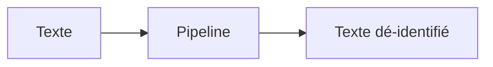
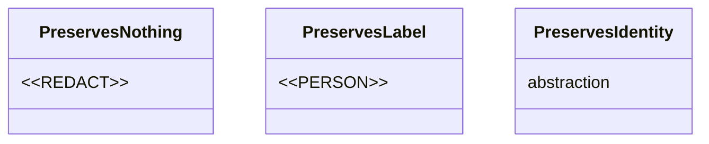

# PIIGhost docs

## Overview

PIIGhost ships **two parallel documentation sites** built with [Zensical](https://zensical.org/), an English one (`docs/en/`) and a French one (`docs/fr/`). Both are deployed via GitHub Pages.

This skill owns both halves of a doc change, the **voice** (which mode the page serves, how the text reads, which words it uses) and the **plumbing** (Zensical build, CSS classes, Mermaid, tables, nav, EN/FR mirroring). Read the voice half before writing, the plumbing half before wiring.

**Iron rule: every change applies to both languages.** A PR that updates only one will look stale and inconsistent the moment it's published. Same files, same headings, same structure, only the prose differs.

**Core principle: write an efficient reference, not a novel.** The reader wants to know what the thing does and why, in as few words as possible. Cut every sentence that only announces or dramatises.

## When to use

- Writing or rewriting any page under `docs/en/` or `docs/fr/`.
- Writing or rewriting the intro/pitch of `README.md` / `README.fr.md`.
- Deciding between "anonymisation" and "dé-identification".
- Reviewing a draft that feels padded, abstract, or over-narrated.
- Adding a diagram, a colour-coded table, a nav entry, or a new page.

Not for sentence-level AI-tell cleanup, use the `humanizer` skill. Not for Python conventions, use `piighost-code-style`.

---

# Part 1 — Voice

## Where each kind of content goes (Diátaxis)

PIIGhost docs follow [Diátaxis](https://diataxis.fr). Four content modes, each answering a different user need. **One page serves one mode.** Do not fold reference into a tutorial, or an explanation into a how-to.

| Mode | User need | Where in PIIGhost | Example |
|---|---|---|---|
| Tutorial | learn by doing, first contact | `docs/*/getting-started/` | quickstart, installation |
| How-to guide | accomplish one task | `docs/*/examples/` | "dé-identifier un thread multi-messages" |
| Reference | look up a fact fast | `docs/*/reference/` | API surface, config keys |
| Explanation | understand why | concept pages (`architecture`, `why-…`, `placeholder-factories`, `tool-call-strategies`, `security`, `limitations`) | why de-identify at all |

Two axes place the modes, practical (tutorial, how-to) versus theoretical (reference, explanation), and study (tutorial, explanation) versus work (how-to, reference). Diagnostic: if a page both teaches a concept and enumerates every option, it is two pages. Split it.

### How to write in each mode

Each mode has its own stance and its own bans. Match the page to its mode before polishing sentences.

**Tutorial (learning).** Stance: a teacher beside the learner, addressing them as « vous » (« vous allez construire », « vous obtenez »). You own the learner's success.

> Diátaxis mixes three registers in a tutorial, « nous » to frame the lesson and justify a constraint (« Dans ce tutoriel, nous allons... », « Nous devons faire x avant y parce que... »), the imperative for the steps (« Installez le socle. »), and « vous » to acknowledge what the learner obtained (« Vous avez construit... »). PIIGhost keeps the imperative and the « vous », and drops the « nous » register: the framing sentence is « Vous allez dé-identifier... ». Shorter, and consistent with the direct address used on every other page. Do not restore « nous » on a Diátaxis-compliance argument.

- Do: state the learning goal up front, give a visible result after every step (« la sortie ressemble à... »), keep steps concrete and repeatable, test every instruction against real failures.
- Don't: explain theory, offer choices or alternatives, dump peripheral detail. Minimise explanation and link out. « A tutorial is not the place for explanation. »

**How-to guide (task).** Stance: a peer helping someone who already knows the goal.

- Do: title « Comment [but précis] », use conditional imperatives (« si vous voulez X, faites Y »), keep only the steps the goal needs, order by dependency, seek flow.
- Don't: teach, inline full reference, add history or theory. « Practical usability is more helpful than completeness. »

**Reference (lookup).** Stance: a neutral map. « Describe and only describe. » Consulted, not read.

- Do: state facts objectively, mirror the structure of the code, keep patterns consistent, add short illustrative examples and warnings.
- Don't: instruct, explain, give opinion, use elegant variation. Consistency beats elaborate vocabulary here (this overrides variety, not the terminology and no-semicolon rules).

**Explanation (understanding).** Stance: a discussion that permits reflection, answering « pourquoi ».

- Do: give context and design decisions, weigh alternatives and trade-offs, make connections, state a viewpoint when useful.
- Don't: give procedural steps, replicate reference detail, stay at task eye-level. Bound the topic by repeatedly asking « pourquoi ? ».

**Diátaxis is scaffolding for the writer, never content for the reader.** The four modes decide where a page goes and how it is written. They are never named on a page. See « No meta-commentary about the documentation » under Judgement rules.

### Never let a page drift between modes

The common failure is drift, a quickstart that starts explaining internals, a reference that starts teaching, an explanation that turns into a how-to. When you feel a page reaching into another mode, cut the intruding content and link to the page that owns it.

### Two levels of quality

Functional quality (accurate, complete, consistent) is measurable and comes first. Deep quality (flow, reads well, anticipates the reader) is judged and builds on top. Get the facts right before polishing the voice. The voice rules below serve deep quality, they never excuse an inaccurate page.

## The README is a signpost, not the docs

**Goal: a short README that drops the reader into the Zensical docs fast.** Everything deep lives in the docs. The README is the front door, not a room.

The README carries only:

- the opening paragraph described in the next section.
- one runnable minimal example or a single sequence diagram, just enough to make the mechanism click.
- a short links block into the four Diátaxis buckets (getting started, examples, reference, concepts).

Keep out of the README: detector catalogs, config reference, migration notes, the threat model, option-by-option comparisons. Those are docs pages. When tempted to explain a second concept in the README, link to the docs page instead.

## How to open a home page or a README

`docs/*/index.md` and the two READMEs share one opening. Write it once, mirror it everywhere.

**Open on what `piighost` does, not on the threat.** State the capability in the first sentence. The « pourquoi c'est important » paragraph for a non-technical reader comes *after*, short, and never before. A reader who already knows why PII matter should not have to scroll past the motivation to find out what the tool is.

The opening paragraph is an identity card, three sentences at most. The reference application, in full:

1. What it is and what it does. « `piighost` est une librairie Python qui permet de protéger vos données personnelles (PII) dans les conversations avec les LLM via de la dé-identification. »
2. How, in one sentence, with the round trip. « Les valeurs sensibles sont cachées avant l'envoi, puis restaurées dans la réponse. » The mechanism only. The benefit does not belong here, see below.
3. What it plugs into. « Les intégrations LangChain, Pydantic AI, LlamaIndex et Claude Code sont fournies, ainsi qu'un connecteur d'API OpenAI et Anthropic. »

**Name `piighost` once, then change the grammatical subject.** The package name appears in sentence 1 and nowhere else. Sentences 2 and 3 do not repeat it, and they do not fall back on the same pronoun twice either: « Elle cache... Elle fournit... » reads mechanical. Each sentence takes a different subject, the library, then the data being handled, then what it plugs into.

**A passive is acceptable here** when it puts the subject the reader is looking for in first position. « Les intégrations LangChain, Pydantic AI, LlamaIndex et Claude Code sont fournies » leads on the integrations, which is what someone evaluating the library scans for. Do not "fix" these back to an active voice with `piighost` as the subject.

Repeat the name only for a practical reason: another noun sits between the pronoun and its antecedent and makes it ambiguous. Avoiding repetition is the default.

**Name the integrations in the opening.** « Est-ce que ça marche avec mon stack » is a first-paragraph question, not a page-three question.

**No links in the opening block.** It lists capabilities, it does not send the reader anywhere. Every link is an invitation to leave before the pitch has landed, and the card grid further down exists precisely to route people. Name the concept in plain words and stop there: « avec le pipeline conversationnel », not « avec le [pipeline conversationnel](getting-started/conversation.md) ». Links resume after the opening block.

**The integration list is a fact, check it before writing it.** The library ships LangChain, Pydantic AI, LlamaIndex and Claude Code integrations plus `PIIGhostClient`. Say « Pydantic AI », not « Pydantic », which is the validation library.

**Sentence 3 names the ecosystem, not only the package.** The OpenAI and Anthropic connector lives in the companion server `piighost-api`, and it belongs in the opening because « est-ce que ça marche avec mon stack » is answered by the ecosystem, not by an import list. Name it without attributing it to the library, « ainsi qu'un connecteur d'API OpenAI et Anthropic », never « `piighost` fournit un proxy OpenAI ». Everywhere else on the page, a capability stated without a condition must hold for the library alone.

### Then define, then run the pipeline

After the identity card, the page defines its concepts before it describes any mechanism. Dé-identification, PII, placeholder, each named and explained where it first appears. Only then comes the pipeline itself, told in real order (message entrant, dé-identification, LLM, réponse, restauration) and kept short.

Do not interleave. A definition that arrives in the middle of the round trip breaks both.

## What a good doc page looks like

Reference example: https://docs.langchain.com/oss/python/deepagents.

- **Descending pyramid.** What it is, then how to use it, then how it works. The reader can stop at any depth and still leave with something.
- **Lead with capability, not theory.** Open on what the reader can now do, with concrete action verbs. Save the rationale for lower on the page.
- **Code first, prose follows.** Show a runnable snippet, then explain it. Never make the reader wade through three paragraphs before the first line of code.
- **Skimmable.** Hierarchical headings, one or two sentence paragraphs, parallel-grammar lists, a callout for a single caveat, at most one diagram that mirrors the section structure.
- **Link out instead of inlining.** An overview page settles *what* and *why*, then links to the *how*. One page, one job.
- **Incremental construction.** Start from the simplest need, add one constraint at a time, let each component appear because a constraint demands it.
- **Continuity.** Link explicitly to the upstream page a reader arrives from (e.g. a page that follows « Pourquoi anonymiser ? »).

### Quickstart shape

The deepagents quickstart is a good tutorial skeleton. Reuse it for `getting-started/`:

1. Goal hook plus concrete deliverable: « Construire votre premier pipeline en quelques minutes. Vous allez dé-identifier une conversation avant qu'elle n'atteigne le LLM. »
2. Prerequisites as a single note.
3. Numbered steps, each a complete copy-paste block, building one component at a time. Offer parallel tabs for interchangeable choices (pip vs uv, one detector vs another) rather than repeating the whole snippet.
4. Show the expected output after the run.
5. A short « Comment ça marche » only after the reader has a working result.
6. Close on an escalation of next-step links (personnaliser, mémoire de conversation, déploiement).

## Terminology: dé-identification, not anonymisation

PIIGhost keeps the mapping between a value and its placeholder so it can restore the value. Under the RGPD that is **pseudonymisation**, not anonymisation. So in prose:

- Use **dé-identifié / dé-identification** for what the pipeline does by default.
- Reserve **anonymisation** for genuinely irreversible removal (no restoration possible). Say so explicitly when you use it.
- When the reversible nature matters (privacy claims, RGPD scope), state it in a `!!! note` (docs) or `> [!NOTE]` (README).

The rule governs every page you write or rewrite. Renaming page slugs and nav labels (`why-anonymize.md` and friends) is a separate, deliberate task, do not rename a file as a side effect of a prose pass.

### Name the two directions, and never confuse them

The pipeline runs in two directions and the docs need one word for each. A blind search-and-replace on « anonymiser » has already inverted the meaning of real sentences in this repo, so this table is not optional.

| Direction | FR | EN |
|---|---|---|
| Real value becomes a token | dé-identifier, dé-identification, dé-identifié | de-identify, de-identification, de-identified |
| Token becomes the real value again | restaurer, restauration, restauré | restore, restoration, restored |
| A value already de-identified goes through the pipeline again | dé-identifier à nouveau | de-identify again |

Banned for the inverse direction: « désanonymiser », « dé-anonymiser », « ré-anonymiser ». They read as the mirror of a word the docs no longer use, and « ré-anonymiser » is routinely misread as « ré-identifier », which means the opposite.

**Check the direction before swapping a word.** A tool call restores its arguments on the way in and de-identifies its result on the way out. Getting that backwards produces a sentence that is grammatical, house-style compliant, and false.

**Names that keep « anonym », because they are names.** The stage is `Anonymizer`, and « the anonymizer » / « l'anonymiseur » is how the docs refer to it, exactly like « the linker » / « le linker ». The methods are `anonymize` and `deanonymize`, the classes `AnonymizationPipeline`, `ThreadAnonymizationPipeline`, `PIIAnonymizationMiddleware`, `PIINodeAnonymizer`. Identifiers are never translated. Only prose moves to the de-identification vocabulary.

## Two kinds of rule

**Mechanical rules** below are absolute. They match on form, a `grep` settles them, they have no edge case, and no argument about intent can excuse one.

**Judgement rules** are the section after. They match on meaning, so they are never written as a ban on a shape. Each one carries a *test* to run and a *keep it when*. A judgement rule applied on the syntax alone destroys good sentences, which is exactly how this skill has already eaten correct prose. Run the test before cutting.

## Mechanical rules (absolute)

| Rule | Wrong | Right |
|---|---|---|
| No semicolon | `...à leur place ; l'utilisateur voit...` | `...à leur place. L'utilisateur voit...` |
| No em dash | `Le détecteur lit le texte — puis renvoie...` | `Le détecteur lit le texte, puis renvoie...` |
| No mid-sentence colon for apposition (colon introduces a list, nothing else) | `des motifs : des chaînes qui...` | `des motifs, c'est-à-dire des chaînes qui...` |
| Straight double quotes, never `«` `»` | `« Bonjour »` | `"Bonjour"` |
| `piighost` in code font, lowercase, in body text | `**PIIGhost** est une librairie...` | `` `piighost` est une librairie...`` |
| Blank line after a heading, between paragraphs, before the first bullet | list glued to its paragraph | blank line |
| `attr_list` braces only after a backticked span | `"Bonjour <<PERSON:1>>{ .placeholder }"` | ``"Bonjour `<<PERSON:1>>`{ .placeholder }"`` |
| Never link across languages | `../en/architecture.md` | same-language link only |

Code identifiers stay in English, plain inline code, no colour tag: `ThreadAnonymizationPipeline`, `abefore_model`. Correct French with every accent.

## Judgement rules

Each rule is a *symptom*, a *test*, and a *keep it when*. The test is the part that matters. Skipping it turns the rule into a form ban, and a form ban misfires.

### One term per concept

- **Symptom.** Two different words for the same thing on the same page.
- **Test.** Do the two words denote exactly the same thing? If yes, keep the one used first and replace the other **everywhere**, image alt text, figure captions, admonition titles and card blurbs included. The classic miss is renaming in the body and leaving the old term in an alt text.
- **Keep both when.** The second word is a pronoun picking up the first (that is the anaphora rule, not elegant variation), or the two words denote things the reader could otherwise conflate.

### No anglicism, except technical vocabulary

- **Symptom.** An English word, or a French sentence built on an English one.
- **Test.** Would a French-speaking developer write this word spontaneously? If yes, it is technical vocabulary, keep it. If a common French word exists and is actually used, translate.
- **Allowed (technical vocabulary).** librairie, placeholder, token, thread, pipeline, quickstart, regex, middleware, proxy, prompt, hash, guard rail.
- **Banned (a current French word exists).** `collapser` → se confondre, `lossy` → à perte / lacunaire, `redaction` → caviardage.
- **The exception never covers calqued phrasing.** A borrowed *word* can be technical vocabulary, a word-for-word translated *turn of phrase* never is. « les agents outillés » (*tool-using agents*) and « tour complet d'un agent » (*full round trip*) are not technical vocabulary, they are bad translations. Write « les agents qui appellent des outils » and « aller-retour complet ».

### Simple copula over periphrasis

- **Symptom.** « se présente comme », « permet de », « livre », where « est » or « a » would do.
- **Test.** Substitute est/a. If the meaning does not move, keep the short form.
- **Keep the periphrasis when.** It carries a real nuance, a condition or a modality. And keep a **passive** when it puts the subject the reader is scanning for in first position, « Les intégrations LangChain, Pydantic AI, LlamaIndex et Claude Code sont fournies ».

### Define before you use

- **Symptom.** A technical term appears with no explanation.
- **Test.** Can a business reader landing on this page keep going without looking elsewhere?
- **Do not define when.** The term was already defined higher on the same page, or the page is in Reference mode, where the reader already knows the domain.
- **How to define.** By the mechanism, never by a vague label. Name the concept, then say what it does.
  > On appellera ça un *placeholder*, le *token* qui prend la place de la valeur dé-identifiée.
  - *regex*, reconnaît des **motifs**, des chaînes de caractères qui suivent une structure fixe (IBAN, téléphone). Efficace sur ces formats, inutilisable sur du texte non structuré (prénom, nom, date écrite, lieu).
  - *NER*, **modèle d'IA** qui, sur un texte, classe les mots selon une classification décidée à l'avance (nom, prénom, lieu, organisation).

### No meta-commentary about the documentation

- **Symptom.** The page talks about the docs rather than about `piighost`.
- **Test.** Does this sentence tell the reader something about the library, or about how the documentation is made?
- **Keep it when.** The page's own subject is contributing to the project. There, the process is the content.

Recurring forms, all cut on sight:

| Meta | Why it goes |
|---|---|
| Naming the doc framework, « Chaque page suit un rôle du framework Diátaxis, tutoriel pour apprendre, recette pour... » | The card titled « Recettes / Résoudre une tâche précise » right below already said it, in the reader's terms |
| Announcing the page's own structure, « Cette page est organisée en trois parties » | The headings are the structure |
| Conventions of writing, « les identifiants de code restent en anglais », « les placeholders sont notés `<<...>>` dans cette doc » | A convention that needs explaining is a bad convention. Show the token, the reader infers it |
| The docs' own history, « cette page a été réécrite pour la v2 » | Git holds this |
| Build and tooling of the site, « documentation générée avec Zensical », « site bilingue EN/FR » | Infrastructure, not content |

Related but distinct, the ban on throat-clearing (« Plongeons dans... ») under « AI tells to avoid ». Throat-clearing announces the prose, meta-commentary describes the documentation. Both go, for different reasons.

### No code identifiers in all-audience explanation

- **Symptom.** A class, function or parameter name on the home page, a README, or an Explanation-mode page.
- **Test.** Does a business reader need that name to follow the sentence?
- **Keep it when.** The page is a tutorial, a how-to or a reference. Their job is to show code.
- **Trap.** Removing the identifier must not remove the condition it carried. Express the condition as the named concept instead.

Name the concept, not the class:

- Avoid: « Ce placeholder reste le même d'un message à l'autre avec `ThreadAnonymizationPipeline`. »
- Prefer: « Ce placeholder reste le même d'un message à l'autre avec le pipeline conversationnel. »
- Avoid: « Avec `PIIAnonymizationMiddleware`, un outil reçoit la vraie valeur. »
- Prefer: « Avec le middleware LangChain, un outil reçoit la vraie valeur. »

Link to the page that owns the mechanism, **except inside the opening block**, which carries no links at all. Still allowed on these pages: the package name `piighost` in code font, placeholder examples (`<<EMAIL:1>>`{ .placeholder }), and a link to another project's repository or docs. A named GitHub project is a destination, an identifier is an implementation detail.

### Concrete opening over vague hinge

- **Symptom.** A paragraph opening on « Mais », « Or », « Cependant », or on a pronoun with no antecedent nearby.
- **Test.** Does the first clause name the subject the paragraph is about?
- **Keep the hinge when.** The paragraph genuinely turns against the previous one and the reader needs the signal.

### Efficient, not a novel

Cut narration and scene-setting. The text explains, it does not announce that it is about to explain.

- Drop opener throat-clearing: no « Le principe est simple. », « Plongeons dans... », « Il faut savoir que... ».
- Drop padding tails that restate the sentence: « ce qui permet de raisonner sur les relations entre entités sans jamais manipuler la donnée réelle » collapses to « ce qui permet au modèle de suivre le fil ».
- Describe the real mechanism, not the felt effect: « Quand le LLM retourne des placeholders, `piighost` réinjecte les vraies valeurs » beats « Quand la réponse revient... ».
- One idea per paragraph. If a paragraph has two, split or cut.
- Short sentences, varied rhythm, no filler.

### Ground abstractions in one concrete example

Abstract prose reads as flou. Anchor an explanation with a single running example and reuse it throughout.

- Pick one PII and its placeholder, e.g. `jean@mail.com` becomes `<<EMAIL:1>>`, and carry it across the whole passage.
- Name the benefit **once per page, at the end of the narrative**, never in the identity card. « l'utilisateur voit `John Doe`{ .pii } et ne voit jamais la dé-identification » lands after the reader has followed the round trip. The same phrase in the opening paragraph asserts a benefit before the reader knows the mechanism, and it turns every later statement of it into a padding tail. One benefit, one place, at the end.
- Pair every explanation with a concrete before/after example.

**Show the literal text, do not describe it.** The goal is that a reader understands what actually happens instead of imagining what dé-identification might look like. Quote what the model emits.

- Avoid: « Quand le LLM retourne des placeholders, `piighost` les remplace. »
- Prefer: « Quand le LLM retourne des placeholders, par exemple en répondant « Bonjour `<<PERSON:1>>`{ .placeholder } », `piighost` les remplace par les vraies valeurs. »

**Write from what a component produces, not from what it perceives.** Production is observable, perception is a story about an internal state.

- Avoid: « le LLM qui décide de l'appeler ne voit toujours que `<<EMAIL:1>>` »
- Prefer: « le LLM qui la fournit n'écrit que `<<EMAIL:1>>` »

### Chaining and rhythm

- **Address the reader as « vous ».** It shortens sentences and reads cleaner than an impersonal construction. « protéger vos données personnelles » beats « la protection des données personnelles ».
- **Chain each paragraph on the term that closed the previous one.** « ...via de la dé-identification. » then « Cette dé-identification repère les PII... ». A paragraph opening on « Cette librairie » or « Il » hooks onto nothing, the reader restarts.
- **Two or more examples of the same shape go into a bulleted list**, never chained inside a sentence with « et ». The list makes the parallel visible instead of asking the reader to hold it.
  - Avoid: « `John Doe` devient `<<PERSON:1>>` et `john.doe@example.com` devient `<<EMAIL:1>>`. »
  - Prefer: two bullets, same grammar, no final punctuation on either.
- **A parenthesis carries a bare list, no prose inside.** Write `(regex, NER, LLM)`, not `(regex, NER, ou un autre LLM)`.

### AI tells to avoid

See the `humanizer` skill for the full catalog. Some are mechanical, three need a test.

**Mechanical, cut on sight.** Authority and effect phrases (« la distinction clé », « ce n'est pas cosmétique », « ce qui découle de tout ce qui précède », « au fond », « en réalité »), generic upbeat conclusions, signposting (« plongeons dans »), mechanical bold, emojis in headings.

The three below are the ones that have already destroyed correct prose in this repo when applied as form bans. They are about **decoration**, not about contrast or enumeration as such.

**Negative parallelism.**

- *Symptom.* « ce n'est pas X, c'est Y », « cesse d'être X et redevient Y ».
- *Test.* Mask the negative half. If the sentence keeps its full meaning, cut. If a word in the positive half goes wobbly, keep.
- *Keep it when.* The negative half names a state the reader is told nowhere else. « le fournisseur **cesse d'être une décision de confidentialité** et redevient une question de qualité, de coût et de latence » earns its first half: it is the only sentence saying what the provider choice is today, and « redevient » means nothing without it.

**Rule of three.**

- *Symptom.* Three coordinated items.
- *Test.* Remove the third. Does the sentence lose information, or only cadence?
- *Keep it when.* The three items are the content. « qualité, coût, latence » are the actual criteria, not a flourish.

**Padding tail.**

- *Symptom.* A clause that looks like it restates the sentence.
- *Test.* Does it state the same thing, or a different facet of it? Condition is not action, cause is not effect.
- *Keep it when.* Overlap is not repetition. « Quand les PII n'atteignent jamais le LLM » states the condition, « Dé-identifier en amont » states the action. Both stay.

### Examples (avoid → prefer)

**Define by mechanism, not by a vague label**

- Avoid: « Le NER repère intelligemment les entités. »
- Prefer: « Le NER est un modèle d'IA qui classe les mots d'un texte selon une classification décidée à l'avance (nom, prénom, lieu). »

**Define the term the first time, then reuse it**

- Avoid: « On remplace la valeur par un marqueur. » (term never defined)
- Prefer: « On remplace la valeur par un placeholder, c'est-à-dire le token qui prend sa place. »

**No authority/effect phrase**

- Avoid: « C'est la distinction clé : asynchrone pour l'I/O et l'orchestration. »
- Prefer: « En résumé, asynchrone pour l'I/O et l'orchestration. »

**No decorative rule of three, no signposting**

- Avoid: « Plongeons dans le cache, à la fois rapide, robuste et élégant. »
- Prefer: « Le cache stocke les résultats de détection par hash du texte. »

---

# Part 2 — Plumbing

## Layout

```
docs/
├── en/                                # canonical English source
│   ├── index.md                       # home (use cases)
│   ├── architecture.md                # layered architecture
│   ├── why-anonymize.md               # threat-model intro
│   ├── extending.md                   # protocol reference for users
│   ├── limitations.md                 # known limits
│   ├── security.md                    # threat model + scope
│   ├── glossary.md
│   ├── placeholder-factories.md       # concept page
│   ├── tool-call-strategies.md        # concept page
│   ├── community/                     # contributing, faq, ...
│   ├── examples/                      # use-case walkthroughs
│   ├── getting-started/               # installation, quickstart, ...
│   ├── reference/                     # API surface
│   ├── stylesheets/extra.css          # CSS overrides
│   └── includes/abbreviations.md      # snippet auto-loaded by zensical
└── fr/                                # mirrors en/, identical layout
zensical.toml       # EN site config (nav, theme, extensions)
zensical.fr.toml    # FR site config
```

## Build & verify

```bash
uv run zensical build --clean              # build EN site (output: site/)
uv run zensical build -f zensical.fr.toml  # build FR site (output: site/fr/)
```

**Always rebuild both sites after a doc change.** CI (`.github/workflows/docs.yml`) runs both in production, so a broken FR build will only surface there if you forget locally.

The mechanical rules, the terminology, the EN/FR parity, the internal links and the nav are checked by a script that ships with this skill:

```bash
python3 .claude/skills/piighost-docs/scripts/audit.py   # exits non-zero on any finding
```

It reads prose only, so an identifier such as `Anonymizer` or `deanonymize` never trips a prose rule. Beyond style it resolves every relative markdown link against the tree and compares each language's pages with its `nav` array both ways, so a moved page shows up as a dead link on one side and an orphan nav entry on the other. An `includes/` page is exempt from the nav check, being pulled in by a snippet. It is deliberately conservative on the apposition colon: a lead-in label of four words or fewer, an enumeration of two or more comma-separated items, and two coordinated alternatives are all left alone. A finding is a real violation, not a style opinion, so drive it to zero rather than arguing with it. It does not judge voice. Diátaxis mode fit, chaining, the running example and the padding tails are still yours to read.

For iteration, use the dev server:

```bash
uv run zensical serve                      # EN at localhost:8001
uv run zensical serve -f zensical.fr.toml  # FR (run separately)
```

## Page structure

### Frontmatter

```yaml
---
icon: lucide/replace          # any icon from https://lucide.dev/icons
tags:                         # optional, must exist in zensical.toml [project.extra.tags]
  - Advanced
  - Detector
---
```

### Section ordering for concept pages

The two existing concept pages (`placeholder-factories.md`, `tool-call-strategies.md`) follow this structure. Reuse it for new concept pages.

1. `# Title` (matches the nav label)
2. Intro paragraph + `!!! note` admonition for sidebars
3. Bulleted family / variant list as a quick overview
4. `---` separator
5. `## Détail des familles` / `## Family details`, one `### Sub-title` per item
6. `## Tags de préservation` / `## Preservation tags`, formal taxonomy + Mermaid hierarchy
7. `## Factories built-in` / `## Built-in factories`, recap table
8. `## Quel placeholder choisir` / `## Which placeholder to pick`, recommendations table
9. `## Pourquoi …` / `## Why …`, explains middleware constraints
10. `## Écrire la sienne` / `## Writing your own`, extension examples
11. `## Voir aussi` / `## See also`, cross-links to related pages

Use `---` between major sections sparingly. Once between blocks is fine, two in a row is noise.

Headings: one separator only, sentence case, no em dash.

### Blank lines are load-bearing

Python-markdown needs a blank line where an editor's eye does not.

- One blank line after a heading, before the first paragraph.
- One blank line between two paragraphs. Without it the two collapse into a single rendered paragraph joined by a space.
- One blank line before the first bullet of a list. Without it the list renders as plain text with visible dashes.
- No trailing whitespace at end of line, and no final period on list items unless every item has one.

### Cross-linking

- Same language, same dir: `[Architecture](architecture.md)`
- Same language, subdir: `[FAQ](community/faq.md)`
- **Never link across languages.** Each site is self-contained.

## Placeholder format conventions

The project normalises placeholder examples along a single rule:

- **Synthetic placeholders that do not replicate a PII** (Redact, Type, Type+id, Id-only) wrap the content in `<<` / `>>` so the LLM sees an unambiguous token.
  Examples: `<<REDACT>>`, `<<PERSON>>`, `<<EMAIL>>`, `<<PERSON:1>>`, `<<PERSON:a1b2c3d4>>`, `<<REDACT:a1b2c3d4>>`.
- **Realistic placeholders that replicate a PII format** (masked, realistic-hashed) keep no delimiters, the whole point is to look like a real value.
  Examples: `Patient_a1b2c3d4`, `a1b2c3d4@anonymized.local`, `j***@mail.com`, `****4567`.

The built-in factories follow this rule: `RedactPlaceholderFactory` emits `<<REDACT>>`, `LabelPlaceholderFactory` emits `<<PERSON>>`, `LabelHashPlaceholderFactory` emits `<<PERSON:a1b2c3d4>>`, `LabelCounterPlaceholderFactory` emits `<<PERSON:1>>`, `MaskPlaceholderFactory` emits `j***@mail.com`. There is no Faker factory, do not invent one in an example. Apply the same convention in any new doc example or new factory.

## Highlighting PII and placeholders inline

Two CSS classes defined in `stylesheets/extra.css`:

- `.placeholder` (purple), synthetic tokens
- `.pii` (red), raw PII values

Apply via `pymdownx.attr_list` *after* a backticked span (note the literal space between the backtick and the brace):

```markdown
Le pipeline transmet `<<PERSON:1>>`{ .placeholder } à la place de `Patrick`{ .pii }.
```

**`attr_list` only attaches to a span, never to bare text.** A token quoted inside a sentence needs its own backticks first, otherwise the braces render literally on the page:

```markdown
en répondant "Bonjour <<PERSON:1>>{ .placeholder }"      <!-- prints the braces -->
en répondant « Bonjour `<<PERSON:1>>`{ .placeholder } »  <!-- correct -->
```

**Straight double quotes `"` in French prose, never the guillemets `«` `»`.** House style, and it keeps quoted tokens copy-pasteable. (The `«` `»` used throughout this skill are example delimiters for the reader of the skill, not a model for the docs.)

When to tag:

| Inline code | Tag |
|---|---|
| Synthetic placeholder that does **not** replicate a real PII (use `<<...>>` delimiters): `<<PERSON:1>>`, `<<PERSON:a1b2c3d4>>`, `<<PERSON>>`, `<<EMAIL>>`, `<<REDACT>>`, `<<REDACT:a1b2c3d4>>` | `{ .placeholder }` |
| Placeholder that **replicates** a real PII format (no delimiters): `j***@mail.com`, `a1b2c3d4@anonymized.local`, `Patient_a1b2c3d4` | `{ .placeholder }` |
| Raw PII example: `Patrick`, `Marie`, `Paris` (when used as a value to anonymise) | `{ .pii }` |
| Class / tag / method / parameter name: `LabelHashPlaceholderFactory`, `PreservesIdentity`, `abefore_model`, `tool_strategy` | none, plain inline code |

## Mermaid diagrams

Wrap a mermaid block, then add an italic caption tagged with `.figure-caption`:

````markdown


*Pipeline de dé-identification, du texte brut au texte dé-identifié.*
{ .figure-caption }
````

The `.figure-caption` rule in `extra.css` centres the line and dims it. The `{ .figure-caption }` line goes **after** the italic caption, separated only by the caption itself.

For class diagrams (`classDiagram`), embed examples directly inside the class box. **Escape `<` and `>` with `&lt;` / `&gt;`**, mermaid's parser treats them as inheritance arrows otherwise:

````markdown

````

For abstract / intermediate nodes, write the literal word `abstraction` (same word in EN and FR) inside the box. Don't use the `<<abstract>>` UML stereotype, zensical's mermaid parser doesn't render it cleanly.

## Tables

### Plain markdown table

Use the default markdown rendering for short, narrow tables (≤4 columns).

### `.wide-table` for dense tables

Wrap a wide markdown table to shrink the font and tighten cell padding without leaving the article column:

```markdown
<div class="wide-table" markdown="1">

| Col1 | Col2 | Col3 | Col4 | Col5 | Col6 |
|---|---|---|---|---|---|
| ... | ... | ... | ... | ... | ... |

</div>
```

The CSS reduces font to `0.82em` and padding to `0.45em / 0.6em`. Native horizontal scroll kicks in when needed. **Do not add negative margins**, earlier attempts to extend the table beyond the article column overlapped the nav and TOC sidebars and were reverted.

### `.security-table` with cell-level colour coding

Used to expose a **privacy / utility gradient** per cell. Two view angles often pair, *confidentiality* (what leaks to the LLM) and *exploitation* (what the agent and system can do). The same answer can flip colour between the two angles, that's the tension the colouring makes explicit.

```markdown
<table class="security-table" markdown="1">
<thead>
<tr><th>Famille</th><th>Type vu ?</th></tr>
</thead>
<tbody>
<tr><td>Marqueur constant</td><td class="c-blue">non</td></tr>
<tr><td>Label seul</td><td class="c-green">oui</td></tr>
</tbody>
</table>
```

Apply colour classes per `<td>`. Available classes:

| Class | Meaning |
|---|---|
| `c-blue` | best, nothing leaks / capability works perfectly |
| `c-green` | acceptable, minimal info, e.g. type alone |
| `c-yellow` | partial, info or conditional collision/risk |
| `c-red` | problematic, real leak / capability broken |

Pair the table with a legend chip set:

```markdown
<small>
Légende :
<span class="sec-legend c-blue">meilleur</span>
<span class="sec-legend c-green">correct</span>
<span class="sec-legend c-yellow">partiel</span>
<span class="sec-legend c-red">problématique</span>
</small>
```

Both light and dark themes are styled in `extra.css` via `[data-md-color-scheme="slate"]` selectors.

## Extend a page before adding one

A new page is the last resort, not the first move. Before creating one, find the page that already owns the reader's question and check whether the content belongs there. Two pages that answer one question force the reader to hold both, and the shared facts diverge at the first rename.

Diagnostic: write the question the reader is asking. If the existing page answers a question the new content is a part of, extend it. If the new content answers a genuinely different question, it is its own page.

- « Sur quoi puis-je m'appuyer, et qu'est-ce qui va disparaître » is one question. The API stability lists and the deprecated-names table live on `community/upgrading.md` together.
- « Comment j'installe » and « comment je déploie en production » are two questions, so `getting-started/installation.md` and `deployment.md` are two pages.

When the content does warrant its own page, move the overlapping section out of the old page rather than copying it. Never leave the same table on two pages.

## Keep the API stability lists current

`community/upgrading.md` classifies the public surface as Stable, Experimental, or Deprecated. It is the only page that tells an integrator what they can build on, so it goes stale silently.

Update it when:

- a new integration or a new LLM-backed component ships, it starts in **Experimental** with a one-line reason that names what is unsettled, not just the label;
- an experimental surface has held its shape across a few minors, it moves to **Stable**;
- a name is deprecated, it joins the deprecated-names table with the release that deprecated it and whether reaching it warns.

The Stable list mirrors `piighost.__all__` plus the ports, the models, the config entrypoints, the CLI commands and the LangChain integration. Read those from the source, do not recall them.

## Nav updates

Both `zensical.toml` (EN) and `zensical.fr.toml` (FR) carry a `nav = [...]` array. Always update **both**. The file paths stay the same since `docs_dir` differs per file:

```toml
{ "Concepts" = [
  { "Why anonymize?" = "why-anonymize.md" },
  { "Architecture" = "architecture.md" },
  { "Placeholder factories" = "placeholder-factories.md" },
  { "Tool-call strategies" = "tool-call-strategies.md" },
  { "Glossary" = "glossary.md" },
  { "Limitations" = "limitations.md" },
  { "Security" = "security.md" },
]},
```

Use French labels in the FR config, EN labels in the EN config. Group the nav by Diátaxis bucket. A page left out of one of the two navs is invisible on that site, which `scripts/audit.py` reports both ways, so run it after adding or moving a page.

## EN ↔ FR sync rules

- Same number of files in `docs/en/` and `docs/fr/`.
- Same heading structure, same section order, same Mermaid blocks (only captions translate).
- Same code in code fences, byte for byte. Only prose and comments translate.
- Stylesheets are identical: `diff docs/fr/stylesheets/extra.css docs/en/stylesheets/extra.css` must print nothing.
- Class names, tag names, method names, parameters stay in English in both languages (`PreservesIdentity`, `ThreadAnonymizationPipeline`, `tool_strategy`).
- Code in code fences (Python, shell, etc.) stays in English regardless of page language.

## Common mistakes

| Symptom | Cause | Fix |
|---|---|---|
| Reads like a story with a narrator | Announcing sentences | Delete them. State the fact directly. |
| Reader says « c'est flou » | No concrete anchor | Add one running example (`jean@mail.com` ↔ `<<EMAIL:1>>`). |
| « anonymisation » used for the default pipeline | Wrong term | Replace with « dé-identification ». Keep « anonymisation » for irreversible only. |
| Semicolon in French prose | House style violation | Split into two sentences. |
| `PIIGhost` in bold in body text | Brand splash | Write `` `piighost` `` in code font. |
| Same concept named three different ways | Elegant variation | Pick one term, use it everywhere. |
| A quickstart that explains internals | Mode drift | Cut the explanation, link to the concept page. |
| Home page opens on the threat instead of the capability | Old README rule | First sentence says what `piighost` does. Motivation comes after. |
| Page explains the docs instead of the library | Meta-commentary | Cut it. Framework names, page structure, writing conventions, site tooling, none of it is content. |
| Paragraph opens on « Cette librairie » or « Il » | No chaining | Open on the term that closed the previous paragraph. |
| Two parallel examples joined by « et » in one sentence | Prose where a list belongs | Split into two bullets with identical grammar. |
| `{ .placeholder }` braces visible on the rendered page | `attr_list` applied to bare text | Wrap the token in backticks first. |
| Two paragraphs render as one | Missing blank line between them | Add the blank line. |
| List renders as text with visible dashes | Missing blank line before the first bullet | Add the blank line. |
| Doc attributes the OpenAI or Anthropic connector to the library | Confusing `piighost` with `piighost-api` | The connector is a capability of the ecosystem, name it as such. Only the opening block may list it. The library itself ships LangChain, Pydantic AI, LlamaIndex, Claude Code and `PIIGhostClient`. |
| Caption appears above the diagram instead of below | `{ .figure-caption }` placed before the italic line | Put `{ .figure-caption }` on the line **after** the italic caption |
| Mermaid renders broken or empty | Used `<<abstract>>` or unescaped `<`/`>` in class members | Use plain `abstraction` text and `&lt;` / `&gt;` for tokens |
| `Unresolved reference` IDE warnings on inline code | Pyrefly tries to resolve identifiers inside markdown tables | Ignore, these are false positives, builds pass |
| Wide table runs under the nav or TOC sidebar | Negative margins on `.wide-table` | Remove the margins, default scroll is correct |
| Doc change shows up only on EN site | Forgot to rebuild FR | Always run both `zensical build --clean` and `zensical build -f zensical.fr.toml` |
| Anchor link broken on FR page (e.g. `#écrire-la-sienne`) | Slugifier with accent inconsistencies | Replace anchor link with prose pointer (« voir la section *X* plus bas ») |
| Cell colours don't appear | Tagged the `<tr>` instead of each `<td>` | Move `class="c-..."` onto each `<td>` (per-cell, not per-row) |

## Where styles live

`docs/{en,fr}/stylesheets/extra.css`, keep these two files **identical**:

- `.placeholder` / `.pii`, inline highlight chips
- `.figure-caption`, centred dim caption under diagrams
- `.wide-table`, compact wrapper for dense tables
- `.security-table` cells (`c-blue` / `c-green` / `c-yellow` / `c-red`), privacy/utility gradient
- `.sec-legend` chips, legend below colour-coded tables

Light + dark mode are both supported via `[data-md-color-scheme="slate"]` selectors.

## Final pass checklist

Run this before calling a page done. It exists because an editor applying the rules one paragraph at a time reliably leaves whole-page defects standing.

**Facts**

- [ ] Every capability stated without a condition holds with the **default configuration**. If it needs a specific component, the condition is stated and linked.
- [ ] Every component, integration and extra named on the page exists in `src/piighost/`, the OpenAI and Anthropic connector excepted, which is served by `piighost-api` and only ever named as an ecosystem capability.
- [ ] Every internal link points at the page that actually covers what the sentence promises. That it resolves at all is the audit script's job, not yours.
- [ ] A new page does not repeat a section that already lives elsewhere. If it does, extend the existing page instead.
- [ ] A new integration or LLM-backed component is classified in the API stability lists of `community/upgrading.md`.

**Whole-page consistency** (the ones a paragraph-by-paragraph pass misses)

- [ ] One term per concept, checked **everywhere**, body prose but also image alt text, figure captions, admonition titles, card blurbs. Renaming a term in the body and leaving it in an alt text is the classic miss.
- [ ] Same verb for the same fact. If the body says « garde la correspondance », an admonition further down does not say « conserve la correspondance ».
- [ ] No admonition or closing paragraph restates what the body already said.
- [ ] Tense is consistent, present throughout outside a tutorial.
- [ ] The concrete running example is carried across the whole page, not dropped mid-way for a periphrasis.

**Voice**

- [ ] Each paragraph chains on the term that closed the previous one.
- [ ] One idea per paragraph.
- [ ] Every concept is defined at its first occurrence.
- [ ] No meta-commentary about the documentation, no code identifier in all-audience explanation.
- [ ] No negative parallelism, no forced rule of three, no throat-clearing, no padding tail.

**Mechanics**

- [ ] No semicolon, no em dash, no mid-sentence apposition colon. Straight double quotes `"`, never `«` `»`.
- [ ] Blank line after a heading, between paragraphs, before the first bullet of a list.
- [ ] `attr_list` braces sit after a backticked span, never after bare text.

**Mirror and build**

- [ ] The other language carries the same change, same structure, same section order, same code.
- [ ] `uv run zensical build --clean` and `uv run zensical build -f zensical.fr.toml` both print `No issues found`.
- [ ] `python3 .claude/skills/piighost-docs/scripts/audit.py` prints `0 finding(s)`.

## See also

- `scripts/audit.py` next to this file, the mechanical, terminology, parity, link and nav gate.
- `humanizer`, sentence-level AI-tell removal (rule of three, negative parallelism, filler).
- `CLAUDE.md` at repo root, broader project conventions (Python tooling, commit style, type-checking).
- `zensical.toml` and `zensical.fr.toml`, site config including theme features, markdown extensions, custom tags.
- https://diataxis.fr, the documentation architecture this skill adopts (four modes, one need per page).
- https://docs.langchain.com/oss/python/deepagents, reference example of a good overview page (pyramid, capability-first, code-first, skimmable, links out).
