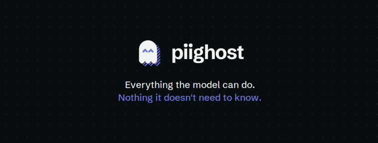

# PIIGhost

English | [Français](docs/README.fr.md)

[](https://github.com/Athroniaeth/piighost/actions/workflows/ci.yml)
[](https://codecov.io/gh/Athroniaeth/piighost)
[](https://pypi.org/project/piighost/)
[](https://pypi.org/project/piighost/)
[](LICENSE)
[](https://github.com/PyCQA/bandit)
[](https://discord.gg/vFg9GHQR2s)

`piighost` is a Python library that protects your confidential data, personal data (PII) and secrets, in conversations with LLMs through de-identification. Sensitive values are hidden before they are sent, then restored in the response. LangChain, Pydantic AI, LlamaIndex and Claude Code integrations are provided, together with an OpenAI and Anthropic API connector.

This de-identification spots confidential data with pluggable detectors (regex, NER, LLM) and replaces each value with a placeholder, the token that takes its place. For example:

- `John Doe` becomes `<<PERSON:1>>`
- `john.doe@example.com` becomes `<<EMAIL:1>>`

This placeholder stays the same from one message to the next with the conversational pipeline, which keeps the mapping between a value and its placeholder across the whole conversation. If `john.doe@example.com` reappears three messages later, the placeholder is still `<<EMAIL:1>>`, which lets the LLM follow the thread.

The LLM therefore only receives de-identified text. When it returns placeholders, for example by answering `Hello <<PERSON:1>>`, `piighost` replaces them with the real values. The user sees `John Doe` and never sees the de-identification.

The same mechanism protects agents that call tools. With the LangChain middleware, a tool that needs the real email address receives it in clear, while the LLM that supplies it only writes `<<EMAIL:1>>`.

<p align="center">
  
</p>

*The LLM only sees placeholders. The tool receives the real address, the user gets a clear-text reply, and your agent code stays the same.*

> [!NOTE]
> This retained mapping makes the de-identification a pseudonymization under the GDPR, not a definitive anonymization. With the conversational pipeline, the real values stay stored for the duration of the conversation and must be protected accordingly.

## Quickstart

```bash
pip install piighost   # or: uv add piighost
```

`ExactMatchDetector` de-identifies a dictionary of known values, with no model to download.

```python
import asyncio

from piighost.components.detector import ExactMatchDetector
from piighost.pipeline import AnonymizationPipeline

detector = ExactMatchDetector({"John Doe": "PERSON", "john.doe@example.com": "EMAIL"})
pipeline = AnonymizationPipeline(detector)

result = asyncio.run(pipeline.anonymize("Write to John Doe at john.doe@example.com."))
print(result.text)  # Write to <<PERSON:1>> at <<EMAIL:1>>.
```

The [Quickstart](https://docs.piighost.dev/en/guide/getting-started/quickstart/) goes on with a real detector and a conversation.

## Go further

- **Start**: [installation](https://docs.piighost.dev/en/guide/getting-started/installation/), [first pipeline](https://docs.piighost.dev/en/guide/getting-started/first-pipeline/), [conversational pipeline](https://docs.piighost.dev/en/guide/getting-started/conversation/)
- **Configure**: [a pipeline in a TOML file](https://docs.piighost.dev/en/guide/getting-started/configuration/), [pattern groups from the catalog](https://docs.piighost.dev/en/guide/reference/detectors/#catalog-groups), [every config key](https://docs.piighost.dev/en/guide/configuration/toml/)
- **Integrate**: [LangChain](https://docs.piighost.dev/en/guide/examples/langchain/), [Pydantic AI](https://docs.piighost.dev/en/guide/examples/pydantic-ai/), [LlamaIndex](https://docs.piighost.dev/en/guide/examples/llama-index/), [Claude Code](https://docs.piighost.dev/en/guide/examples/claude-code/), [a remote piighost-api](https://docs.piighost.dev/en/guide/getting-started/api-client/)
- **Deploy**: [an API server from a catalog configuration](https://docs.piighost.dev/en/guide/getting-started/api-server/), [a production thread pipeline](https://docs.piighost.dev/en/guide/deployment/), [several instances](https://docs.piighost.dev/en/guide/multi-instance/)
- **Understand**: [why de-identify](https://docs.piighost.dev/en/guide/why-anonymize/), [architecture](https://docs.piighost.dev/en/guide/architecture/), [security](https://docs.piighost.dev/en/guide/security/), [GDPR compliance](https://docs.piighost.dev/en/guide/compliance/), [limitations](https://docs.piighost.dev/en/guide/limitations/), [detection, measured](https://docs.piighost.dev/en/guide/benchmark/), [how it compares](https://docs.piighost.dev/en/guide/comparison/)
- **Upgrade**: [versions and the move to 2.0](https://docs.piighost.dev/en/guide/community/upgrading/)

## Ecosystem

- **[piighost.dev](https://piighost.dev/?utm_source=github&utm_medium=readme&utm_campaign=piighost)**: the presentation site
- **[piighost catalog](https://catalog.piighost.dev)**: reviewed regex groups and ready-made pipeline configurations, pulled by reference
- **[piighost-api](https://github.com/Athroniaeth/piighost-api)**: a server hosting one pipeline behind HTTP, with OpenAI- and Anthropic-compatible proxies
- **[piighost-chat](https://github.com/Athroniaeth/piighost-chat)**: an example chat interface with human-in-the-loop

## Project

- **Community**: [Discord](https://discord.gg/vFg9GHQR2s) to get help, report bugs and request features
- **Contributing**: [contribution guide](https://docs.piighost.dev/en/guide/community/contributing/) and [bug reports](https://docs.piighost.dev/en/guide/community/bug-reports/)
- **License**: [MIT](LICENSE)
