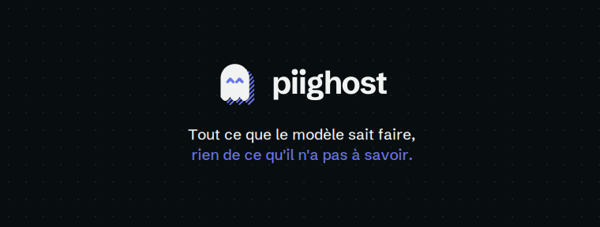

# PIIGhost

[English](../README.md) | Français

[](https://github.com/Athroniaeth/piighost/actions/workflows/ci.yml)
[](https://codecov.io/gh/Athroniaeth/piighost)
[](https://pypi.org/project/piighost/)
[](https://pypi.org/project/piighost/)
[](../LICENSE)
[](https://github.com/PyCQA/bandit)
[](https://discord.gg/vFg9GHQR2s)

`piighost` est une librairie Python qui permet de protéger vos données confidentielles, données personnelles (PII) et secrets, dans les conversations avec les LLM via de la dé-identification. Les valeurs sensibles sont cachées avant l'envoi, puis restaurées dans la réponse. Les intégrations LangChain, Pydantic AI, LlamaIndex et Claude Code sont fournies, ainsi qu'un connecteur d'API OpenAI et Anthropic.

Cette dé-identification repère les données confidentielles grâce à des détecteurs modulables (regex, NER, LLM) et remplace chaque valeur par un placeholder, le token qui prend sa place. Par exemple :

- `John Doe` devient `<<PERSON:1>>`
- `john.doe@example.com` devient `<<EMAIL:1>>`

Ce placeholder reste le même d'un message à l'autre avec le pipeline conversationnel, qui garde la correspondance entre une valeur et son placeholder sur toute la conversation. Si `john.doe@example.com` réapparaît trois messages plus tard, le placeholder reste `<<EMAIL:1>>`, ce qui permet au LLM de suivre le fil.

Le LLM ne reçoit donc que du texte dé-identifié. Quand il retourne des placeholders, par exemple en répondant `Bonjour <<PERSON:1>>`, `piighost` les remplace par les vraies valeurs. L'utilisateur voit `John Doe` et ne voit jamais la dé-identification.

La même mécanique protège les agents qui appellent des outils. Avec le middleware LangChain, un outil qui a besoin de la vraie adresse mail la reçoit en clair, alors que le LLM qui la fournit n'écrit que `<<EMAIL:1>>`.

<p align="center">
  
</p>

*Le LLM ne voit que des placeholders. L'outil reçoit la vraie adresse, l'utilisateur reçoit une réponse en clair, et le code de l'agent ne change pas.*

> [!NOTE]
> Cette correspondance conservée fait de la dé-identification une pseudonymisation au sens du RGPD, pas une anonymisation définitive. Avec le pipeline conversationnel, les valeurs réelles restent stockées le temps de la conversation et doivent être protégées en conséquence.

## Démarrage rapide

```bash
pip install piighost   # ou : uv add piighost
```

`ExactMatchDetector` dé-identifie un dictionnaire de valeurs connues, sans modèle à télécharger.

```python
import asyncio

from piighost.components.detector import ExactMatchDetector
from piighost.pipeline import AnonymizationPipeline

detector = ExactMatchDetector({"John Doe": "PERSON", "john.doe@example.com": "EMAIL"})
pipeline = AnonymizationPipeline(detector)

result = asyncio.run(pipeline.anonymize("Write to John Doe at john.doe@example.com."))
print(result.text)  # Write to <<PERSON:1>> at <<EMAIL:1>>.
```

Le [démarrage rapide](https://docs.piighost.dev/fr/guide/getting-started/quickstart/) continue avec un vrai détecteur et une conversation.

## Aller plus loin

- **Démarrer** : [installation](https://docs.piighost.dev/fr/guide/getting-started/installation/), [premier pipeline](https://docs.piighost.dev/fr/guide/getting-started/first-pipeline/), [pipeline conversationnel](https://docs.piighost.dev/fr/guide/getting-started/conversation/)
- **Configurer** : [un pipeline dans un fichier TOML](https://docs.piighost.dev/fr/guide/getting-started/configuration/), [les groupes de motifs du catalogue](https://docs.piighost.dev/fr/guide/reference/detectors/#groupes-du-catalogue), [toutes les clés de config](https://docs.piighost.dev/fr/guide/configuration/toml/)
- **Intégrer** : [LangChain](https://docs.piighost.dev/fr/guide/examples/langchain/), [Pydantic AI](https://docs.piighost.dev/fr/guide/examples/pydantic-ai/), [LlamaIndex](https://docs.piighost.dev/fr/guide/examples/llama-index/), [Claude Code](https://docs.piighost.dev/fr/guide/examples/claude-code/), [un piighost-api distant](https://docs.piighost.dev/fr/guide/getting-started/api-client/)
- **Déployer** : [un serveur d'API depuis une configuration du catalogue](https://docs.piighost.dev/fr/guide/getting-started/api-server/), [un pipeline de thread en production](https://docs.piighost.dev/fr/guide/deployment/), [plusieurs instances](https://docs.piighost.dev/fr/guide/multi-instance/)
- **Comprendre** : [pourquoi dé-identifier](https://docs.piighost.dev/fr/guide/why-anonymize/), [architecture](https://docs.piighost.dev/fr/guide/architecture/), [sécurité](https://docs.piighost.dev/fr/guide/security/), [conformité RGPD](https://docs.piighost.dev/fr/guide/compliance/), [limites](https://docs.piighost.dev/fr/guide/limitations/), [la détection mesurée](https://docs.piighost.dev/fr/guide/benchmark/), [comparaison](https://docs.piighost.dev/fr/guide/comparison/)
- **Mettre à jour** : [versions et passage à la 2.0](https://docs.piighost.dev/fr/guide/community/upgrading/)

## Écosystème

- **[piighost.dev](https://piighost.dev/fr/?utm_source=github&utm_medium=readme&utm_campaign=piighost)** : le site de présentation
- **[catalogue piighost](https://catalog.piighost.dev)** : des groupes de regex relus et des configurations de pipeline prêtes à l'emploi, tirés par référence
- **[piighost-api](https://github.com/Athroniaeth/piighost-api)** : un serveur qui héberge un pipeline derrière HTTP, avec des proxys compatibles OpenAI et Anthropic
- **[piighost-chat](https://github.com/Athroniaeth/piighost-chat)** : une interface de chat d'exemple avec validation humaine

## Projet

- **Communauté** : [Discord](https://discord.gg/vFg9GHQR2s) pour obtenir de l'aide, signaler un bug ou demander une fonctionnalité
- **Contribuer** : [guide de contribution](https://docs.piighost.dev/fr/guide/community/contributing/) et [signaler un bug](https://docs.piighost.dev/fr/guide/community/bug-reports/)
- **Licence** : [MIT](../LICENSE)
