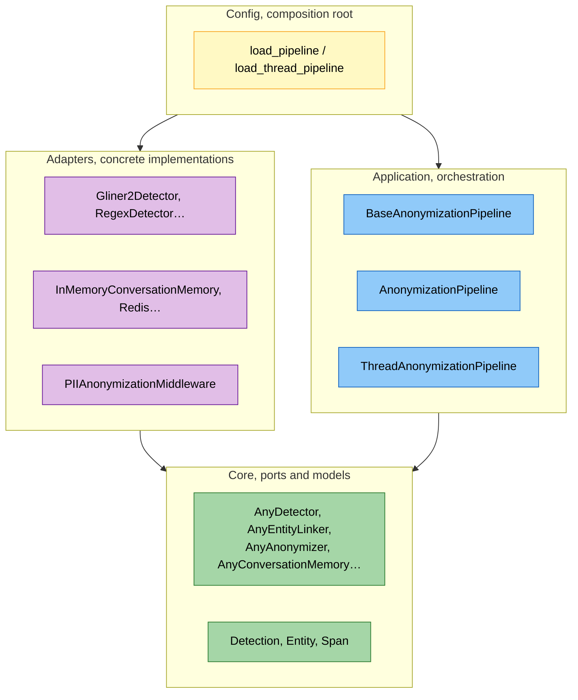
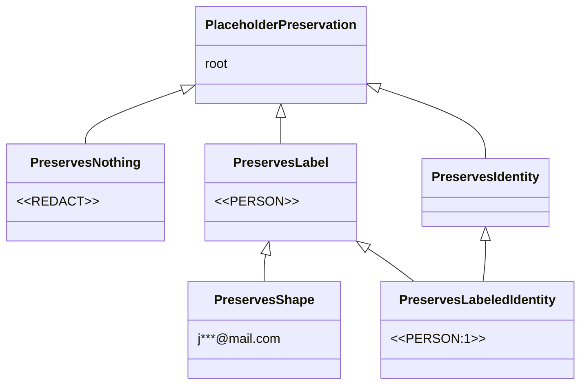
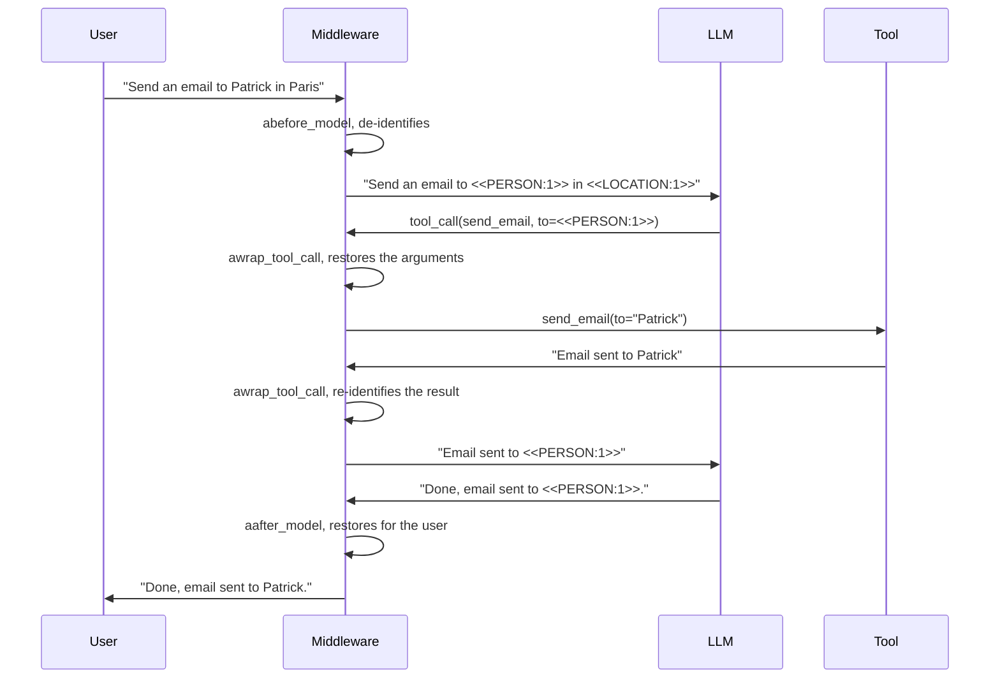

# Architecture

`piighost` follows a hexagonal architecture, also known as ports and adapters. The core
knows only abstract contracts, the **ports**. Each concrete implementation, a GLiNER2
detector, a Redis backend, a LangChain middleware, is an **adapter** that satisfies a
port without the core knowing about it. The de-identification pipeline is assembled by
injecting the chosen adapters behind the ports it expects.

!!! note "De-identification, not anonymization"
    By default `piighost` keeps the link between a value and its token, so it can
    restore the value. This is reversible de-identification, which under the GDPR is
    pseudonymization, not anonymization. The word anonymization stays reserved for an
    irreversible removal, for example with `RedactPlaceholderFactory`.

---

## The three rings

The code reads as three rings, from the most abstract to the most concrete. The
direction of the dependencies is fixed once and for all, an outer ring imports an inner
ring, never the reverse.



*Three rings and the composition root. Dependencies always point toward the core.*
{ .figure-caption }

- **Core.** The data models (`Detection`, `Entity`, `Span`, frozen dataclasses) and the
  ports. No external dependency, no pydantic, no I/O.
- **Application.** The pipeline orchestration, which depends only on the core ports.
  This is where `anonymize`, `deanonymize`, and `forget_thread` live.
- **Adapters.** The concrete implementations of the ports, detectors, resolvers,
  factories, guard rails, memory backends, observation, HTTP client, middleware. Each
  adapter imports the core, never the reverse.
- **Config.** The composition root. It is the only place allowed to know both the ports
  and the concrete adapters, in order to assemble them.

---

## Ports and templates

A port is a Python `Protocol` marked `runtime_checkable`, in each component's
`base.py`. The typing there is **structural**, an object satisfies the port as soon as
it has the methods, without inheriting from it. The pipeline depends on the port, never
on a concrete class.

```python
@runtime_checkable
class AnyDetector(Protocol):
    async def detect(self, text: str) -> list[Detection]: ...
```

When several adapters of one port share a skeleton, that skeleton lives in a `Base*`
class, an abstract class that applies the Template Method pattern. The skeleton is
written once in the base class, and each subclass provides only the step that varies.

```python
class BaseEntityLinker(ABC):
    def link(self, detections: list[Detection]) -> list[Entity]:
        # common skeleton: group by key
        ...

    @abstractmethod
    def _key(self, detection: Detection) -> Hashable:
        # only varying step, defined by the subclass
        ...
```

Two ports have no template. The guard rails and the memory backends differ by their
whole mechanism, not by a single step, so there is nothing common to factor out. This
is the deliberate exception to the always-template rule.

---

## The pipeline stages

`BaseAnonymizationPipeline` chains the stages from detection to de-identified text.
Three stages are mandatory, detection, linking, and anonymization. The others are
optional and behave as pass-throughs when they are not provided.

```mermaid
flowchart LR
    classDef req fill:#90CAF9,stroke:#1565C0,color:#000
    classDef opt fill:#FFF9C4,stroke:#F9A825,color:#000
    classDef data fill:#A5D6A7,stroke:#2E7D32,color:#000

    IN(["`**Source text**
    _'Patrick lives in Paris.
    Patrick loves Paris.'_`"]):::data

    DET["`**Detector**
    _AnyDetector_`"]:::req
    OVR["`override
    _AnyDetectionOverride_`"]:::opt
    OVL["`span resolver
    _AnyOverlapResolver_`"]:::opt
    EXP["`expander
    _AnyDetectionExpander_`"]:::opt
    LINK["`**Linker**
    _AnyEntityLinker_`"]:::req
    ENT["`entity resolver
    _AnyEntityResolver_`"]:::opt
    ANON["`**Anonymizer**
    _AnyAnonymizer + factory_`"]:::req
    GUARD["`guard rail
    _AnyGuardRail_`"]:::opt

    OUT(["`**Output**
    _'<<PERSON:1>> lives in <<LOCATION:1>>.
    <<PERSON:1>> loves <<LOCATION:1>>.'_`"]):::data

    IN --> DET --> OVR --> OVL --> EXP --> LINK --> ENT --> ANON --> GUARD --> OUT
```



*The pipeline, mandatory stages in blue, optional stages in yellow.*
{ .figure-caption }

Why each stage exists and in which order is covered in
[Pipeline design](conception.md). Here is the role and the default adapter of each.

<div class="wide-table" markdown="1">

| Stage | Port | Provided adapter | Role |
|---|---|---|---|
| Detector | `AnyDetector` | `Gliner2Detector`, `RegexDetector`, `LLMDetector`, `ExactMatchDetector`, `CompositeDetector`, `ChunkedDetector` | Finds the PII, returns positioned and typed `Detection` objects. |
| Span resolver | `AnyOverlapResolver` | `ConfidenceOverlapResolver` | Arbitrates overlapping detections, keeps the highest-confidence one. |
| Expander | `AnyDetectionExpander` | `WordBoundaryExpander` | Catches missed occurrences of an already-detected value. |
| Linker | `AnyEntityLinker` | `ExactEntityLinker` | Groups the detections of one value into an `Entity`. |
| Entity resolver | `AnyEntityResolver` | `MergeEntityResolver`, `FuzzyEntityResolver`, `SeparateEntityResolver` | Reconciles entities that share a detection. |
| Anonymizer | `AnyAnonymizer` (+ `AnyPlaceholderFactory`) | `Anonymizer` + `LabelCounterPlaceholderFactory` | Replaces each entity with its token. |
| Guard rail | `AnyGuardRail` | `DetectorGuardRail`, `LLMGuardRail`, `ModerationGuardRail` | Re-checks the output, raises `PIIRemainingError` on residual PII. |

</div>

The override (`AnyDetectionOverride`, adapter `DetectionOverride`) is an optional server
component. It applies a whitelist and a blacklist to every detection set, right after
detection, before span resolution.

---

## The placeholder component and its preservation tags

The anonymizer delegates the shape of the token to a **placeholder factory**
(`AnyPlaceholderFactory`). What changes between two factories is **what the token
preserves** of the original value.



*The preservation tags, from the token that keeps nothing to the one that identifies
each entity.*
{ .figure-caption }

Each tag is a subclass of `str`, so a token is a real string carrying its preservation
level in its own type. These tags are phantom types, they exist only for the type
checker. The middleware requires a tag that preserves identity
(`PreservesRecognizableIdentity`), so plugging a `<<PERSON>>` factory into the
middleware is an error caught at type-check time, not a runtime surprise.

The provided factories range from the least to the most informative.
`RedactPlaceholderFactory` emits `<<REDACT>>`{ .placeholder }, `LabelPlaceholderFactory`
emits `<<PERSON>>`{ .placeholder }, `LabelCounterPlaceholderFactory` emits
`<<PERSON:1>>`{ .placeholder }, `LabelHashPlaceholderFactory` emits
`<<PERSON:a1b2c3d4>>`{ .placeholder }, `MaskPlaceholderFactory` emits
`j***@mail.com`{ .placeholder }. The detail is in
[Placeholder factories](placeholder-factories.md).

---

## The single-text pipeline

`AnonymizationPipeline` handles an isolated text. It detects, applies the optional
stages that are present, groups into entities, anonymizes, then passes the output to
the guard rail. Its `deanonymize` method takes the token-to-entity mapping produced by
`anonymize` and restores the values.

```python
from piighost.pipeline import AnonymizationPipeline
from piighost.components.detector import ExactMatchDetector
from piighost.components.linker import ExactEntityLinker
from piighost.components.anonymizer import Anonymizer
from piighost.components.placeholder import LabelCounterPlaceholderFactory

pipeline = AnonymizationPipeline(
    detector=ExactMatchDetector({"Patrick": "PERSON"}),
    linker=ExactEntityLinker(),
    anonymizer=Anonymizer(LabelCounterPlaceholderFactory()),
)
result = await pipeline.anonymize("Patrick habite à Paris.")
# result.text   -> "<<PERSON:1>> habite à Paris."
# result.tokens -> {Entity("Patrick"): "<<PERSON:1>>"}
restored = pipeline.deanonymize(result.text, result.tokens)
# restored -> "Patrick habite à Paris."
```

The constructor takes only the detector, the linker, and the anonymizer as mandatory.
The optional stages come as keyword arguments.

```python
AnonymizationPipeline(
    detector,
    linker,
    anonymizer,
    overlap_resolver=None,   # AnyOverlapResolver
    expander=None,           # AnyDetectionExpander
    entity_resolver=None,    # AnyEntityResolver
    guard=None,              # AnyGuardRail
    override=None,           # AnyDetectionOverride
)
```

---

## The conversation pipeline

`ThreadAnonymizationPipeline` shares the same base but adds a **conversation memory**
(`AnyConversationMemory`), passed as a mandatory argument. An agent chains messages, and
the same `Patrick`{ .pii } must keep the same `<<PERSON:1>>`{ .placeholder } from the
first to the last.

Tokens are assigned over **the union of every message's detections** in the thread, not
over one message alone. A value seen again later therefore recovers its token instead of
creating a new one. Rendering, in contrast, stays per message, only the current
message's spans are replaced, because detections from different messages do not share
the same offset space.

```python
result = await thread_pipeline.anonymize(text, thread_id="t-42")
restored = await thread_pipeline.deanonymize(reply, thread_id="t-42")
dropped = await thread_pipeline.forget_thread("t-42")
```

- The `thread_id` is **mandatory**, there is no shared default thread, so two callers
  cannot fall into the same thread and leak each other's PII.
- `deanonymize` rebuilds the thread's tokens from memory, so **any** text carrying those
  tokens is restored, including a model reply the pipeline never anonymized.
- `forget_thread` erases a thread's whole memory and reports how much was dropped, for
  the right to erasure.

### Value provenance

A value whose first occurrence in the thread comes from a model message is not user PII.
Tokenizing it would strip the model of its world knowledge. So the memory records the
**role** of each value's first occurrence (`MessageRole.USER` or
`MessageRole.ASSISTANT`), and the pipeline leaves assistant-introduced values in clear.

---

## The conversation memory and encryption

The memory is a **repository**, an `AnyConversationMemory` port with two adapters.

- `InMemoryConversationMemory` keeps everything in a process-local dict. Simple, enough
  for a single worker.
- `RedisConversationMemory` persists to Redis, for a multi-worker deployment where each
  worker must see the others' threads.

The Redis backend stores clear PII by nature, the reverse mapping. Two **crypto**
components protect it. An `AnyHasher` (`Sha256Hasher`, `Argon2Hasher`) turns each
message into a deterministic key without revealing the text. An `AnyCipher`
(`AesGcmCipher`) encrypts the detections at rest, so a store leak reveals neither the
message nor the PII. The `thread_id` stays clear as a key prefix, so a thread can be
enumerated and forgotten.

---

## The LangChain middleware

`PIIAnonymizationMiddleware` wires the conversation pipeline into a LangChain agent
loop. It contains no de-identification logic, it delegates everything to the pipeline.
It is an adapter between the LangChain world and the core.



*The middleware intercepts the agent loop at three points.*
{ .figure-caption }

- `abefore_model` de-identifies the messages before the LLM sees them.
- `aafter_model` restores the model's output for the user display.
- `awrap_tool_call` handles the tool call according to the chosen strategy
  (`ToolCallStrategy`), restoring the arguments so the tool receives real data, then
  re-identifying its response.

The middleware requires a factory that preserves identity, at type-check time. It also
recognizes the tokens the model **invents** (`InventedPlaceholderStrategy`), since after
restoration any token still following the placeholder grammar was not emitted by the
pipeline. The detail of the tool strategies is in
[Tool-call strategies](tool-call-strategies.md).

---

## Observation

`piighost` emits one trace per pipeline stage through a port (`AnyObservationTracer`), a
seam on top of OpenTelemetry. With no backend configured, a no-op implementation traces
nothing and costs nothing, so the pipeline can always emit without checking whether
tracing is active. An optional `observation_redactor` replaces the values in the traces
with tokens, for a backend not allowed to see PII.

---

## The config, composition root

A TOML or JSON file describes the whole pipeline. The config subsystem reads it with
pydantic-settings and turns it into config models, discriminated unions where each
component type carries a `build()` method. Assembling the pipeline amounts to calling
`build()` on each model.

```python
from piighost.config import load_pipeline, load_thread_pipeline

pipeline = load_pipeline("piighost.toml")
thread_pipeline = load_thread_pipeline("piighost.toml")
```

The coupling is one-way, config depends on the core and the adapters, the core never
imports config. Adding a component means writing an adapter, a config model with
`build()`, and nothing else. The pipeline does not change.

---

## Data models

All core models are **frozen dataclasses**, immutable so they can be shared across
coroutines without risk.

| Model | Key fields |
|---|---|
| `Detection` | `text`, `label`, `span: Span`, `confidence` |
| `Entity` | `detections: tuple[Detection, ...]`, `label` and `text` as properties |
| `Span` | `start`, `end`, `overlaps()`, `extract()` |

---

## See also

- [Pipeline design](conception.md), why each stage exists and in which order
- [Placeholder factories](placeholder-factories.md), the families of tokens and what
  they preserve
- [Tool-call strategies](tool-call-strategies.md), the detail of `awrap_tool_call`
- [Extending PIIGhost](extending.md), plugging your own adapter behind a port
