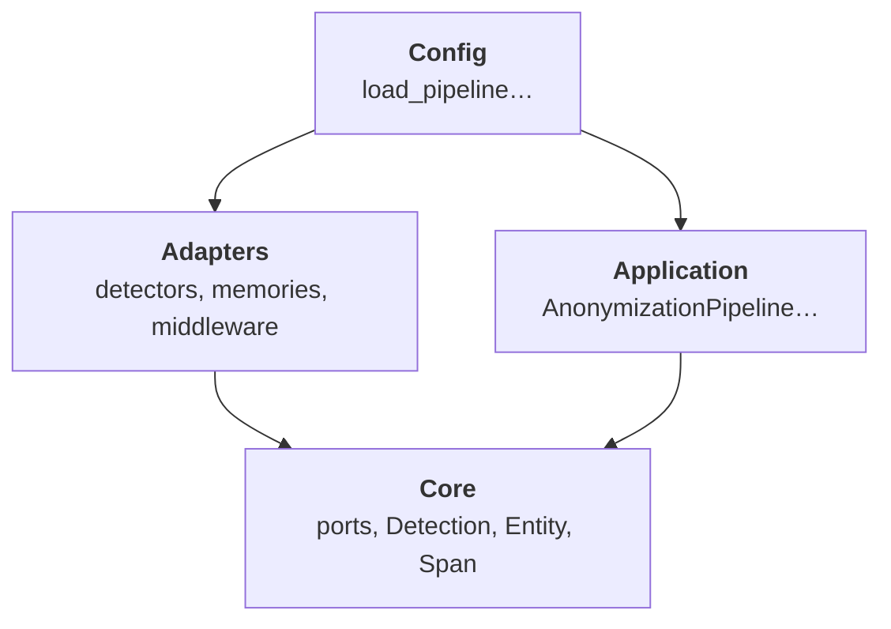
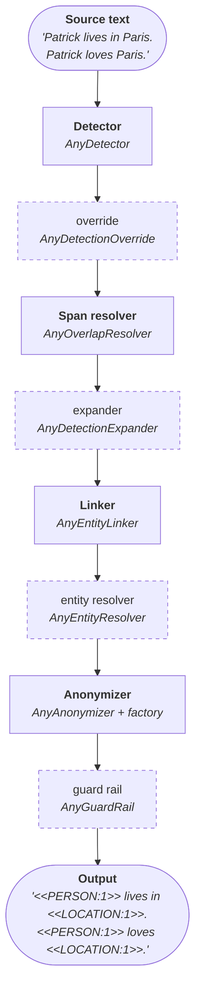
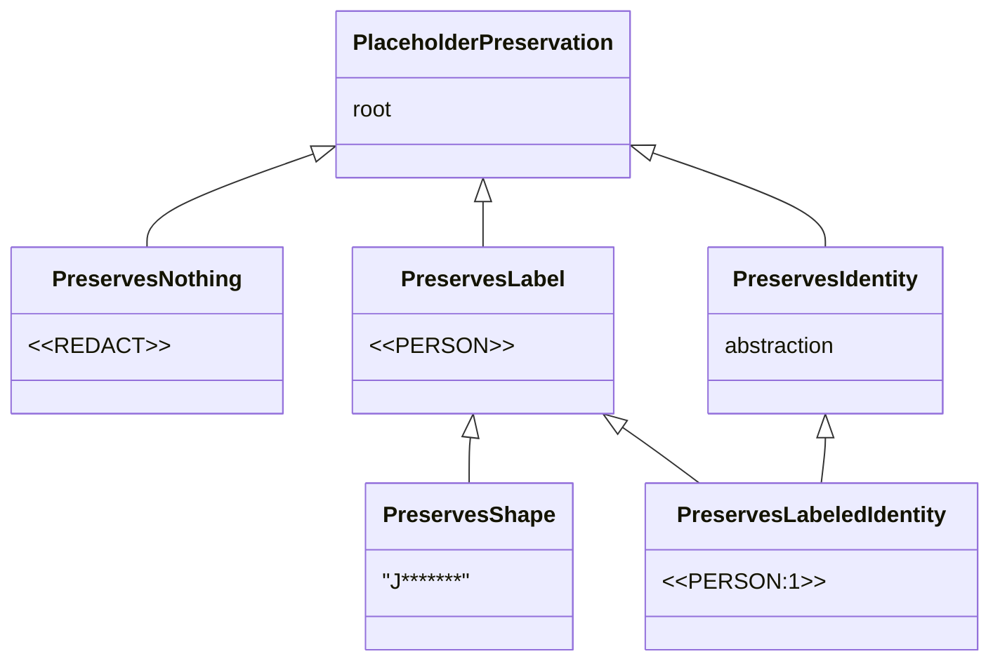
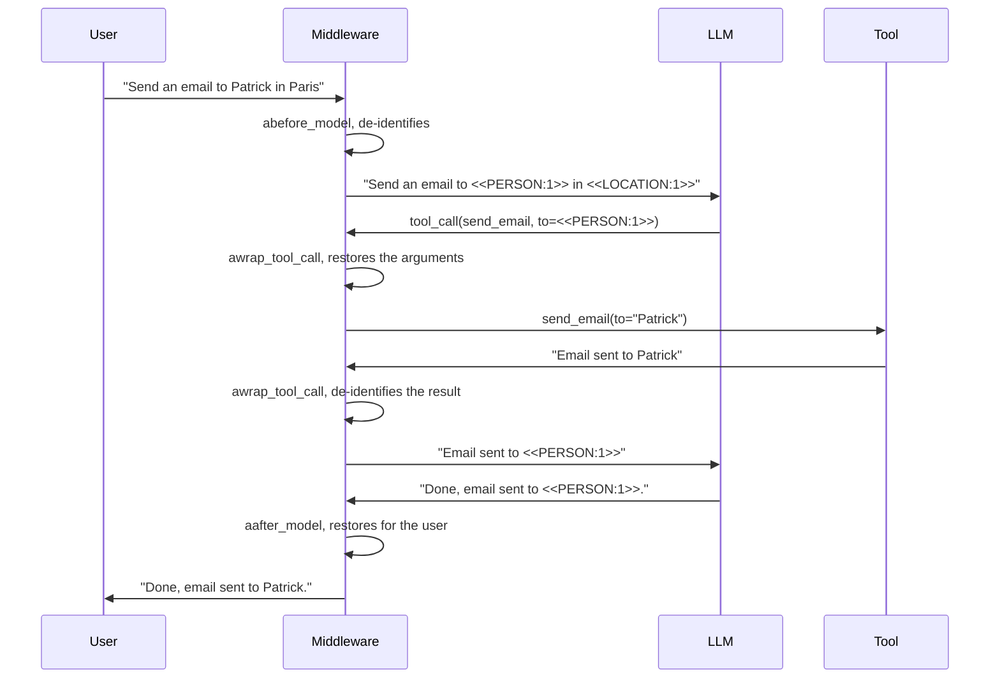

# Architecture

`piighost` follows a hexagonal architecture, also known as ports and adapters. The core
knows only abstract contracts, the **ports**. Each concrete implementation, a GLiNER2
detector, a Redis backend, a LangChain middleware, is an **adapter** that satisfies a
port without the core knowing about it. The de-identification pipeline is assembled by
injecting the chosen adapters behind the ports it expects.

!!! note "De-identification, not anonymization"
    By default `piighost` keeps the link between a value and its token, so it can
    restore the value. This is reversible de-identification, which under the GDPR is
    pseudonymization, not anonymization. The word anonymization stays reserved for an
    irreversible removal, for example with `RedactPlaceholderFactory`.

---

## The three rings

The code reads as three rings, from the most abstract to the most concrete. The
direction of the dependencies is fixed once and for all. An outer ring imports an inner
ring, and an inner ring never imports an outer ring.


```mermaid
flowchart TB
    CFG["`**Config**
    load_pipeline…`"]
    ADP["`**Adapters**
    detectors, memories, middleware`"]
    APP["`**Application**
    AnonymizationPipeline…`"]
    CORE["`**Core**
    ports, Detection, Entity, Span`"]

    CFG --> ADP & APP
    ADP & APP --> CORE
```

*Three rings and the composition root. Dependencies always point toward the core.*
{ .figure-caption }

- **Core.** The data models (`Detection`, `Entity`, `Span`, frozen dataclasses) and the
  ports. No external dependency, no pydantic, no I/O.
- **Application.** The pipeline orchestration, which depends only on the core ports.
  This is where `anonymize`, `deanonymize`, and `forget_thread` live.
- **Adapters.** The concrete implementations of the ports, that is detectors, resolvers,
  factories, guard rails, memory backends, observation, HTTP client, middleware. Each
  adapter imports the core, never the reverse.
- **Config.** The composition root. It is the only place allowed to know both the ports
  and the concrete adapters, in order to assemble them.

---

## Ports and templates

A port is a Python `Protocol` marked `runtime_checkable`, in each component's
`base.py`. The typing there is **structural**. An object satisfies the port as soon as
it has the methods, without inheriting from it. The pipeline depends on the port, never
on a concrete class.

```python
--8<-- "snippets/architecture_port.py:example"
```

When several adapters of one port share a skeleton, that skeleton lives in a `Base*`
class, an abstract class that applies the Template Method pattern. The skeleton is
written once in the base class, and each subclass provides only the step that varies.

```python
--8<-- "snippets/architecture_template.en.py:example"
```

Five ports have no template shared by all their adapters, the detector, override, guard
rail, memory backend and cipher ports. Their adapters differ by their whole mechanism, not
by a single step, so they have nothing common to factor out. This is the deliberate
exception to the always-template rule.

The detector is a partial exception. The model detectors (`Gliner2Detector`,
`SpacyDetector`, `TransformersDetector`, `PresidioDetector`, `BridgeDetector`,
`LLMDetector`) share the `BaseNERDetector` template. It re-reads each detection's text
from the source, applies the confidence threshold and maps the labels. `RegexDetector`,
`ExactMatchDetector`, `CompositeDetector` and `ChunkedDetector` implement the port
directly.

---

## The pipeline stages

`BaseAnonymizationPipeline` chains the stages from detection to de-identified text.
Only the detector is a required constructor argument. Linking, de-identification, and
overlap resolution always run. When omitted, they fall back to built-in defaults. These
defaults are an `ExactEntityLinker`, an `Anonymizer` with a `LabelCounterPlaceholderFactory`, and a
`ConfidenceOverlapResolver`. The override, expand, entity-resolve, and guard stages
are pass-throughs when not provided.


```mermaid
flowchart TB
    classDef opt stroke-dasharray:5 5

    IN(["`**Source text**
    _'Patrick lives in Paris.
    Patrick loves Paris.'_`"])

    DET["`**Detector**
    _AnyDetector_`"]
    OVR["`override
    _AnyDetectionOverride_`"]:::opt
    OVL["`**Span resolver**
    _AnyOverlapResolver_`"]
    EXP["`expander
    _AnyDetectionExpander_`"]:::opt
    LINK["`**Linker**
    _AnyEntityLinker_`"]
    ENT["`entity resolver
    _AnyEntityResolver_`"]:::opt
    ANON["`**Anonymizer**
    _AnyAnonymizer + factory_`"]
    GUARD["`guard rail
    _AnyGuardRail_`"]:::opt

    OUT(["`**Output**
    _'#lt;#lt;PERSON:1#gt;#gt; lives in #lt;#lt;LOCATION:1#gt;#gt;.
    #lt;#lt;PERSON:1#gt;#gt; loves #lt;#lt;LOCATION:1#gt;#gt;.'_`"])

    IN --> DET --> OVR --> OVL --> EXP --> LINK --> ENT --> ANON --> GUARD --> OUT
```

*The pipeline. The stages that always run are in bold, the optional stages have a dashed border.*
{ .figure-caption }

The [Pipeline design](conception.md) page explains why each stage exists and why
they run in this order. Here is the role and the default adapter of each.

<div class="wide-table" markdown="1">

| Port | Provided adapters | Role |
|---|---|---|
| `AnyDetector` | `Gliner2Detector`, `Gliner2PiiDetector`, `SpacyDetector`, `TransformersDetector`, `PresidioDetector`, `BridgeDetector`, `LLMDetector`, `RegexDetector`, `ExactMatchDetector`, `CompositeDetector`, `ChunkedDetector` | Finds the confidential data (personal data, secrets), returns positioned and typed `Detection` objects. |
| `AnyOverlapResolver` | `ConfidenceOverlapResolver`, `MergeOverlapResolver` | Arbitrates overlapping detections, keeps the highest-confidence one or their union. |
| `AnyDetectionExpander` | `WordBoundaryExpander` | Catches missed occurrences of an already-detected value. |
| `AnyEntityLinker` | `ExactEntityLinker` | Groups the detections of one value into an `Entity`. |
| `AnyEntityResolver` | `MergeEntityResolver`, `FuzzyEntityResolver`, `SeparateEntityResolver` | Reconciles entities that share a detection. |
| `AnyAnonymizer` and `AnyPlaceholderFactory` | `Anonymizer` and `LabelCounterPlaceholderFactory` | Replaces each entity with its token. |
| `AnyGuardRail` | `DetectorGuardRail`, `Gliner2GuardRail`, `LLMGuardRail`, `ModerationGuardRail` | Re-checks the output, raises `PIIRemainingError` on residual confidential data. |

</div>

The override (`AnyDetectionOverride`, adapter `DetectionOverride`) is an optional server
component. It applies a deny list and an allow list to every detection set, right after
detection, before span resolution.

---

## The placeholder component and its preservation tags

The anonymizer delegates the shape of the token to a **placeholder factory**
(`AnyPlaceholderFactory`). What changes between two factories is **what the token
preserves** of the original value.


```mermaid
classDiagram
    class PlaceholderPreservation {
        root
    }
    class PreservesNothing {
        &lt;&lt;REDACT&gt;&gt;
    }
    class PreservesLabel {
        &lt;&lt;PERSON&gt;&gt;
    }
    class PreservesShape {
        "J*******"
    }
    class PreservesIdentity {
        abstraction
    }
    class PreservesLabeledIdentity {
        &lt;&lt;PERSON:1&gt;&gt;
    }

    PlaceholderPreservation <|-- PreservesNothing
    PlaceholderPreservation <|-- PreservesLabel
    PlaceholderPreservation <|-- PreservesIdentity
    PreservesLabel <|-- PreservesShape
    PreservesLabel <|-- PreservesLabeledIdentity
    PreservesIdentity <|-- PreservesLabeledIdentity
```

*The preservation tags, from the token that keeps nothing to the one that identifies
each entity. Each arrow goes from a tag to its parent and reads "is a".*
{ .figure-caption }

Each tag is a subclass of `str`. A token is therefore a real string carrying its
preservation level in its own type. These tags are phantom types, which means they
exist only for the type checker. The middleware requires a tag that preserves identity
(`PreservesRecognizableIdentity`). Plugging a `<<PERSON>>` factory into the
middleware is therefore an error caught at type-check time, not a runtime surprise.

The provided factories range from the least to the most informative.
`RedactPlaceholderFactory` emits `<<REDACT>>`{ .placeholder }, `LabelPlaceholderFactory`
emits `<<PERSON>>`{ .placeholder }, `LabelCounterPlaceholderFactory` emits
`<<PERSON:1>>`{ .placeholder }, `LabelHashPlaceholderFactory` emits
`<<PERSON:a1b2c3d4>>`{ .placeholder }. `MaskPlaceholderFactory` keeps the first character
and masks the rest, so `Jonathan`{ .pii } becomes `J*******`{ .placeholder }. The detail is in
[Placeholder factories](placeholder-factories.md).

---

## The single-text pipeline

`AnonymizationPipeline` handles an isolated text. It detects, applies the optional
stages that are present, groups into entities, de-identifies, then passes the output to
the guard rail. Its `deanonymize` method takes the token-to-entity mapping produced by
`anonymize` and restores the values.

```python
--8<-- "snippets/architecture_pipeline.py:example"
```

The constructor requires only the detector. The linker and anonymizer default to
`ExactEntityLinker` and an `Anonymizer` with a `LabelCounterPlaceholderFactory`.
The other stages come as keyword arguments.

```python
--8<-- "snippets/architecture_signature.en.py:example"
```

Omitting `overlap_resolver`, or passing `None`, builds a `ConfidenceOverlapResolver`,
since the render stage needs disjoint spans. The expand, entity-resolve, guard, and
override stages stay disabled when `None`.

---

## The conversation pipeline

`ThreadAnonymizationPipeline` shares the same base but adds a **conversation memory**
(`AnyConversationMemory`), passed through the `memory` keyword argument. Without it, the
pipeline builds an `InMemoryConversationMemory`. An agent chains messages, and
the same `Patrick`{ .pii } must keep the same `<<PERSON:1>>`{ .placeholder } from the
first to the last.

Tokens are assigned over **the union of every message's detections** in the thread, not
over one message alone. A value seen again later therefore recovers its token instead of
creating a new one. Rendering, in contrast, stays per message. Only the current
message's spans are replaced, because detections from different messages do not share
the same offset space.

```python
--8<-- "snippets/architecture_thread.py:example"
```

- The `thread_id` is **mandatory**. There is no shared default thread, so two callers
  cannot fall into the same thread and leak each other's confidential data.
- `deanonymize` rebuilds the thread's tokens from memory. It therefore restores **any**
  text carrying those tokens, including a model reply the pipeline never de-identified.
- `forget_thread` erases a thread's whole memory and reports how much was dropped, for
  the right to erasure.

### Value provenance

A value whose first occurrence in the thread comes from a model message is not the user's confidential data.
Tokenizing it would strip the model of its world knowledge. So the memory records the
**role** of each value's first occurrence (`MessageRole.USER` or
`MessageRole.ASSISTANT`), and the pipeline leaves assistant-introduced values in clear.

---

## The conversation memory and encryption

The memory is a **repository**, an `AnyConversationMemory` port with three adapters.

- `InMemoryConversationMemory` keeps everything in a process-local dict, bounded by
  default. Simple, enough for a single worker.
- `RedisConversationMemory` persists to Redis, for a multi-worker deployment where each
  worker must see the others' threads.
- `SqlAlchemyConversationMemory` persists to a SQL table, for long conversations that
  outlive the process.

By nature, a persistent backend stores confidential data, because it keeps the reverse
mapping, which leads each token back to its value. Two optional **crypto** components,
passed together, protect it on Redis as on SQL. An `AnyHasher` (`Sha256Hasher`,
`Argon2Hasher`) turns each message into a deterministic key without revealing the text.
An `AnyCipher` (`AesGcmCipher`) encrypts the detections at rest, so a store leak reveals
neither the message nor the values. The `thread_id` stays clear, a key prefix in Redis
and a column in the SQL table, so a thread can be enumerated and forgotten.

---

## The LangChain middleware

`PIIAnonymizationMiddleware` wires the conversation pipeline into a LangChain agent
loop. It contains no de-identification logic, it delegates everything to the pipeline.
It is an adapter between the LangChain world and the core.


```mermaid
sequenceDiagram
    participant U as User
    participant M as Middleware
    participant L as LLM
    participant T as Tool

    U->>M: "Send an email to Patrick in Paris"
    M->>M: abefore_model, de-identifies
    M->>L: "Send an email to <<PERSON:1>> in <<LOCATION:1>>"
    L->>M: tool_call(send_email, to=<<PERSON:1>>)
    M->>M: awrap_tool_call, restores the arguments
    M->>T: send_email(to="Patrick")
    T->>M: "Email sent to Patrick"
    M->>M: awrap_tool_call, de-identifies the result
    M->>L: "Email sent to <<PERSON:1>>"
    L->>M: "Done, email sent to <<PERSON:1>>."
    M->>M: aafter_model, restores for the user
    M->>U: "Done, email sent to Patrick."
```

*The middleware intercepts the agent loop at three points.*
{ .figure-caption }

- `abefore_model` de-identifies the messages before the LLM sees them.
- `aafter_model` restores the model's output for the user display.
- `awrap_tool_call` handles the tool call according to the chosen strategy
  (`ToolCallStrategy`), restoring the arguments so the tool receives real data, then
  de-identifying its response.

The middleware requires a factory that preserves identity, at type-check time. At
runtime, it also refuses a pipeline whose tokens have no delimited grammar, such as a
mask (`UnrecognizableFactoryError`), and a factory whose tokens several values can
share, such as `redact` (`IrreversibleFactoryError`). That grammar lets it
recognize the tokens the model **invents** (`InventedPlaceholderStrategy`). After
restoration, any token still following the placeholder grammar was not emitted by the
pipeline. The detail of the tool strategies is in
[Tool-call strategies](tool-call-strategies.md).

---

## Observation

`piighost` emits one trace per pipeline stage through a port (`AnyObservationTracer`), a
seam on top of OpenTelemetry. With no backend configured, a no-op implementation traces
nothing and costs nothing. The pipeline can therefore always emit its traces without
checking whether tracing is active. An optional `observation_redactor` replaces the values in the traces
with tokens, for a backend not allowed to see confidential data.

---

## The config, composition root

A TOML or JSON file describes the whole pipeline. The config subsystem reads it with
pydantic-settings and turns it into config models. These models are discriminated
unions, where each component type carries a `build()` method. Assembling the pipeline amounts to calling
`build()` on each model.

```python
--8<-- "snippets/loaders.py"
```

A file without a `[memory]` section builds a pipeline. A file that declares a `[memory]` section builds a conversation pipeline. Each loader refuses the file meant for the other. `load_pipeline` refuses a file with `[memory]`, and `load_thread_pipeline` a file without one.

The coupling is one-way. Config depends on the core and the adapters, but the core
never imports config. Adding a component means writing an adapter, a config model with
`build()`, and nothing else. The pipeline does not change.

---

## Data models

All core models are **frozen dataclasses**, immutable so they can be shared across
coroutines without risk.

| Model | Key fields |
|---|---|
| `Detection` | `text`, `label`, `span: Span`, `confidence` |
| `Entity` | `detections: tuple[Detection, ...]`, `label` and `text` as properties |
| `Span` | `start`, `end`, `overlaps()`, `extract()` |

---

## See also

- [Pipeline design](conception.md): why each stage exists and in which order.
- [Placeholder factories](placeholder-factories.md): the families of tokens and what they preserve.
- [Tool-call strategies](tool-call-strategies.md): the detail of `awrap_tool_call`.
- [Extending piighost](extending.md): plugging your own adapter behind a port.
- [Data models reference](reference/models.md): the fields, methods and validation of `Detection`, `Entity`, `Span` and `Chunk`.
