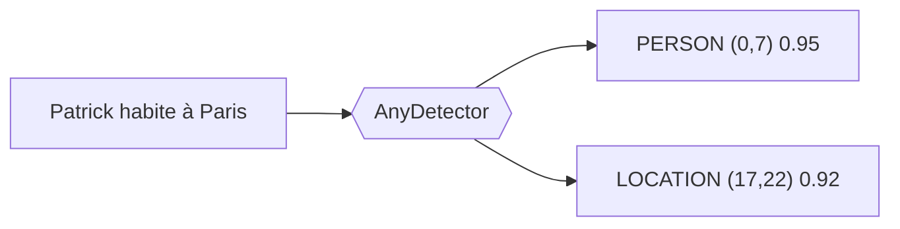
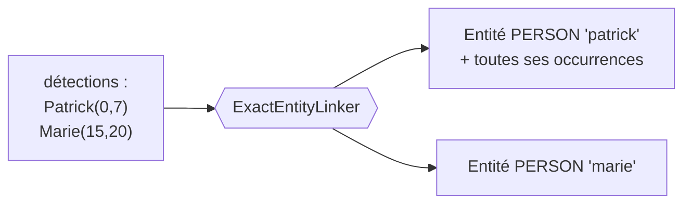
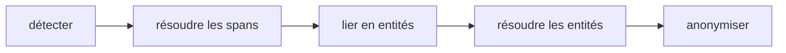
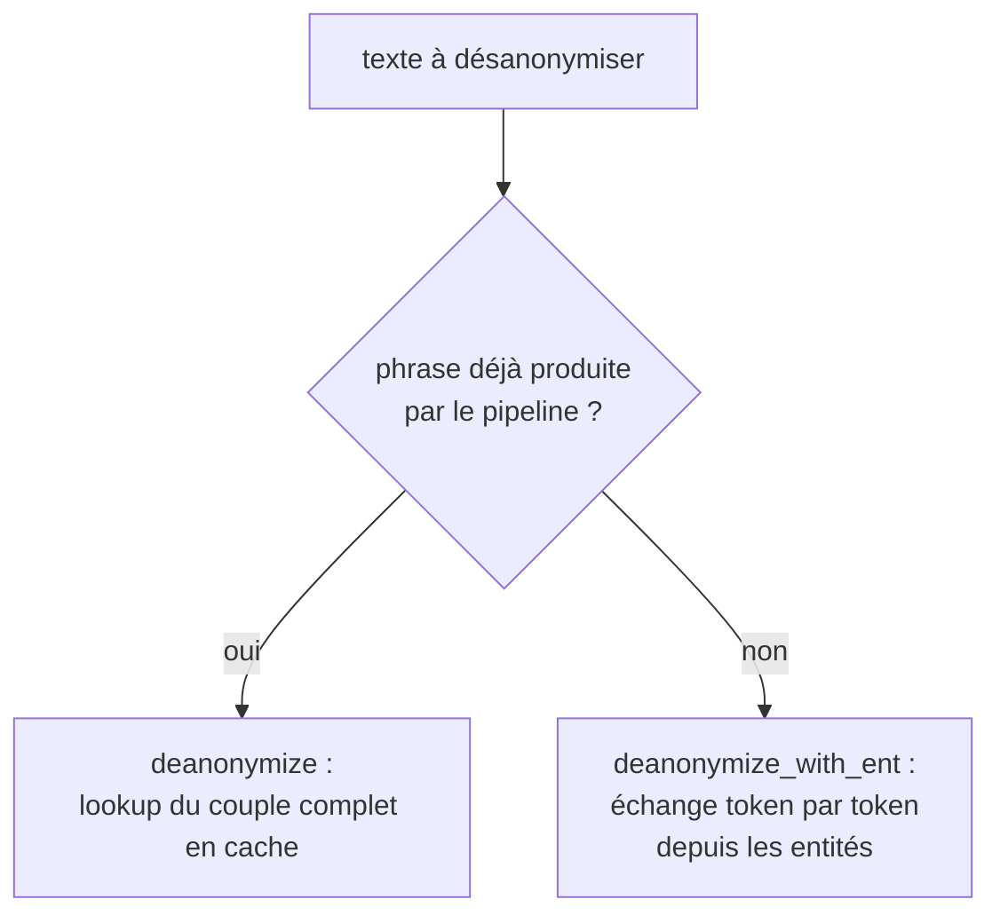

# Pipeline design

Once you accept that you need to anonymize (see [Why de-identify?](why-anonymize.md)),
the question that remains is **how**. This page builds it step by step. We start from the first
brick, detecting sensitive data, and add one constraint at a time. Each
component of the pipeline appears because a previous constraint made it
necessary. By the end, the order of the stages and the technical choices (synchronous vs
asynchronous, two deanonymization mechanisms, per-conversation memory) are
no longer arbitrary, they follow from the problem.

!!! note "For the overview"
    This page is narrative. For the map of the layers and the API of each
    component, see [Architecture](architecture.md).

---

## Step 1: knowing *what* to replace, the detector

Anonymizing means replacing a sensitive value with a *placeholder*, that is the
*token* that takes its place in the anonymized text. On free text, you do not know
in advance where the PII are nor of what type. So the first brick is **detection**.

Two classic approaches complement each other:

- **regex** recognizes **patterns**, that is strings of characters that
  follow a fixed structure (IBAN, phone, email). Effective on those formats,
  but unusable on unstructured text such as a first name, a last name, a written
  date, or a location;
- **NER** (Named Entity Recognition) is an **AI model** that, on a text,
  classifies the words according to a classification decided in advance (name, first name, location,
  organization). It captures context where regex only sees a format.

That is the role of the **detector** (`AnyDetector`). It reads the text and returns a list
of **detections**, one per PII found, with its position, its type, and a confidence
score.



*The detector turns raw text into positioned and typed detections.*
{ .figure-caption }

PIIGhost provides these approaches as interchangeable detectors:

- **NER**: `Gliner2Detector`, `SpacyDetector`, `TransformersDetector`;
- **regex**: `RegexDetector`, with an optional checksum validator (Luhn,
  mod-97) that discards false positives;
- **LLM**: `LLMDetector`, when the business context exceeds the narrow detectors.

They can be combined (`CompositeDetector`): a regex plus a NER cover more
cases than a single one. That is why the detector is a **protocol** and not a
frozen class, you inject the one you want.

---

## Step 2: saying *what type* it is, the typed placeholder

With detection, you know the type of each PII. The simplest placeholder
would be a constant token, the same for everything, like `<<REDACT>>`{ .placeholder }. You
enrich it with the type: `<<PERSON>>`{ .placeholder } or `<<EMAIL>>`{ .placeholder }.

Why is that useful? Because the model that reads the anonymized text needs the
**type** to reason. "Contact `<<PERSON>>`{ .placeholder } at
`<<EMAIL>>`{ .placeholder }" stays usable; "Contact `<<REDACT>>`{ .placeholder }
at `<<REDACT>>`{ .placeholder }" no longer is.

The **placeholder factory** (`AnyPlaceholderFactory`) decides the shape of the placeholder.
It takes an entity and returns its token. It is the one you change to go from
`<<REDACT>>`{ .placeholder } to `<<PERSON>>`{ .placeholder }.

---

## Step 3: distinguishing individuals, the entity and its identity

A text can mention **two different people**. If both become
`<<PERSON>>`{ .placeholder }, the model can no longer tell them apart, and you can
no longer go back without ambiguity. So you need an **identity** per individual:

```text
Patrick écrit à Marie  →  <<PERSON:1>> écrit à <<PERSON:2>>
```

`Patrick`{ .pii } becomes `<<PERSON:1>>`{ .placeholder }, `Marie`{ .pii } becomes
`<<PERSON:2>>`{ .placeholder }. The counter distinguishes individuals of the same type.

But the same person often appears **several times**, sometimes spelled
differently ("Patrick", "patrick"). All these occurrences must share
**the same** token. An isolated detection is therefore not enough. You need a notion
above it, the **entity**, which groups all the detections referring to the same PII.

Hence a new step, going from detections to entities. That is the **linker**
(`AnyEntityLinker`). `ExactEntityLinker`:

1. **expands** each detection by searching for its other occurrences in the text
   ("Patrick" found once is searched everywhere);
2. **groups** the detections of the same canonical key `(lowercase text, label)`
   into a single entity.



*The linker groups the detections of the same PII into one entity, which will receive a
unique token.*
{ .figure-caption }

It is the entity, not the detection, that receives a token. All the occurrences of an
entity therefore share the same `<<PERSON:1>>`{ .placeholder }.

---

## Step 4: arbitrating detections that contradict each other, the span resolver

As soon as you combine detectors, or a detector finds several candidates on
the same area, detections **overlap**. Classic example: a NER proposes
`LOCATION` on "Paris" and `PERSON` on the same position, or two models give
slightly different bounds.

If you let these overlaps through to the replacement, you would produce
nested tokens and corrupted text. So you must **resolve the position conflicts
before** grouping into entities.

That is the **span resolver** (`AnySpanConflictResolver`).
`ConfidenceSpanConflictResolver` keeps, on overlap, the highest-confidence
detection; on equal confidence, the **longest** (the most specific). This
"longest wins" rule prevents a "Jean" detected inside
"Jean-Pierre" from evicting the full entity.

The order of the stages is constrained:



*Positions are resolved before linking; identities are resolved after.*
{ .figure-caption }

Positions are resolved **before** linking (you want clean detections to
expand), and identities **after** (see the next step).

---

## Step 5: merging equivalent entities, the entity resolver

After linking, two entities can still refer to the same person, for example
"Patrick" and "Patric" (typo), or come from different detectors that
share a detection. Merging them avoids giving two tokens to a single
person.

That is the **entity resolver** (`AnyEntityConflictResolver`):

- `MergeEntityConflictResolver` merges entities that share a detection
  (union-find, transitive);
- `FuzzyEntityConflictResolver` merges by text similarity (Jaro-Winkler), to
  catch spelling variants.

At this stage, you have a list of clean entities, each due to receive a unique
and stable token.

---

## Step 6: producing the text, the anonymizer

The **anonymizer** (`AnyAnonymizer`) finally applies the replacement. It asks the
factory for a token for each entity, then replaces each detection with its token.

Consequence of step 4: the replacement by positions is done **right to
left**, so that replacing one area does not shift the positions of the areas still to
process. This assumes non-overlapping spans, which step 4 guarantees.

---

## Step 7: going back, two-way deanonymization

Anonymizing is only useful if you can **deanonymize**, that is restore the
real values for the user. For that you must know that
`<<PERSON:1>>`{ .placeholder } was `Patrick`{ .pii }. There are two situations, hence
two mechanisms.

**Way 1, the whole sentence is known (`deanonymize`).**
When the pipeline turned "Patrick habite Paris" into
"`<<PERSON:1>>` habite `<<LOCATION:1>>`", it **memorizes the complete pair** in
the cache. If you give it back exactly that anonymized sentence, it finds
the original in one go. Fast and exact, but limited to a sentence **already produced**
by the pipeline.

**Way 2, a new sentence (`deanonymize_with_ent`).**
The model generates a **new** response containing a token, for example "Bien sûr,
`<<PERSON:1>>`{ .placeholder } !". This sentence was never produced by the
pipeline, so way 1 does not find it. But you know the
token ↔ value pairs of the conversation's entities; you then replace each known token
with its value, in **any** text.



*Two ways for two situations: recovering a known sentence as a block, or swapping
the tokens one by one in an arbitrary sentence.*
{ .figure-caption }

The middleware tries way 1 (exact, cheap) and falls back on way 2 in case
of failure. This fallback is essential. A text carrying tokens but absent from the cache
must be restorable from memory rather than returned as-is with its
tokens.

---

## Step 8: the conversation, memory and counter consistency

Everything above handles **one** text, in isolation. An agent chains
messages, and the same `Patrick`{ .pii } must keep the same
`<<PERSON:1>>`{ .placeholder } from the first to the last.

### Why replaying the pipeline per message is not enough

The temptation is to simply call `anonymize` again on each message. But the
single-text pipeline has no memory. It starts from scratch on each call, and the
counter restarts at 1. Over two messages, you would get:

```text
Message 1 : "Patrick appelle Marie"   →  <<PERSON:1>> appelle <<PERSON:2>>
Message 2 : "Marie rappelle Patrick"  →  <<PERSON:1>> rappelle <<PERSON:2>>
```

`Marie`{ .pii } is `<<PERSON:2>>`{ .placeholder } in message 1 then
`<<PERSON:1>>`{ .placeholder } in message 2. The identities cross, and nothing
is reversible consistently over the thread anymore. A conversation therefore carries a
**shared state** from one message to the next.

### The conversation memory

The `ThreadAnonymizationPipeline` adds that state, a **memory** that accumulates the
entities seen, deduplicated by canonical identity `(lowercase text, label)`.
On each message, the detected entities are first **linked to those already known**
(cross-message linking) before being rendered. A person seen again in a later
message therefore recovers their entity, and their token, instead of creating a new
one.

```text
Message 1 : "Patrick appelle Marie"   →  <<PERSON:1>> appelle <<PERSON:2>>
   mémoire : patrick→1, marie→2
Message 2 : "Marie rappelle Patrick"  →  <<PERSON:2>> rappelle <<PERSON:1>>
   (réutilise la mémoire, aucun nouveau compteur)
```

### The two rules that follow

- **Order frozen at first seen** (*first-seen*). The counter of an entity is assigned
  to its **first** appearance in the conversation and never moves again. If "Patrick"
  appears in message 1, it keeps `<<PERSON:1>>`{ .placeholder } even if another
  person appears earlier in a later message. Without this rule, a new
  entity early in its message would steal the counter of an older one.
- **Isolation by `thread_id`.** Memory and cache keys are prefixed by
  conversation, so that a shared backend (Redis) does not mix two dialogues, and
  so that `forget_thread` can erase everything from a thread (right to be forgotten).

### The rendering also changes in nature

On an isolated text, you replaced by **positions** (step 6). But in a conversation,
the detections of an entity come from **different messages**; their positions
no longer have a common frame. The rendering of a message is therefore done by
**replacement of all the known surface forms** of the conversation, from the longest
token to the shortest, so that a short form ("Jean") does not bite
inside a longer one ("Jean-Pierre").

That is also what makes way 2 of step 7 possible: since you know how to replace
the surface forms in any text, you know how to restore the tokens in an
unseen response from the model.

---

## Step 9: why everything is asynchronous

The pipeline is **asynchronous end to end**, for two concrete reasons:

- **The cache is an external service.** Detections and mappings are cached via
  aiocache, potentially on Redis or a SQL database. Reading and writing these entries
  is network I/O; doing it asynchronously avoids blocking during the wait.
- **The API serves several requests at once.** A server hosting the pipeline
  must handle concurrent conversations on a single event loop.

But the inference of a local NER model is **synchronous and heavy** (hundreds
of milliseconds of CPU/GPU compute). Called directly in a coroutine,
it **freezes the whole loop**: no other request progresses during that time.
Model detection is therefore **offloaded to a thread** (`asyncio.to_thread`), with
an optional semaphore to bound the concurrency (GPU memory, CPU cores).

In short: **asynchronous for I/O and orchestration, offloaded to a thread for
blocking compute**. A detector that calls a **remote API** stays in
native async (it is network I/O, not compute), without `to_thread`.

---

## Step 10: why a cache, and which one

Detection is the costly step. The same text comes back often (the middleware
re-anonymizes the whole history on each turn). So you **cache the detection
results** and the anonymization mappings, by hash of the text.

The choice of backend follows the criticality:

- a detection is **expensive and shareable** (serializable), so you put it in a
  **shared** backend: one worker does not redo another's work;
- a cheap projection (grouping already-known entities) is **recomputed**
  rather than shared.

The cache only stores JSON-compatible dicts. The SQL backend therefore uses a
**JSON** serializer by default, and not Pickle, so that a tampered database cannot
trigger code execution on read.

---

## Step 11: the guard rail, defense in depth

Even with everything above, a PII can slip through the net, for example a
name the NER missed or an IBAN no regex covered. The **guard rail** (`AnyGuardRail`)
re-analyzes the anonymized text and **raises an error** if it still finds a PII in
clear.

Since realistic placeholders (Faker) can themselves look like PII, the
pipeline passes to the guard rail the tokens it just emitted, so that it
ignores them. The guard rail is optional but it is the last barrier before the output.

---

## Step 12: connecting to the agent world, the middleware

It remains to wire all this into a LangChain agent loop, transparently.
That is the `PIIAnonymizationMiddleware`, which acts at three points:

- **before the model** (`abefore_model`): anonymizes the messages before the LLM
  sees them;
- **after the model** (`aafter_model`): deanonymizes for the user display;
- **around the tool calls** (`awrap_tool_call`): depending on the chosen strategy,
  deanonymizes the arguments so the tool receives real data, then
  re-anonymizes its response.

The middleware contains no anonymization logic, it **delegates everything** to the
conversational pipeline. It is a simple adapter between the LangChain world and the
core.

---

## Recap: each component answers a constraint

<div class="wide-table" markdown="1">

| Constraint encountered | Component born from the constraint |
|---|---|
| You do not know where the PII are | Detector (`AnyDetector`) |
| The model needs the type | Typed placeholder (`AnyPlaceholderFactory`) |
| Distinguish two individuals of the same type | Identity per entity + linker (`AnyEntityLinker`) |
| Detections that overlap | Span resolver (`AnySpanConflictResolver`) |
| Equivalent entities to merge | Entity resolver (`AnyEntityConflictResolver`) |
| Producing the text without corruption | Anonymizer, right-to-left replacement |
| Going back on a known / new sentence | `deanonymize` (cache) + `deanonymize_with_ent` (entities) |
| Consistency across the whole conversation | Memory per `thread_id`, first-seen order |
| I/O without blocking / heavy compute | Async + inference offloaded to a thread |
| Costly and repeated detection | aiocache cache, JSON serialization |
| Residual PII | Guard rail (`AnyGuardRail`) |
| Transparent agent integration | LangChain middleware |

</div>

---

## See also

- [Architecture](architecture.md), the map of the layers and the API of each component
- [Placeholder factories](placeholder-factories.md), the families of tokens and what
  they preserve
- [Tool-call strategies](tool-call-strategies.md), the detail of `awrap_tool_call`
- [Observation and cache](observation.md), cache backends and tracing
