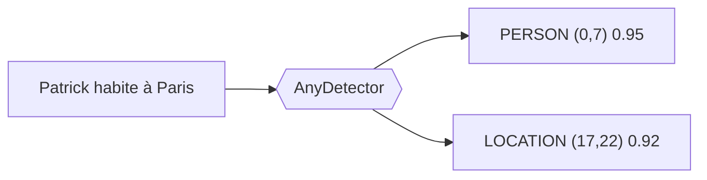
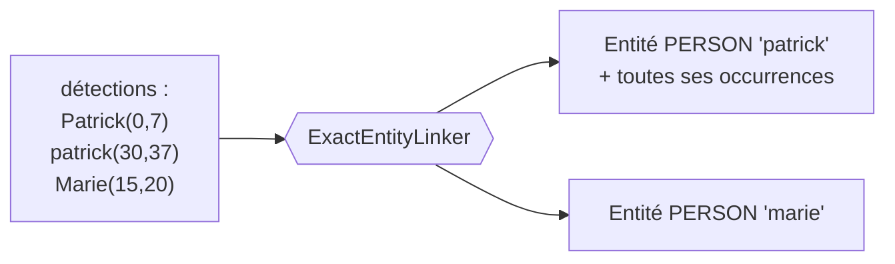
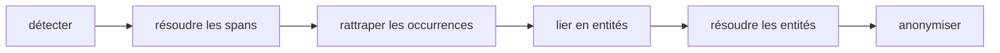
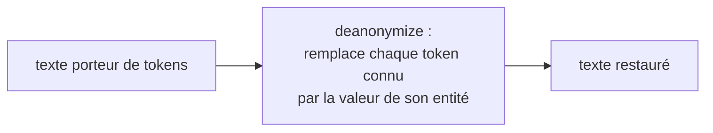

# Pipeline design

Once you accept that you need to de-identify (see [Why de-identify?](why-anonymize.md)),
the question that remains is how. This page builds it step by step. We start from the
first brick, detecting sensitive data, and add one constraint at a time. Each component
of the pipeline appears because a previous constraint made it necessary. By the end, the
order of the stages and the technical choices are no longer arbitrary, they follow from
the problem.

!!! note "De-identification, not anonymization"
    `piighost` keeps the link between a value and its token so it can restore it. This
    is reversible de-identification. We reserve the word anonymization for an
    irreversible removal, for example with `RedactPlaceholderFactory`.

!!! note "For the overview"
    This page explains the why. For the map of the layers and the API of each component,
    see [Architecture](architecture.md).

---

## Step 1, knowing what to replace, the detector

De-identifying means replacing a sensitive value with a *placeholder*, that is the
*token* that takes its place in the text. On free text, you do not know in advance where
the PII are nor of what type. So the first brick is detection.

Two classic approaches complement each other.

- **regex** recognizes patterns, that is strings of characters that follow a fixed
  structure (IBAN, phone, email). Effective on those formats, unusable on unstructured
  text such as a first name, a last name, a written date, or a location.
- **NER** (Named Entity Recognition) is an AI model that, on a text, classifies the
  words according to a classification decided in advance (name, first name, location,
  organization). It captures context where regex only sees a format.

That is the role of the detector (`AnyDetector`). It reads the text and returns a list
of detections, one per PII found, with its position, its type, and a confidence score.



*The detector turns raw text into positioned and typed detections.*
{ .figure-caption }

`piighost` provides these approaches as interchangeable detectors, `Gliner2Detector`,
`SpacyDetector`, `TransformersDetector` for NER, `RegexDetector` for patterns,
`LLMDetector` when the business context exceeds the narrow detectors, and
`ExactMatchDetector` for tests. You can combine them with `CompositeDetector`, a regex
plus a NER cover more cases than a single one. That is why the detector is a port and not
a frozen class, you inject the one you want.

The regex validates **no checksum**. An IBAN or a card number recognized by the pattern
is kept as-is, with no check-digit control. A value damaged by an OCR therefore stays a
detection rather than being discarded by a computation that fails on the noise. Better
one detection too many, arbitrated later, than a PII left in clear.

---

## Step 2, saying what type it is, the typed placeholder

With detection, you know the type of each PII. The simplest placeholder would be a
constant token, the same for everything, like `<<REDACT>>`{ .placeholder }. You enrich it
with the type, `<<PERSON>>`{ .placeholder } or `<<EMAIL>>`{ .placeholder }.

Why is that useful. Because the model that reads the de-identified text needs the type
to reason. "Contact `<<PERSON>>`{ .placeholder } at `<<EMAIL>>`{ .placeholder }" stays
usable, "Contact `<<REDACT>>`{ .placeholder } at `<<REDACT>>`{ .placeholder }" no longer
is.

The placeholder factory (`AnyPlaceholderFactory`) decides the shape of the token. It
takes an entity and returns its token. It is the one you change to go from
`<<REDACT>>`{ .placeholder } to `<<PERSON>>`{ .placeholder }.

---

## Step 3, distinguishing individuals, the entity and its identity

A text can mention two different people. If both become `<<PERSON>>`{ .placeholder }, the
model can no longer tell them apart, and you can no longer go back without ambiguity. So
you need an identity per individual.

```text
Patrick écrit à Marie  →  <<PERSON:1>> écrit à <<PERSON:2>>
```

`Patrick`{ .pii } becomes `<<PERSON:1>>`{ .placeholder }, `Marie`{ .pii } becomes
`<<PERSON:2>>`{ .placeholder }. The counter distinguishes individuals of the same type.

But the same person often appears several times, sometimes spelled differently
("Patrick", "patrick"). All these occurrences must share the same token. An isolated
detection is therefore not enough. You need a notion above it, the entity, which groups
all the detections referring to the same PII.

Hence a new step, going from detections to entities. That is the linker
(`AnyEntityLinker`). `ExactEntityLinker` groups the detections by canonical key
`(lowercase text, label)`, one entity per key.



*The linker groups the detections of the same PII into one entity, which will receive a
unique token.*
{ .figure-caption }

It is the entity, not the detection, that receives a token. All the occurrences of an
entity therefore share the same `<<PERSON:1>>`{ .placeholder }.

---

## Step 4, catching missed occurrences, the expander

The linker only groups the detections **you give it**. But a NER misses occurrences. It
finds `Patrick`{ .pii } in sentence 1, but misses the lone `Patrick`{ .pii } in sentence
3. If you stop at the linker, that occurrence stays in clear in the de-identified text.

Catching missed occurrences is a separate job, the expander's (`AnyDetectionExpander`).
`WordBoundaryExpander` searches, for each already-detected value, its other occurrences
in the text by word-boundary search, and adds a detection for each.

The expander is kept apart from the linker on purpose. The linker groups, the expander
searches. Each has a single responsibility, and the expander stays optional, a detection
set that is already complete does not need it.

---

## Step 5, arbitrating detections that contradict each other, the span resolver

As soon as you combine detectors, or a detector finds several candidates on the same
area, detections overlap. Classic example, one NER proposes `LOCATION` on "Paris" and
another `PERSON` on the same position, or two models give slightly different bounds.

If you let these overlaps through to the replacement, you would produce nested tokens and
corrupted text. So you must resolve the position conflicts before grouping into entities.

That is the span resolver (`AnyOverlapResolver`). `ConfidenceOverlapResolver` groups the
overlapping detections, then keeps the highest-confidence one in each group.

The order of the stages is constrained.



*Positions are resolved before linking, identities after.*
{ .figure-caption }

You resolve positions early, on still-raw detections, then catch the missed occurrences,
then group into entities, and resolve identities last (see the next step).

---

## Step 6, merging equivalent entities, the entity resolver

After linking, two entities can still refer to the same person, for example "Patrick"
and "Patric" (typo), or come from different detectors that share a detection. Reconciling
them avoids giving two tokens to a single person.

That is the entity resolver (`AnyEntityResolver`).

- `MergeEntityResolver` merges entities that share a detection (union-find, transitive).
- `FuzzyEntityResolver` merges by text similarity (Jaro-Winkler), to catch spelling
  variants.
- `SeparateEntityResolver` does the opposite, it splits entities that should not have
  been conflated.

At this stage, you have a list of clean entities, each due to receive a unique and stable
token.

---

## Step 7, producing the text, the anonymizer

The anonymizer (`AnyAnonymizer`) finally applies the replacement. It asks the factory for
a token for each entity, then replaces each detection with its token.

Consequence of step 5, the replacement by positions is done right to left, so that
replacing one area does not shift the positions of the areas still to process. This
assumes non-overlapping spans, which step 5 guarantees.

---

## Step 8, going back, deanonymization

De-identifying is only useful if you can restore the real values for the user. For that
you must know that `<<PERSON:1>>`{ .placeholder } was `Patrick`{ .pii }. Anonymizing a
text returns exactly that mapping, one entity per emitted token.

Restoration replaces, in a text, each known token with the value of its entity. It is
not limited to the text the pipeline produced. The model often generates a new response
containing a token, for example "Bien sûr, `<<PERSON:1>>`{ .placeholder } !". This
sentence was never produced by the pipeline, but since you know the token-to-value pair,
you replace the token in any text.



*Deanonymization replaces known tokens with their value, in any text.*
{ .figure-caption }

Restoration is unambiguous only if the tokens preserve identity. Two entities sharing a
token, as with `<<PERSON>>`{ .placeholder }, would collapse onto a single value. That is
why the reversible mode requires a factory that identifies each entity,
`<<PERSON:1>>`{ .placeholder } and not `<<PERSON>>`{ .placeholder }.

---

## Step 9, the conversation, memory and counter consistency

Everything above handles one text, in isolation. An agent chains messages, and the same
`Patrick`{ .pii } must keep the same `<<PERSON:1>>`{ .placeholder } from the first to the
last.

### Why replaying the pipeline per message is not enough

The temptation is to simply call `anonymize` again on each message. But the single-text
pipeline has no memory. It starts from scratch on each call, and the counter restarts at
1. Over two messages, you would get this.

```text
Message 1 : "Patrick appelle Marie"   →  <<PERSON:1>> appelle <<PERSON:2>>
Message 2 : "Marie rappelle Patrick"  →  <<PERSON:1>> rappelle <<PERSON:2>>
```

`Marie`{ .pii } is `<<PERSON:2>>`{ .placeholder } in message 1 then
`<<PERSON:1>>`{ .placeholder } in message 2. The identities cross, and nothing is
reversible consistently over the thread anymore. A conversation therefore carries a
shared state from one message to the next.

### The conversation memory

`ThreadAnonymizationPipeline` adds that state, a memory (`AnyConversationMemory`) that
persists, per thread, the detections of each message. Tokens are then assigned over the
union of every message's detections in the thread, not over one message alone. A person
seen again in a later message therefore recovers their entity, and their token, instead
of creating a new one.

```text
Message 1 : "Patrick appelle Marie"   →  <<PERSON:1>> appelle <<PERSON:2>>
   mémoire : patrick→1, marie→2
Message 2 : "Marie rappelle Patrick"  →  <<PERSON:2>> rappelle <<PERSON:1>>
   (réutilise la mémoire, aucun nouveau compteur)
```

### The rules that follow

- **Order frozen at first seen.** The counter of an entity is assigned to its first
  appearance in the conversation and never moves again. Without this rule, a new entity
  early in its message would steal the counter of an older one.
- **Isolation by `thread_id`.** The `thread_id` is mandatory, there is no shared default
  thread, so two callers do not fall into the same thread and leak each other's PII.
  `forget_thread` can erase everything from a thread, for the right to erasure.

### Rendering stays per message

The detections of an entity come from different messages, whose positions have no common
frame. So you cannot replace by positions at the scale of the thread. Tokens are assigned
over the whole thread, but rendering only replaces the current message's spans, the ones
whose offsets are valid in that message.

---

## Step 10, value provenance

Not every value in a message is PII to protect. If the model mentions a public figure
from its world knowledge, tokenizing it would hide it from the model on the next turn,
protecting nothing of the user.

The memory therefore records the role of each value's first occurrence,
`MessageRole.USER` or `MessageRole.ASSISTANT`. A value whose first occurrence comes from
a model message is left in clear, because it is not user PII. The middleware controls
this behavior through `EntityCreateByAssistantStrategy`, preserve, de-identify anyway, or ignore
the model's messages.

---

## Step 11, why everything is asynchronous

The pipeline is asynchronous end to end, for two concrete reasons.

- **Persistent memory is an external service.** A Redis backend reads and writes over the
  network. Doing it asynchronously avoids blocking during the wait.
- **A server serves several requests at once.** An API hosting the pipeline handles
  concurrent conversations on a single event loop.

But the inference of a local NER model is synchronous and heavy, hundreds of milliseconds
of CPU or GPU compute. Called directly in a coroutine, it freezes the whole loop, no
other request progresses during that time. Model detection is therefore to be offloaded
to a thread. A detector that calls a remote API, in contrast, stays in native async, it
is network I/O and not compute.

In short, asynchronous for I/O and orchestration, offloaded to a thread for blocking
compute.

---

## Step 12, encrypting the reverse mapping

On a single worker, the memory fits in a process-local dict
(`InMemoryConversationMemory`). A multi-worker deployment needs a shared one,
`RedisConversationMemory`, so one worker sees another's threads.

But the reverse mapping is clear PII. A store leak would reveal it. Two crypto components
protect the Redis backend. A hasher (`AnyHasher`) turns each message into a deterministic
key without revealing the text. A cipher (`AnyCipher`) encrypts the detections at rest,
so a store leak yields neither the message nor the PII. The `thread_id` stays clear as a
key prefix, so a thread can be enumerated and forgotten.

---

## Step 13, the guard rail, defense in depth

Even with everything above, a PII can slip through the net, for example a name the NER
missed. The guard rail (`AnyGuardRail`) re-analyzes the de-identified text and raises
`PIIRemainingError` if it still finds a PII in clear.

The guard rail examines only the de-identified output. The placeholders it carries are
clearly synthetic, so a check meant for real PII does not mistake them for it. The guard
rail is optional but it is the last barrier before the output. `DetectorGuardRail`
replays a detector, `LLMGuardRail` and `ModerationGuardRail` query an external model.

---

## Step 14, connecting to the agent world, the middleware

It remains to wire all this into a LangChain agent loop, transparently. That is the
`PIIAnonymizationMiddleware`, which acts at three points.

- Before the model (`abefore_model`), it de-identifies the messages before the LLM sees
  them.
- After the model (`aafter_model`), it restores the output for the user display.
- Around the tool calls (`awrap_tool_call`), depending on the chosen strategy
  (`ToolCallStrategy`), it restores the arguments so the tool receives real data, then
  re-identifies its response.

The middleware contains no de-identification logic, it delegates everything to the
conversation pipeline. It is a simple adapter between the LangChain world and the core.
It requires a factory that preserves identity, at type-check time, and it recognizes the
tokens the model invents (`InventedPlaceholderStrategy`), since after restoration any
token still following the placeholder grammar was not emitted by the pipeline.

---

## Recap, each component answers a constraint

<div class="wide-table" markdown="1">

| Constraint encountered | Component born from the constraint |
|---|---|
| You do not know where the PII are | Detector (`AnyDetector`) |
| The model needs the type | Typed placeholder (`AnyPlaceholderFactory`) |
| Distinguish two individuals of the same type | Identity per entity and linker (`AnyEntityLinker`) |
| Occurrences missed by the detector | Expander (`AnyDetectionExpander`) |
| Detections that overlap | Span resolver (`AnyOverlapResolver`) |
| Equivalent entities to merge | Entity resolver (`AnyEntityResolver`) |
| Producing the text without corruption | Anonymizer, right-to-left replacement |
| Going back on an arbitrary text | `deanonymize`, token-by-token replacement |
| Consistency across the whole conversation | Memory per `thread_id`, first-seen order |
| A value from the model, not the user | Provenance in memory (`MessageRole`) |
| I/O without blocking and heavy compute | Async and inference offloaded to a thread |
| Persistent reverse mapping to protect | Crypto, hasher and cipher of the Redis backend |
| Residual PII | Guard rail (`AnyGuardRail`) |
| Transparent agent integration | LangChain middleware |

</div>

---

## See also

- [Architecture](architecture.md), the map of the layers and the API of each component
- [Placeholder factories](placeholder-factories.md), the families of tokens and what
  they preserve
- [Tool-call strategies](tool-call-strategies.md), the detail of `awrap_tool_call`
