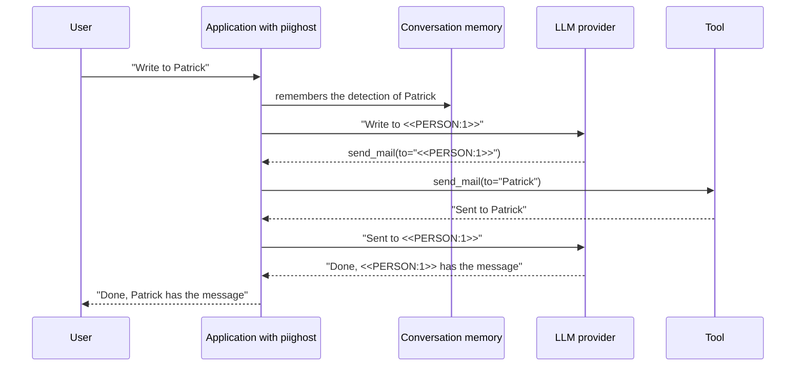

# How to document `piighost` in a DPIA

A data protection impact assessment (DPIA) describes a processing, weighs its risks to the people concerned, and lists the measures that address them. If your system sends conversations to an LLM through `piighost`, this page gives your DPO the material for the parts of the DPIA that concern it, in the order of Article 35(7) of the GDPR. The legal reading of pseudonymization, and what the Court of Justice held in EDPS v SRB, are on [Compliance](compliance.md).

!!! warning "Not legal advice"
    This page describes what `piighost` does and does not do. Whether your processing requires a DPIA, and what the DPIA concludes, is for your DPO and your counsel to decide.

## Check whether a DPIA is required

Article 35(1) requires a DPIA before a processing that is likely to result in a high risk, and each supervisory authority publishes a list of the processing operations that require one (Article 35(4)). In France, that is the [CNIL list](https://www.cnil.fr/sites/default/files/atoms/files/liste-traitements-aipd-requise.pdf).

The [WP248 rev.01 guidelines](https://ec.europa.eu/newsroom/article29/items/611236), adopted by the Article 29 Working Party and endorsed by the EDPB, give nine criteria. In most cases, a processing that meets two of them requires a DPIA. An LLM assistant for a law firm or a notary's office can meet several, among them "sensitive data or data of a highly personal nature" and "innovative use or applying new technological or organisational solutions".

If you conclude that a DPIA is required, gather the facts of your deployment before writing it.

- The configuration file of the pipeline, or the code that builds it. [`piighost validate`](reference/cli.md) checks a configuration file.
- The detectors and the labels they look for.
- The placeholder factory.
- The memory backend, and whether a hasher and a cipher protect it.
- The guard rail, if any.
- The observation redactor, if traces are exported.
- The integration (LangChain middleware, Pydantic AI, LlamaIndex, Claude Code hooks, remote client) and, for the LangChain middleware, the tool-call strategy.

## Describe the processing

Article 35(7)(a) asks for a systematic description of the processing. For the part `piighost` performs, it holds in four steps.

1. **Detection.** The configured detectors find the PII in each message, a name, an email, an IBAN. Only what they recognize is replaced. The prebuilt regex catalogs and the NER models run locally, an `LLMDetector` runs wherever its chat model runs.
2. **Replacement.** Each detected value is replaced by a token before the text leaves for the LLM provider. `Patrick`{ .pii } becomes `<<PERSON:1>>`{ .placeholder }, and stays `<<PERSON:1>>`{ .placeholder } for the whole conversation.
3. **Retention of the mapping.** The mapping from `<<PERSON:1>>`{ .placeholder } back to `Patrick`{ .pii } is kept in the conversation memory, partitioned by conversation (`thread_id`).
4. **Restoration.** When the reply comes back, `piighost` puts `Patrick`{ .pii } back in place of `<<PERSON:1>>`{ .placeholder } for the user. With the LangChain middleware, the tool-call strategy decides whether tools receive real values too. The default, `ToolCallStrategy.FULL`, restores the arguments of a tool call and de-identifies its result.

### Where the mapping lives

The mapping is what the GDPR calls additional information, and it holds the values in clear. Record where it lives.

| Memory backend | Where the mapping lives | Survives a restart | At-rest protection | Extra |
|---|---|---|---|---|
| `InMemoryConversationMemory` (default) | the memory of the application process | no | none | core |
| `RedisConversationMemory` | a Redis server | yes, with an optional `ttl` | opt-in hasher and cipher | `redis` |
| `SqlAlchemyConversationMemory` | a SQL table (SQLite, PostgreSQL) | yes | opt-in hasher and cipher | `sqlalchemy` |
| `PIIGhostClient` | the `piighost-api` server it calls | depends on that server's backend | depends on that server's backend | `client` |

The hasher and the cipher need the `crypto` extra, and `Argon2Hasher` the `argon2` extra. The conversation identifier stays in clear in the Redis keys and the SQL table, since it is what lets a conversation be found and erased. Use an opaque `thread_id`, never an email or a name.

Two other places hold values in clear and belong in the description.

- Each worker keeps a memoized copy of a conversation's tokens in its own memory. `token_memo_ttl` bounds how long it lives, see [Multi-instance deployment](multi-instance.md).
- With the LangChain middleware, the messages in the LangGraph state hold the restored values after the model turn, so a checkpointer that persists that state persists them. See [Security](security.md).

### Who can restore

Restoring takes the mapping, so it takes access to the memory backend, and to the cipher key when the backend encrypts. In practice, that is the application process, and anyone who can read the store together with `PIIGHOST_CIPHER_KEY`, or the store alone when it is not encrypted. The LLM provider receives only tokens, so it cannot restore. Recital 29 asks the controller to indicate the authorized persons, so name them in the DPIA.

## Map the data flows

The diagram follows `Patrick`{ .pii } through one turn of a conversation.

*One turn with the LangChain middleware and the default `FULL` tool-call strategy.*
{ .figure-caption }

Each flow goes into the DPIA with what crosses it and who receives it.

| Flow | What crosses | Recipient |
|---|---|---|
| User to application | the message in clear | you |
| Application to memory | the detected values, encrypted when a cipher is configured | you, or the host of the store |
| Application to LLM provider | the de-identified text, with everything the detectors did not replace | the LLM provider |
| Application to tool | the restored values, under the `FULL` and `INPUT` strategies | the operator of the tool |
| Application to trace backend | the stage payloads, tokenized when an `observation_redactor` is set, in clear otherwise | the operator of the trace backend |
| Application to a remote `LLMDetector` | the message in clear, since detection runs before replacement | the provider of that chat model |
| Application to a remote guard rail | the de-identified output (`LLMGuardRail`, `ModerationGuardRail`) | the provider of that model |

## Map the measures to the risks

Article 35(7)(d) asks for the measures envisaged to address the risks. The table lists those `piighost` provides, the setting to record, and the page that details it.

| Risk | Measure | Setting to record | Detail |
|---|---|---|---|
| The LLM provider reads the PII | the values are replaced before the text leaves, and a counter or hash token is never computed from the value it replaces | the detectors, the placeholder factory | [Placeholder factories](placeholder-factories.md) |
| The mapping reaches the provider | the mapping stays in the memory on your side and is never sent with the text | the memory backend | [Security](security.md) |
| Theft of the persistent store | the key of each message is hashed (`Sha256Hasher` or `Argon2Hasher`) and each value encrypted (`AesGcmCipher`), both or neither, and a networked store built without them emits a `PIIGhostSecurityWarning` | the hasher, the cipher, where `PIIGHOST_HASH_PEPPER` and `PIIGHOST_CIPHER_KEY` are kept | [Security](security.md) |
| A PII left in the output | a guard rail re-checks the de-identified text, and the pipeline raises `PIIRemainingError` when it flags one | `DetectorGuardRail`, `Gliner2GuardRail`, `LLMGuardRail` or `ModerationGuardRail` | [Guard rails](reference/guard-rails.md) |
| Logs and traces carry PII | the library writes no PII to its loggers, and an `observation_redactor` tokenizes the trace payloads | the redactor, `trace_clear_text`, whether `PIIGHOST_HOOK_LOG` is unset | [Observation](observation.md) |
| One conversation sees another's values | the memory is partitioned by `thread_id`, and the LangChain middleware refuses a missing one by default (`require_thread_id=True`) | how `thread_id` is derived | [Limitations](limitations.md) |
| A user types a token to read someone else's value | a token typed in the input is neutralized before rendering (`escape_existing_tokens=True` by default) | left at its default | [Security](security.md) |
| The LLM makes up a token | an invented token is refused by default (`InventedPlaceholderStrategy.RAISE`) | the strategy | [Tool-call strategies](tool-call-strategies.md) |
| Retention, and a request for erasure | `forget_thread` erases a conversation from the memory and the local token memo, and returns how many messages and detections it dropped | the retention rule, `max_threads` and `ttl` on the in-memory backend, `ttl` on Redis, `token_memo_ttl` | [Pipeline reference](reference/pipeline.md) |

The debug log of the Claude Code hooks, written only when `PIIGHOST_HOOK_LOG` is set, can contain restored values. Leave it unset in production.

## Record the residual risks

Article 35(7)(c) asks for an assessment of the risks. `piighost` lowers the exposure toward the LLM provider without removing the following risks, to record as residual.

- **Detection is best-effort.** A PII the detectors do not recognize reaches the provider in clear. A NER model can also truncate a text longer than its context. See [Limitations](limitations.md).
- **Context and quasi-identifiers stay in clear.** "`<<PERSON:1>>`{ .placeholder }, the only notary in a village of 300" identifies a person without naming them. The detectors see values, not that inference.
- **The LLM can write a PII it invented.** A name the model makes up is in no mapping, so nothing ties it to a person or removes it.
- **Values the assistant introduces stay in clear** under the default `EntityCreateByAssistantStrategy.PRESERVE`. `ANONYMIZE` tokenizes them too.
- **The mapping store is a target.** It holds the values in clear, or encrypted under a key your environment holds. The process memory and a persisted LangGraph state hold them in clear. See [Security](security.md).
- **Tools receive real values** under the `FULL` and `INPUT` strategies, so every tool the agent can call is a recipient.
- **Erasure has a scope.** `forget_thread` reaches the memory and the memo of the process that runs it. It does not reach the provider's logs, your checkpointer, your traces, or the memo of another worker before its `token_memo_ttl` runs out.
- **The provider's position is not settled.** A DPIA that treats the de-identified text as personal data for the provider holds whichever way that question is settled. See [Compliance](compliance.md).

## Fill in the template

Copy the table into your DPIA and fill in the last column for your deployment. It follows the four items of Article 35(7). The [DPIA template of the EDPB](https://www.edpb.europa.eu/news/news/2026/enhancing-compliance-and-consistency-edpb-adopts-dpia-template_en), adopted on 14 April 2026 for public consultation, and the [CNIL method and PIA software](https://www.cnil.fr/fr/RGPD-analyse-impact-protection-des-donnees-aipd) (in French) can host it.

| Article 35(7) | Item | What to record | Your deployment |
|---|---|---|---|
| (a) description | purpose | what the LLM assistant is used for | |
| (a) description | detectors | the detectors, the labels they look for, the languages they cover | |
| (a) description | placeholder | the factory and an example token | |
| (a) description | mapping | the memory backend, its host, its retention | |
| (a) description | recipients | the LLM provider, the tools, the trace backend, any remote detector or guard rail | |
| (a) description | restoration | who can restore, and with which access | |
| (b) necessity | minimization | why the provider needs the de-identified text, and why the tools need real values | |
| (c) risks | residual | the residual risks above that apply, with their likelihood and severity | |
| (d) measures | crypto | the hasher, the cipher, where the secrets live | |
| (d) measures | guard | the guard rail, or why there is none | |
| (d) measures | logging | the observation redactor, the application logs, the checkpointer | |
| (d) measures | isolation | how `thread_id` is derived, and that it is opaque | |
| (d) measures | erasure | when and by whom `forget_thread` is called, and what it does not reach | |
| (d) measures | provider | the processor contract, retention and training terms, the transfer outside the EU if any | |

## See also

- [Compliance](compliance.md): the GDPR provisions, the EDPB guidelines and the EDPS v SRB judgment on pseudonymization.
- [Security](security.md): the threat model, the memory backends, and the at-rest crypto.
- [Limitations](limitations.md): what detection misses, and how to mitigate it.
- [Deployment](deployment.md): bounding the memory and running `piighost` in production.
