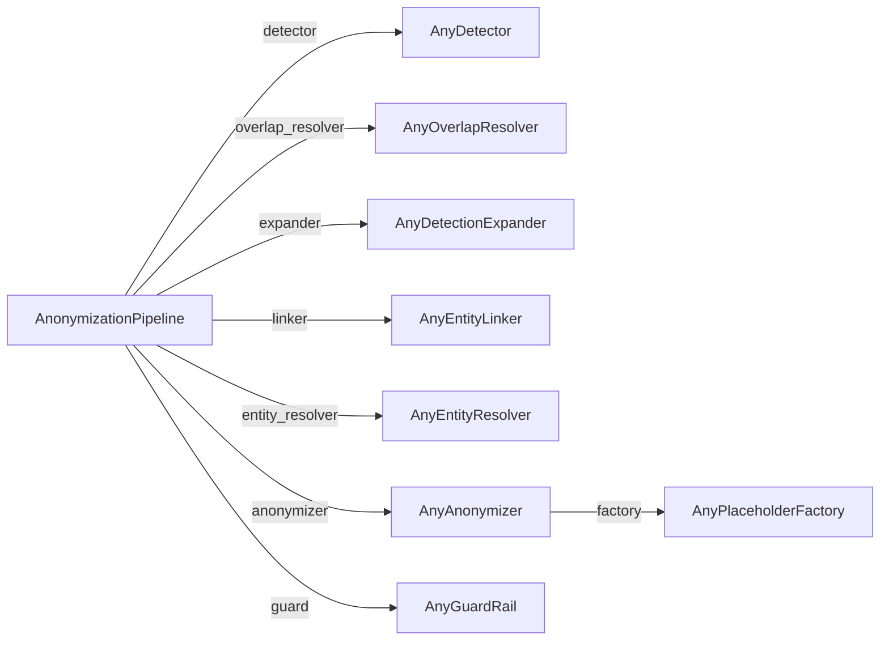

# Extending PIIGhost

Every pipeline stage is a **port**: a `Protocol` you satisfy by implementing its one method. There is no base class to inherit, and nothing else in the pipeline changes. You can also subclass a `Base*` template where one exists, which supplies the shared skeleton and leaves you a single hook.



*The pipeline injects one component per port. Only detector, linker, and anonymizer are required; the others default to disabled.*
{ .figure-caption }

The ports live in each component's `base.py`, under `piighost.components.*`. The data models they exchange live in `piighost.models`.

```python
from piighost.models import Detection, Entity, Span
```

A `Detection` is a `Span(start, end)` carrying `text`, `label`, and a `confidence` in the range 0 to 1. An `Entity` groups the detections that share a value, and derives its `label`, `text`, and `spans` from them.

---

## A custom detector

A detector finds PII in a text. Implement one method:

```python
class AnyDetector(Protocol):
    async def detect(self, text: str) -> list[Detection]: ...
```

`detect` is async so an implementation can await a model server or an LLM API. Return detections in any order. Overlaps and repeats are resolved by later stages, not here.

???+ example "Regex handle detector"

    ```python
    import re

    from piighost.models import Detection, Span


    class HandleDetector:
        """Detect @handles as USERNAME."""

        async def detect(self, text: str) -> list[Detection]:
            detections: list[Detection] = []
            for match in re.finditer(r"@\w+", text):
                span = Span(match.start(), match.end())
                detections.append(
                    Detection(
                        span=span,
                        text=match.group(),
                        label="USERNAME",
                        confidence=1.0,
                    )
                )
            return detections
    ```

To feed a detector from a fixed value list in tests, use the built-in `ExactMatchDetector` instead. See [Test a pipeline without models](examples/testing.md).

### For NER models, subclass `BaseNERDetector`

The model-backed detectors (`Gliner2Detector`, `SpacyDetector`, `TransformersDetector`) all extend `BaseNERDetector`. It maps the label a model emits internally to the label that appears in `Detection.label`, so you can query a model with the strings it detects best while producing clean labels downstream. Pass `labels` as a list for identity mapping, or as an `{emitted: internal}` dict to rename:

```python
from piighost.components.detector.ner import Gliner2Detector

# Query GLiNER2 with "person" and "company" but emit "PERSON" / "COMPANY".
detector = Gliner2Detector(
    model,
    labels={"PERSON": "person", "COMPANY": "company"},
)
```

### Usage

```python
from piighost.pipeline import AnonymizationPipeline

detector = HandleDetector()
pipeline = AnonymizationPipeline(
    detector,
    linker,
    anonymizer,
)
```

---

## A custom overlap resolver

An overlap resolver reconciles detections whose spans overlap into a non-overlapping set. The port:

```python
class AnyOverlapResolver(Protocol):
    def resolve(self, detections: list[Detection]) -> list[Detection]: ...
```

Rather than implement `resolve` from scratch, subclass `BaseOverlapResolver`. It clusters the detections into overlap groups and hands each group to your `_reduce`, so you only decide which detections to keep from a group that overlaps.

???+ example "Longest span wins"

    ```python
    from piighost.models import Detection
    from piighost.components.overlap_resolver.base import BaseOverlapResolver


    class LongestOverlapResolver(BaseOverlapResolver):
        """Keep the longest detection in each overlap group."""

        def _reduce(self, conflicting: list[Detection]) -> list[Detection]:
            return [max(conflicting, key=lambda d: d.span.length)]
    ```

The built-in `ConfidenceOverlapResolver` keeps the highest-confidence detection instead. The stage is optional: pass no `overlap_resolver` and overlapping detections flow straight to the linker.

---

## A custom expander

An expander finds occurrences a detector missed, such as a repeat of a name flagged elsewhere. The port:

```python
class AnyDetectionExpander(Protocol):
    def expand(self, text: str, detections: list[Detection]) -> list[Detection]: ...
```

Subclass `BaseDetectionExpander`. It keeps the original detections and, for each one, adds a detection at every extra occurrence your `_find_occurrences` returns, carrying the source detection's label and confidence.

???+ example "Whole-word repeats"

    ```python
    import re
    from collections.abc import Iterable

    from piighost.models import Detection, Span
    from piighost.components.expander.base import BaseDetectionExpander


    class WholeWordExpander(BaseDetectionExpander):
        """Find whole-word repeats of a detected value."""

        def _find_occurrences(self, text: str, detection: Detection) -> Iterable[Span]:
            pattern = re.compile(rf"\b{re.escape(detection.text)}\b")
            return [Span(m.start(), m.end()) for m in pattern.finditer(text)]
    ```

The built-in `WordBoundaryExpander` does exactly this. The stage is optional.

---

## A custom entity linker

A linker groups the detections that refer to the same value into entities, so every occurrence shares one placeholder. The port:

```python
class AnyEntityLinker(Protocol):
    def link(self, detections: list[Detection]) -> list[Entity]: ...
```

Subclass `BaseEntityLinker`. It groups detections by a key you compute in `_key`, one entity per distinct key, keeping first-occurrence order.

???+ example "Group by exact value and label"

    ```python
    from collections.abc import Hashable

    from piighost.models import Detection
    from piighost.components.linker.base import BaseEntityLinker


    class CaseSensitiveLinker(BaseEntityLinker):
        """Group detections that share an exact value and label."""

        def _key(self, detection: Detection) -> Hashable:
            return (detection.text, detection.label)
    ```

The built-in `ExactEntityLinker` groups on the casefolded value, so `Patrick`{ .pii } and `patrick`{ .pii } become one entity.

---

## A custom entity resolver

An entity resolver reconciles entities that should not coexist, such as two entities sharing a detection. The port:

```python
class AnyEntityResolver(Protocol):
    def resolve(self, entities: list[Entity]) -> list[Entity]: ...
```

Subclass `BaseEntityResolver`. It clusters entities that share a detection into groups and hands each group to your `_reduce`, which returns a consistent set, whether by merging the group into one entity or by keeping them apart. The built-ins:

- `MergeEntityResolver` merges entities that share a detection, by union-find.
- `SeparateEntityResolver` keeps them apart, giving each shared detection to one entity.
- `FuzzyEntityResolver` merges entities with similar values (needs the `rapidfuzz` extra).

The stage is optional.

---

## A custom placeholder factory

A placeholder factory turns entities into their replacement tokens. It is generic on a **preservation tag**, a phantom type stating what its tokens preserve, which the type checker uses to gate a consumer like the middleware. The port:

```python
class AnyPlaceholderFactory(Protocol[PreservationT_co]):
    def create(self, entities: list[Entity]) -> Mapping[Entity, PreservationT_co]: ...
```

A token is an instance of the tag, which is a `str` subclass, so it is a real string that carries its preservation level in its own type. `create` must be deterministic: the same entities yield the same tokens on every call, because the pipeline calls it more than once per run.

???+ example "Bracket label factory"

    ```python
    from collections.abc import Mapping

    from piighost.models import Entity
    from piighost.components.placeholder.base import AnyPlaceholderFactory
    from piighost.components.placeholder.tags import PreservesLabel


    class BracketLabelFactory(AnyPlaceholderFactory[PreservesLabel]):
        """Emit [LABEL] for every entity, collapsing each label to one token."""

        def create(self, entities: list[Entity]) -> Mapping[Entity, PreservesLabel]:
            return {
                entity: PreservesLabel(f"[{entity.label}]") for entity in entities
            }
    ```

`PreservesLabel` says the token reveals the type but not a unique identity, so this factory suits one-shot redaction, not the middleware. For a token the middleware can deanonymize and find again, tag it `PreservesRecognizableIdentity` (or a sub-tag such as `PreservesLabeledIdentityOpaque`) and use a delimited grammar like `<<PERSON:1>>`{ .placeholder }. To wrap an inner form in delimiters without writing the wrapping yourself, subclass `BaseDelimitedPlaceholderFactory`. See [Placeholder factories](placeholder-factories.md) for the full tag taxonomy and worked examples.

### Usage

```python
from piighost.components.anonymizer import Anonymizer

factory = BracketLabelFactory()
anonymizer = Anonymizer(factory)
```

---

## A custom guard rail

A guard rail re-checks the anonymized output for residual PII. It classifies, it does not decide: it returns a `GuardVerdict` and leaves the pipeline to raise `PIIRemainingError` when a verdict is flagged. There is no `Base` template, guards differ by their whole checking mechanism. The port:

```python
class AnyGuardRail(Protocol):
    async def check(self, text: str) -> GuardVerdict: ...
```

`check` sees only the anonymized text. The placeholders it carries are clearly synthetic, so a check meant for real PII does not mistake them for it.

???+ example "Flag a residual @ sign"

    ```python
    from piighost.components.guard.base import GuardVerdict


    class AtSignGuard:
        """Flag any residual @ sign as leftover PII."""

        async def check(self, text: str) -> GuardVerdict:
            return GuardVerdict(flagged="@" in text)
    ```

The built-in `DetectorGuardRail` re-runs a detector and reports the residual detections. The stage is optional: pass no `guard` and the output is returned unchecked.

### Usage

```python
from piighost.pipeline import AnonymizationPipeline

guard = AtSignGuard()
pipeline = AnonymizationPipeline(
    detector,
    linker,
    anonymizer,
    guard=guard,
)
```

---

## Full composition

The stages are independent, so a custom detector, factory, and guard combine freely with the built-ins:

```python
from piighost.components.anonymizer import Anonymizer
from piighost.components.linker import ExactEntityLinker
from piighost.components.overlap_resolver import ConfidenceOverlapResolver
from piighost.components.entity_resolver import MergeEntityResolver
from piighost.pipeline import AnonymizationPipeline

detector = HandleDetector()
linker = ExactEntityLinker()
factory = BracketLabelFactory()
anonymizer = Anonymizer(factory)
overlap_resolver = ConfidenceOverlapResolver()
entity_resolver = MergeEntityResolver()
guard = AtSignGuard()
pipeline = AnonymizationPipeline(
    detector,
    linker,
    anonymizer,
    overlap_resolver=overlap_resolver,
    entity_resolver=entity_resolver,
    guard=guard,
)
```

To unit-test a custom component deterministically, feed it through `ExactMatchDetector`. See [Test a pipeline without models](examples/testing.md).
