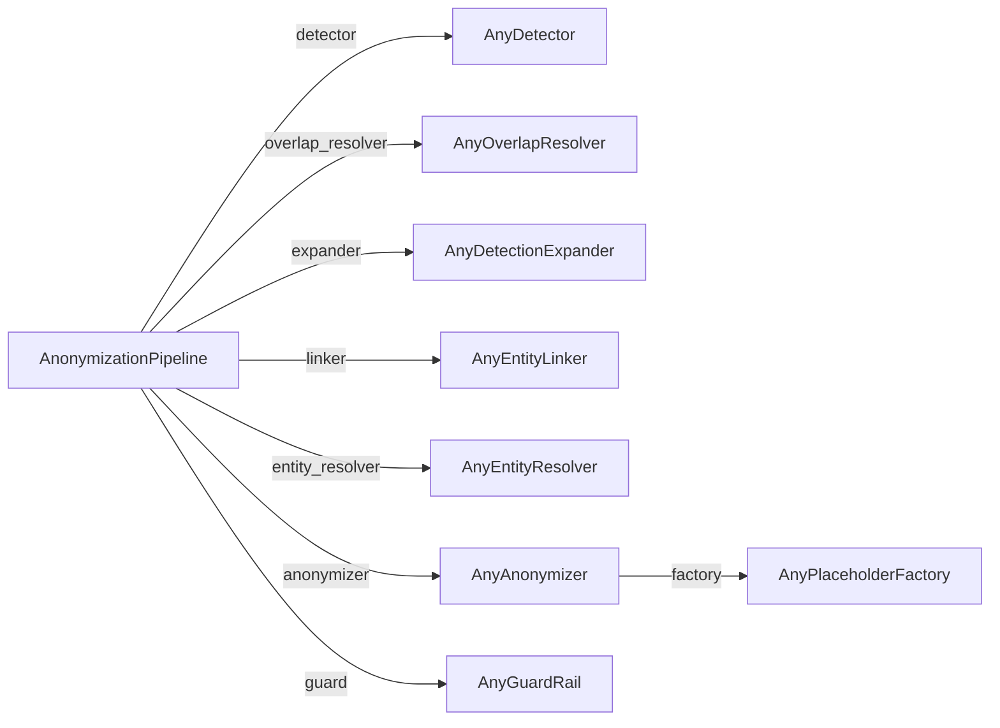

# Extending piighost

Every pipeline stage is a **port**, a `Protocol` you satisfy by implementing its one method. There is no base class to inherit, and nothing else in the pipeline changes. Where a `Base*` template exists, you can also subclass it. That template supplies the shared skeleton and leaves you a single hook.


```mermaid
flowchart LR
    P[AnonymizationPipeline] -->|detector| D[AnyDetector]
    P -->|overlap_resolver| O[AnyOverlapResolver]
    P -->|expander| X[AnyDetectionExpander]
    P -->|linker| L[AnyEntityLinker]
    P -->|entity_resolver| R[AnyEntityResolver]
    P -->|anonymizer| A[AnyAnonymizer]
    P -->|guard| G[AnyGuardRail]
    A -->|factory| F[AnyPlaceholderFactory]
```

*The pipeline injects one component per port. Only the detector is required. The linker, anonymizer, and overlap resolver default to built-ins. The expansion, entity resolution, guard rail, and deny and allow list stages are disabled by default.*
{ .figure-caption }

The ports live in each component's `base.py`, under `piighost.components.*`. The data models they exchange live in `piighost.models`.

A `Detection` is a `Span(start, end)` carrying `text`, `label`, and a `confidence` in the range 0 to 1. An `Entity` groups the detections that share a value, and derives its `label`, `text`, and `spans` from them. See the [data models reference](reference/models.md) for every field, method and validation error.

## A custom detector

A detector finds confidential data (personal data, secrets) in a text. Implement one method:

```python
--8<-- "snippets/ports.py:detector"
```

`detect` is async so an implementation can await a model server or an LLM API. Return detections in any order. Overlaps and repeats are resolved by later stages, not here.

???+ example "Regex handle detector"

    ```python
    --8<-- "snippets/extending.py:handle_detector"
    ```

### Use the detector

```python
--8<-- "snippets/extending.py:use_detector"
```

To feed a detector from a fixed value list in tests, use the built-in `ExactMatchDetector` instead. See [Testing without a model](examples/testing.md).

### For NER models, subclass `BaseNERDetector`

The model-backed detectors (`Gliner2Detector`, `SpacyDetector`, `TransformersDetector`) all extend `BaseNERDetector`. `BaseNERDetector` maps the label a model emits internally to the label that appears in `Detection.label`. You can thus query a model with the strings it detects best, while producing clean labels downstream. Pass `labels` as a list to keep each label as is (identity mapping), or as an `{emitted: internal}` dict to rename:

```python
--8<-- "snippets/extending_gliner2.py:example"
```

## A custom overlap resolver

An overlap resolver takes detections whose spans overlap, and turns them into a set of detections with no overlap. The port:

```python
--8<-- "snippets/ports.py:overlap_resolver"
```

Rather than implement `resolve` from scratch, subclass `BaseOverlapResolver`. It clusters the detections into overlap groups and hands each group to your `_reduce`, so you only decide which detections to keep from a group that overlaps.

???+ example "Longest span wins"

    ```python
    --8<-- "snippets/extending.py:longest_resolver"
    ```

The built-in `ConfidenceOverlapResolver` keeps the highest-confidence detection instead. The overlap resolver is always on. Omit it and the pipeline installs a `ConfidenceOverlapResolver`. Pass your own to change the rule. There is no supported way to disable it, since render assumes disjoint spans and raises `OverlappingSpansError` otherwise.

## A custom expander

An expander finds occurrences a detector missed, such as a repeat of a name flagged elsewhere. The port:

```python
--8<-- "snippets/ports.py:expander"
```

Subclass `BaseDetectionExpander`. It keeps the original detections. For each one, it adds a detection at every extra occurrence your `_find_occurrences` returns. Each added detection carries the source detection's label and confidence. An occurrence that overlaps a detection already kept is skipped, since the expander runs after the overlap resolver and the renderer refuses overlapping spans. Values are searched longest first, so a full name claims a place before its first name does.

???+ example "Whole-word repeats"

    ```python
    --8<-- "snippets/extending.py:whole_word_expander"
    ```

The built-in `WordBoundaryExpander` does exactly this. The stage is optional.

## A custom entity linker

A linker groups into entities the detections that refer to the same value. All occurrences of a value thus share one placeholder. The port:

```python
--8<-- "snippets/ports.py:linker"
```

Subclass `BaseEntityLinker`. It groups detections by a key you compute in `_key`. It creates one entity per distinct key, in first-occurrence order.

???+ example "Group by exact value and label"

    ```python
    --8<-- "snippets/extending.py:case_sensitive_linker"
    ```

The built-in `ExactEntityLinker` groups on the value key. That key is the same for the same words, whatever their spaces and case. `Patrick`{ .pii } and `patrick`{ .pii } therefore become one entity. Use `piighost.text.value_key` in your own linker to follow the same rule, see [Unicode spaces](reference/detectors.md#unicode-spaces).

## A custom entity resolver

An entity resolver reconciles entities that should not coexist, such as two entities sharing a detection. The port:

```python
--8<-- "snippets/ports.py:entity_resolver"
```

Subclass `BaseEntityResolver`. It clusters entities that share a detection into groups and hands each group to your `_reduce`. Your `_reduce` returns a consistent set, whether by merging the group into one entity or by keeping the entities apart. The built-ins:

- `MergeEntityResolver` merges entities that share a detection, by union-find.
- `SeparateEntityResolver` keeps them apart, giving each shared detection to one entity.
- `FuzzyEntityResolver` merges entities with similar values (needs the `fuzzy` extra).

The stage is optional.

## A custom placeholder factory

A placeholder factory turns entities into their replacement tokens. It is generic on a **preservation tag**, a phantom type stating what its tokens preserve. The type checker uses this tag to gate a consumer like the middleware. The port:

```python
--8<-- "snippets/ports.py:placeholder_factory"
```

A token is an instance of the tag, and the tag is a `str` subclass. The token is therefore a real string, which carries its preservation level in its own type. `create` must be deterministic. The same entities yield the same tokens on every call, because the pipeline calls it more than once per run.

???+ example "Bracket label factory"

    ```python
    --8<-- "snippets/extending.py:bracket_factory"
    ```

`PreservesLabel` says the token reveals the type but not a unique identity. This factory therefore suits one-shot redaction, not the middleware. For a token the middleware can restore and find again, tag it `PreservesRecognizableIdentity` (or a sub-tag such as `PreservesLabeledIdentityOpaque`) and use a delimited grammar like `<<PERSON:1>>`{ .placeholder }. To wrap an inner form in delimiters without writing the wrapping yourself, subclass `BaseDelimitedPlaceholderFactory`. See [Placeholder factories](placeholder-factories.md) for the full tag taxonomy and worked examples.

### Use the factory

```python
--8<-- "snippets/extending.py:use_factory"
```

## A custom guard rail

A guard rail re-checks the de-identified output for residual confidential data. It classifies, it does not decide. It returns a `GuardVerdict` and leaves the pipeline to raise `PIIRemainingError` when a verdict is flagged. There is no `Base` template, because each guard has its own checking mechanism. The port:

```python
--8<-- "snippets/ports.py:guard"
```

`check` sees only the de-identified text, placeholders included. A model can read `<<PERSON:1>>`{ .placeholder } as a person, so a guard should not flag on the placeholders alone. `DetectorGuardRail` drops the detections that hold nothing else.

???+ example "Flag a residual @ sign"

    ```python
    --8<-- "snippets/extending.py:at_sign_guard"
    ```

The built-in `DetectorGuardRail` re-runs a detector and reports the residual detections. The stage is optional. Pass no `guard` and the output is returned unchecked.

### Use the guard rail

```python
--8<-- "snippets/extending.py:use_guard"
```

### A decision model behind the port

A decision model does not generate text. It answers a question whose possible answers are fixed in advance, here yes or no. A guard rail does the same on the de-identified text. [`examples/guard_rail_laya.py`](https://github.com/Athroniaeth/piighost/blob/master/examples/guard_rail_laya.py) puts [Laya](https://huggingface.co/convaiinnovations/laya), an Apache 2.0 counterpart of Jev, behind the port in a dozen lines, running locally. It asks whether personal data is left and flags the text above a probability.

The [decision guard benchmark](https://github.com/Athroniaeth/piighost/tree/master/benchmarks/decision_guard) measured this guard on 200 de-identified texts, half of them leaking one value. Laya does not separate the leaking texts from the clean ones. Its AUROC is 0.50, the chance level. AUROC is the probability that a leaking text scores above a clean one. At a 0.5 threshold, Laya catches 69 leaks out of 100 and flags 60 clean texts out of 100. Placeholders raise its score more than real personal data does. A detector that says where each value is, and ignores what it finds on placeholders, does far better. With its threshold chosen away from the texts it is tested on, it catches 83 leaks out of 100 for 7 false alarms, see [`DetectorGuardRail`](reference/guard-rails.md). The example therefore shows how to plug a decision model into the port, not a guard to deploy.

## Full composition

The stages are independent, so a custom detector, factory, and guard combine freely with the built-ins:

```python
--8<-- "snippets/extending.py:assemble"
```

To unit-test a custom component deterministically, feed it through `ExactMatchDetector`. See [Testing without a model](examples/testing.md).
