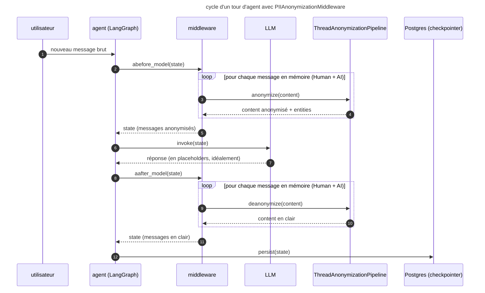
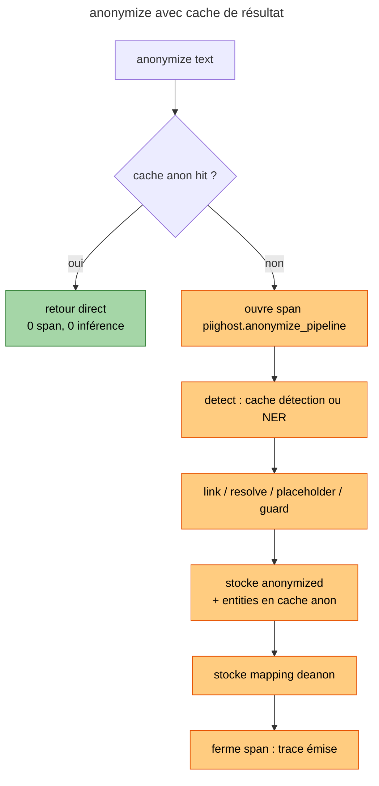
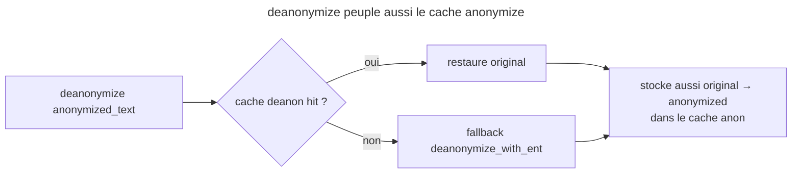

# Observation, cache and middleware

This document explains **how** observation is wired into piighost,
**why** it was conceived this way, and **which open problems**
remain to solve in the observation ↔ cache ↔ LangChain middleware
interaction. It does not limit itself to the API surface: it documents the
design choices, the trade-offs explicitly ruled out, and the consequences observed in
production.

---

## 1. Why an observation module in piighost

### 1.1 The need

An anonymization pipeline in production is an unpleasant black box:
when a placeholder is mis-detected, when a PII leaks, when a guard rail
rejects a text, or when latency explodes, you have neither a single
point to reconstruct the flow of a request, nor a standard
mechanism to relate detection, link, anonymizer, and guard to the same
observation unit.

The objective is therefore to **produce for each `anonymize` request a
hierarchical trace**:

- a root span `piighost.anonymize_pipeline` (redacted input/output)
- one child span per stage: `detect`, `link`, `placeholder`, `guard`
- each child carries its own input/output in **observed form**
  (PII redacted by default)

### 1.2 Why a backend-agnostic abstraction

The market of LLM observation platforms is fragmented (Langfuse, Opik,
Phoenix, Traceloop, etc.) and **moves fast**. Wiring the Langfuse
SDK directly into `pipeline.py` would have two unacceptable consequences:

1. **Vendor lock-in** at the library level: every consumer of piighost
   ends up paying for Langfuse, or patching the lib to plug in
   something else.
2. **Unstable API cycle**: Langfuse v3 → v4 already broke the
   `update_trace` API. Tying the lib to an SDK version locks the user in.

The chosen abstraction is deliberately **a thin layer over the Langfuse
v3 API** (`start_as_current_span` / `start_as_current_observation` /
`update` / `update_trace`). This is no accident: Langfuse v3 has a
vocabulary sufficient to express what we want to trace, so the mapping
to the other backends is trivial. Reversing the abstraction ("invent
our own vocabulary and make Langfuse map to us") would have
required twice as many adapters for zero gain.

### 1.3 The contract

```python
class AbstractObservationService(ABC):
    @abstractmethod
    def start_as_current_span(
        self, *,
        name: str,
        input: Any = None,
        output: Any = None,
        session_id: str | None = None,
        user_id: str | None = None,
        metadata: dict[str, Any] | None = None,
        tags: list[str] | None = None,
    ) -> AbstractContextManager[AbstractSpan]: ...

    def flush(self) -> None:
        return None
```

Three implementations exist:

| Implémentation                | Localisation                              | Extra      |
|-------------------------------|-------------------------------------------|------------|
| `NoOpObservationService`      | `piighost.observation.base`               | (aucun)    |
| `LangfuseObservationService`  | `piighost.observation.langfuse`           | `langfuse` |
| `OpikObservationService`      | `piighost.observation.opik`               | `opik`     |

The `NoOpObservationService` is wired by default when no backend
is passed to `ThreadAnonymizationPipeline.__init__`: the pipeline always calls
`start_as_current_span`, but it is free. This uniformity
avoids polluting the code with `if observation is not None`.

### 1.4 Activation by environment variables

On the server side (piighost-api), the choice of backend is made from the
*native* environment variables of each SDK:

- `LANGFUSE_PUBLIC_KEY` set → `LangfuseObservationService`
- `OPIK_API_KEY` set → `OpikObservationService`
- none → no observation

**Why not an explicit switch like `PIIGHOST_OBSERVATION=langfuse`?**
Because it would duplicate information already carried by the credentials.
If the user sets `LANGFUSE_PUBLIC_KEY`, their intent is clear;
requiring a second flag `PIIGHOST_OBSERVATION=langfuse` is a redundant
configuration trap.

**Why a hard mutex (fail-fast at boot) if several are set?**
Because the pipeline can accept only **one** `observation` at
instantiation, and a silent fallback ("we take Langfuse by
priority") would produce traces that go to the wrong backend without
anyone noticing. The explicit error at startup is
always preferable to surprising behavior in production.

---

## 2. Two levels of observation: anonymization pipeline and agent

When piighost is used via the piighost-api + piighost-chat pair, two
distinct zones deserve to be traced, and each has its own instrumentation
point:

| Zone                               | Instrumenté via                          | Trace produite                       |
|------------------------------------|------------------------------------------|--------------------------------------|
| Pipeline d'anonymisation           | `pipeline._observation` (piighost)       | `piighost.anonymize_pipeline`        |
| Agent LangChain (LLM + outils)     | `langfuse.langchain.CallbackHandler`     | trace LangChain canonique            |

Both emit into **the same Langfuse project** (same credentials),
but as **two distinct traces**. There is no propagation today of
`trace_id` from the chat to the API: tracing the full chain would
require:

1. an HTTP header on the piighost-chat side (`X-Trace-Parent: …`)
2. a parsing on the piighost-api side that turns this header into
   `root_span` passed to `pipeline.anonymize(..., root_span=…)`
3. the public API of `pipeline.anonymize` already accepts this `root_span`,
   but `LangfuseObservationService` does not expose a clean way to
   reconstruct a span from a remote W3C trace_id

This correlation was **explicitly ruled out** at launch: the added
value ("everything in one trace") does not cover the cost (two services to
modify + strong dependency on the Langfuse propagation format). It stays
open if a use case justifies it (for example debugging an inconsistency
between placeholder on the chat side and on the API side).

---

## 3. Middleware anonymize / deanonymize cycle (current state)

This section documents **the real behavior** of the middleware as
defined in `piighost.middleware.PIIAnonymizationMiddleware`, and explains
why it has counter-intuitive consequences on the cache and
observation.

### 3.1 The cycle per turn



Two key points:

- **`abefore_model` iterates over all messages**, not only the last.
  Before each LLM call, the whole history must be in placeholders.
- **`aafter_model` also iterates over all messages** and writes the
  deanonymized result into the state. It is this state that is persisted by the
  LangGraph checkpointer.

### 3.2 The privacy consequence: Postgres stores clear text

Empirical verification by reading the LangGraph checkpoint directly:

```python
async with AsyncPostgresSaver.from_conn_string(pg_url) as cp:
    snap = await cp.aget({"configurable": {"thread_id": "..."}})
    for m in snap["channel_values"]["messages"]:
        print(type(m).__name__, repr(m.content))

# HumanMessage 'Hi, my name is Emma and I live in Paris'
# AIMessage    'Hi Emma — nice to meet you!'
```

Postgres contains the raw PII, never the placeholders. The Redis cache
(detentions and mappings) is only an auxiliary structure used to
rebuild the anonymization on each turn; it is not the source of
truth.

**Why this choice?** In the initial design of the middleware, two properties
were favored:

1. **Easy reading for the UI**: `state.values["messages"]` is readable
   as-is without going through piighost on each render.
2. **Robustness to a cache crash**: if Redis flushes or goes down, the history
   in clear stays interpretable by a human.

These properties have **a hidden cost** the design did not anticipate,
detailed in 3.3 and 3.4.

### 3.3 The performance consequence: O(N²) calls per conversation

Since the stored state is in clear, `abefore_model` must re-anonymize
**the whole history** before each LLM call, not only the last
message. For a conversation of N turns:

- turn 1: 1 message to anonymize → 1 `anonymize` call
- turn 2: 3 messages (Human, AI, Human) → 3 calls
- turn 3: 5 messages → 5 calls
- ...
- turn N: 2N-1 messages → 2N-1 calls

**Total**: Σ(2k-1) = N² `anonymize` calls over the duration of the
conversation. For the repeated `HumanMessage`, the detection cache
amortizes the cost (the hash of the text hits the `detect:hash(text)` cache), but
the link/resolve/placeholder/guard steps run anyway. For the
`AIMessage`, **no cache hits**: each LLM response has a unique
text, so the NER runs fully on each turn, on messages that
the LLM itself generated.

### 3.4 The observation consequence: massive noise on Langfuse

A `piighost.anonymize_pipeline` span is opened at the start of each
`pipeline.anonymize` call, **before** the cache lookup (`base.py:225`).
Direct consequence:

- On each turn, 2N-1 traces are emitted into Langfuse
- Of which the majority are **replays** of messages already processed, which
  bring no new information (the result is deterministic
  for a given `(text, thread_id)`)
- The noise drowns the truly interesting traces (HITL, first passes,
  guard rail that rejects)

### 3.5 Why re-anonymizing the `AIMessage` is forced

A quick reading makes you want to say: "the LLM has a system prompt that
asks it to preserve the placeholders, so the output AIMessage is
already in placeholders, no need to anonymize it". This is false **in the
current architecture**:

1. At the end of turn N, `aafter_model` deanonymizes the content of the AIMessage
   (`<<PERSON:1>>` → `Emma`) before persisting it.
2. At turn N+1, the state read from Postgres contains `Emma`.
3. Before the LLM call, this content must be **re-projected** into placeholders,
   otherwise the LLM sees raw text, which cancels all the anonymization.

So the anonymization of AIMessages in `abefore_model` is not a
paranoid defense against a hallucination. It is a **mechanical
consequence** of the choice to deanonymize in `aafter_model`. If you
change the storage strategy, this cost disappears.

---

## 4. The HITL (Human-in-the-loop) problem

The HITL flow exposed by piighost-chat is:

| Étape                    | Endpoint chat                        | Endpoint piighost-api      | Trace |
|--------------------------|--------------------------------------|----------------------------|-------|
| 1. Détection initiale    | `POST /api/detect`                   | `POST /v1/detect`          | non   |
| 2. Correction utilisateur| `PUT /api/detect`                    | `PUT /v1/detect`           | non   |
| 3. Validation + envoi    | `POST /api/chat` → middleware → API  | `POST /v1/anonymize`       | oui   |

Only step 3 produces a trace, and it is the right one (it reflects the
detections corrected by the user, because `PUT /v1/detect` has
written into the detection cache with the same key as the one `anonymize`
will look up).

This is a **critical point** to understand the next section: if
you suppress the traces on cache hit, you also suppress the HITL
trace, the detection cache having precisely been pre-filled by `PUT
/v1/detect`. That would lose the observation of the most
interesting messages: those the user corrected by hand.

---

## 5. Proposed model: anonymize result cache + observation on miss

This section describes the envisioned solution to solve simultaneously
three problems: O(N²) over the history, useless NER on the AIMessage,
and Langfuse noise on replay.

### 5.1 Central idea

Today the piighost cache only memorizes **the detections** (key
`detect:hash(text)`). We add a **full anonymize result cache**
(key `anon:result:hash(text)`, value `(anonymized_text, entities)`),
populated in two places:

1. **On the way out of `pipeline.anonymize`**: after a real run, we store
   `text → (anonymized, entities)` for that thread.
2. **On the way out of `pipeline.deanonymize` / `deanonymize_with_ent`**:
   we know both sides of the mapping (`anonymized → text`), so we
   also populate the anonymize cache in the reverse direction
   (`text → anonymized`) for that thread.

The second point is what makes the overhead on the AIMessage disappear:
when `aafter_model` deanonymizes an AIMessage, it publishes the knowledge
needed for the next turn's `abefore_model` to find it.

### 5.2 Skipping the root span on cache hit

The cache check is done **before** opening the observation span:

```python
async def anonymize(self, text, *, root_span=None, metadata=None):
    if root_span is not None:
        return await self._anonymize_with_span(text, root_span, ...)

    cached = await self._cache_get_anon_result(text)
    if cached is not None:
        # ni span racine, ni spans enfants : trace muette
        return cached["anonymized"], self._deserialize_entities(cached["entities"])

    with self._observation.start_as_current_span(
        name="piighost.anonymize_pipeline", ...
    ) as auto_root:
        return await self._anonymize_with_span(text, auto_root, ...)
```

The cache hit short-circuits both the pipeline and the observation. No
"ignore this trace" flag, no empty span to filter on the
Langfuse side: the span is never created.

### 5.3 Invalidation by HITL

`override_detections` must invalidate the anonymize cache for the text
concerned, otherwise a user override would not trigger a
new run:

```python
async def override_detections(self, text, detections, thread_id="default"):
    if self._cache is None:
        raise RuntimeError(...)
    detect_key = self._thread_key(thread_id, f"{CACHE_KEY_DETECTION}:{hash_sha256(text)}")
    anon_key   = self._thread_key(thread_id, f"{CACHE_KEY_ANON_RESULT}:{hash_sha256(text)}")
    await self._cache.set(detect_key, self._serialize_detections(detections), ttl=self._cache_ttl)
    await self._cache.delete(anon_key)
```

On the next `anonymize(text)`, the anonymize cache misses, the pipeline
runs with the corrected detections, and the HITL trace goes into
Langfuse.

### 5.4 Resulting flow





### 5.5 Expected benefits

- **Observation**: 1 Langfuse trace per **genuinely new** message
  (first pass or HITL). The turn-to-turn replays are silent.
- **Performance**: from O(N²) to O(N) effective calls for a
  conversation of N turns, the rest being free cache hits.
- **AIMessage**: 0 useless NER, because the mapping is already known
  from the previous turn's `aafter_model`.
- **HITL**: stays traced and stays authoritative, because the override
  explicitly invalidates the cache.

---

## 6. Trade-offs and ruled-out alternatives

### 6.1 Storing placeholders in Postgres rather than clear text

The most radical alternative: remove `aafter_model`, keep the
state in placeholders, and delegate the deanonymization to the
display layer (`/api/messages` on the piighost-chat side already does it).

Benefits:

- Postgres never contains PII in clear (massive privacy gain)
- O(N) calls instead of O(N²) in pure mode (without even needing the cache
  proposed in §5)

Costs:

- **Contract break** with existing consumers that read
  `state.values["messages"]` directly
- **Loss of the "robust to cache crash" property**: if the cache
  of the mappings goes down, you can no longer deanonymize for the display

Verdict: the result cache (§5) captures the majority of the performance
gain without breaking the storage contract. The break will stay a
separate decision to make when the privacy need commands it (GDPR,
audit, etc.). We document it, but we do not ship it in the same PR.

### 6.2 Trace-ID correlation chat ↔ piighost-api

Rejected for now, reasons in §2.

### 6.3 Explicit flag `force_trace=True`

A variant of the proposed solution would be: no result cache,
but simply a flag `pipeline.anonymize(text, force_trace=True)`
that the calling layer would pass when it wants a trace regardless
of the cache. It is simpler to implement but:

- does **not** solve the pipeline cost (NER runs the same)
- moves the complexity to the caller (which must know when to force)
- does not eliminate the Langfuse noise for the replays (the caller does not know
  whether the turn is a replay)

The result cache makes the three problems disappear in a single
mechanism, so we prefer the structured solution to it.

### 6.4 Disabling observation by tag/rule on the Langfuse side

You could let piighost emit all the traces and filter on the
Langfuse side via tags or ingestion rules. It is technically feasible
but:

- you keep paying the OTLP export cost (latency, bandwidth)
- you keep paying the Langfuse ingestion cost (often billed)
- the solution does not migrate with the project to another backend

So to avoid: you filter **at the source** when you can.

---

## 7. Migration plan

Recommended implementation order:

1. **`piighost`**:
   1. Add `CACHE_KEY_ANON_RESULT` and the helpers
      `_cache_get_anon_result` / `_store_anon_result` in
      `pipeline/base.py`
   2. Modify `anonymize()` to check the cache before opening the
      root span
   3. Modify `deanonymize()` and `deanonymize_with_ent()` to populate
      the anonymize cache on the reverse side
   4. Modify `override_detections()` to invalidate the anonymize cache
   5. Tests: add a case that verifies that `anonymize` after
      `deanonymize` triggers neither a span nor a pipeline run; and a case
      that verifies that `override_detections` does invalidate
   6. Doc: this file
2. **`piighost-api`**: no change needed, the lib exposes
   exactly the same contract.
3. **`piighost-chat`**: no change needed, the middleware
   is not aware of the cache.

Backward compatibility:

- The new cache is **implicitly opt-in**: if `cache=None` at
  pipeline instantiation, nothing changes.
- Users who already have a Redis have **no migration** to
  do: the new key `anon:result:*` coexists with the existing keys
  `detect:*` and `anon:anonymized:*`. At worst, they pay a
  cache miss on the first pass.
- The public API of `pipeline.anonymize` does not change. The new
  behavior is strictly more permissive (skip pipeline when
  possible).

---

## 8. Open questions

- **TTL of the anonymize cache**: should it be aligned on the global `cache_ttl`
  or expose a specific TTL? A short window protects against
  placeholder factory configuration changes; a long window
  maximizes the gain. Recommendation: align on `cache_ttl`,
  let the user tune it.
- **Invalidation on a placeholder factory change**: if the
  pipeline is re-instantiated with another `ph_factory`, the
  cached entries are stale. Today the cache is versioned by hash
  of text, not by config. A clean solution would be to include a
  `pipeline_signature` in the cache key.
- **Concurrency on the same key**: if two concurrent `anonymize(text)`
  miss the cache, they both do the run and the
  last write wins. This is rarely a problem (deterministic
  result), but worth documenting.
