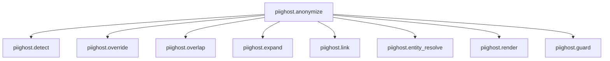

# Observation

`piighost` emits an OpenTelemetry trace for every anonymization. Each call opens
a root span and one child span per pipeline stage, so you can see where a PII was
detected, how it was linked, which token replaced it, and whether the guard
passed. Tracing is optional and never required for anonymization to run.

!!! note
    Trace payloads carry the clear PII values by default, so a trace doubles as
    an annotation dataset. Pass an `observation_redactor` to scrub those values
    before you send traces to a backend you do not fully trust. See
    [Redacting the trace payloads](#redacting-the-trace-payloads) below.

## The tracer seam

The pipeline never talks to a tracing backend directly. It calls `get_tracer()`
once at construction and records through the returned tracer.

```python
from piighost.observation import get_tracer

tracer = get_tracer()
with tracer.span("piighost.detect") as span:
    span.set_input(text)
    span.set_output(detections)
    span.set_attribute("count", len(detections))
```

`get_tracer()` returns an OpenTelemetry-backed tracer when the `observation`
extra is installed, and a no-op tracer otherwise. The no-op tracer records
nothing and costs nothing, so the pipeline emits spans unconditionally without a
guard around each call. Unlike the other optional dependencies, a missing extra
degrades to the no-op tracer instead of raising, because tracing must never
block anonymization.

A span is a context manager that carries an input payload, an output payload,
and scalar attributes. Nesting is implicit, a span opened inside another span
becomes its child through OpenTelemetry's ambient context, so the pipeline does
not thread a parent handle through its stages.

## Per-stage spans

`AnonymizationPipeline.anonymize` opens a `piighost.anonymize` root span, then a
child span per stage that ran. A stage that is disabled emits no span. The tree
for a full run is:



*The span tree of one anonymization. Optional stages appear only when configured.*
{ .figure-caption }

The root span records the input text and the final anonymized text. `detect`
records the detections and their count. `link` records the entities. `render`
records the anonymized text and the token count. `guard` records whether it
flagged and the labels it saw. The thread pipeline emits the same tree from its
own `anonymize`, and a `piighost.deanonymize` span when it restores a text.

Spans nest under whatever span is current when `anonymize` is called. Open one
application-level span around a conversation and every pipeline call renders
below it as one trace.

## Redacting the trace payloads

By default a span payload holds the clear PII. The `detect` span records
`Patrick`{ .pii }, the root span records the input text with `Patrick`{ .pii }
in place. That is deliberate. A trace with clear values is a ready-made dataset
for evaluating detection quality.

It is also a leak if the backend is not trusted with PII. Pass an
`observation_redactor`, a placeholder factory, to the pipeline constructor and
every payload is scrubbed through it before it leaves the process.

```python
from piighost.pipeline import AnonymizationPipeline
from piighost.components.placeholder import LabelPlaceholderFactory

redactor = LabelPlaceholderFactory()
pipeline = AnonymizationPipeline(
    detector,
    linker,
    anonymizer,
    observation_redactor=redactor,
)
```

With the redactor set, the `detect` span records `<<PERSON>>`{ .placeholder }
instead of `Patrick`{ .pii }, and the input payload shows the redacted text. The
trade-off is direct. A redacted trace is safe to ship to any backend but cannot
serve as an annotation dataset, since the clear values are gone.

<div class="wide-table" markdown="1">

| `observation_redactor` | Trace payloads | Safe for an untrusted backend | Usable as a dataset |
|---|---|---|---|
| `None` (default) | clear PII values | no | yes |
| a placeholder factory | scrubbed tokens | yes | no |

</div>

## Backend correlation is deployment config, not lib code

`piighost` emits standard OpenTelemetry spans and stops there. It ships no
per-backend adapter. Which backend receives the spans is the application's OTel
SDK configuration, set once at deployment, outside `piighost`.

Any OTLP exporter works as-is. The spans reach whatever `TracerProvider` the
application registered. With no provider configured, the OpenTelemetry API is a
no-op and the spans go nowhere.

Langfuse is a common target because its v3 SDK is built on OpenTelemetry. Point
it at the process and it captures the `piighost` spans alongside its own. Its
default export filter passes only its own spans and known LLM instrumentors, so
admit the `piighost` instrumentation scope through the SDK's `should_export_span`
predicate:

```python
from langfuse import Langfuse

def export_piighost_spans(span) -> bool:
    scope = span.instrumentation_scope
    if scope is None:
        return False
    return (
        scope.name == "langfuse-sdk"
        or scope.name == "piighost"
        or scope.name.startswith("piighost.")
    )

client = Langfuse(should_export_span=export_piighost_spans)
```

The payloads are serialized under the attribute keys Langfuse maps to
observation input and output, so they render richly there. Any other OTLP
backend still shows them as plain span attributes. None of this lives in
`piighost`, it is the SDK wiring you already do for the rest of your stack.

The full runnable version, with a console fallback when no Langfuse credentials
are present, is in `examples/observation/langfuse_tracing.py`.

## See also

- [Architecture](architecture.md): each pipeline stage emits a span.
- [Placeholder factories](placeholder-factories.md): the factories usable as an `observation_redactor`.
- [Security](security.md): what a trace can leak and how to bound it.
