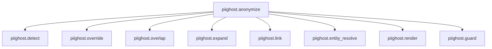

# Observation

`piighost` emits an OpenTelemetry trace for every de-identification. Each call opens
a root span and one child span per pipeline stage, so you can see where a value was
detected, how it was linked, which token replaced it, and whether the guard
passed. Tracing is optional and never required for de-identification to run.

!!! note
    Trace payloads carry the clear values by default, so a trace doubles as
    an annotation dataset. Pass an `observation_redactor` to scrub those values
    before you send traces to a backend you do not fully trust. See
    [Redacting the trace payloads](#redacting-the-trace-payloads) below.

## The tracer seam

The pipeline never talks to a tracing backend directly. It calls `get_tracer()`
once at construction and records through the returned tracer.

```python
--8<-- "snippets/observation_tracer.py:example"
```

`get_tracer()` returns an OpenTelemetry-backed tracer when the `observation`
extra is installed, and a no-op tracer otherwise. The no-op tracer records
nothing and costs nothing, so the pipeline emits spans unconditionally without a
guard around each call. Unlike the other optional dependencies, a missing `observation` extra raises
nothing. `get_tracer()` falls back to the no-op tracer instead, because tracing
must never block de-identification.

A span is a context manager that carries an input payload, an output payload,
and scalar attributes. Nesting is implicit. A span opened inside another span
becomes its child through OpenTelemetry's ambient context. The pipeline therefore
does not have to pass the parent span from one stage to the next.

## Per-stage spans

`AnonymizationPipeline.anonymize` opens a `piighost.anonymize` root span, then a
child span per stage that ran. A stage that is disabled emits no span. The tree
for a full run is:


```mermaid
flowchart TD
    A[piighost.anonymize] --> B[piighost.detect]
    A --> C[piighost.override]
    A --> D[piighost.overlap]
    A --> E[piighost.expand]
    A --> F[piighost.link]
    A --> G[piighost.entity_resolve]
    A --> H[piighost.render]
    A --> I[piighost.guard]
```

*The span tree of one de-identification. Optional stages appear only when configured.*
{ .figure-caption }

The root span records the input text and the final de-identified text. `detect`
records the detections and their count. `link` records the entities. `render`
records the de-identified text and the token count. `guard` records whether it
flagged and the labels it saw. The thread pipeline differs. It runs overlap
resolution and expansion inside `_detect`, and entity resolution inside
`_thread_tokens`. None of those stages gets a span of its own, so only `detect`,
`link`, and `render` remain under the root. The root and `detect` spans also carry a
`cache_hit` attribute and a `langfuse.session.id`. The thread pipeline also emits a
`piighost.deanonymize` span when it restores a text.

Spans nest under whatever span is current when `anonymize` is called. If you open one
application-level span around a conversation, every pipeline call shows below it,
and the whole forms one trace.

## Redacting the trace payloads

By default a span payload holds the confidential data (personal data, secrets) in clear. The `detect` span records
`Patrick`{ .pii }. The root span records the input text, where
`Patrick`{ .pii } appears in clear. That is deliberate. A trace with clear values is a ready-made dataset
for evaluating detection quality.

It is also a leak if the backend is not trusted with confidential data. Pass an
`observation_redactor` to the pipeline constructor. It is a placeholder factory,
which scrubs every payload before it leaves the process.

```python
--8<-- "snippets/observation_redactor.py:example"
```

With the redactor set, the `detect` span records `<<PERSON>>`{ .placeholder }
instead of `Patrick`{ .pii }, and the input payload shows the redacted text. The
trade-off is direct. A redacted trace is safe to ship to any backend but cannot
serve as an annotation dataset, since the clear values are gone.

<div class="wide-table" markdown="1">

| `observation_redactor` | Trace payloads | Safe for an untrusted backend | Usable as a dataset |
|---|---|---|---|
| `None` (default) | clear values | no | yes |
| a placeholder factory | scrubbed tokens | yes | no |

</div>

Clear-text tracing stays the default so traces keep their annotation value. It must still be an explicit choice. With no redactor set and a tracer provider actually configured, the pipeline warns once at construction that its traces carry confidential data in clear. Pass `trace_clear_text=True` to acknowledge clear-text tracing and silence the warning, or an `observation_redactor` to scrub the payloads.

```python
--8<-- "snippets/observation_clear_text.py:example"
```

## Backend correlation is deployment config, not lib code

`piighost` emits standard OpenTelemetry spans and stops there. It ships no
per-backend adapter. Which backend receives the spans is the application's OTel
SDK configuration, set once at deployment, outside `piighost`.

Any OTLP exporter works as-is. The spans reach whatever `TracerProvider` the
application registered. With no provider configured, the OpenTelemetry API is a
no-op and the spans go nowhere.

Langfuse is a common target because its v3 SDK is built on OpenTelemetry. Point
it at the process and it captures the `piighost` spans alongside its own. Its
default export filter passes only its own spans and those of known LLM
instrumentors. Admit the `piighost` instrumentation scope through the SDK's
`should_export_span` predicate:

```python
--8<-- "snippets/observation_langfuse.py"
```

The payloads are serialized under the attribute keys Langfuse maps to
observation input and output. Langfuse therefore shows them in those two fields. Any other OTLP
backend still shows them as plain span attributes. This wiring does not live in
`piighost`. It is the SDK wiring you already do for the rest of your stack.

The full runnable version, with a console fallback when no Langfuse credentials
are present, is in `examples/observation/langfuse_tracing.py`.

## See also

- [Architecture](architecture.md): each pipeline stage emits a span.
- [Placeholder factories](placeholder-factories.md): the factories usable as an `observation_redactor`.
- [Security](security.md): what a trace can leak and how to bound it.
