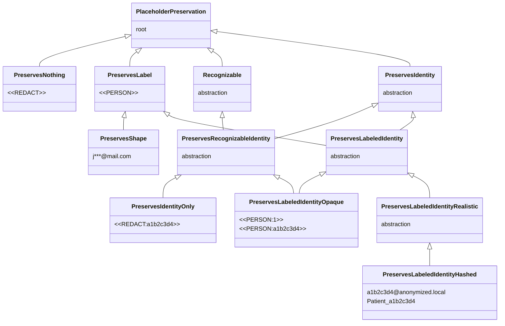

# Placeholder factories

A *placeholder* is the synthetic token that takes the place of a detected PII before the text reaches the LLM. Instead of sending `Patrick lives in Paris`{ .pii } to the LLM, the pipeline sends `<<PERSON:1>>`{ .placeholder } `lives in`  `<<LOCATION:1>>`{ .placeholder }. The original values stay in the conversation memory; the LLM never sees them.

!!! note "Why the name placeholder factory"

    *Placeholder* because the token holds the place of the original value. We could have said *token*, but that word is already overloaded in the LLM context (language tokens). *Factory* because the component builds these tokens on the fly, based on the entities detected in each message.

A **placeholder factory** decides what those tokens look like and how much information they carry. Two questions structure the choice.

1. *Is the token unique per entity?* `Patrick`{ .pii } and `Marie`{ .pii } should not both collapse onto a generic `<<PERSON>>`{ .placeholder }, otherwise the LLM cannot tell them apart. A unique token per entity lets the model reason about relations, *is the manager the same person as `Patrick`{ .pii }?* becomes *is `<<PERSON:1>>`{ .placeholder } the same as `<<PERSON:2>>`{ .placeholder }?* and gets a clear answer.
2. *Is the token reversible and findable?* From the token alone, without consulting the memory, can the original value be recovered, and can the token be relocated in a text the pipeline never produced? This is the precondition for the string replacement the middleware runs on tool arguments. If two entities collapse onto the same `<<PERSON>>`{ .placeholder }, there is no way to know which original to restore.

Five families of factories sit at different points on that spectrum, and the choice has direct consequences on which `ToolCallStrategy` you can use safely. See [Tool-call strategies](tool-call-strategies.md) for the runtime side.

- **No information** (`<<REDACT>>`{ .placeholder }): a constant token that reveals nothing to the LLM. Classic redaction. No reasoning possible on entities, the model cannot tell that the value was a city and decide to call the `get_weather` tool.
- **Type only** (`<<PERSON>>`{ .placeholder }, `<<EMAIL>>`{ .placeholder }): the type is revealed, not the identity. Multiple persons in the same conversation collapse onto the same `<<PERSON>>`{ .placeholder }, so cross-references break.
- **Type + id (opaque)** (`<<PERSON:1>>`{ .placeholder }, `<<PERSON:a1b2c3d4>>`{ .placeholder }): type revealed, stable identity, clearly synthetic token. The LLM can tell that `<<PERSON:1>>`{ .placeholder } and `<<PERSON:2>>`{ .placeholder } are two different people. Unique, so reversible by string replacement.
- **Id only** (`<<REDACT:a1b2c3d4>>`{ .placeholder }): a unique hash per entity, without revealing the type. The LLM sees that two distinct entities exist but cannot tell whether they are persons, emails, or cards. Keeps reversibility on the tool side without giving any semantic hint to the model.
- **Partial value** (`j***@mail.com`{ .placeholder }): the format is kept but part of the real content stays visible. The LLM sees that it is an email, may guess the domain, but not the full address. Riskier on privacy (real fragments) and on reversibility (collisions possible).

!!! note "Token format convention"

    Tokens in this documentation follow a simple rule.

    - **Synthetic token** (does not look like any real PII), wrapped in `<<` and `>>`. Examples: `<<REDACT>>`{ .placeholder }, `<<PERSON>>`{ .placeholder }, `<<PERSON:1>>`{ .placeholder }, `<<PERSON:a1b2c3d4>>`{ .placeholder }, `<<REDACT:a1b2c3d4>>`{ .placeholder }. The delimiters serve two purposes. An LLM or a human re-reading never mistakes the token for a regular word or for an HTML/XML tag the model might emit. And the middleware can find the token again to run its string replacement, including spotting a token the model invented.
    - **Token that replicates a PII format** (realistic hashed, masked), no delimiters. Examples: `a1b2c3d4@anonymized.local`{ .placeholder }, `Patient_a1b2c3d4`{ .placeholder }, `j***@mail.com`{ .placeholder }. The absence of delimiters is deliberate, the goal is to look natural so a downstream tool that validates a format (email regex, card length) still accepts the token.

    The rule also applies to any factory you write. Purely opaque token, wrap it. Token that mimics a real value, leave it raw.

---

## Family details

### No information: total destruction

The token is a fixed marker, e.g. `<<REDACT>>`{ .placeholder }. The LLM learns *that* something was removed but nothing about its type, count, or relations. The conversation loses every internal reference. An agent trying to act on *send the invoice to the client* cannot tell whether the client is the one mentioned earlier or someone new. Useful for archival redaction, useless once an agent has to reason.

Built-in: `RedactPlaceholderFactory` (output `<<REDACT>>`{ .placeholder }, delimiters configurable). Tag `PreservesNothing`.

### Type only: known type, identities collapsed

`<<PERSON>>`{ .placeholder }, `<<EMAIL>>`{ .placeholder }. The LLM knows that something is a person, an email, a card, and can answer questions that depend on the type alone. But two different persons in the same conversation collapse onto the same token. The classic failure mode is cross-reference, *is `Patrick`{ .pii } the same person as the manager mentioned earlier?* becomes *is `<<PERSON>>`{ .placeholder } the same as `<<PERSON>>`{ .placeholder }?*, which has no answer.

Built-in: `LabelPlaceholderFactory` (output `<<PERSON>>`{ .placeholder }). Tag `PreservesLabel`.

### Type + id (opaque)

`<<PERSON:1>>`{ .placeholder }, `<<PERSON:a1b2c3d4>>`{ .placeholder }. The string clearly is *not* a person, an email, or a card number, it is a token. The LLM cannot mistake it for real data, audit logs are easy to scan, and there is **zero chance** of collision with a real value. Its delimiters also make it findable, which lets a consumer spot a token the model invented. Trade-off, a strict downstream prompt or tool that requires *the argument must look like an email* will reject these tokens.

Built-in: `LabelCounterPlaceholderFactory` (`<<PERSON:1>>`{ .placeholder }) and `LabelHashPlaceholderFactory` (`<<PERSON:a1b2c3d4>>`{ .placeholder }). Both number the entities per label in order, the first person becomes ordinal 1, the second 2, while an email starts its own count at 1. `LabelHashPlaceholderFactory` renders that ordinal as a hash. The hash is a sha256 of the string `label:ordinal`, never of the value, purely for the opaque look, so two consecutive entities look unrelated. Tag `PreservesLabeledIdentityOpaque`.

### Id only: identity without type

`<<REDACT:a1b2c3d4>>`{ .placeholder }. The token keeps the synthetic `<<...>>` shape but does not reveal the label, while carrying a unique hash per entity. The LLM cannot tell whether the entity is a person, an email, or a card, but it can see that `<<REDACT:a1b2c3d4>>`{ .placeholder } and `<<REDACT:ef98abcd>>`{ .placeholder } are two distinct entities. One of the most protective levels that stays usable on the tool side, the hash being unique the string replacement works.

No built-in for this branch. The tag `PreservesIdentityOnly` is meant for a factory you write, a hashed redaction with no label prefix. See *Writing your own* below.

### Type + id (realistic hashed)

A custom factory can produce values that **look like the original format** but whose content is driven by a hash, e.g. `a1b2c3d4@anonymized.local`{ .placeholder } for an email, or `Patient_a1b2c3d4`{ .placeholder } for a name. The token passes basic format validation (email regex, length, allowed characters), so downstream tools and prompt templates that expect a real-looking value still work. Because the content is a hash, the token is **unique and cannot coincidentally match** an existing real value.

No built-in. Tag `PreservesLabeledIdentityHashed`. See *Writing your own* below for a complete example. This tag is not findable, so the middleware cannot spot an invented token in this form, something to weigh before using it under the middleware.

### Partial value: partial value leak

`j***@mail.com`{ .placeholder }, `****4567`{ .placeholder }, `P******`{ .placeholder }. The token keeps *part* of the original value, the email domain, the last four digits of a card, the first letter of a name. The LLM can reason on more than the type, *the email is on the company domain*, *the card ends in 4567*, *the name starts with P*. Two trade-offs come with this.

1. **Real fragments of the PII reach the LLM.** It cannot reconstruct the full value, but `j***@mail.com`{ .placeholder } already places the user inside a known mail provider.
2. **Collisions are possible.** Two different cards ending in `4567` collapse onto `****4567`{ .placeholder }, two emails sharing the first letter and domain end up identical. The token is *mostly* unique, with no guarantee.

Built-in: `MaskPlaceholderFactory`, which by default keeps the first character of the value and masks the rest with `*`, so `Jonathan`{ .pii } becomes `J*******`{ .placeholder }. Tag `PreservesShape`. The middleware refuses it for the same reason as `PreservesLabel`, an ambiguous token cannot be deanonymised through string replacement.

---

## Preservation tags

Every factory carries a **phantom type** that summarises the preservation level of its tokens. The type-checker reads this tag to validate a factory against its consumers. A phantom type is a generic parameter that exists only at type-check time, it does not affect execution.

**Identity of each family.**

| Family | Example | Tag |
|---|---|---|
| No information | `<<REDACT>>`{ .placeholder } | `PreservesNothing` |
| Type only | `<<PERSON>>`{ .placeholder } | `PreservesLabel` |
| Type + id (opaque) | `<<PERSON:1>>`{ .placeholder }, `<<PERSON:a1b2c3d4>>`{ .placeholder } | `PreservesLabeledIdentityOpaque` |
| Id only | `<<REDACT:a1b2c3d4>>`{ .placeholder } | `PreservesIdentityOnly` |
| Type + id (realistic hashed) | `a1b2c3d4@anonymized.local`{ .placeholder }, `Patient_a1b2c3d4`{ .placeholder } | `PreservesLabeledIdentityHashed` |
| Partial value | `j***@mail.com`{ .placeholder }, `****4567`{ .placeholder } | `PreservesShape` |

Two angles, two tables. **Confidentiality**, what leaks to the LLM, attacker and privacy point of view. **Exploitation**, what the agent and the system can do with the token, functional capabilities point of view. The same answer can be good in one and problematic in the other, this is the tension we make explicit.

Shared colour code, blue = best, green = acceptable, yellow = partial, red = problematic.

#### Confidentiality (what leaks to the LLM)

<table class="security-table" markdown="1">
<thead>
<tr><th>Family</th><th>Type seen?</th><th>PIIs distinguished?</th><th>Real-value leak?</th><th>Collision with a real value?</th></tr>
</thead>
<tbody>
<tr><td>No information</td><td class="c-blue">no</td><td class="c-blue">no</td><td class="c-blue">none</td><td class="c-blue">no</td></tr>
<tr><td>Type only</td><td class="c-green">yes</td><td class="c-blue">no</td><td class="c-blue">none</td><td class="c-blue">no</td></tr>
<tr><td>Type + id (opaque)</td><td class="c-green">yes</td><td class="c-green">yes</td><td class="c-blue">none</td><td class="c-blue">no</td></tr>
<tr><td>Id only</td><td class="c-blue">no</td><td class="c-green">yes</td><td class="c-blue">none</td><td class="c-blue">no</td></tr>
<tr><td>Type + id (realistic hashed)</td><td class="c-green">yes</td><td class="c-green">yes</td><td class="c-blue">none</td><td class="c-blue">no</td></tr>
<tr><td>Partial value</td><td class="c-green">yes</td><td class="c-green">yes</td><td class="c-yellow">partial</td><td class="c-yellow">risk</td></tr>
</tbody>
</table>

#### Exploitation by the LLM and the agent

<table class="security-table" markdown="1">
<thead>
<tr><th>Family</th><th>Reason about the type</th><th>Track cross-references</th><th>Reversible at the tool boundary</th><th>Token findable</th></tr>
</thead>
<tbody>
<tr><td>No information</td><td class="c-red">no</td><td class="c-red">no</td><td class="c-red">no</td><td class="c-green">yes</td></tr>
<tr><td>Type only</td><td class="c-blue">yes</td><td class="c-red">no</td><td class="c-red">no</td><td class="c-green">yes</td></tr>
<tr><td>Type + id (opaque)</td><td class="c-blue">yes</td><td class="c-blue">yes</td><td class="c-blue">yes</td><td class="c-blue">yes</td></tr>
<tr><td>Id only</td><td class="c-red">no</td><td class="c-blue">yes</td><td class="c-blue">yes</td><td class="c-blue">yes</td></tr>
<tr><td>Type + id (realistic hashed)</td><td class="c-blue">yes</td><td class="c-blue">yes</td><td class="c-blue">yes</td><td class="c-red">no</td></tr>
<tr><td>Partial value</td><td class="c-blue">yes</td><td class="c-yellow">mostly</td><td class="c-yellow">yes (collisions)</td><td class="c-red">no</td></tr>
</tbody>
</table>

<small>
Legend:
<span class="sec-legend c-blue">best</span>
<span class="sec-legend c-green">acceptable</span>
<span class="sec-legend c-yellow">partial</span>
<span class="sec-legend c-red">problematic</span>
</small>

Tags form an **inheritance hierarchy** that the type-checker exploits through the covariance of `AnyPlaceholderFactory[PreservationT_co]`. A factory tagged more specifically therefore satisfies a consumer asking for a looser one. Three independent axes structure the taxonomy. *Label*, the token reveals the type. *Identity*, the token is unique per entity. *Recognizable*, the factory can find its token again in arbitrary text, which a delimited token allows and a realistic one does not.

`PreservesLabeledIdentity` combines label and identity via multiple inheritance, so a `<<PERSON:1>>`{ .placeholder } factory is both a `PreservesLabel` *and* a `PreservesIdentity`. `PreservesRecognizableIdentity` crosses identity with findability, the intersection the middleware narrows on. A consumer typed against `PreservesRecognizableIdentity` accepts `PreservesIdentityOnly` and `PreservesLabeledIdentityOpaque`, and rejects `PreservesLabel`, `PreservesShape`, `PreservesNothing` which lack the uniqueness guarantee, along with `PreservesLabeledIdentityHashed` which is not findable.



*Preservation tag hierarchy. Each node carries an example token; the abstract nodes are intersections between axes.*
{ .figure-caption }

`PreservesLabeledIdentity` inherits from both `PreservesLabel` and `PreservesIdentity`. This expresses the *A is a B but not every B is an A* relation, every `PreservesLabeledIdentity` is also a `PreservesLabel` and a `PreservesIdentity`, but the reverse is false. `PreservesShape` extends `PreservesLabel`, a masked token implies the label through its format but does not guarantee uniqueness, so it stays a sibling of identity. Each tag is a subclass of `str`, so a token is a real string that carries its preservation level in its own type.

A factory declares the **most specific** tag that matches its guarantees.

```python
class LabelCounterPlaceholderFactory(BaseCounterPlaceholderFactory): ...  # PreservesLabeledIdentityOpaque
class LabelHashPlaceholderFactory(BaseCounterPlaceholderFactory): ...     # PreservesLabeledIdentityOpaque
class LabelPlaceholderFactory(AnyPlaceholderFactory[PreservesLabel]): ...
class MaskPlaceholderFactory(AnyPlaceholderFactory[PreservesShape]): ...
class RedactPlaceholderFactory(AnyPlaceholderFactory[PreservesNothing]): ...
# No built-in for the id-only branch nor the realistic hashed one,
# implement your own with PreservesIdentityOnly or PreservesLabeledIdentityHashed.
```

---

## Built-in factories

| Factory | Style | Mechanism | Output example | Tag |
|---|---|---|---|---|
| `RedactPlaceholderFactory` | Redact | none | `<<REDACT>>`{ .placeholder } | `PreservesNothing` |
| `LabelPlaceholderFactory` | Label | none | `<<PERSON>>`{ .placeholder } | `PreservesLabel` |
| `LabelCounterPlaceholderFactory` (default) | Label | Counter | `<<PERSON:1>>`{ .placeholder } | `PreservesLabeledIdentityOpaque` |
| `LabelHashPlaceholderFactory` | Label | Hash | `<<PERSON:a1b2c3d4>>`{ .placeholder } | `PreservesLabeledIdentityOpaque` |
| `MaskPlaceholderFactory` | Mask | partial | `J*******`{ .placeholder } | `PreservesShape` |

The naming follows a `<Style><Mechanism>PlaceholderFactory` schema.

- **Style**, what the token preserves, Redact = nothing, Label = type, Mask = partial value.
- **Mechanism**, how uniqueness is achieved, Counter = sequential per-label count, Hash = sha256 of `label:ordinal` rendered as hex. Absent when not relevant.

`LabelCounterPlaceholderFactory` and `LabelHashPlaceholderFactory` are the safe defaults, reversible and findable. `RedactPlaceholderFactory`, `LabelPlaceholderFactory` and `MaskPlaceholderFactory` are non-reversible redaction tools, rejected by the middleware. The id-only and realistic-hashed branches have no built-in, you write them with the matching tag.

---

## Which placeholder to pick?

The placeholder factory is the place where the **privacy / agent-capability trade-off** is made explicit. The right choice depends on the use case. Two scenarios cover most needs.

### Case 1: simple de-identification (one-shot, archival, compliance)

The goal is to produce a sanitised version of a document, redacting a court ruling, scrubbing an HR record before archival, exporting a dataset. No agent, no tools, sometimes not even reversibility.

| Need | Recommended family | Why |
|---|---|---|
| Erase every trace, no reversibility needed | **No information** (`<<REDACT>>`{ .placeholder }) | The most protective, no semantic leak. The document stays readable but the LLM cannot infer anything. Built-in `RedactPlaceholderFactory`. |
| Keep the text readable, a human reader sees `<<EMAIL>>`{ .placeholder } rather than `<<REDACT>>`{ .placeholder } | **Type only** (`<<PERSON>>`{ .placeholder }, `<<EMAIL>>`{ .placeholder }) | The type aids human reading without leaking the value. Built-in `LabelPlaceholderFactory`. |
| Allow server-side de-anonymisation | **Type + id (opaque)** (`<<PERSON:1>>`{ .placeholder }) | Reversible, trivial to audit, no collisions. Built-in `LabelCounterPlaceholderFactory` or `LabelHashPlaceholderFactory`. |
| Track *who is who* without revealing the type (medical, HR) | **Id only** (`<<REDACT:a1b2c3d4>>`{ .placeholder }) | Distinguishes entities without a semantic hint. Custom factory, no built-in. |

### Case 2: de-identification for an LLM or agent with tools

The LLM reasons about the conversation, and tools (CRM, DB, mail) need real values at call time. The middleware does string replacement on tool arguments, **so it requires a unique and findable token per entity**.

Direct consequence, only families with preserved identity *and* a findable grammar are compatible, that is id only and type + id opaque. `No information`, `Type only` and `Partial value` are rejected at type-check. Realistic hashed preserves identity but is not findable, so it fails the middleware constraint.

| Need | Recommended family | Why |
|---|---|---|
| **Default** | **Type + id (opaque)** (`<<PERSON:1>>`{ .placeholder }, `<<PERSON:a1b2c3d4>>`{ .placeholder }) | Reversible, findable, opaque, zero collision. The safe default. Built-in `LabelCounterPlaceholderFactory` (per-thread counter) or `LabelHashPlaceholderFactory` (hash of the ordinal). |
| Bias reduction (CV screening, hiring) | **Id only** (`<<REDACT:a1b2c3d4>>`{ .placeholder }) | The LLM does not see the type, so gender or origin inferable from a first name vanishes. Distinguishes candidates without biasing reasoning. Custom factory. |
| Sensitive type (medical category, clearance level) | **Id only** (`<<REDACT:a1b2c3d4>>`{ .placeholder }) | Same reason, the type itself is a PII and must not reach the LLM. Custom factory. |

To avoid in an agent under the middleware.

- `LabelPlaceholderFactory` and `MaskPlaceholderFactory` are rejected by the middleware, no uniqueness guarantee. Usable outside the middleware, or in `ToolCallStrategy.PASSTHROUGH`, where the agent never receives the real values.
- A realistic-hashed factory (`PreservesLabeledIdentityHashed`) preserves identity but stays not findable, so the middleware cannot spot a token the model would invent. Reserve it for de-identification outside an agent, or for a flow where the invented placeholder is not a concern.

The preservation tag exists so this choice is visible to the type-checker, not buried in placeholder-format trivia. A factory tagged `PreservesShape` cannot be plugged into the middleware *by accident*, the error falls at type-check time, not on the first tool call in production.

---

## Why `PIIAnonymizationMiddleware` requires a findable identity

The middleware operates on three boundaries, **input messages** (LLM in), **output messages** (LLM out), and **tool calls**. The first two rely on the conversation memory; the tool calls do not.

**Input and output messages.** When `abefore_model` de-identifies a message, the pipeline records the entity-to-token mapping. The reply from the LLM is restored by reading that mapping in reverse. This works for any factory, whether or not tokens collide.

**Tool calls.** The LLM produces tool arguments by *combining* and *paraphrasing* the tokens it just saw. That exact text was never produced by the pipeline, so it is not memorised. The only way to deanonymise is **string replacement**, scan the args for known tokens and substitute the original value of each entity. The logic is symmetric for the tool response, re-anonymised by replacing known PII values with their token.

That substitution is unambiguous **only if every entity maps to a unique token**. If two entities collapse onto `<<PERSON>>`{ .placeholder }, there is no way to know which original to restore. The middleware also requires a **findable grammar**, once every issued token has been replaced, any token still matching the grammar was invented by the model and can be refused (see [Tool-call strategies](tool-call-strategies.md)). The middleware therefore narrows its accepted type to a pipeline whose tokens are `PreservesRecognizableIdentity`, which through covariance encompasses `PreservesIdentityOnly` (hashed redact, no label) and `PreservesLabeledIdentityOpaque` (with label). Wiring a `PreservesLabel`, `PreservesShape`, `PreservesNothing` or `PreservesLabeledIdentityHashed` factory in is caught by `pyrefly` before the program runs.

`PIIAnonymizationMiddleware` mirrors that constraint at runtime. At construction, it asks the pipeline for a *recognizer*, the object that knows how to find its own tokens. A delimited factory is its own recognizer, a factory with no grammar, such as a mask, has none and the middleware raises `UnrecognizableFactoryError`. This catches untyped or remote pipelines that bypassed the type-checker.

The recognizer's grammar is bounded, not "anything between the delimiters". The inner form is a label, then an optional colon and identifier: `<<PERSON>>`{ .placeholder }, `<<PERSON:1>>`{ .placeholder }, `<<PERSON:a1b2c3d4>>`{ .placeholder }. A label starts with a letter or underscore, then letters, digits, underscores, spaces, or hyphens, so a multi-word label a detector emits, such as `date of birth`, still fits. The identifier after the colon is alphanumeric, an ordinal or a hex digest. Arbitrary delimited content is not a token, so a C++ shift `cout << x >> y` or a markdown run never trips the invented-token guard, and a streaming reply that opens `<<` without closing it is released rather than buffered indefinitely.

See [Tool-call strategies](tool-call-strategies.md) for the only escape hatch, `ToolCallStrategy.PASSTHROUGH`, where the tool boundary is never crossed in clear text.

---

## Writing your own

Subclass `AnyPlaceholderFactory[<tag>]` with the right preservation tag for your guarantees, then implement `create()`.

???+ example "Id-only factory (id without label): `PreservesIdentityOnly`"

    ```python
    import uuid
    from collections.abc import Mapping

    from piighost.models import Entity
    from piighost.components.placeholder import AnyPlaceholderFactory
    from piighost.components.placeholder.tags import PreservesIdentityOnly


    class UUIDPlaceholderFactory(AnyPlaceholderFactory[PreservesIdentityOnly]):
        """Generate opaque delimited ids, e.g. <<a3f21b4c>>, no label revealed."""

        def create(self, entities: list[Entity]) -> Mapping[Entity, PreservesIdentityOnly]:
            tokens: dict[Entity, PreservesIdentityOnly] = {}
            seen: dict[str, PreservesIdentityOnly] = {}  # canonical value -> token

            for entity in entities:
                canonical = entity.text.lower()
                if canonical not in seen:
                    seen[canonical] = PreservesIdentityOnly(f"<<{uuid.uuid4().hex[:8]}>>")
                tokens[entity] = seen[canonical]

            return tokens
    ```

    The token is delimited, hence findable, and unique per entity. This factory can be used under `PIIAnonymizationMiddleware`.

??? example "Bracket format factory (label + id): `PreservesLabeledIdentityOpaque`"

    ```python
    from collections import defaultdict
    from collections.abc import Mapping

    from piighost.models import Entity
    from piighost.components.placeholder import AnyPlaceholderFactory
    from piighost.components.placeholder.tags import PreservesLabeledIdentityOpaque


    class BracketPlaceholderFactory(AnyPlaceholderFactory[PreservesLabeledIdentityOpaque]):
        """Generate tokens in the format [PERSON:1], [LOCATION:2], etc."""

        def create(
            self, entities: list[Entity]
        ) -> Mapping[Entity, PreservesLabeledIdentityOpaque]:
            tokens: dict[Entity, PreservesLabeledIdentityOpaque] = {}
            counters: dict[str, int] = defaultdict(int)

            for entity in entities:
                counters[entity.label] += 1
                inner = f"{entity.label}:{counters[entity.label]}"
                tokens[entity] = PreservesLabeledIdentityOpaque(f"[{inner}]")

            return tokens
    ```

??? example "Realistic hashed factory: `PreservesLabeledIdentityHashed`"

    This factory produces a real-looking value whose content comes from a hash of the original value, hence unique and collision-free. The token has no delimited grammar, so it is not findable, keep it out of the middleware.

    ```python
    import hashlib
    from collections.abc import Mapping

    from piighost.models import Entity
    from piighost.components.placeholder import AnyPlaceholderFactory
    from piighost.components.placeholder.tags import PreservesLabeledIdentityHashed


    class HashedEmailPlaceholderFactory(
        AnyPlaceholderFactory[PreservesLabeledIdentityHashed]
    ):
        """Generate realistic emails like a1b2c3d4@anonymized.local."""

        def create(
            self, entities: list[Entity]
        ) -> Mapping[Entity, PreservesLabeledIdentityHashed]:
            tokens: dict[Entity, PreservesLabeledIdentityHashed] = {}

            for entity in entities:
                digest = hashlib.sha256(entity.text.encode()).hexdigest()[:8]
                tokens[entity] = PreservesLabeledIdentityHashed(f"{digest}@anonymized.local")

            return tokens
    ```

---

## See also

- [Tool-call strategies](tool-call-strategies.md): how the middleware uses these tokens, and why `PASSTHROUGH` is the only mode that tolerates a weaker tag.
- [Extending PIIGhost](extending.md): the full protocol reference and the rest of the pipeline injection points.
- [Limitations](limitations.md): operational consequences of the factory choice.
