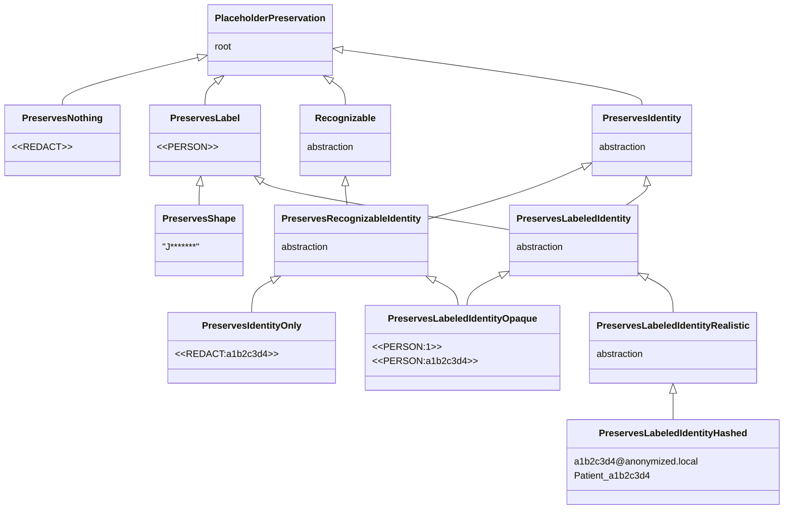

# Placeholder factories

A *placeholder* is the synthetic token that takes the place of a detected value before the text reaches the LLM. Instead of sending `Patrick`{ .pii } lives in `Paris`{ .pii } to the LLM, the pipeline sends `<<PERSON:1>>`{ .placeholder } lives in `<<LOCATION:1>>`{ .placeholder }. The original values stay in the conversation memory. The LLM never sees them.

!!! note "Why the name placeholder factory"

    *Placeholder* because the token holds the place of the original value. We could have said *token*, but that word is already overloaded in the LLM context (language tokens). *Factory* because the component builds these tokens on the fly, based on the entities detected in each message.

A **placeholder factory** decides what those tokens look like and how much information they carry. Two questions structure the choice.

1. *Is the token unique per entity?* `Patrick`{ .pii } and `Marie`{ .pii } should not both collapse onto a generic `<<PERSON>>`{ .placeholder }, otherwise the LLM cannot tell them apart. A unique token per entity lets the model reason about relations. The question *is the manager the same person as `Patrick`{ .pii }?* becomes *is `<<PERSON:1>>`{ .placeholder } the same as `<<PERSON:2>>`{ .placeholder }?*, and it gets a clear answer.

2. *Is the token reversible and findable?* Does the token denote a single value in the conversation memory, and can it be relocated in a text the pipeline never produced? Restoration needs both properties, whether it runs on the model's reply or on a tool's arguments. If two entities collapse onto the same `<<PERSON>>`{ .placeholder }, there is no way to know which original to restore.

Six families of factories sit at different points on that spectrum, and the choice has direct consequences on which `ToolCallStrategy` you can use safely. See [Tool-call strategies](tool-call-strategies.md) for the runtime side.

- **No information** (`<<REDACT>>`{ .placeholder }): a constant token that reveals nothing to the LLM. Classic redaction. No reasoning is possible on entities. For example, the model cannot tell that the value was a city and decide to call the `get_weather` tool.

- **Type only** (`<<PERSON>>`{ .placeholder }, `<<EMAIL>>`{ .placeholder }): the type is revealed, not the identity. Multiple persons in the same conversation collapse onto the same `<<PERSON>>`{ .placeholder }, so cross-references break.

- **Type + id (opaque)** (`<<PERSON:1>>`{ .placeholder }, `<<PERSON:a1b2c3d4>>`{ .placeholder }): type revealed, stable identity, clearly synthetic token. The LLM can tell that `<<PERSON:1>>`{ .placeholder } and `<<PERSON:2>>`{ .placeholder } are two different people. Unique, so reversible by string replacement.

- **Id only** (`<<REDACT:a1b2c3d4>>`{ .placeholder }): a unique hash per entity, without revealing the type. The LLM sees that two distinct entities exist but cannot tell whether they are persons, emails, or cards. Keeps reversibility on the tool side without giving any semantic hint to the model.

- **Partial value** (`J*******`{ .placeholder } for `Jonathan`{ .pii }): part of the real content stays visible, here the first letter and the length. The LLM sees the start of the value, not the full value. Riskier on privacy (real fragments) and on reversibility (collisions possible).

!!! note "Token format convention"

    Tokens in this documentation follow a simple rule.

    - **Synthetic token** (does not look like any real value), wrapped in `<<` and `>>`. For example `<<REDACT>>`{ .placeholder }, `<<PERSON>>`{ .placeholder }, `<<PERSON:1>>`{ .placeholder }, `<<PERSON:a1b2c3d4>>`{ .placeholder }, `<<REDACT:a1b2c3d4>>`{ .placeholder }. The delimiters serve two purposes. An LLM or a human re-reading never mistakes the token for a regular word or for an HTML/XML tag the model might emit. And the middleware can find the token again to run its string replacement, including spotting a token the model invented.
    - **Token that replicates a real value's format** (realistic hashed, masked), no delimiters. For example `a1b2c3d4@anonymized.local`{ .placeholder }, `Patient_a1b2c3d4`{ .placeholder }, `j***@mail.com`{ .placeholder }. The absence of delimiters is deliberate. The token has to look natural, so that a downstream tool that validates a format (email regex, card length) still accepts it.

    The rule also applies to any factory you write. Purely opaque token, wrap it. Token that mimics a real value, leave it raw.

---

## Family details

### No information, total destruction

The token is a fixed marker, e.g. `<<REDACT>>`{ .placeholder }. The LLM learns *that* something was removed but nothing about its type, count, or relations. The conversation loses every internal reference. An agent trying to act on *send the invoice to the client* cannot tell whether the client is the one mentioned earlier or someone new.

Useful for archival redaction, useless once an agent has to reason.

- Built-in: `RedactPlaceholderFactory` (output `<<REDACT>>`{ .placeholder }, delimiters configurable).
- Preservation tag: `PreservesNothing`.

### Type only, identities collapsed

`<<PERSON>>`{ .placeholder }, `<<EMAIL>>`{ .placeholder }. The LLM knows that something is a person, an email, a card, and can answer questions that depend on the type alone. But two different persons in the same conversation collapse onto the same token.

The classic failure mode is cross-reference. The question *is `Patrick`{ .pii } the same person as the manager mentioned earlier?* becomes *is `<<PERSON>>`{ .placeholder } the same as `<<PERSON>>`{ .placeholder }?*, and that question has no answer.

- Built-in: `LabelPlaceholderFactory` (output `<<PERSON>>`{ .placeholder }).
- Preservation tag: `PreservesLabel`.

### Type + id (opaque)

`<<PERSON:1>>`{ .placeholder }, `<<PERSON:a1b2c3d4>>`{ .placeholder }. The string clearly is *not* a person, an email, or a card number, it is a token. The LLM cannot mistake it for real data, audit logs are easy to scan, and there is **zero chance** of collision with a real value.

Its delimiters also make it findable. A consumer can then spot a token the model invented.

In return, a strict downstream prompt or tool that requires *the argument must look like an email* will reject these tokens.

- Built-in: `LabelCounterPlaceholderFactory` (`<<PERSON:1>>`{ .placeholder }) and `LabelHashPlaceholderFactory` (`<<PERSON:a1b2c3d4>>`{ .placeholder }).
- Preservation tag: `PreservesLabeledIdentityOpaque`.

Both number the entities per label, in order. The first person becomes ordinal 1, the second 2, while an email starts its own count at 1.

`LabelHashPlaceholderFactory` renders that ordinal as a hash. The hash is a sha256 of the string `label:ordinal`, never of the value. It only gives an opaque look, so that two consecutive entities look unrelated.

### Id only, identity without type

`<<REDACT:a1b2c3d4>>`{ .placeholder }. The token keeps the synthetic `<<...>>` shape but does not reveal the label, while carrying a unique hash per entity. The LLM cannot tell whether the entity is a person, an email, or a card, but it can see that `<<REDACT:a1b2c3d4>>`{ .placeholder } and `<<REDACT:ef98abcd>>`{ .placeholder } are two distinct entities.

It is one of the most protective levels that stays usable on the tool side. The string replacement works, because the hash is unique.

- Built-in: none for this branch.
- Preservation tag: `PreservesIdentityOnly`, meant for a factory you write, a hashed redaction with no label prefix. See *Writing your own* below.

### Type + id (realistic hashed)

A custom factory can produce values that **look like the original format** but whose content is driven by a hash, e.g. `a1b2c3d4@anonymized.local`{ .placeholder } for an email, or `Patient_a1b2c3d4`{ .placeholder } for a name.

The token passes basic format validation (email regex, length, allowed characters), so downstream tools and prompt templates that expect a real-looking value still work. Because the content is a hash, the token is **unique and cannot coincidentally match** an existing real value.

- Built-in: none. See *Writing your own* below for a complete example.
- Preservation tag: `PreservesLabeledIdentityHashed`.

!!! warning "Token not findable"

    This tag is not findable. The middleware therefore cannot spot an invented token in this form. Weigh this before using it under the middleware.

### Partial value, a fragment leaks

`J*******`{ .placeholder }, `j***@mail.com`{ .placeholder }, `****4567`{ .placeholder }. The token keeps *part* of the original value, for example the email domain, the last four digits of a card, the first letter of a name. The LLM can reason on more than the type, *the email is on the company domain*, *the card ends in 4567*, *the name starts with J*. Two trade-offs come with this.

1. **Real fragments of the value reach the LLM.** It cannot reconstruct the full value, but `j***@mail.com`{ .placeholder } already places the user inside a known mail provider.
2. **Collisions are possible.** Two different cards ending in `4567` collapse onto `****4567`{ .placeholder }, two emails sharing the first letter and domain end up identical. The token is *mostly* unique, with no guarantee.

- Built-in: `MaskPlaceholderFactory`, which by default keeps the first character of the value and masks the rest with `*`, so `Jonathan`{ .pii } becomes `J*******`{ .placeholder } and `jean@mail.com`{ .pii } becomes `j************`{ .placeholder }. The `j***@mail.com`{ .placeholder } and `****4567`{ .placeholder } forms need a factory you write.
- Preservation tag: `PreservesShape`.

The middleware refuses it, at type-check time and at runtime. An ambiguous token cannot be restored through string replacement, and a mask has no grammar the middleware can find again.

---

## Preservation tags

Every factory carries a **phantom type** that summarises the preservation level of its tokens. A phantom type is a generic parameter that exists only at type-check time, it does not affect execution. The type-checker reads this tag to validate a factory against its consumers.

The table below gives an example token and the tag of each family.

| Family | Example | Tag |
|---|---|---|
| No information | `<<REDACT>>`{ .placeholder } | `PreservesNothing` |
| Type only | `<<PERSON>>`{ .placeholder } | `PreservesLabel` |
| Type + id (opaque) | `<<PERSON:1>>`{ .placeholder }, `<<PERSON:a1b2c3d4>>`{ .placeholder } | `PreservesLabeledIdentityOpaque` |
| Id only | `<<REDACT:a1b2c3d4>>`{ .placeholder } | `PreservesIdentityOnly` |
| Type + id (realistic hashed) | `a1b2c3d4@anonymized.local`{ .placeholder }, `Patient_a1b2c3d4`{ .placeholder } | `PreservesLabeledIdentityHashed` |
| Partial value | `J*******`{ .placeholder }, `****4567`{ .placeholder } | `PreservesShape` |

Two tables read these families from two angles. The **Confidentiality** table shows what leaks to the LLM, from the attacker and privacy point of view. The **Exploitation** table shows what the agent and the system can do with the token, from the point of view of functional capabilities. The same answer can be good in one and problematic in the other, and the two tables make this tension explicit.

Both tables share the same colour code, from best to problematic, explained in the legend under the second table.

#### Confidentiality (what leaks to the LLM)

<table class="security-table" markdown="1">
<thead>
<tr><th>Family</th><th>Type seen?</th><th>Values distinguished?</th><th>Real-value leak?</th><th>Collision with a real value?</th></tr>
</thead>
<tbody>
<tr><td>No information</td><td class="c-blue">no</td><td class="c-blue">no</td><td class="c-blue">none</td><td class="c-blue">no</td></tr>
<tr><td>Type only</td><td class="c-green">yes</td><td class="c-blue">no</td><td class="c-blue">none</td><td class="c-blue">no</td></tr>
<tr><td>Type + id (opaque)</td><td class="c-green">yes</td><td class="c-green">yes</td><td class="c-blue">none</td><td class="c-blue">no</td></tr>
<tr><td>Id only</td><td class="c-blue">no</td><td class="c-green">yes</td><td class="c-blue">none</td><td class="c-blue">no</td></tr>
<tr><td>Type + id (realistic hashed)</td><td class="c-green">yes</td><td class="c-green">yes</td><td class="c-blue">none</td><td class="c-blue">no</td></tr>
<tr><td>Partial value</td><td class="c-green">yes</td><td class="c-green">yes</td><td class="c-yellow">partial</td><td class="c-yellow">risk</td></tr>
</tbody>
</table>

#### Exploitation by the LLM and the agent

<table class="security-table" markdown="1">
<thead>
<tr><th>Family</th><th>Reason about the type</th><th>Track cross-references</th><th>Reversible at the tool boundary</th><th>Token findable</th></tr>
</thead>
<tbody>
<tr><td>No information</td><td class="c-red">no</td><td class="c-red">no</td><td class="c-red">no</td><td class="c-green">yes</td></tr>
<tr><td>Type only</td><td class="c-blue">yes</td><td class="c-red">no</td><td class="c-red">no</td><td class="c-green">yes</td></tr>
<tr><td>Type + id (opaque)</td><td class="c-blue">yes</td><td class="c-blue">yes</td><td class="c-blue">yes</td><td class="c-blue">yes</td></tr>
<tr><td>Id only</td><td class="c-red">no</td><td class="c-blue">yes</td><td class="c-blue">yes</td><td class="c-blue">yes</td></tr>
<tr><td>Type + id (realistic hashed)</td><td class="c-blue">yes</td><td class="c-blue">yes</td><td class="c-blue">yes</td><td class="c-red">no</td></tr>
<tr><td>Partial value</td><td class="c-blue">yes</td><td class="c-yellow">mostly</td><td class="c-yellow">yes (collisions)</td><td class="c-red">no</td></tr>
</tbody>
</table>

<small>
Legend:
<span class="sec-legend c-blue">best</span>
<span class="sec-legend c-green">acceptable</span>
<span class="sec-legend c-yellow">partial</span>
<span class="sec-legend c-red">problematic</span>
</small>

Tags form an **inheritance hierarchy** that the type-checker exploits through the covariance of `AnyPlaceholderFactory[PreservationT_co]`. A factory tagged more specifically therefore satisfies a consumer asking for a looser one.

Three independent axes structure the taxonomy:

- *Label*: the token reveals the type.
- *Identity*: the token is unique per entity.
- *Recognizable*: the factory can find its token again in arbitrary text. A delimited token allows this, a realistic one does not.

`PreservesLabeledIdentity` combines label and identity via multiple inheritance. A `<<PERSON:1>>`{ .placeholder } factory is therefore both a `PreservesLabel` *and* a `PreservesIdentity`.

`PreservesRecognizableIdentity` crosses identity with findability. The middleware accepts only this intersection. A consumer typed against `PreservesRecognizableIdentity` sorts the tags as follows:

- Accepts: `PreservesIdentityOnly` and `PreservesLabeledIdentityOpaque`.
- Rejects: `PreservesLabel`, `PreservesShape` and `PreservesNothing`, which lack the uniqueness guarantee, along with `PreservesLabeledIdentityHashed`, which is not findable.


```mermaid
classDiagram
    class PlaceholderPreservation {
        root
    }
    class PreservesNothing {
        &lt;&lt;REDACT&gt;&gt;
    }
    class PreservesLabel {
        &lt;&lt;PERSON&gt;&gt;
    }
    class PreservesShape {
        "J*******"
    }
    class Recognizable {
        abstraction
    }
    class PreservesIdentity {
        abstraction
    }
    class PreservesRecognizableIdentity {
        abstraction
    }
    class PreservesIdentityOnly {
        &lt;&lt;REDACT:a1b2c3d4&gt;&gt;
    }
    class PreservesLabeledIdentity {
        abstraction
    }
    class PreservesLabeledIdentityOpaque {
        &lt;&lt;PERSON:1&gt;&gt;
        &lt;&lt;PERSON:a1b2c3d4&gt;&gt;
    }
    class PreservesLabeledIdentityRealistic {
        abstraction
    }
    class PreservesLabeledIdentityHashed {
        a1b2c3d4@anonymized.local
        Patient_a1b2c3d4
    }

    PlaceholderPreservation <|-- PreservesNothing
    PlaceholderPreservation <|-- PreservesLabel
    PlaceholderPreservation <|-- Recognizable
    PlaceholderPreservation <|-- PreservesIdentity
    PreservesLabel <|-- PreservesShape
    PreservesIdentity <|-- PreservesRecognizableIdentity
    Recognizable <|-- PreservesRecognizableIdentity
    PreservesRecognizableIdentity <|-- PreservesIdentityOnly
    PreservesLabel <|-- PreservesLabeledIdentity
    PreservesIdentity <|-- PreservesLabeledIdentity
    PreservesLabeledIdentity <|-- PreservesLabeledIdentityOpaque
    PreservesRecognizableIdentity <|-- PreservesLabeledIdentityOpaque
    PreservesLabeledIdentity <|-- PreservesLabeledIdentityRealistic
    PreservesLabeledIdentityRealistic <|-- PreservesLabeledIdentityHashed
```

*Preservation tag hierarchy. Each node carries an example token, the abstract nodes are intersections between axes. Each arrow goes from a tag to its parent and reads "is a".*
{ .figure-caption }

`PreservesLabeledIdentity` inherits from both `PreservesLabel` and `PreservesIdentity`. This inheritance expresses the *A is a B but not every B is an A* relation. Every `PreservesLabeledIdentity` is also a `PreservesLabel` and a `PreservesIdentity`, but a `PreservesLabel` is not necessarily a `PreservesLabeledIdentity`.

`PreservesShape` extends `PreservesLabel`, because a masked token implies the label through its format. It does not guarantee uniqueness, so it does not descend from `PreservesIdentity`.

Each tag is a subclass of `str`, so a token is a real string that carries its preservation level in its own type.

A factory declares the **most specific** tag that matches its guarantees.

```python
--8<-- "snippets/placeholder_builtins.py:example"
```

---

## Built-in factories

| Factory | Style | Mechanism | Output example |
|---|---|---|---|
| `RedactPlaceholderFactory` | Redact | none | `<<REDACT>>`{ .placeholder } |
| `LabelPlaceholderFactory` | Label | none | `<<PERSON>>`{ .placeholder } |
| `LabelCounterPlaceholderFactory` (default) | Label | Counter | `<<PERSON:1>>`{ .placeholder } |
| `LabelHashPlaceholderFactory` | Label | Hash | `<<PERSON:a1b2c3d4>>`{ .placeholder } |
| `MaskPlaceholderFactory` | Mask | partial | `J*******`{ .placeholder } |

The tag of each factory is in the family table, above. The naming follows a `<Style><Mechanism>PlaceholderFactory` schema.

- **Style**: what the token preserves. Redact = nothing, Label = type, Mask = partial value.
- **Mechanism**: how uniqueness is achieved. Counter = sequential per-label count, Hash = sha256 of `label:ordinal` rendered as hex. Absent when not relevant.

`LabelCounterPlaceholderFactory` and `LabelHashPlaceholderFactory` are the safe defaults, reversible and findable. `RedactPlaceholderFactory`, `LabelPlaceholderFactory` and `MaskPlaceholderFactory` are non-reversible redaction tools. The type checker rejects them under the middleware, and the middleware also refuses the mask at construction. The id-only and realistic-hashed branches have no built-in. You write them with the matching tag.

---

## Which placeholder to pick?

The placeholder factory is the place where the **privacy / agent-capability trade-off** is made explicit. The right choice depends on the use case. Two scenarios cover most needs.

### Case 1, one-off de-identification (archival, compliance)

The goal is to produce a sanitised version of a document, for example redacting a court ruling, scrubbing an HR record before archival, exporting a dataset. No agent, no tools, sometimes not even reversibility.

| Need | Recommended family | Why |
|---|---|---|
| Erase every trace, no reversibility needed | **No information** (`<<REDACT>>`{ .placeholder }) | The most protective, no semantic leak. The document stays readable but the LLM cannot infer anything. Built-in `RedactPlaceholderFactory`. |
| Keep the text readable, a human reader sees `<<EMAIL>>`{ .placeholder } rather than `<<REDACT>>`{ .placeholder } | **Type only** (`<<PERSON>>`{ .placeholder }, `<<EMAIL>>`{ .placeholder }) | The type aids human reading without leaking the value. Built-in `LabelPlaceholderFactory`. |
| Allow server-side restoration | **Type + id (opaque)** (`<<PERSON:1>>`{ .placeholder }) | Reversible, trivial to audit, no collisions. Built-in `LabelCounterPlaceholderFactory` or `LabelHashPlaceholderFactory`. |
| Track *who is who* without revealing the type (medical, HR) | **Id only** (`<<REDACT:a1b2c3d4>>`{ .placeholder }) | Distinguishes entities without a semantic hint. Custom factory, no built-in. |

### Case 2, de-identification for an LLM or an agent with tools

The LLM reasons about the conversation, and tools (CRM, DB, mail) need real values at call time. The middleware restores through string replacement, on the model's reply as on tool arguments. **It therefore requires a unique and findable token per entity**.

As a direct consequence, only families with preserved identity *and* a findable grammar are compatible, that is id only and type + id opaque. The no-information, type-only and partial-value families are rejected at type-check time. Realistic hashed preserves identity but is not findable, so it fails the middleware constraint.

| Need | Recommended family | Why |
|---|---|---|
| **Default** | **Type + id (opaque)** (`<<PERSON:1>>`{ .placeholder }, `<<PERSON:a1b2c3d4>>`{ .placeholder }) | Reversible, findable, opaque, zero collision. The safe default. Built-in `LabelCounterPlaceholderFactory` (per-thread counter) or `LabelHashPlaceholderFactory` (hash of the ordinal). |
| Bias reduction (CV screening, hiring) | **Id only** (`<<REDACT:a1b2c3d4>>`{ .placeholder }) | The LLM does not see the type, so gender or origin inferable from a first name vanishes. Distinguishes candidates without biasing reasoning. Custom factory. |
| Sensitive type (medical category, clearance level) | **Id only** (`<<REDACT:a1b2c3d4>>`{ .placeholder }) | Same reason, the type itself is a PII and must not reach the LLM. Custom factory. |

To avoid in an agent under the middleware.

- `LabelPlaceholderFactory` and `MaskPlaceholderFactory` are rejected by the middleware, whatever the `ToolCallStrategy`, because they do not guarantee uniqueness. The type checker rejects both, and the middleware also refuses the mask at construction. Use them with the bare pipeline, outside the middleware.
- A realistic-hashed factory (`PreservesLabeledIdentityHashed`) preserves identity but stays not findable, so the middleware cannot spot a token the model would invent. Reserve it for de-identification outside an agent, or for a flow where a placeholder invented by the model is not a concern.

The preservation tag exists so this choice is visible to the type-checker, not buried in placeholder-format trivia. A factory tagged `PreservesShape` cannot be plugged into the middleware *by accident*, the error falls at type-check time, not on the first tool call in production.

---

## Why `PIIAnonymizationMiddleware` requires a findable identity

The middleware operates on three boundaries, **input messages** (LLM in), **output messages** (LLM out), and **tool calls**. All three rely on the conversation memory, which keeps each message's detections.

**Input and output messages.** When `abefore_model` de-identifies a message, the pipeline records its detections in the memory. When the LLM replies, `aafter_model` restores the reply through **string replacement**. It looks for every known token of the thread and replaces it with the value of its entity. The model's reply is a new text the pipeline never produced, so there is no other way to restore it.

**Tool calls.** The LLM produces tool arguments by *combining* and *paraphrasing* the tokens it just saw. The middleware restores them the same way, scanning the args for known tokens. The tool response, for its part, goes through the thread's pipeline like a user message, detection included.

On both channels, that replacement is unambiguous **only if every entity maps to a unique token**. If two entities collapse onto `<<PERSON>>`{ .placeholder }, there is no way to know which original to restore.

The middleware also requires a **findable grammar**, a token shape it can spot in a text. Once every issued token has been replaced, any token still matching the grammar was invented by the model and can be refused (see [Tool-call strategies](tool-call-strategies.md)).

The middleware therefore narrows its accepted type to a pipeline whose tokens are `PreservesRecognizableIdentity`. Through covariance, this type encompasses `PreservesIdentityOnly` (hashed redact, no label) and `PreservesLabeledIdentityOpaque` (with label). `pyrefly` catches a `PreservesLabel`, `PreservesShape`, `PreservesNothing` or `PreservesLabeledIdentityHashed` factory before the program runs.

`PIIAnonymizationMiddleware` mirrors part of that constraint at runtime. At construction, it asks the pipeline for a *recognizer*, the object that knows how to find its own tokens. A delimited factory is its own recognizer. A factory with no grammar, such as a mask, has none, and the middleware then raises `UnrecognizableFactoryError`. This runtime check catches untyped or remote pipelines that bypassed the type checker. It only checks the grammar, so a delimited factory without identity, such as `LabelPlaceholderFactory`, passes at runtime. Only the type checker rejects it.

The recognizer's grammar is bounded, not "anything between the delimiters". It reads as follows:

- Inner form: a label, then an optional colon and identifier, such as `<<PERSON>>`{ .placeholder }, `<<PERSON:1>>`{ .placeholder } or `<<PERSON:a1b2c3d4>>`{ .placeholder }.
- Label: a letter or underscore, then letters, digits, underscores, spaces, or hyphens, so a multi-word label a detector emits, such as `date of birth`, still fits.
- Identifier: after the colon, alphanumeric, an ordinal or a hex digest.

Arbitrary delimited content is not a token. A C++ shift `cout << x >> y` or a markdown run therefore never trips the invented-token guard.

A streaming reply that opens `<<` without closing it is released rather than buffered indefinitely.

The choice of `ToolCallStrategy` does not lift this constraint. Even under `PASSTHROUGH`, the middleware restores the model's reply for the user, so each token must denote a single entity. See [Tool-call strategies](tool-call-strategies.md).

---

## Writing your own

Subclass `AnyPlaceholderFactory[<tag>]` with the right preservation tag for your guarantees, then implement `create()`.

???+ example "Id-only factory (id without label), `PreservesIdentityOnly`"

    ```python
    --8<-- "snippets/placeholder_uuid.py"
    ```

    The token is delimited, hence findable, and unique per entity. This factory can be used under `PIIAnonymizationMiddleware`.

??? example "Bracket format factory (label + id), `PreservesLabeledIdentityOpaque`"

    ```python
    --8<-- "snippets/placeholder_bracket.py"
    ```

??? example "Realistic hashed factory, `PreservesLabeledIdentityHashed`"

    This factory produces a real-looking value whose content comes from a hash of the original value, hence unique and collision-free. The token has no delimited grammar, so it is not findable. Keep it out of the middleware.

    ```python
    --8<-- "snippets/placeholder_hashed_email.py"
    ```

---

## See also

- [Tool-call strategies](tool-call-strategies.md): how the middleware uses these tokens.
- [Extending piighost](extending.md): the full protocol reference and the rest of the pipeline injection points.
- [Limitations](limitations.md): operational consequences of the factory choice.
