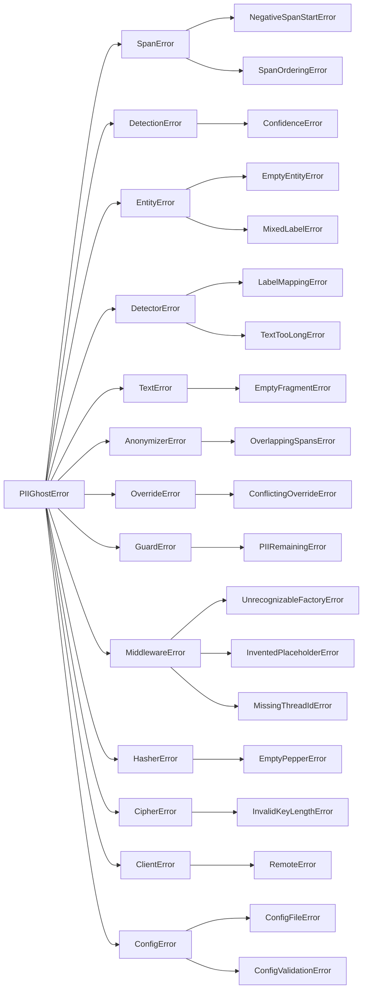

# Exceptions reference

Module: `piighost.exceptions`

Every error the library raises derives from `PIIGhostError`, so one `except PIIGhostError` covers the whole family. Between the root and the leaves sit the grouping classes, one per subsystem, which a caller catches to react to a stage rather than to a single failure. The module depends on nothing outside the standard library, so every class imports without an optional extra, including the errors raised by components that need one.

```python
from piighost.exceptions import PIIGhostError
```

`PIIGhostSecurityWarning` is the one name in the module outside this tree. Being a warning and not an error, it is described at the end of the page.

## The hierarchy



*The `PIIGhostError` tree, each grouping class to the left of the errors it covers.*
{ .figure-caption }

Of the thirty-three error classes, twenty are raised by a component and thirteen exist only to be caught. `ConfigError` counts on both sides, a grouping class that is also raised on its own.

## Data models

Module: `piighost.models`. `SpanError`, `DetectionError`, and `EntityError` group the validation failures of the frozen data models. Each is raised from `__post_init__`, so an invalid value fails at construction and never reaches a stage.

| Exception | Raised by | Raised when |
|-----------|-----------|-------------|
| `NegativeSpanStartError` | `Span.__post_init__` | `start` is negative |
| `SpanOrderingError` | `Span.__post_init__` | `end` is not strictly greater than `start`, which describes an empty or a reversed range |
| `ConfidenceError` | `Detection.__post_init__` | `confidence` falls outside the closed range 0 to 1 |
| `EmptyEntityError` | `Entity.__post_init__` | the entity groups no detection |
| `MixedLabelError` | `Entity.__post_init__` | the grouped detections do not all share one label |

The invariants these errors enforce are in [Data models](models.md), and the ports that exchange the models in [Extending PIIGhost](../extending.md).

## Detectors

Module: `piighost.components.detector.ner`. `DetectorError` groups two failures of `BaseNERDetector`, so they reach the model-backed detectors only. A regex, exact-match, composite, or chunked detector raises neither.

| Exception | Raised by | Raised when |
|-----------|-----------|-------------|
| `LabelMappingError` | `BaseNERDetector.__init__` | two external labels map to one internal label, which would make the reverse lookup ambiguous |
| `TextTooLongError` | `BaseNERDetector`, on detection | a text exceeds `max_chars` while `auto_chunk` is off, so a prefix-only scan is refused |

Both are covered in [Detectors](detectors.md), with the `max_chars` and `auto_chunk` arguments that govern the second.

## Text helpers

Module: `piighost.text`. `TextError` groups the failures of the word-boundary helpers and carries one subclass.

| Exception | Raised by | Raised when |
|-----------|-----------|-------------|
| `EmptyFragmentError` | `boundary_wrap`, `find_all_word_boundary`, and `ExactMatchDetector.__init__` | the fragment searched for is empty, which would match at every position of the text |

An empty fragment would yield zero-width spans a `Span` refuses, so the failure would otherwise surface as a `SpanOrderingError` far from its cause. `ExactMatchDetector` checks its configured values at construction, so a config typo fails at load rather than on the first message. `LLMDetector` does not raise it, because a model's output is untrusted, so a blank extracted value is dropped with a warning instead.

## Anonymizer

Module: `piighost.components.anonymizer`. `AnonymizerError` groups the render stage's failures and carries one subclass.

| Exception | Raised by | Raised when |
|-----------|-----------|-------------|
| `OverlappingSpansError` | `Anonymizer.render` | two spans still overlap when the one-pass rewrite reaches them |

The disjoint-span assumption behind it is in [Anonymizer](anonymizer.md), and the stage that upholds it in [Pipeline](pipeline.md).

## Detection overrides

Module: `piighost.components.override`. `OverrideError` groups the failures of the whitelist and blacklist stage and carries one subclass.

| Exception | Raised by | Raised when |
|-----------|-----------|-------------|
| `ConflictingOverrideError` | `DetectionOverride.apply` | a whitelisted span overlaps a blacklisted one under the `raise` conflict strategy |

The other two conflict strategies resolve the collision instead of raising. Every `[override]` key is in the [configuration reference](../configuration/toml.md).

## Guard rails

Module: `piighost.pipeline`. `GuardError` groups the guard-stage failures and carries one subclass.

| Exception | Raised by | Raised when |
|-----------|-----------|-------------|
| `PIIRemainingError` | the pipeline, after the guard stage | a guard returns a flagged verdict |

A guard raises nothing itself. It returns a verdict, and the pipeline turns a flagged one into this error, as described in [Guard rails](guard-rails.md).

## Integrations

Module: `piighost.integrations`. `MiddlewareError` groups the failures of the integration layer. The first two below come from the shared `TextDeidentifier`, which backs the LangChain middleware, the LlamaIndex query engine, and the Pydantic AI hooks alike. The third belongs to the LangChain middleware alone.

| Exception | Raised by | Raised when |
|-----------|-----------|-------------|
| `UnrecognizableFactoryError` | `TextDeidentifier.__init__` | the pipeline exposes no token recognizer, its placeholder factory having no re-findable grammar |
| `InventedPlaceholderError` | `TextDeidentifier.deanonymize` and `deanonymize_stream` | restored text still holds a token the pipeline never issued, under the `RAISE` invented-placeholder strategy |
| `MissingThreadIdError` | the LangChain middleware, on each turn | the LangGraph config carries no `thread_id` while `require_thread_id` is set |

The three are covered in [LangChain integration](langchain.md), with the strategies that decide whether the second is raised at all.

## Crypto

Module: `piighost.crypto`. `HasherError` and `CipherError` group the constructor failures of the at-rest primitives, one subclass each.

| Exception | Raised by | Raised when |
|-----------|-----------|-------------|
| `EmptyPepperError` | `BaseHasher.__init__` | the pepper is empty, which would leave low-entropy PII brute-forceable |
| `InvalidKeyLengthError` | `AesGcmCipher.__init__` | the AES key is not 16, 24, or 32 bytes |

Both fail closed at construction, so a misconfigured store never starts. What these primitives protect is in [Security](../security.md), and the memory backends that take them in [Conversation memory](memory.md).

## Remote client

Module: `piighost.integrations.client`. `ClientError` groups the remote client's failures and carries one subclass.

| Exception | Raised by | Raised when |
|-----------|-----------|-------------|
| `RemoteError` | `PIIGhostClient`, on every call | the remote `piighost-api` answers with a non-2xx status |

The status guard is all it covers. A 2xx body missing an expected key surfaces as a `KeyError`, not a `RemoteError`. The client's methods are in [API client](../getting-started/api-client.md).

## Configuration

Module: `piighost.config`. `ConfigError` groups the load-time and build-time failures, and unlike the other grouping classes it is also raised on its own.

| Exception | Raised by | Raised when |
|-----------|-----------|-------------|
| `ConfigFileError` | `load_config` | the file is missing, unreadable, or invalid TOML or JSON |
| `ConfigValidationError` | `load_config` | the parsed data fails schema validation, wrapping pydantic's `ValidationError` in the library's family |
| `ConfigError` | `load_pipeline`, `load_thread_pipeline`, and a component config's `build()` | the entry point does not match the `[memory]` section declared, a secret environment variable is unset or malformed, or a memory declares exactly one of a hasher and a cipher |

Catching `ConfigError` covers all three. Every key and every secret variable is in the [configuration reference](../configuration/toml.md), and the `piighost` CLI reports the same three from `validate`, as described in [CLI](cli.md).

## Errors carrying data

Three errors expose the values behind the failure as attributes. Every other error carries its message only.

| Exception | Attribute | Holds |
|-----------|-----------|-------|
| `PIIRemainingError` | `detections` | the residual detections behind the flag, empty when the guard is score-based and localizes nothing |
| `InventedPlaceholderError` | `tokens` | the invented tokens, in order of appearance |
| `RemoteError` | `status_code` | the HTTP status the server returned |

## `PIIGhostSecurityWarning`

A `UserWarning`, outside the `PIIGhostError` tree, so it never fails a call and the standard `warnings` filters govern it. It marks a setup that runs but keeps PII readable, so a knowing choice still works while a forgotten one is loud. Two sites emit it, both at construction.

| Emitted by | Emitted when |
|------------|--------------|
| `warn_plaintext`, called from `RedisConversationMemory` and `SqlAlchemyConversationMemory` | a persistent backend is built without a hasher and a cipher, so its store holds PII in clear |
| `BaseAnonymizationPipeline.__init__` | no `observation_redactor` is set, `trace_clear_text` is off, and the tracer is exporting, so traces would record clear text |

The backend comparison is in [Conversation memory](memory.md), and the redactor in [Observation](../observation.md).

## See also

- [Pipeline](pipeline.md): the stage order the errors above follow.
- [Guard rails](guard-rails.md): the verdict behind `PIIRemainingError`.
- [LangChain integration](langchain.md): the strategies behind the middleware errors.
- [Configuration reference](../configuration/toml.md): every key the configuration errors validate.
- [Security](../security.md): what the fail-closed choices protect against.
