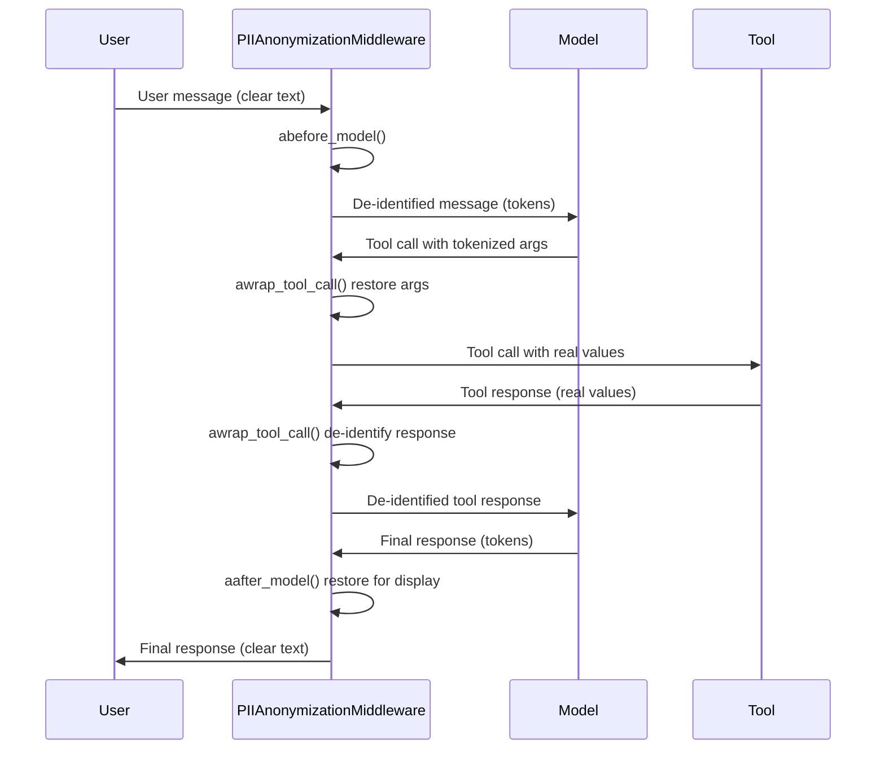

# LangChain middleware reference

Module: `piighost.integrations.langchain`

!!! note "Moved in 1.4.0"
    This integration moved here from `piighost.integrations.middleware`. The old import path still works but emits a `DeprecationWarning`. Update imports to `piighost.integrations.langchain`.

`PIIAnonymizationMiddleware` is a LangChain `AgentMiddleware` that de-identifies PII around the model and tool boundary of an agent. It reads the thread id from the LangGraph config, de-identifies messages before the model sees them, restores them after for display, and routes tool calls by a chosen strategy. All detection, token assignment, and replacement is delegated to a `ThreadAnonymizationPipeline`.

```python
from piighost.integrations.langchain import (
    AssistantEntityStrategy,
    InventedPlaceholderStrategy,
    PIIAnonymizationMiddleware,
    ToolCallStrategy,
)
```

Needs the `middleware` extra (`pip install piighost[langchain]`), which pulls in `langchain`. Importing the package never pulls `langchain` in; the middleware class is imported on demand, so a missing extra raises an `ImportError` naming the extra.

---

## `PIIAnonymizationMiddleware`

Extends `AgentMiddleware` and hooks the agent loop at three points.

<div class="wide-table" markdown="1">

| Hook | When | Operation |
|------|------|-----------|
| `abefore_model` | Before each model call | De-identifies the user and model messages |
| `aafter_model` | After each model response | Restores the user and model messages for display |
| `awrap_tool_call` | Around each tool call | De-identifies arguments, de-identifies the response, per strategy |

</div>

### Constructor

```python
PIIAnonymizationMiddleware(
    pipeline: AnyThreadPipeline,
    tool_strategy: ToolCallStrategy = ToolCallStrategy.FULL,
    require_thread_id: bool = True,
    invented_strategy: InventedPlaceholderStrategy = InventedPlaceholderStrategy.RAISE,
    assistant_strategy: AssistantEntityStrategy = AssistantEntityStrategy.PRESERVE,
)
```

| Parameter | Type | Description |
|-----------|------|-------------|
| `pipeline` | `AnyThreadPipeline` | The thread pipeline that de-identifies and restores (required) |
| `tool_strategy` | `ToolCallStrategy` | How the two directions of a tool call are handled |
| `require_thread_id` | `bool` | Whether a missing thread id raises, rather than falling back to a shared thread |
| `invented_strategy` | `InventedPlaceholderStrategy` | How a token the pipeline never issued is treated after restoration |
| `assistant_strategy` | `AssistantEntityStrategy` | How values the assistant introduces are treated |

The pipeline must expose a delimited token recognizer through `pipeline.recognizer`, so a token the model invented can be found again. A pipeline whose placeholder factory is not delimited (a mask, for example) has no recognizer, and the constructor raises `UnrecognizableFactoryError`. The `IdentityT` type bound enforces the same at type-check time for typed callers.

`require_thread_id` defaults to `True`, so a missing thread id raises `MissingThreadIdError` rather than routing every conversation into the shared `"default"` thread, which would leak placeholder state across conversations. Pass `False` to opt into that shared fallback for single-conversation or stateless use.

---

## Hooks

### `abefore_model(state, runtime) -> dict | None`

De-identifies the user and model messages before the model sees them. Each message is passed through `pipeline.anonymize()` under the role its type contributes. A `ToolMessage` is never rewritten here, only in the tool wrapper. Under `AssistantEntityStrategy.IGNORE`, `AIMessage` content is skipped entirely.

Returns `{"messages": [...]}` when a message changed, `None` otherwise.

```python
# before: [HumanMessage("Email Patrick in Paris")]
# after:  [HumanMessage("Email <<PERSON:1>> in <<LOCATION:1>>")]
```

### `aafter_model(state, runtime) -> dict | None`

Restores the user and model messages for display through `pipeline.deanonymize()`, then applies `invented_strategy` to the restored text. Returns `{"messages": [...]}` when a message changed, `None` otherwise.

```python
# before: [AIMessage("Sent to <<PERSON:1>>.")]
# after:  [AIMessage("Sent to Patrick.")]
```

### `awrap_tool_call(request, handler) -> ToolMessage | Command`

Routes the tool call by `tool_strategy`. When the strategy de-identifies input, the tool arguments are restored to real values before the tool runs. When it de-identifies output, a string tool response is passed through `pipeline.anonymize()` after the tool runs. `PASSTHROUGH` touches neither.

Argument restoration recurses through nested `dict`, `list`, and `tuple` containers. Only `str` leaves are restored; other types pass through unchanged.

```python
# model calls  : send_email(to="<<PERSON:1>>", subject="Hi")
#                       restore args
# tool receives: send_email(to="Patrick", subject="Hi")
# tool returns : "Sent to Patrick."
#                       de-identify response
# model sees   : "Sent to <<PERSON:1>>."
```

---

## Strategies

Plain enums in `piighost.integrations.langchain.strategy`, importable without `langchain`.

### `ToolCallStrategy`

How the two directions of a tool call are handled. The directions are independent, and the middleware acts only in the tool wrapper.

| Value | Arguments | Response |
|-------|-----------|----------|
| `INPUT` | restored to real values | left as the tool returned it |
| `OUTPUT` | left tokenized | de-identified |
| `FULL` | restored to real values | de-identified |
| `PASSTHROUGH` | untouched | untouched |

`FULL` is the default. A strategy that does not de-identify the response leaves it as the tool returned it, and the model sees it that way.

### `InventedPlaceholderStrategy`

How a token the pipeline never issued is treated. After restoration, every issued token has been replaced by its value, so any token still matching the placeholder grammar was invented by the model, whether hallucinated or injected.

| Value | Effect |
|-------|--------|
| `KEEP` | leave the invented token in the text |
| `DROP` | remove the invented token |
| `RAISE` | raise `InventedPlaceholderError` |

`RAISE` is the default.

### `AssistantEntityStrategy`

How values the assistant introduces are treated. A value's provenance is the role of its first occurrence in the thread. A value the assistant introduced is not user PII, so de-identifying it strips the model of its world knowledge of that entity.

| Value | Effect |
|-------|--------|
| `PRESERVE` | leave assistant-introduced values in clear |
| `ANONYMIZE` | de-identify them like user PII |
| `IGNORE` | do not analyze assistant messages at all, saving the detector |

`PRESERVE` is the default.

---

## Full flow



*From the user message to the restored response, through the model and the tool.*
{ .figure-caption }

---

## Example

```python
from langchain.agents import create_agent
from langchain_core.tools import tool

from piighost.config import load_thread_pipeline
from piighost.integrations.langchain import PIIAnonymizationMiddleware


@tool
def get_info(person: str) -> str:
    """Return information about a person."""
    return f"{person} is a software engineer in Paris."


pipeline = load_thread_pipeline("pipeline.toml")
middleware = PIIAnonymizationMiddleware(pipeline)

agent = create_agent(
    model="openai:gpt-5.4",
    system_prompt="You are a helpful assistant. Treat placeholders as real values.",
    tools=[get_info],
    middleware=[middleware],
)

config = {"configurable": {"thread_id": "conv-1"}}
result = await agent.ainvoke(
    {"messages": [{"role": "user", "content": "Who is Patrick?"}]},
    config,
)
print(result["messages"][-1].content)
```

The pipeline must be a thread pipeline whose placeholder factory is delimited, such as `label`, `label_counter`, or `label_hash`. Pass a thread id on every call through `config["configurable"]["thread_id"]`, since `require_thread_id` defaults to `True`.

---

## Streaming

The `abefore_model` and `aafter_model` hooks see the whole message, so a live display that streams the reply would show placeholders until it completes. For a token-by-token display, wrap `deanonymize_stream` around your own streaming loop. It buffers only a token split across chunks, restores each token once it completes, and applies `invented_strategy` per restored token.

### `deanonymize_stream(source, thread_id) -> AsyncIterator[str]`

`source` is an async iterator of the model's text chunks; `thread_id` is the id you ran the agent with, since a manual stream loop is outside the LangGraph config the hooks read.

```python
config = {"configurable": {"thread_id": "conv-1"}}


async def model_text():
    async for chunk, _meta in agent.astream(
        {"messages": [{"role": "user", "content": "Who is Patrick?"}]},
        config,
        stream_mode="messages",
    ):
        if isinstance(chunk.content, str):
            yield chunk.content


async for restored in middleware.deanonymize_stream(model_text(), "conv-1"):
    print(restored, end="", flush=True)
```

A token split across chunks, `<<PER`{ .placeholder } then `SON:1>>`{ .placeholder }, is held until it completes and restored to `Patrick`{ .pii }, so the display never shows a broken token.

For another framework, the same restoration is one step lower: `pipeline.recognizer.async_stream_decoder(replace)` builds the decoder over any factory's grammar, with `replace` a coroutine that deanonymizes one token.

---

## See also

- [Pipeline reference](pipeline.md) for the thread pipeline the middleware drives.
- [Tool-call strategies](../tool-call-strategies.md) for the reasoning behind each strategy.
- [TOML configuration](../configuration/toml.md) for building the pipeline from a file.
