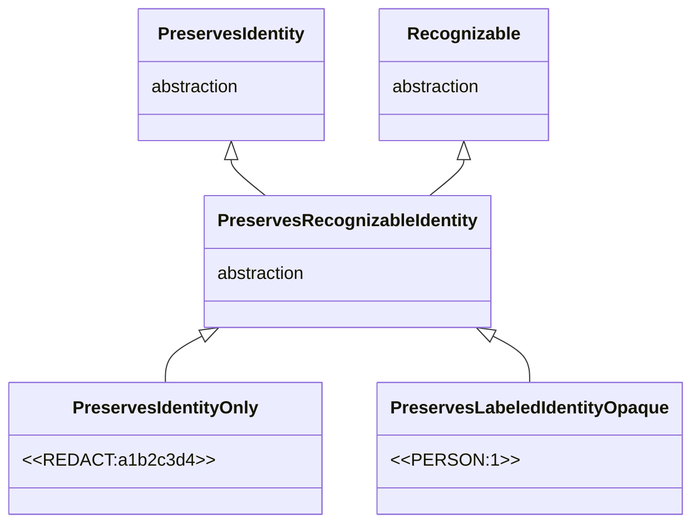
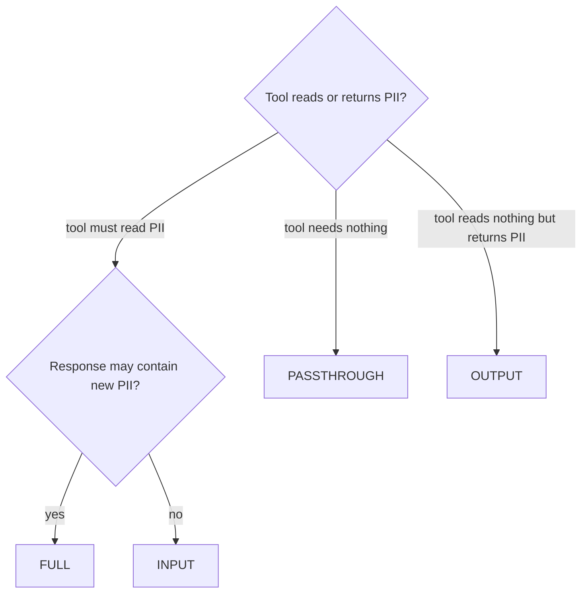

# Tool-call strategies

`PIIAnonymizationMiddleware` sits on two channels, the LLM channel and the tool channel, which do not offer the same reliability guarantees. Three strategies drive its behaviour, one per independent decision the middleware has to make.

- **`ToolCallStrategy`** decides what crosses the tool boundary, in both directions. Default `FULL`.
- **`InventedPlaceholderStrategy`** decides the fate of a token the pipeline never issued, surfacing in a response or a deanonymised argument. Default `RAISE`.
- **`AssistantEntityStrategy`** decides the fate of a value whose first occurrence in the thread came from the assistant. Default `PRESERVE`.

!!! note "One entity, one token, across the whole thread"

    Take `jean@mail.com`{ .pii } in the first message of a thread. The pipeline de-identifies it to `<<EMAIL:1>>`{ .placeholder } and records the mapping. That token carries the entity's identity across the whole thread, it is what travels through the LLM, the tools, and the reply. All the strategies below decide *where* and *which way* this token is translated to `jean@mail.com`{ .pii } and back.

---

## Family details

### The LLM channel: memory-based, reliable

In `abefore_model`, the middleware sends an *exact* de-identified text to the LLM and the pipeline records the entity-to-token mapping. When the LLM replies, `aafter_model` restores the values by reading that mapping. This is deterministic, it cannot be ambiguous, and it works regardless of which token was used. As long as the LLM forwards back the exact de-identified string it received, this channel is reliable.

### The tool channel: string replacement, fragile

In `awrap_tool_call`, the LLM produces tool arguments by combining, splitting, paraphrasing the tokens it just saw. That arbitrary text was never produced by the pipeline, so it is not memorised. The same is true of the tool response, `piighost` has never seen it before.

Both directions therefore fall back on **plain string replacement**.

- *Tool args (LLM to tool)*, scan the args for known tokens and replace each with the original value of its entity, `<<EMAIL:1>>`{ .placeholder } becomes `jean@mail.com`{ .pii } again.
- *Tool response (tool to LLM)*, scan the response for known PII values and replace each with the corresponding token.

Plain replacement only works when the mapping is **unambiguous**. If two entities share the token `<<PERSON>>`{ .placeholder }, there is no way to decide which original to restore in the args. This is the structural reason the middleware accepts only factories whose tokens preserve a findable identity. See [Placeholder factories](placeholder-factories.md).

The middleware acts only in the tool wrapper, never on the stored response afterwards. Arguments are deanonymised recursively through nested `dict`, `list`, and `tuple` containers, other containers pass through unchanged.

### `ToolCallStrategy`: what crosses the tool boundary

The two directions of a tool call are independent. `INPUT` deanonymises the arguments so the tool receives real data. `OUTPUT` anonymises the tool response to protect any PII it returns. `FULL` does both. `PASSTHROUGH` touches neither.

| Strategy | Tool sees | Response to the LLM | When to use |
|---|---|---|---|
| `INPUT` | real values (deanonymised args) | as-is, not anonymised | tools whose response is known PII-free |
| `OUTPUT` | tokens | re-anonymised by the pipeline | tools that receive opaque ids but may return PII |
| `FULL` (default) | real values (deanonymised args) | re-anonymised by the pipeline | tools that read PII and may return new PII (DBs, CRMs, search) |
| `PASSTHROUGH` | tokens | as-is | tools that must never see PII, or that do not need them |

`FULL` is symmetric, deanonymise the arguments then run the response through `pipeline.anonymize()`, which re-detects and re-anonymises. Any new PII the tool returned becomes a token before the LLM sees it, at the cost of one detection pass per call.

`INPUT` deanonymises the input only and leaves the response raw, reserve it for tools whose output is known PII-free, an internal id lookup, a status flag, a numeric value. `OUTPUT` does the reverse, it leaves the arguments as tokens and only anonymises the response.

`PASSTHROUGH` is the strictest privacy boundary, tools never observe PII. The tool receives the token string as-is and its response is forwarded back without rewriting. Useful when the agent's tools work on opaque identifiers, or when the tool is itself the LLM-facing layer of a separate de-identification system. It is the only mode that tolerates a `PreservesLabel`, `PreservesShape` or `PreservesNothing` factory, since the tool boundary is never crossed in clear text the uniqueness requirement disappears. You still cannot wire such a factory into `PIIAnonymizationMiddleware` directly, the type-checker rejects it, the escape hatch is to use the bare pipeline outside the middleware.

### `InventedPlaceholderStrategy`: the token the model invented

After deanonymisation, every token the pipeline issued has been replaced by its value. If a string still matches the token grammar, the model invented it, by hallucination or injection. The model may have produced a `<<PERSON:9>>`{ .placeholder } that maps to no known entity.

| Strategy | Effect | When to use |
|---|---|---|
| `KEEP` | leaves the invented token in the text | tolerant, when a fake token does not matter |
| `DROP` | removes the invented token from the text | clean a user-facing output without raising |
| `RAISE` (default) | raises `InventedPlaceholderError` | default, refuse a non-issued token rather than pass it on |

This detection is possible only because the factory is findable, which the tag `PreservesRecognizableIdentity` that the middleware requires guarantees.

### `AssistantEntityStrategy`: the value that came from the assistant

The *provenance* of a value is the role of its first occurrence in the thread. A value the assistant introduced is not user PII, anonymising it strips the model of its world knowledge of that entity. If the assistant cites a public place in its reply, de-identifying it on the next turn cuts the model off from information it produced itself.

| Strategy | Effect | When to use |
|---|---|---|
| `PRESERVE` (default) | leaves assistant-introduced values in clear | default, keep the model's knowledge |
| `ANONYMIZE` | de-identifies them like user PII | when even assistant values must be protected |
| `IGNORE` | does not analyse assistant messages at all | save the detector when the assistant never introduces PII |

---

## Preservation tags

The strategies above are not phantom types, they are `Enum`s passed at middleware construction. The type constraint is on the pipeline's *factory*, not on the strategies.

The middleware is generic on a `PreservesRecognizableIdentity` tag, the intersection of the *Identity* axis (the token is unique per entity) and the *Recognizable* axis (the token carries a delimited grammar the factory can find again). Uniqueness makes the string-replacement deanonymisation unambiguous. Findability makes it possible to detect an invented token, hence `InventedPlaceholderStrategy`.



*The intersection the middleware narrows on, identity and findability at once.*
{ .figure-caption }

One exception, `PASSTHROUGH`. Since the tool boundary is never crossed in clear text the requirement falls away, but it is still imposed at type-check, so you must step outside the middleware to use a weaker tag.

---

## Built-in strategies

<div class="wide-table" markdown="1">

| Enum | Members | Default | Decides |
|---|---|---|---|
| `ToolCallStrategy` | `INPUT`, `OUTPUT`, `FULL`, `PASSTHROUGH` | `FULL` | what crosses the tool boundary, in each direction |
| `InventedPlaceholderStrategy` | `KEEP`, `DROP`, `RAISE` | `RAISE` | the fate of a token the pipeline never issued |
| `AssistantEntityStrategy` | `PRESERVE`, `ANONYMIZE`, `IGNORE` | `PRESERVE` | the fate of a value introduced by the assistant, by provenance |

</div>

All three are plain `Enum`s with no external dependency, importable from `piighost.integrations.langchain` without installing `langchain`.

---

## Which strategy to pick?



*Picking a `ToolCallStrategy` from what the tool reads and returns.*
{ .figure-caption }

For `ToolCallStrategy`.

- Default to `FULL`, the most defensive setting and the only one that catches tool-introduced PII automatically.
- `INPUT` when the response is proven PII-free and the latency saving matters.
- `OUTPUT` when the tool receives opaque identifiers but may return PII.
- `PASSTHROUGH` when privacy outweighs functionality, or when the tool is engineered to work on tokens.

For the other two, keep the defaults unless you have a reason not to. Set `InventedPlaceholderStrategy` to `DROP` to clean a user-facing output without raising, or to `KEEP` to tolerate a fake token. Set `AssistantEntityStrategy` to `ANONYMIZE` if even values the assistant cited must be protected, or to `IGNORE` to save the detector when the assistant never introduces PII.

---

## Why the tool channel requires a findable identity

The LLM channel restores by reading the memorised mapping, it tolerates any factory. The tool channel falls back on string replacement over a text the pipeline never produced, so it cannot read a mapping, it must **find** the tokens in the text and know **which unique entity** each one denotes.

Two guarantees follow, carried by the `PreservesRecognizableIdentity` tag that `PIIAnonymizationMiddleware` requires. Uniqueness, otherwise two entities sharing a token make restoration ambiguous. Findability, otherwise the token has no fixed grammar and blends into the prose, which also rules out spotting an invented token.

The constraint is checked at type-check time by the generic bound, and re-checked at runtime when the middleware is constructed, which asks the pipeline for a recognizer and raises `UnrecognizableFactoryError` if there is none. See [Placeholder factories](placeholder-factories.md) for the tag detail and the full hierarchy.

---

## Writing your own

The strategies are closed `Enum`s, you do not extend them, you combine them at middleware construction. The example covers all three axes in one call.

???+ example "Combining the three strategies at construction"

    ```python
    from piighost.integrations.langchain import (
        PIIAnonymizationMiddleware,
        ToolCallStrategy,
        InventedPlaceholderStrategy,
        AssistantEntityStrategy,
    )

    middleware = PIIAnonymizationMiddleware(
        pipeline,  # PreservesRecognizableIdentity tokens, else UnrecognizableFactoryError
        tool_strategy=ToolCallStrategy.FULL,
        invented_strategy=InventedPlaceholderStrategy.DROP,
        assistant_strategy=AssistantEntityStrategy.PRESERVE,
        require_thread_id=True,
    )
    ```

To change *what* the pipeline finds and restores, you swap the placeholder factory, not a strategy. See *Writing your own* in [Placeholder factories](placeholder-factories.md).

---

## See also

- [Placeholder factories](placeholder-factories.md): the uniqueness and findability constraint that drives `PreservesRecognizableIdentity`.
- [Architecture](architecture.md): sequence diagrams of the LLM and tool channels.
- [Limitations](limitations.md): how the strategy choice interacts with the rest of the pipeline.
