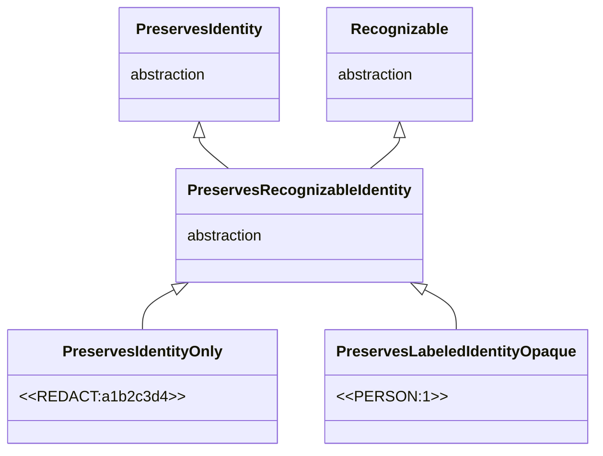

# Tool-call strategies

`PIIAnonymizationMiddleware` sits on two channels, the LLM channel and the tool channel. Both restore tokens the same way, but the tool channel hands the real values to code that acts. Three strategies drive its behaviour, one per independent decision the middleware has to make.

- **`ToolCallStrategy`** decides what crosses the tool boundary, in both directions. Default `FULL`.
- **`InventedPlaceholderStrategy`** decides the fate of a token the pipeline never issued, surfacing in a response or a restored argument. Default `RAISE`.
- **`EntityCreateByAssistantStrategy`** decides the fate of a value whose first occurrence in the thread came from the assistant. Default `PRESERVE`.

!!! note "One entity, one token, across the whole thread"

    Take `jean@mail.com`{ .pii } in the first message of a thread. The pipeline de-identifies it to `<<EMAIL:1>>`{ .placeholder } and records the mapping. That token carries the entity's identity across the whole thread. It is what travels through the LLM, the tools, and the reply. All the strategies below decide *where* and *which way* this token is translated to `jean@mail.com`{ .pii } and back.

---

## The two channels

### The LLM channel

In `abefore_model`, the middleware de-identifies the messages and the pipeline records their detections in the thread's memory. When the LLM replies, `aafter_model` restores the reply through **string replacement**. It looks for every known token of the thread and replaces it with the value of its entity. The LLM writes for example "I wrote to `<<EMAIL:1>>`{ .placeholder }", and the user reads "I wrote to `jean@mail.com`{ .pii }". That reply is a text the pipeline never produced. Replacement is the only way to restore it.

### The tool channel

In `awrap_tool_call`, the LLM produces tool arguments by combining, splitting, paraphrasing the tokens it just saw. The two directions of the call are handled differently.

- *Tool args (LLM to tool)*. The middleware restores them through the same string replacement as the LLM channel. It scans the args for known tokens and replaces each with the original value of its entity. For example, `<<EMAIL:1>>`{ .placeholder } becomes `jean@mail.com`{ .pii } again.
- *Tool response (tool to LLM)*. The response goes through the thread's pipeline, detection included, like a user message. A value already seen takes its token back. A value the conversation never mentioned, an email returned by a CRM for example, is detected and gets its own.

On both channels, replacement only works when the mapping is **unambiguous**. If two entities share the token `<<PERSON>>`{ .placeholder }, there is no way to decide which original to restore. On the tool channel, the mistake has a concrete effect, for example an email sent to the wrong person. This is the reason the middleware accepts only factories whose tokens preserve a findable identity. See [Placeholder factories](placeholder-factories.md).

The middleware acts only in the tool wrapper, never on the stored response afterwards. Arguments are restored recursively through nested `dict`, `list`, and `tuple` containers. Other containers pass through unchanged.

---

## The three strategies

### `ToolCallStrategy`, what crosses the tool boundary

The two directions of a tool call are independent. `INPUT` restores the arguments so the tool receives real data. `OUTPUT` de-identifies the tool response to protect any confidential data (personal data, secrets) it returns. `FULL` does both. `PASSTHROUGH` touches neither.

| Strategy | Tool sees | Response to the LLM | When to use |
|---|---|---|---|
| `INPUT` | real values (restored args) | as-is, not de-identified | tools whose response is known to hold no confidential data |
| `OUTPUT` | tokens | de-identified by the pipeline | tools that receive opaque ids but may return confidential data |
| `FULL` (default) | real values (restored args) | de-identified by the pipeline | tools that read confidential data and may return new confidential data (DBs, CRMs, search) |
| `PASSTHROUGH` | tokens | as-is | tools that must never see confidential data, or that do not need it |

`FULL` is symmetric. It restores the arguments, then runs the response through `pipeline.anonymize()`, which re-detects and de-identifies. Any new confidential data the tool returned becomes a token before the LLM sees it, at the cost of one detection pass per call.

`INPUT` restores the input only and leaves the response raw. Reserve it for tools whose output is known to hold no confidential data, such as an internal id lookup, a status flag or a numeric value. `OUTPUT` does the reverse. It leaves the arguments as tokens and only de-identifies the response.

`PASSTHROUGH` is the strictest privacy boundary. Tools never observe confidential data. The tool receives the token string as-is and its response is forwarded back without rewriting. Useful when the agent's tools work on opaque identifiers, or when the tool is itself the LLM-facing layer of a separate de-identification system. `PASSTHROUGH` does not relax the requirement on the factory. The LLM channel still restores the model's reply, so each token must still denote a single entity. A `PreservesLabel`, `PreservesShape` or `PreservesNothing` factory only works with the bare pipeline, outside the middleware.

### `InventedPlaceholderStrategy`, the token the model invented

After restoration, every token the pipeline issued has been replaced by its value. If a string still matches the token grammar, the model invented it, by hallucination or injection. The model may have produced a `<<PERSON:9>>`{ .placeholder } that maps to no known entity.

| Strategy | Effect | When to use |
|---|---|---|
| `KEEP` | leaves the invented token in the text | tolerant, when a fake token does not matter |
| `DROP` | removes the invented token from the text | clean a user-facing output without raising |
| `RAISE` (default) | raises `InventedPlaceholderError` | default, refuse a non-issued token rather than pass it on |

This detection is possible only because the factory is findable. The `PreservesRecognizableIdentity` tag, which the middleware requires, guarantees it.

### `EntityCreateByAssistantStrategy`, the value that came from the assistant

The *provenance* of a value is the role of its first occurrence in the thread. A value the assistant introduced is not the user's confidential data. De-identifying it strips the model of its world knowledge of that entity. If the assistant cites a public place in its reply, de-identifying it on the next turn cuts the model off from information it produced itself.

| Strategy | Effect | When to use |
|---|---|---|
| `PRESERVE` (default) | leaves assistant-introduced values in clear | default, keep the model's knowledge |
| `ANONYMIZE` | de-identifies them like the user's confidential data | when even assistant values must be protected |
| `IGNORE` | does not analyse assistant messages at all | save the detector when the assistant never introduces confidential data |

---

## Preservation tags

The strategies above are `Enum`s passed at middleware construction. The type constraint is on the pipeline's *factory*, not on the strategies.

The middleware is generic on a `PreservesRecognizableIdentity` tag. This tag is the intersection of the *Identity* axis (the token is unique per entity) and the *Recognizable* axis (the token carries a delimited grammar the factory can find again). Uniqueness makes the string-replacement restoration unambiguous. Findability makes it possible to detect an invented token. `InventedPlaceholderStrategy` relies on that detection.


```mermaid
classDiagram
    class PreservesIdentity {
        abstraction
    }
    class Recognizable {
        abstraction
    }
    class PreservesRecognizableIdentity {
        abstraction
    }
    class PreservesIdentityOnly {
        &lt;&lt;REDACT:a1b2c3d4&gt;&gt;
    }
    class PreservesLabeledIdentityOpaque {
        &lt;&lt;PERSON:1&gt;&gt;
    }

    PreservesIdentity <|-- PreservesRecognizableIdentity
    Recognizable <|-- PreservesRecognizableIdentity
    PreservesRecognizableIdentity <|-- PreservesIdentityOnly
    PreservesRecognizableIdentity <|-- PreservesLabeledIdentityOpaque
```

*The intersection the middleware narrows on, identity and findability at once.*
{ .figure-caption }

The constraint holds for every `ToolCallStrategy`, `PASSTHROUGH` included, because the LLM channel always restores the model's reply. To use a weaker tag, you must step outside the middleware.

---

## Built-in strategies

<div class="wide-table" markdown="1">

| Enum | Members | Default | Decides |
|---|---|---|---|
| `ToolCallStrategy` | `INPUT`, `OUTPUT`, `FULL`, `PASSTHROUGH` | `FULL` | what crosses the tool boundary, in each direction |
| `InventedPlaceholderStrategy` | `KEEP`, `DROP`, `RAISE` | `RAISE` | the fate of a token the pipeline never issued |
| `EntityCreateByAssistantStrategy` | `PRESERVE`, `ANONYMIZE`, `IGNORE` | `PRESERVE` | the fate of a value introduced by the assistant, by provenance |

</div>

All three are plain `Enum`s with no external dependency, importable from `piighost.integrations.langchain` without installing `langchain`.

---

## Which strategy to pick?

Two questions are enough to pick a `ToolCallStrategy`.

| Does the tool need the real values? | Can its response hold confidential data? | Strategy |
|---|---|---|
| yes | yes | `FULL` |
| yes | no | `INPUT` |
| no | yes | `OUTPUT` |
| no | no | `PASSTHROUGH` |

For `ToolCallStrategy`.

- Default to `FULL`, the most defensive setting and the only one that catches tool-introduced confidential data automatically.
- `INPUT` when the response is proven to hold no confidential data and the latency saving matters.
- `OUTPUT` when the tool receives opaque identifiers but may return confidential data.
- `PASSTHROUGH` when privacy outweighs functionality, or when the tool is engineered to work on tokens.

For the other two, keep the defaults unless you have a reason not to. Set `InventedPlaceholderStrategy` to `DROP` to clean a user-facing output without raising, or to `KEEP` to tolerate a fake token. Set `EntityCreateByAssistantStrategy` to `ANONYMIZE` if even values the assistant cited must be protected, or to `IGNORE` to save the detector when the assistant never introduces confidential data.

---

## Why the middleware requires a findable identity

Both channels restore through string replacement, over a text the pipeline never produced, the model's reply or a tool's arguments. They must therefore **find** the tokens in the text and know **which unique entity** each one denotes.

Two guarantees follow, carried by the `PreservesRecognizableIdentity` tag that `PIIAnonymizationMiddleware` requires. Uniqueness is required, otherwise two entities sharing a token make restoration ambiguous. Findability is required, otherwise the token has no fixed grammar and blends into the prose. Without findability, an invented token cannot be spotted either.

The type checker enforces the constraint through the generic bound. Constructing the middleware re-checks part of it at runtime. The middleware then asks the pipeline for a recognizer and raises `UnrecognizableFactoryError` if there is none, for example with a mask. See [Placeholder factories](placeholder-factories.md) for the tag detail and the full hierarchy.

---

## Writing your own

The strategies are closed `Enum`s. You do not extend them, you combine them at middleware construction. The example covers all three axes in one call.

???+ example "Combining the three strategies at construction"

    ```python
    --8<-- "snippets/tool_call_middleware.en.py:example"
    ```

To change *what* the pipeline finds and restores, you swap the placeholder factory, not a strategy. See *Writing your own* in [Placeholder factories](placeholder-factories.md).

---

## See also

- [Placeholder factories](placeholder-factories.md): the uniqueness and findability constraint that drives `PreservesRecognizableIdentity`.
- [Architecture](architecture.md): sequence diagrams of the LLM and tool channels.
- [Limitations](limitations.md): how the strategy choice interacts with the rest of the pipeline.
- [Let a tool act on the real values](../../openwiki/en/processes/let-a-tool-act.md): the business rules of a tool call, `BR-TOOL-01` to `BR-TOOL-11`, and where each lives in the code.
