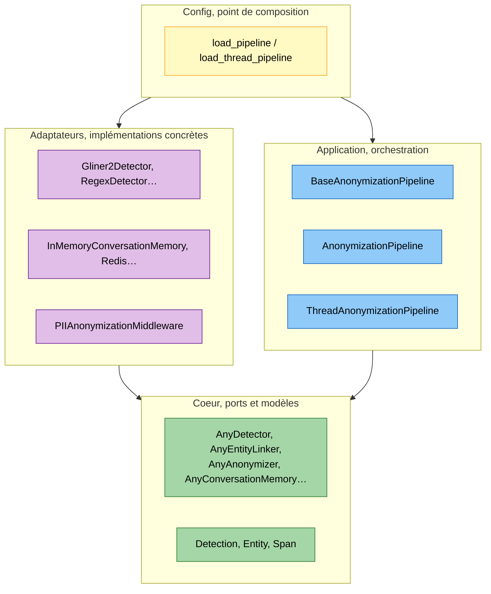
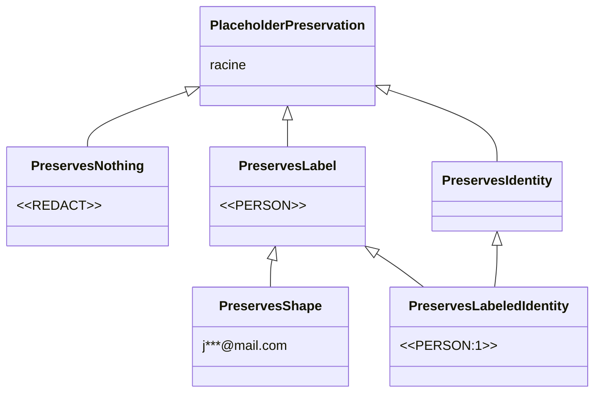
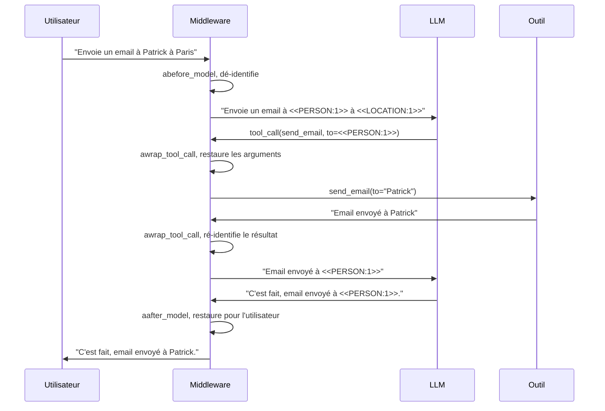

# Architecture

`piighost` suit une architecture hexagonale, aussi appelée ports et adaptateurs.
Le coeur ne connaît que des contrats abstraits, les **ports**. Chaque implémentation
concrète, un détecteur GLiNER2, un backend Redis, un middleware LangChain, est un
**adaptateur** qui satisfait un port sans que le coeur ne le connaisse. Le pipeline
de dé-identification s'assemble en injectant les adaptateurs voulus derrière les ports
qu'il attend.

!!! note "Dé-identification, pas anonymisation"
    Par défaut `piighost` garde le lien entre une valeur et son token, pour pouvoir
    restaurer la valeur. C'est de la dé-identification réversible, au sens du RGPD une
    pseudonymisation, et non de l'anonymisation. Le terme anonymisation reste réservé à
    une suppression irréversible, par exemple avec `RedactPlaceholderFactory`.

---

## Les trois anneaux

Le code se lit en trois anneaux, du plus abstrait au plus concret. Le sens des
dépendances est fixé une fois pour toutes, un anneau extérieur importe un anneau
intérieur, jamais l'inverse.



*Trois anneaux et le point de composition. Les dépendances pointent toujours vers le
coeur.*
{ .figure-caption }

- **Coeur.** Les modèles de données (`Detection`, `Entity`, `Span`, des dataclasses
  gelées) et les ports. Aucune dépendance externe, pas de pydantic, pas d'I/O.
- **Application.** L'orchestration du pipeline, qui ne dépend que des ports du coeur.
  C'est là que vivent `anonymize`, `deanonymize` et `forget_thread`.
- **Adaptateurs.** Les implémentations concrètes des ports, détecteurs, résolveurs,
  factories, gardes-fous, backends de mémoire, observation, client HTTP, middleware.
  Chaque adaptateur importe le coeur, jamais le contraire.
- **Config.** Le point de composition. C'est le seul endroit autorisé à connaître à la
  fois les ports et les adaptateurs concrets, pour les assembler.

---

## Ports et templates

Un port est un `Protocol` Python marqué `runtime_checkable`, dans le `base.py` de
chaque composant. Le typage y est **structurel**, un objet satisfait le port dès qu'il
en a les méthodes, sans en hériter. Le pipeline dépend du port, jamais d'une classe
concrète.

```python
@runtime_checkable
class AnyDetector(Protocol):
    async def detect(self, text: str) -> list[Detection]: ...
```

Quand plusieurs adaptateurs d'un même port partagent un squelette, ce squelette vit
dans une classe `Base*`, une classe abstraite qui applique le patron de méthode
(Template Method). Le squelette est écrit une fois dans la classe de base, et chaque
sous-classe ne fournit que le pas qui varie.

```python
class BaseEntityLinker(ABC):
    def link(self, detections: list[Detection]) -> list[Entity]:
        # squelette commun : grouper par clé
        ...

    @abstractmethod
    def _key(self, detection: Detection) -> Hashable:
        # seul pas variable, défini par la sous-classe
        ...
```

Deux ports n'ont pas de template. Les gardes-fous et les backends de mémoire diffèrent
par tout leur mécanisme, pas par un seul pas, donc rien de commun n'est à factoriser.
C'est l'exception assumée à la règle du template systématique.

---

## Les étapes du pipeline

`BaseAnonymizationPipeline` enchaîne les étapes de la détection au texte
dé-identifié. Seul le détecteur est un argument obligatoire du constructeur. Le
linking, l'anonymisation et la résolution des chevauchements tournent toujours et
retombent sur des composants intégrés par défaut quand on les omet, un
`ExactEntityLinker`, un `Anonymizer` doté d'une `LabelCounterPlaceholderFactory` et
un `ConfidenceOverlapResolver`. Les étapes override, expand, entity-resolve et guard
se comportent en passe-plat quand elles ne sont pas fournies.

```mermaid
flowchart LR
    classDef req fill:#90CAF9,stroke:#1565C0,color:#000
    classDef opt fill:#FFF9C4,stroke:#F9A825,color:#000
    classDef data fill:#A5D6A7,stroke:#2E7D32,color:#000

    IN(["`**Texte source**
    _'Patrick habite à Paris.
    Patrick aime Paris.'_`"]):::data

    DET["`**Détecteur**
    _AnyDetector_`"]:::req
    OVR["`override
    _AnyDetectionOverride_`"]:::opt
    OVL["`résolveur de spans
    _AnyOverlapResolver_`"]:::opt
    EXP["`expander
    _AnyDetectionExpander_`"]:::opt
    LINK["`**Linker**
    _AnyEntityLinker_`"]:::req
    ENT["`résolveur d'entités
    _AnyEntityResolver_`"]:::opt
    ANON["`**Anonymiseur**
    _AnyAnonymizer + factory_`"]:::req
    GUARD["`garde-fou
    _AnyGuardRail_`"]:::opt

    OUT(["`**Sortie**
    _'<<PERSON:1>> habite à <<LOCATION:1>>.
    <<PERSON:1>> aime <<LOCATION:1>>.'_`"]):::data

    IN --> DET --> OVR --> OVL --> EXP --> LINK --> ENT --> ANON --> GUARD --> OUT
```



*Le pipeline, étapes obligatoires en bleu, étapes optionnelles en jaune.*
{ .figure-caption }

Le détail de pourquoi chaque étape existe et dans quel ordre est traité dans
[Conception du pipeline](conception.md). Voici le rôle et l'adaptateur par défaut de
chacune.

<div class="wide-table" markdown="1">

| Étape | Port | Adaptateur fourni | Rôle |
|---|---|---|---|
| Détecteur | `AnyDetector` | `Gliner2Detector`, `RegexDetector`, `LLMDetector`, `ExactMatchDetector`, `CompositeDetector`, `ChunkedDetector` | Trouve les PII, renvoie des `Detection` positionnées et typées. |
| Résolveur de spans | `AnyOverlapResolver` | `ConfidenceOverlapResolver` | Arbitre les détections qui se chevauchent, garde la plus confiante. |
| Expander | `AnyDetectionExpander` | `WordBoundaryExpander` | Rattrape les occurrences ratées d'une valeur déjà détectée. |
| Linker | `AnyEntityLinker` | `ExactEntityLinker` | Regroupe les détections d'une même valeur en une `Entity`. |
| Résolveur d'entités | `AnyEntityResolver` | `MergeEntityResolver`, `FuzzyEntityResolver`, `SeparateEntityResolver` | Réconcilie les entités qui partagent une détection. |
| Anonymiseur | `AnyAnonymizer` (+ `AnyPlaceholderFactory`) | `Anonymizer` + `LabelCounterPlaceholderFactory` | Remplace chaque entité par son token. |
| Garde-fou | `AnyGuardRail` | `DetectorGuardRail`, `LLMGuardRail`, `ModerationGuardRail` | Re-vérifie la sortie, lève `PIIRemainingError` sur PII résiduelle. |

</div>

L'override (`AnyDetectionOverride`, adaptateur `DetectionOverride`) est un composant
serveur optionnel. Il applique une liste blanche et une liste noire à chaque jeu de
détections, juste après la détection, avant la résolution des spans.

---

## Le composant placeholder et ses tags de préservation

L'anonymiseur délègue la forme du token à une **placeholder factory**
(`AnyPlaceholderFactory`). Ce qui change entre deux factories, c'est **ce que le token
préserve** de la valeur d'origine.



*Les tags de préservation, du token qui ne garde rien à celui qui identifie chaque
entité.*
{ .figure-caption }

Chaque tag est une sous-classe de `str`, donc un token est une vraie chaîne qui porte
son niveau de préservation dans son propre type. Ces tags sont des types fantômes, ils
n'existent que pour le vérificateur de types. Le middleware exige un tag qui préserve
l'identité (`PreservesRecognizableIdentity`), donc brancher une factory `<<PERSON>>`
sur le middleware est une erreur détectée à la vérification de types, pas une surprise
à l'exécution.

Les factories fournies vont du moins au plus informatif. `RedactPlaceholderFactory`
émet `<<REDACT>>`{ .placeholder }, `LabelPlaceholderFactory` émet
`<<PERSON>>`{ .placeholder }, `LabelCounterPlaceholderFactory` émet
`<<PERSON:1>>`{ .placeholder }, `LabelHashPlaceholderFactory` émet
`<<PERSON:a1b2c3d4>>`{ .placeholder }, `MaskPlaceholderFactory` émet
`j***@mail.com`{ .placeholder }. Le détail est dans
[Placeholder factories](placeholder-factories.md).

---

## Le pipeline mono-texte

`AnonymizationPipeline` traite un texte isolé. Il détecte, applique les étapes
optionnelles présentes, groupe en entités, anonymise, puis passe la sortie au
garde-fou. Sa méthode `deanonymize` reçoit le mapping token vers entité produit par
`anonymize` et restaure les valeurs.

```python
from piighost.pipeline import AnonymizationPipeline
from piighost.components.detector import ExactMatchDetector
from piighost.components.linker import ExactEntityLinker
from piighost.components.anonymizer import Anonymizer
from piighost.components.placeholder import LabelCounterPlaceholderFactory

detector = ExactMatchDetector({"Patrick": "PERSON"})
linker = ExactEntityLinker()
factory = LabelCounterPlaceholderFactory()
anonymizer = Anonymizer(factory)
pipeline = AnonymizationPipeline(
    detector=detector,
    linker=linker,
    anonymizer=anonymizer,
)
result = await pipeline.anonymize("Patrick habite à Paris.")
# result.text   -> "<<PERSON:1>> habite à Paris."
# result.tokens -> {Entity("Patrick"): "<<PERSON:1>>"}
restored = pipeline.deanonymize(result.text, result.tokens)
# restored -> "Patrick habite à Paris."
```

Le constructeur n'exige que le détecteur. Le linker et l'anonymiseur retombent par
défaut sur `ExactEntityLinker` et un `Anonymizer` doté d'une
`LabelCounterPlaceholderFactory`. Les autres étapes arrivent en argument nommé.

```python
AnonymizationPipeline(
    detector,
    linker,
    anonymizer,
    overlap_resolver=None,   # AnyOverlapResolver, ConfidenceOverlapResolver par défaut
    expander=None,           # AnyDetectionExpander
    entity_resolver=None,    # AnyEntityResolver
    guard=None,              # AnyGuardRail
    override=None,           # AnyDetectionOverride
)
```

Omettre `overlap_resolver`, ou passer `None`, construit un `ConfidenceOverlapResolver`,
car l'étape de rendu a besoin de spans disjoints. Les étapes expand, entity-resolve,
guard et override restent désactivées quand elles valent `None`.

---

## Le pipeline conversationnel

`ThreadAnonymizationPipeline` partage le même socle mais ajoute une **mémoire de
conversation** (`AnyConversationMemory`), passée en argument obligatoire. Un agent
enchaîne des messages, et le même `Patrick`{ .pii } doit garder le même
`<<PERSON:1>>`{ .placeholder } du premier au dernier.

Les tokens sont attribués sur **l'union des détections de tous les messages** du
thread, pas sur un message seul. Une valeur revue plus tard retrouve donc son token au
lieu d'en créer un nouveau. Le rendu, lui, reste par message, seuls les spans du
message courant sont remplacés, car les détections de messages différents ne partagent
pas le même espace d'offsets.

```python
result = await thread_pipeline.anonymize(text, thread_id="t-42")
restored = await thread_pipeline.deanonymize(reply, thread_id="t-42")
dropped = await thread_pipeline.forget_thread("t-42")
```

- Le `thread_id` est **obligatoire**, il n'y a pas de thread partagé par défaut, donc
  deux appelants ne peuvent pas tomber dans le même thread et fuiter leurs PII.
- `deanonymize` reconstruit les tokens du thread depuis la mémoire, donc **n'importe
  quel** texte porteur de ces tokens est restauré, y compris une réponse du modèle que
  le pipeline n'a jamais anonymisée.
- `forget_thread` efface toute la mémoire d'un thread et rend le compte de ce qui a été
  supprimé, pour le droit à l'oubli.

### La provenance des valeurs

Une valeur dont la première occurrence dans le thread vient d'un message du modèle
n'est pas de la PII utilisateur. La tokeniser priverait le modèle de sa connaissance du
monde. La mémoire enregistre donc le **rôle** de la première occurrence de chaque
valeur (`MessageRole.USER` ou `MessageRole.ASSISTANT`), et le pipeline laisse en clair
les valeurs introduites par l'assistant.

---

## La mémoire de conversation et le chiffrement

La mémoire est un **repository**, un port `AnyConversationMemory` avec deux
adaptateurs.

- `InMemoryConversationMemory` garde tout dans un dictionnaire du processus. Simple,
  suffisant pour un seul worker.
- `RedisConversationMemory` persiste dans Redis, pour un déploiement multi-worker où
  chaque worker doit voir les threads des autres.

Le backend Redis stocke de la PII en clair par nature, le mapping inverse. Deux
composants **crypto** le protègent. Un `AnyHasher` (`Sha256Hasher`, `Argon2Hasher`)
transforme chaque message en clé déterministe sans révéler le texte. Un `AnyCipher`
(`AesGcmCipher`) chiffre les détections au repos, de sorte qu'une fuite de la base ne
révèle ni le message ni la PII. Le `thread_id` reste en clair comme préfixe de clé,
pour qu'un thread puisse être énuméré et oublié.

---

## Le middleware LangChain

`PIIAnonymizationMiddleware` branche le pipeline conversationnel dans une boucle
d'agent LangChain. Il ne contient aucune logique de dé-identification, il délègue tout
au pipeline. C'est un adaptateur entre le monde LangChain et le coeur.



*Le middleware intercepte la boucle d'agent en trois points.*
{ .figure-caption }

- `abefore_model` dé-identifie les messages avant que le LLM ne les voie.
- `aafter_model` restaure la sortie du modèle pour l'affichage utilisateur.
- `awrap_tool_call` traite l'appel d'outil selon la stratégie choisie
  (`ToolCallStrategy`), en restaurant les arguments pour que l'outil reçoive de vraies
  données, puis en ré-identifiant sa réponse.

Le middleware exige au type une factory qui préserve l'identité. Il reconnaît aussi les
tokens que le modèle **invente** (`InventedPlaceholderStrategy`), car après restauration
tout token qui suit encore la grammaire des placeholders n'a pas été émis par le
pipeline. Le détail des stratégies d'outil est dans
[Stratégies d'appel outil](tool-call-strategies.md).

---

## L'observation

`piighost` émet une trace par étape du pipeline à travers un port
(`AnyObservationTracer`), une couture au-dessus d'OpenTelemetry. Sans backend configuré,
une implémentation no-op ne trace rien et ne coûte rien, donc le pipeline peut toujours
émettre sans vérifier si le traçage est actif. Un `observation_redactor` optionnel
remplace les valeurs des traces par des tokens, pour un backend qui n'a pas le droit de
voir la PII.

---

## La config, point de composition

Un fichier TOML ou JSON décrit tout le pipeline. Le sous-système config le lit avec
pydantic-settings et le convertit en modèles de config, des unions discriminées où
chaque type de composant porte une méthode `build()`. Assembler le pipeline revient à
appeler `build()` sur chaque modèle.

```python
from piighost.config import load_pipeline, load_thread_pipeline

pipeline = load_pipeline("piighost.toml")
thread_pipeline = load_thread_pipeline("piighost.toml")
```

Le couplage est à sens unique, la config dépend du coeur et des adaptateurs, le coeur
n'importe jamais la config. Ajouter un composant, c'est écrire un adaptateur, un modèle
de config avec `build()`, et rien d'autre. Le pipeline ne change pas.

---

## Modèles de données

Tous les modèles du coeur sont des **dataclasses gelées**, immuables donc partageables
entre coroutines sans risque.

| Modèle | Champs clés |
|---|---|
| `Detection` | `text`, `label`, `span: Span`, `confidence` |
| `Entity` | `detections: tuple[Detection, ...]`, `label` et `text` en propriété |
| `Span` | `start`, `end`, `overlaps()`, `extract()` |

---

## Voir aussi

- [Conception du pipeline](conception.md), pourquoi chaque étape existe et dans quel
  ordre
- [Placeholder factories](placeholder-factories.md), les familles de tokens et ce
  qu'elles préservent
- [Stratégies d'appel outil](tool-call-strategies.md), le détail de `awrap_tool_call`
- [Étendre PIIGhost](extending.md), brancher son propre adaptateur derrière un port
