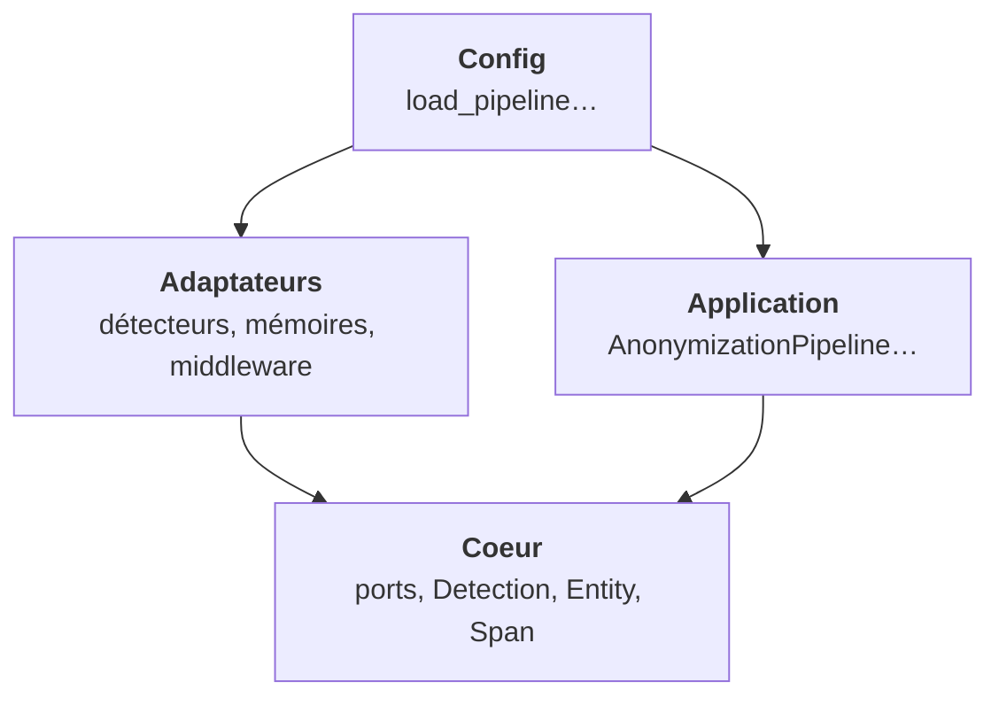
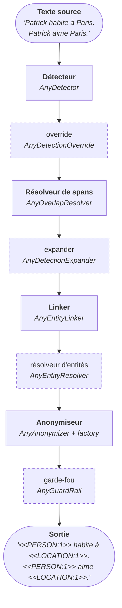
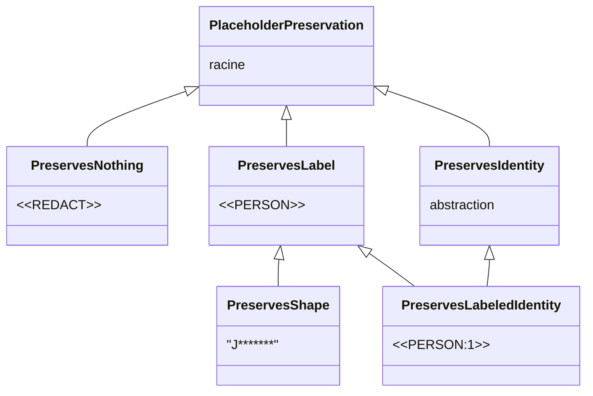
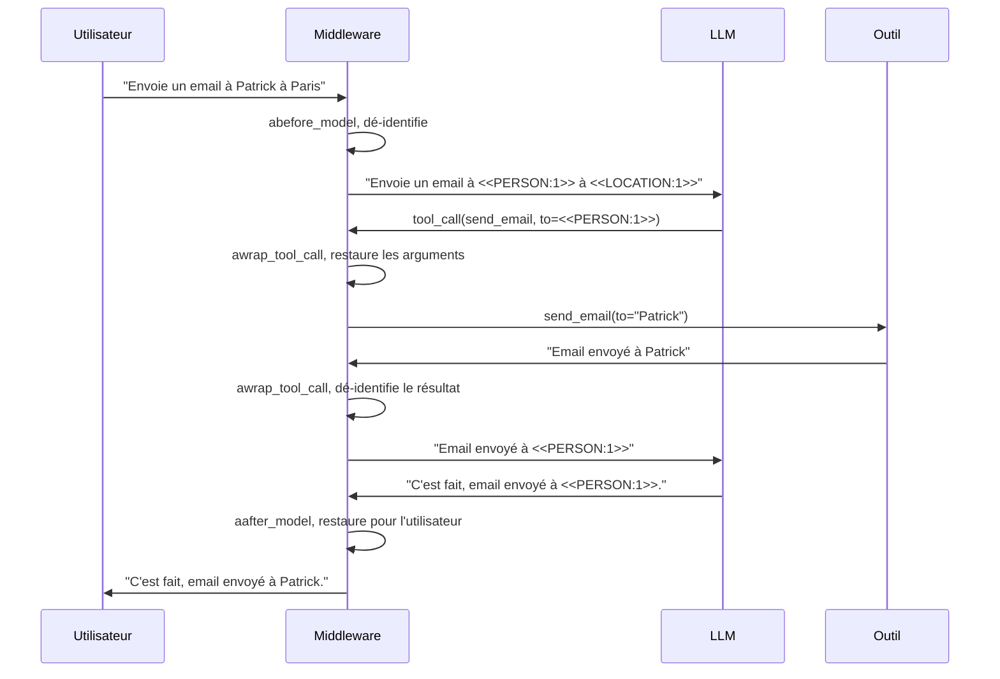

# Architecture

`piighost` suit une architecture hexagonale, aussi appelée ports et adaptateurs.
Le cœur ne connaît que des contrats abstraits, les **ports**. Chaque implémentation
concrète, un détecteur GLiNER2, un backend Redis, un middleware LangChain, est un
**adaptateur** qui satisfait un port sans que le cœur ne le connaisse. Le pipeline
de dé-identification s'assemble en injectant les adaptateurs voulus derrière les ports
qu'il attend.

!!! note "Dé-identification, pas anonymisation"
    Par défaut `piighost` garde le lien entre une valeur et son jeton, pour pouvoir
    restaurer la valeur. C'est de la dé-identification réversible, au sens du RGPD une
    pseudonymisation, et non de l'anonymisation. Le terme anonymisation reste réservé à
    une suppression irréversible, par exemple avec `RedactPlaceholderFactory`.

---

## Les trois anneaux

Le code se lit en trois anneaux, du plus abstrait au plus concret. Le sens des
dépendances est fixé une fois pour toutes. Un anneau extérieur importe un anneau
intérieur, et un anneau intérieur n'importe jamais un anneau extérieur.


```mermaid
flowchart TB
    CFG["`**Config**
    load_pipeline…`"]
    ADP["`**Adaptateurs**
    détecteurs, mémoires, middleware`"]
    APP["`**Application**
    AnonymizationPipeline…`"]
    CORE["`**Coeur**
    ports, Detection, Entity, Span`"]

    CFG --> ADP & APP
    ADP & APP --> CORE
```

*Trois anneaux et le point de composition. Les dépendances pointent toujours vers le
cœur.*
{ .figure-caption }

- **Coeur.** Les modèles de données (`Detection`, `Entity`, `Span`, des dataclasses
  gelées) et les ports. Aucune dépendance externe, pas de pydantic, pas d'I/O.
- **Application.** L'orchestration du pipeline, qui ne dépend que des ports du cœur.
  C'est là que vivent `anonymize`, `deanonymize` et `forget_thread`.
- **Adaptateurs.** Les implémentations concrètes des ports, c'est-à-dire les détecteurs, résolveurs,
  factories, gardes-fous, backends de mémoire, observation, client HTTP, middleware.
  Chaque adaptateur importe le cœur, jamais le contraire.
- **Config.** Le point de composition. C'est le seul endroit autorisé à connaître à la
  fois les ports et les adaptateurs concrets, pour les assembler.

---

## Ports et templates

Un port est un `Protocol` Python marqué `runtime_checkable`, dans le `base.py` de
chaque composant. Le typage y est **structurel**. Un objet satisfait le port dès qu'il
en a les méthodes, sans en hériter. Le pipeline dépend du port, jamais d'une classe
concrète.

```python
--8<-- "snippets/architecture_port.py:example"
```

Quand plusieurs adaptateurs d'un même port partagent un squelette, ce squelette vit
dans une classe `Base*`, une classe abstraite qui applique le patron de méthode
(Template Method). Le squelette est écrit une fois dans la classe de base, et chaque
sous-classe ne fournit que le pas qui varie.

```python
--8<-- "snippets/architecture_template.fr.py:example"
```

Cinq ports n'ont pas de template commun à tous leurs adaptateurs, ceux du détecteur, de
l'override, des gardes-fous, des backends de mémoire et du chiffrement. Leurs adaptateurs
diffèrent par tout leur mécanisme, pas par un seul pas, donc ils n'ont rien de commun à
factoriser. C'est l'exception assumée à la règle du template systématique.

Le détecteur est une exception partielle. Les détecteurs à modèle (`Gliner2Detector`,
`SpacyDetector`, `TransformersDetector`, `PresidioDetector`, `BridgeDetector`,
`LLMDetector`) partagent le template `BaseNERDetector`. Il relit le texte de chaque
détection dans la source, applique le seuil de confiance et traduit les labels.
`RegexDetector`, `ExactMatchDetector`, `CompositeDetector` et `ChunkedDetector`
implémentent le port directement.

---

## Les étapes du pipeline

`BaseAnonymizationPipeline` enchaîne les étapes de la détection au texte
dé-identifié. Seul le détecteur est un argument obligatoire du constructeur. Le
linking, la dé-identification et la résolution des chevauchements tournent toujours.
Quand on les omet, ils retombent sur des composants intégrés par défaut. Ces
composants sont un `ExactEntityLinker`, un `Anonymizer` doté d'une `LabelCounterPlaceholderFactory` et
un `ConfidenceOverlapResolver`. Les étapes override, expand, entity-resolve et guard
se comportent en passe-plat quand elles ne sont pas fournies.


```mermaid
flowchart TB
    classDef opt stroke-dasharray:5 5

    IN(["`**Texte source**
    _'Patrick habite à Paris.
    Patrick aime Paris.'_`"])

    DET["`**Détecteur**
    _AnyDetector_`"]
    OVR["`override
    _AnyDetectionOverride_`"]:::opt
    OVL["`**Résolveur de spans**
    _AnyOverlapResolver_`"]
    EXP["`expander
    _AnyDetectionExpander_`"]:::opt
    LINK["`**Linker**
    _AnyEntityLinker_`"]
    ENT["`résolveur d'entités
    _AnyEntityResolver_`"]:::opt
    ANON["`**Anonymiseur**
    _AnyAnonymizer + factory_`"]
    GUARD["`garde-fou
    _AnyGuardRail_`"]:::opt

    OUT(["`**Sortie**
    _'#lt;#lt;PERSON:1#gt;#gt; habite à #lt;#lt;LOCATION:1#gt;#gt;.
    #lt;#lt;PERSON:1#gt;#gt; aime #lt;#lt;LOCATION:1#gt;#gt;.'_`"])

    IN --> DET --> OVR --> OVL --> EXP --> LINK --> ENT --> ANON --> GUARD --> OUT
```

*Le pipeline. Les étapes toujours exécutées sont en gras, les étapes optionnelles ont un cadre en pointillé.*
{ .figure-caption }

La page [Conception du pipeline](conception.md) explique pourquoi chaque étape existe
et pourquoi elles s'enchaînent dans cet ordre. Voici le rôle et l'adaptateur par défaut de
chacune.

<div class="wide-table" markdown="1">

| Port | Adaptateurs fournis | Rôle |
|---|---|---|
| `AnyDetector` | `Gliner2Detector`, `Gliner2PiiDetector`, `SpacyDetector`, `TransformersDetector`, `PresidioDetector`, `BridgeDetector`, `LLMDetector`, `RegexDetector`, `ExactMatchDetector`, `CompositeDetector`, `ChunkedDetector` | Trouve les données confidentielles (données personnelles, secrets), renvoie des `Detection` positionnées et typées. |
| `AnyOverlapResolver` | `ConfidenceOverlapResolver`, `MergeOverlapResolver` | Arbitre les détections qui se chevauchent, garde la plus confiante ou leur union. |
| `AnyDetectionExpander` | `WordBoundaryExpander` | Rattrape les occurrences ratées d'une valeur déjà détectée. |
| `AnyEntityLinker` | `ExactEntityLinker` | Regroupe les détections d'une même valeur en une `Entity`. |
| `AnyEntityResolver` | `MergeEntityResolver`, `FuzzyEntityResolver`, `SeparateEntityResolver` | Réconcilie les entités qui partagent une détection. |
| `AnyAnonymizer` et `AnyPlaceholderFactory` | `Anonymizer` et `LabelCounterPlaceholderFactory` | Remplace chaque entité par son jeton. |
| `AnyGuardRail` | `DetectorGuardRail`, `Gliner2GuardRail`, `LLMGuardRail`, `ModerationGuardRail` | Re-vérifie la sortie, lève `PIIRemainingError` sur donnée confidentielle résiduelle. |

</div>

L'override (`AnyDetectionOverride`, adaptateur `DetectionOverride`) est un composant
serveur optionnel. Il applique une liste à masquer et une liste à laisser en clair à chaque
jeu de détections, juste après la détection, avant la résolution des spans.

---

## Le composant placeholder et ses tags de préservation

L'anonymiseur délègue la forme du jeton à une **placeholder factory**
(`AnyPlaceholderFactory`). Ce qui change entre deux factories, c'est **ce que le jeton
préserve** de la valeur d'origine.


```mermaid
classDiagram
    class PlaceholderPreservation {
        racine
    }
    class PreservesNothing {
        &lt;&lt;REDACT&gt;&gt;
    }
    class PreservesLabel {
        &lt;&lt;PERSON&gt;&gt;
    }
    class PreservesShape {
        "J*******"
    }
    class PreservesIdentity {
        abstraction
    }
    class PreservesLabeledIdentity {
        &lt;&lt;PERSON:1&gt;&gt;
    }

    PlaceholderPreservation <|-- PreservesNothing
    PlaceholderPreservation <|-- PreservesLabel
    PlaceholderPreservation <|-- PreservesIdentity
    PreservesLabel <|-- PreservesShape
    PreservesLabel <|-- PreservesLabeledIdentity
    PreservesIdentity <|-- PreservesLabeledIdentity
```

*Les tags de préservation, du jeton qui ne garde rien à celui qui identifie chaque
entité. Chaque flèche va d'un tag vers son parent et se lit "est un".*
{ .figure-caption }

Chaque tag est une sous-classe de `str`. Un jeton est donc une vraie chaîne qui porte
son niveau de préservation dans son propre type. Ces tags sont des types fantômes,
c'est-à-dire qu'ils n'existent que pour le vérificateur de types. Le middleware exige
un tag qui préserve l'identité (`PreservesRecognizableIdentity`). Brancher une factory
`<<PERSON>>` sur le middleware est donc une erreur détectée à la vérification de
types, pas une surprise à l'exécution.

Les factories fournies vont du moins au plus informatif. `RedactPlaceholderFactory`
émet `<<REDACT>>`{ .placeholder }, `LabelPlaceholderFactory` émet
`<<PERSON>>`{ .placeholder }, `LabelCounterPlaceholderFactory` émet
`<<PERSON:1>>`{ .placeholder }, `LabelHashPlaceholderFactory` émet
`<<PERSON:a1b2c3d4>>`{ .placeholder }. `MaskPlaceholderFactory` garde le premier caractère
et masque le reste, si bien que `Jonathan`{ .pii } devient `J*******`{ .placeholder }. Le détail est dans
[Fabriques de placeholders](placeholder-factories.md).

---

## Le pipeline mono-texte

`AnonymizationPipeline` traite un texte isolé. Il détecte, applique les étapes
optionnelles présentes, groupe en entités, dé-identifie, puis passe la sortie au
garde-fou. Sa méthode `deanonymize` reçoit le mapping jeton vers entité produit par
`anonymize` et restaure les valeurs.

```python
--8<-- "snippets/architecture_pipeline.py:example"
```

Le constructeur n'exige que le détecteur. Le linker et l'anonymiseur retombent par
défaut sur `ExactEntityLinker` et un `Anonymizer` doté d'une
`LabelCounterPlaceholderFactory`. Les autres étapes arrivent en argument nommé.

```python
--8<-- "snippets/architecture_signature.fr.py:example"
```

Omettre `overlap_resolver`, ou passer `None`, construit un `ConfidenceOverlapResolver`,
car l'étape de rendu a besoin de spans disjoints. Les étapes expand, entity-resolve,
guard et override restent désactivées quand elles valent `None`.

---

## Le pipeline conversationnel

`ThreadAnonymizationPipeline` partage le même socle mais ajoute une **mémoire de
conversation** (`AnyConversationMemory`), passée par l'argument nommé `memory`. Sans cet
argument, le pipeline construit une `InMemoryConversationMemory`. Un agent
enchaîne des messages, et le même `Patrick`{ .pii } doit garder le même
`<<PERSON:1>>`{ .placeholder } du premier au dernier.

Les jetons sont attribués sur **l'union des détections de tous les messages** de la
conversation, pas sur un message seul. Une valeur revue plus tard retrouve donc son jeton au
lieu d'en créer un nouveau. Le rendu, lui, reste par message. Seuls les spans du
message courant sont remplacés, parce que les détections de messages différents ne
partagent pas le même espace d'offsets.

```python
--8<-- "snippets/architecture_thread.py:example"
```

- Le `thread_id` est **obligatoire**. Il n'y a pas de conversation partagée par défaut.
  Deux appelants ne peuvent donc pas tomber dans la même conversation et fuiter leurs
  données confidentielles.
- `deanonymize` reconstruit les jetons de la conversation depuis la mémoire. Il restaure
  donc **n'importe quel** texte porteur de ces jetons, y compris une réponse du modèle
  que le pipeline n'a jamais dé-identifiée.
- `forget_thread` efface toute la mémoire d'une conversation et indique ce qui a été
  supprimé, pour le droit à l'oubli.

### La provenance des valeurs

Une valeur dont la première occurrence dans la conversation vient d'un message du modèle
n'est pas une donnée confidentielle de l'utilisateur. La dé-identifier priverait le modèle de sa connaissance du
monde. La mémoire enregistre donc le **rôle** de la première occurrence de chaque
valeur (`MessageRole.USER` ou `MessageRole.ASSISTANT`), et le pipeline laisse en clair
les valeurs introduites par l'assistant.

---

## La mémoire de conversation et le chiffrement

La mémoire est un **repository**, un port `AnyConversationMemory` avec trois
adaptateurs.

- `InMemoryConversationMemory` garde tout dans un dictionnaire du processus, borné par
  défaut. Simple, suffisant pour un seul worker.
- `RedisConversationMemory` persiste dans Redis, pour un déploiement multi-worker où
  chaque worker doit voir les conversations des autres.
- `SqlAlchemyConversationMemory` persiste dans une table SQL, pour des conversations
  longues qui survivent au processus.

Par nature, un backend persistant stocke des données confidentielles, parce qu'il garde
le mapping inverse, qui ramène chaque jeton à sa valeur. Deux composants **crypto**
optionnels, à fournir ensemble, le protègent sur Redis comme sur SQL. Un `AnyHasher`
(`Sha256Hasher`, `Argon2Hasher`) transforme chaque message en clé déterministe sans
révéler le texte. Un `AnyCipher` (`AesGcmCipher`) chiffre les détections au repos, de
sorte qu'une fuite de la base ne révèle ni le message ni les valeurs. Le `thread_id` reste
en clair, préfixe de clé dans Redis et colonne dans la table SQL, pour qu'une
conversation puisse être énumérée et oubliée.

---

## Le middleware LangChain

`PIIAnonymizationMiddleware` branche le pipeline conversationnel dans une boucle
d'agent LangChain. Il ne contient aucune logique de dé-identification, il délègue tout
au pipeline. C'est un adaptateur entre le monde LangChain et le cœur.


```mermaid
sequenceDiagram
    participant U as Utilisateur
    participant M as Middleware
    participant L as LLM
    participant T as Outil

    U->>M: "Envoie un email à Patrick à Paris"
    M->>M: abefore_model, dé-identifie
    M->>L: "Envoie un email à <<PERSON:1>> à <<LOCATION:1>>"
    L->>M: tool_call(send_email, to=<<PERSON:1>>)
    M->>M: awrap_tool_call, restaure les arguments
    M->>T: send_email(to="Patrick")
    T->>M: "Email envoyé à Patrick"
    M->>M: awrap_tool_call, dé-identifie le résultat
    M->>L: "Email envoyé à <<PERSON:1>>"
    L->>M: "C'est fait, email envoyé à <<PERSON:1>>."
    M->>M: aafter_model, restaure pour l'utilisateur
    M->>U: "C'est fait, email envoyé à Patrick."
```

*Le middleware intercepte la boucle d'agent en trois points.*
{ .figure-caption }

- `abefore_model` dé-identifie les messages avant que le LLM ne les voie.
- `aafter_model` restaure la sortie du modèle pour l'affichage utilisateur.
- `awrap_tool_call` traite l'appel d'outil selon la stratégie choisie
  (`ToolCallStrategy`), en restaurant les arguments pour que l'outil reçoive de vraies
  données, puis en dé-identifiant sa réponse.

Le type du middleware exige une factory qui préserve l'identité. À l'exécution, il
refuse aussi un pipeline dont les jetons n'ont pas de grammaire délimitée, comme un
masque (`UnrecognizableFactoryError`). Cette grammaire lui permet de
reconnaître les jetons que le modèle **invente** (`InventedPlaceholderStrategy`).
Après la restauration, tout jeton qui suit encore la grammaire des placeholders n'a
pas été émis par le pipeline. Le détail des stratégies d'outil est dans
[Stratégies d'appel outil](tool-call-strategies.md).

---

## L'observation

`piighost` émet une trace par étape du pipeline à travers un port
(`AnyObservationTracer`), une couture au-dessus d'OpenTelemetry. Sans backend configuré,
une implémentation no-op ne trace rien et ne coûte rien. Le pipeline peut donc toujours
émettre ses traces sans vérifier si le traçage est actif. Un `observation_redactor` optionnel
remplace les valeurs des traces par des jetons, pour un backend qui n'a pas le droit de
voir les données confidentielles.

---

## La config, point de composition

Un fichier TOML ou JSON décrit tout le pipeline. Le sous-système config le lit avec
pydantic-settings et le convertit en modèles de config. Ces modèles sont des unions
discriminées, où chaque type de composant porte une méthode `build()`. Assembler le pipeline revient à
appeler `build()` sur chaque modèle.

```python
--8<-- "snippets/loaders.py"
```

Un fichier sans section `[memory]` construit un pipeline. Un fichier qui déclare une section `[memory]` construit un pipeline de conversation. Chaque chargeur refuse le fichier destiné à l'autre. `load_pipeline` refuse un fichier avec `[memory]`, et `load_thread_pipeline` un fichier sans.

Le couplage est à sens unique. La config dépend du cœur et des adaptateurs, mais le
cœur n'importe jamais la config. Ajouter un composant, c'est écrire un adaptateur, un modèle
de config avec `build()`, et rien d'autre. Le pipeline ne change pas.

---

## Modèles de données

Tous les modèles du cœur sont des **dataclasses gelées**, immuables donc partageables
entre coroutines sans risque.

| Modèle | Champs clés |
|---|---|
| `Detection` | `text`, `label`, `span: Span`, `confidence` |
| `Entity` | `detections: tuple[Detection, ...]`, `label` et `text` en propriété |
| `Span` | `start`, `end`, `overlaps()`, `extract()` |

---

## Voir aussi

- [Conception du pipeline](conception.md) : pourquoi chaque étape existe et dans quel ordre.
- [Fabriques de placeholders](placeholder-factories.md) : les familles de jetons et ce qu'elles préservent.
- [Stratégies d'appel outil](tool-call-strategies.md) : le détail de `awrap_tool_call`.
- [Étendre piighost](extending.md) : brancher son propre adaptateur derrière un port.
- [Référence des modèles de données](reference/models.md) : les champs, méthodes et validations de `Detection`, `Entity`, `Span` et `Chunk`.
