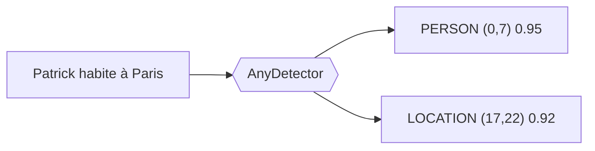
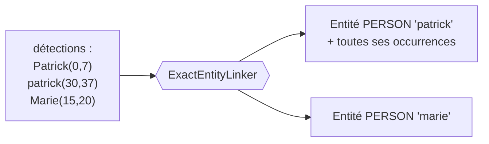
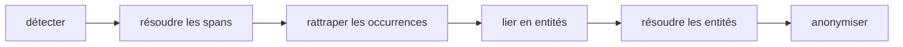
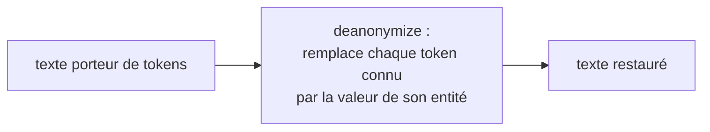

# Conception du pipeline

Une fois admis qu'il faut dé-identifier (voir [Pourquoi dé-identifier ?](why-anonymize.md)),
reste le comment. Cette page le construit pas à pas. On part de la première brique,
détecter les données sensibles, et on ajoute une contrainte à la fois. Chaque composant
du pipeline apparaît parce qu'une contrainte précédente l'a rendu nécessaire. À la fin,
l'ordre des étapes et les choix techniques ne sont plus arbitraires, ils découlent du
problème.

!!! note "Dé-identification, pas anonymisation"
    `piighost` garde le lien entre une valeur et son token pour pouvoir la restaurer.
    C'est de la dé-identification réversible. On réserve le mot anonymisation à une
    suppression irréversible, par exemple avec `RedactPlaceholderFactory`.

!!! note "Pour la vue d'ensemble"
    Cette page explique le pourquoi. Pour la carte des couches et l'API de chaque
    composant, voir [Architecture](architecture.md).

---

## Étape 1, savoir quoi remplacer, le détecteur

Dé-identifier, c'est remplacer une valeur sensible par un *placeholder*, c'est-à-dire le
*token* qui prend sa place dans le texte. Sur un texte libre, on ne sait pas d'avance où
sont les PII ni de quel type. La première brique est donc la détection.

Deux approches classiques se complètent.

- La **regex** reconnaît des motifs, c'est-à-dire des chaînes de caractères qui suivent
  une structure fixe (IBAN, téléphone, e-mail). Efficace sur ces formats, inutilisable
  sur du texte non structuré comme un prénom, un nom, une date écrite ou un lieu.
- Le **NER** (Named Entity Recognition) est un modèle d'IA qui, sur un texte, classe les
  mots selon une classification décidée à l'avance (nom, prénom, lieu, organisation). Il
  saisit le contexte là où la regex ne voit qu'un format.

C'est le rôle du détecteur (`AnyDetector`). Il lit le texte et renvoie une liste de
détections, une par PII trouvée, avec sa position, son type et un score de confiance.



*Le détecteur transforme un texte brut en détections positionnées et typées.*
{ .figure-caption }

`piighost` fournit ces approches comme détecteurs interchangeables, `Gliner2Detector`,
`SpacyDetector`, `TransformersDetector` pour le NER, `RegexDetector` pour les motifs,
`LLMDetector` quand le contexte métier dépasse les détecteurs étroits, et
`ExactMatchDetector` pour les tests. On peut les combiner avec `CompositeDetector`, une
regex plus un NER couvrent plus de cas qu'un seul. C'est pour cela que le détecteur est
un port et non une classe figée, on injecte celui qu'on veut.

La regex ne valide **aucun checksum**. Un IBAN ou un numéro de carte reconnu par le
motif est gardé tel quel, sans contrôle de clé de contrôle. Une valeur abîmée par un OCR
reste ainsi une détection plutôt que d'être écartée par un calcul qui échoue sur le
bruit. Mieux vaut une détection de trop, arbitrée plus tard, qu'une PII laissée en
clair.

---

## Étape 2, dire de quel type il s'agit, le placeholder typé

Avec la détection, on connaît le type de chaque PII. Le placeholder le plus simple
serait un token constant, le même pour tout, comme `<<REDACT>>`{ .placeholder }. On
l'enrichit avec le type, `<<PERSON>>`{ .placeholder } ou `<<EMAIL>>`{ .placeholder }.

Pourquoi est-ce utile. Parce que le modèle qui lit le texte dé-identifié a besoin du
type pour raisonner. « Contacte `<<PERSON>>`{ .placeholder } à
`<<EMAIL>>`{ .placeholder } » reste exploitable, « Contacte `<<REDACT>>`{ .placeholder }
à `<<REDACT>>`{ .placeholder } » ne l'est plus.

La placeholder factory (`AnyPlaceholderFactory`) décide de la forme du token. Elle prend
une entité et rend son token. C'est elle qu'on change pour passer de
`<<REDACT>>`{ .placeholder } à `<<PERSON>>`{ .placeholder }.

---

## Étape 3, distinguer les individus, l'entité et son identité

Un texte peut citer deux personnes différentes. Si les deux deviennent
`<<PERSON>>`{ .placeholder }, le modèle ne peut plus les distinguer, et on ne peut plus
revenir en arrière sans ambiguïté. Il faut donc une identité par individu.

```text
Patrick écrit à Marie  →  <<PERSON:1>> écrit à <<PERSON:2>>
```

`Patrick`{ .pii } devient `<<PERSON:1>>`{ .placeholder }, `Marie`{ .pii } devient
`<<PERSON:2>>`{ .placeholder }. Le compteur distingue les individus du même type.

Mais une même personne apparaît souvent plusieurs fois, parfois orthographiée
différemment (« Patrick », « patrick »). Toutes ces occurrences doivent partager le même
token. Une détection isolée ne suffit donc pas. Il faut une notion au-dessus, l'entité,
qui regroupe toutes les détections désignant la même PII.

D'où une nouvelle étape, passer des détections aux entités. C'est le linker
(`AnyEntityLinker`). `ExactEntityLinker` groupe les détections par clé canonique
`(texte en minuscules, label)`, une entité par clé.



*Le linker regroupe les détections d'une même PII en une entité, qui recevra un token
unique.*
{ .figure-caption }

C'est l'entité, pas la détection, qui reçoit un token. Toutes les occurrences d'une
entité partagent donc le même `<<PERSON:1>>`{ .placeholder }.

---

## Étape 4, rattraper les occurrences ratées, l'expander

Le linker ne groupe que les détections **qu'on lui donne**. Or un NER rate des
occurrences. Il trouve `Patrick`{ .pii } dans la phrase 1, mais rate le `Patrick`{ .pii }
tout seul de la phrase 3. Si on s'arrête au linker, cette occurrence reste en clair dans
le texte dé-identifié.

Rattraper les occurrences ratées est un travail à part, celui de l'expander
(`AnyDetectionExpander`). `WordBoundaryExpander` cherche, pour chaque valeur déjà
détectée, ses autres occurrences dans le texte par recherche aux frontières de mot, et
ajoute une détection pour chacune.

On sépare l'expander du linker à dessein. Le linker regroupe, l'expander cherche. Chacun
a une seule responsabilité, et l'expander reste optionnel, un jeu de détections déjà
complet n'en a pas besoin.

---

## Étape 5, arbitrer les détections qui se contredisent, le résolveur de spans

Dès qu'on combine des détecteurs, ou qu'un détecteur trouve plusieurs candidats sur la
même zone, des détections se chevauchent. Exemple classique, un NER propose `LOCATION`
sur « Paris » et un autre `PERSON` sur la même position, ou deux modèles donnent des
bornes légèrement différentes.

Si on laissait passer ces chevauchements jusqu'au remplacement, on produirait des tokens
imbriqués et un texte corrompu. Il faut donc résoudre les conflits de positions avant de
regrouper en entités.

C'est le résolveur de spans (`AnyOverlapResolver`). `ConfidenceOverlapResolver` groupe
les détections qui se chevauchent, puis garde dans chaque groupe la plus confiante.

L'ordre des étapes est contraint.



*Les positions se résolvent avant le linking, les identités après.*
{ .figure-caption }

On résout les positions tôt, sur des détections encore brutes, puis on rattrape les
occurrences ratées, puis on groupe en entités, et on résout les identités en dernier
(voir l'étape suivante).

---

## Étape 6, fusionner les entités équivalentes, le résolveur d'entités

Après le linking, deux entités peuvent encore désigner la même personne, par exemple
« Patrick » et « Patric » (faute de frappe), ou provenir de détecteurs différents qui
partagent une détection. Les réconcilier évite de donner deux tokens à une seule
personne.

C'est le résolveur d'entités (`AnyEntityResolver`).

- `MergeEntityResolver` fusionne les entités qui partagent une détection (union-find,
  transitif).
- `FuzzyEntityResolver` fusionne par similarité de texte (Jaro-Winkler), pour rattraper
  les variantes orthographiques.
- `SeparateEntityResolver` fait l'inverse, il sépare des entités qui n'auraient pas dû
  se confondre.

À ce stade, on a une liste d'entités propres, chacune devant recevoir un token unique et
stable.

---

## Étape 7, produire le texte, l'anonymiseur

L'anonymiseur (`AnyAnonymizer`) applique enfin le remplacement. Il demande un token à la
factory pour chaque entité, puis remplace chaque détection par son token.

Conséquence de l'étape 5, le remplacement par positions se fait de droite à gauche, pour
que remplacer une zone ne décale pas les positions des zones encore à traiter. Cela
suppose des spans non chevauchants, ce que l'étape 5 garantit.

---

## Étape 8, revenir en arrière, la déanonymisation

Dé-identifier ne sert que si l'on peut restaurer les vraies valeurs pour l'utilisateur.
Pour cela il faut savoir que `<<PERSON:1>>`{ .placeholder } valait `Patrick`{ .pii }.
L'anonymisation d'un texte rend justement ce mapping, une entité par token émis.

La restauration remplace, dans un texte, chaque token connu par la valeur de son entité.
Elle ne se limite pas au texte que le pipeline a produit. Le modèle génère souvent une
réponse nouvelle contenant un token, par exemple « Bien sûr,
`<<PERSON:1>>`{ .placeholder } ! ». Cette phrase n'a jamais été produite par le pipeline,
mais comme on connaît le couple token vers valeur, on remplace le token dans n'importe
quel texte.



*La déanonymisation remplace les tokens connus par leur valeur, dans n'importe quel
texte.*
{ .figure-caption }

La restauration n'est sans ambiguïté que si les tokens préservent l'identité. Deux
entités qui partageraient un token, comme avec `<<PERSON>>`{ .placeholder }, se
confondraient sur une seule valeur. C'est pourquoi le mode réversible impose une factory
qui identifie chaque entité, `<<PERSON:1>>`{ .placeholder } et non
`<<PERSON>>`{ .placeholder }.

---

## Étape 9, la conversation, mémoire et cohérence des compteurs

Tout ce qui précède traite un texte, isolément. Un agent, lui, enchaîne des messages, et
le même `Patrick`{ .pii } doit garder le même `<<PERSON:1>>`{ .placeholder } du premier
au dernier.

### Pourquoi rejouer le pipeline par message ne suffit pas

La tentation est de rappeler simplement `anonymize` sur chaque message. Mais le pipeline
mono-texte n'a aucune mémoire. Il repart de zéro à chaque appel, et le compteur
recommence à 1. Sur deux messages, on obtiendrait ceci.

```text
Message 1 : "Patrick appelle Marie"   →  <<PERSON:1>> appelle <<PERSON:2>>
Message 2 : "Marie rappelle Patrick"  →  <<PERSON:1>> rappelle <<PERSON:2>>
```

`Marie`{ .pii } est `<<PERSON:2>>`{ .placeholder } au message 1 puis
`<<PERSON:1>>`{ .placeholder } au message 2. Les identités se croisent, et plus rien
n'est réversible de façon cohérente sur le fil. Une conversation porte donc un état
partagé d'un message au suivant.

### La mémoire de conversation

`ThreadAnonymizationPipeline` ajoute cet état, une mémoire (`AnyConversationMemory`) qui
persiste, par thread, les détections de chaque message. Les tokens sont ensuite
attribués sur l'union des détections de tous les messages du thread, pas sur un message
seul. Une personne revue dans un message ultérieur retrouve donc son entité, et son
token, au lieu d'en créer un nouveau.

```text
Message 1 : "Patrick appelle Marie"   →  <<PERSON:1>> appelle <<PERSON:2>>
   mémoire : patrick→1, marie→2
Message 2 : "Marie rappelle Patrick"  →  <<PERSON:2>> rappelle <<PERSON:1>>
   (réutilise la mémoire, aucun nouveau compteur)
```

### Les règles qui en découlent

- **Ordre figé au premier vu.** Le compteur d'une entité est attribué à sa première
  apparition dans la conversation et ne bouge plus. Sans cette règle, une nouvelle
  entité tôt dans son message volerait le compteur d'une plus ancienne.
- **Isolation par `thread_id`.** Le `thread_id` est obligatoire, il n'y a pas de thread
  partagé par défaut, pour que deux appelants ne tombent pas dans le même fil et ne
  fuitent pas leurs PII. `forget_thread` peut tout effacer d'un fil, pour le droit à
  l'oubli.

### Le rendu reste par message

Les détections d'une entité viennent de messages différents, dont les positions n'ont
pas de référentiel commun. On ne peut donc pas remplacer par positions à l'échelle du
thread. Les tokens sont attribués sur tout le thread, mais le rendu ne remplace que les
spans du message courant, ceux dont les offsets valent dans ce message.

---

## Étape 10, la provenance des valeurs

Toute valeur d'un message n'est pas de la PII à protéger. Si le modèle mentionne une
personnalité publique de sa connaissance du monde, la tokeniser la lui cacherait au tour
suivant, sans rien protéger de l'utilisateur.

La mémoire enregistre donc le rôle de la première occurrence de chaque valeur,
`MessageRole.USER` ou `MessageRole.ASSISTANT`. Une valeur dont la première occurrence
vient d'un message du modèle est laissée en clair, car elle n'est pas une PII
utilisateur. Le middleware règle ce comportement par `AssistantEntityStrategy`,
préserver, dé-identifier quand même, ou ignorer les messages du modèle.

---

## Étape 11, pourquoi tout est asynchrone

Le pipeline est asynchrone de bout en bout, pour deux raisons concrètes.

- **La mémoire persistante est un service externe.** Un backend Redis lit et écrit sur
  le réseau. Le faire en asynchrone évite de bloquer pendant l'attente.
- **Un serveur sert plusieurs requêtes à la fois.** Une API qui héberge le pipeline
  traite des conversations concurrentes sur une seule boucle d'événements.

Mais l'inférence d'un modèle NER local est, elle, synchrone et lourde, des centaines de
millisecondes de calcul CPU ou GPU. Appelée directement dans une coroutine, elle gèle
toute la boucle, aucune autre requête ne progresse pendant ce temps. La détection modèle
est donc à déporter dans un thread. Un détecteur qui appelle une API distante, lui,
reste en asynchrone natif, c'est de l'I/O réseau et non du calcul.

En résumé, asynchrone pour l'I/O et l'orchestration, déport en thread pour le calcul
bloquant.

---

## Étape 12, chiffrer le mapping inverse

Sur un seul worker, la mémoire tient dans un dictionnaire du processus
(`InMemoryConversationMemory`). Un déploiement multi-worker en a besoin d'une partagée,
`RedisConversationMemory`, pour qu'un worker voie les threads d'un autre.

Mais le mapping inverse est de la PII en clair. Une fuite du store la révélerait. Deux
composants crypto protègent le backend Redis. Un hasher (`AnyHasher`) transforme chaque
message en clé déterministe sans révéler le texte. Un cipher (`AnyCipher`) chiffre les
détections au repos, de sorte qu'une fuite de la base ne rende ni le message ni la PII.
Le `thread_id` reste en clair comme préfixe de clé, pour qu'un thread puisse être
énuméré et oublié.

---

## Étape 13, le garde-fou, défense en profondeur

Même avec tout ce qui précède, une PII peut passer entre les mailles, par exemple un nom
que le NER a raté. Le garde-fou (`AnyGuardRail`) re-analyse le texte dé-identifié et lève
`PIIRemainingError` s'il y trouve encore une PII en clair.

Le garde-fou n'examine que la sortie dé-identifiée. Les placeholders qu'elle porte sont
clairement synthétiques, donc un contrôle prévu pour de la vraie PII ne les prend pas
pour telle. Le garde-fou est optionnel mais c'est la dernière barrière avant la sortie.
`DetectorGuardRail` rejoue un détecteur, `LLMGuardRail` et `ModerationGuardRail`
interrogent un modèle externe.

---

## Étape 14, raccorder au monde agent, le middleware

Reste à brancher tout cela dans une boucle d'agent LangChain, de façon transparente.
C'est le `PIIAnonymizationMiddleware`, qui intervient en trois points.

- Avant le modèle (`abefore_model`), il dé-identifie les messages avant que le LLM ne
  les voie.
- Après le modèle (`aafter_model`), il restaure la sortie pour l'affichage utilisateur.
- Autour des appels outils (`awrap_tool_call`), selon la stratégie choisie
  (`ToolCallStrategy`), il restaure les arguments pour que l'outil reçoive de vraies
  données, puis ré-identifie sa réponse.

Le middleware ne contient aucune logique de dé-identification, il délègue tout au
pipeline conversationnel. C'est un simple adaptateur entre le monde LangChain et le
coeur. Il exige au type une factory qui préserve l'identité, et il reconnaît les tokens
que le modèle invente (`InventedPlaceholderStrategy`), car après restauration tout token
qui suit encore la grammaire des placeholders n'a pas été émis par le pipeline.

---

## Récapitulatif, chaque composant répond à une contrainte

<div class="wide-table" markdown="1">

| Contrainte rencontrée | Composant né de la contrainte |
|---|---|
| On ne sait pas où sont les PII | Détecteur (`AnyDetector`) |
| Le modèle a besoin du type | Placeholder typé (`AnyPlaceholderFactory`) |
| Distinguer deux individus du même type | Identité par entité et linker (`AnyEntityLinker`) |
| Occurrences ratées par le détecteur | Expander (`AnyDetectionExpander`) |
| Détections qui se chevauchent | Résolveur de spans (`AnyOverlapResolver`) |
| Entités équivalentes à fusionner | Résolveur d'entités (`AnyEntityResolver`) |
| Produire le texte sans corruption | Anonymiseur, remplacement droite à gauche |
| Revenir en arrière sur un texte quelconque | `deanonymize`, remplacement token par token |
| Cohérence sur toute la conversation | Mémoire par `thread_id`, ordre first-seen |
| Valeur venant du modèle, pas de l'utilisateur | Provenance en mémoire (`MessageRole`) |
| I/O sans bloquer et calcul lourd | Asynchrone et déport en thread de l'inférence |
| Mapping inverse persistant à protéger | Crypto, hasher et cipher du backend Redis |
| PII résiduelle | Garde-fou (`AnyGuardRail`) |
| Intégration agent transparente | Middleware LangChain |

</div>

---

## Voir aussi

- [Architecture](architecture.md), la carte des couches et l'API de chaque composant
- [Placeholder factories](placeholder-factories.md), les familles de tokens et ce
  qu'elles préservent
- [Stratégies d'appel outil](tool-call-strategies.md), le détail de `awrap_tool_call`
