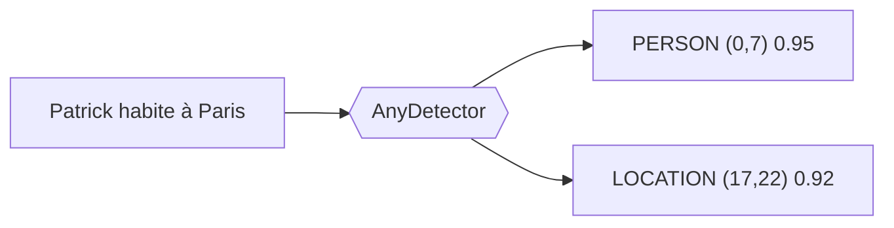
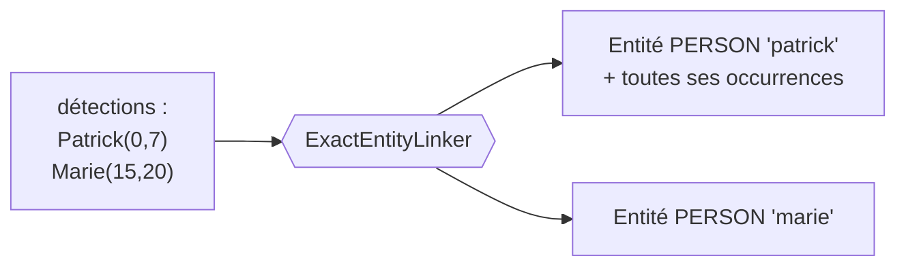
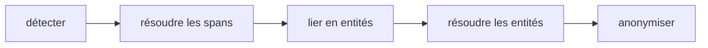
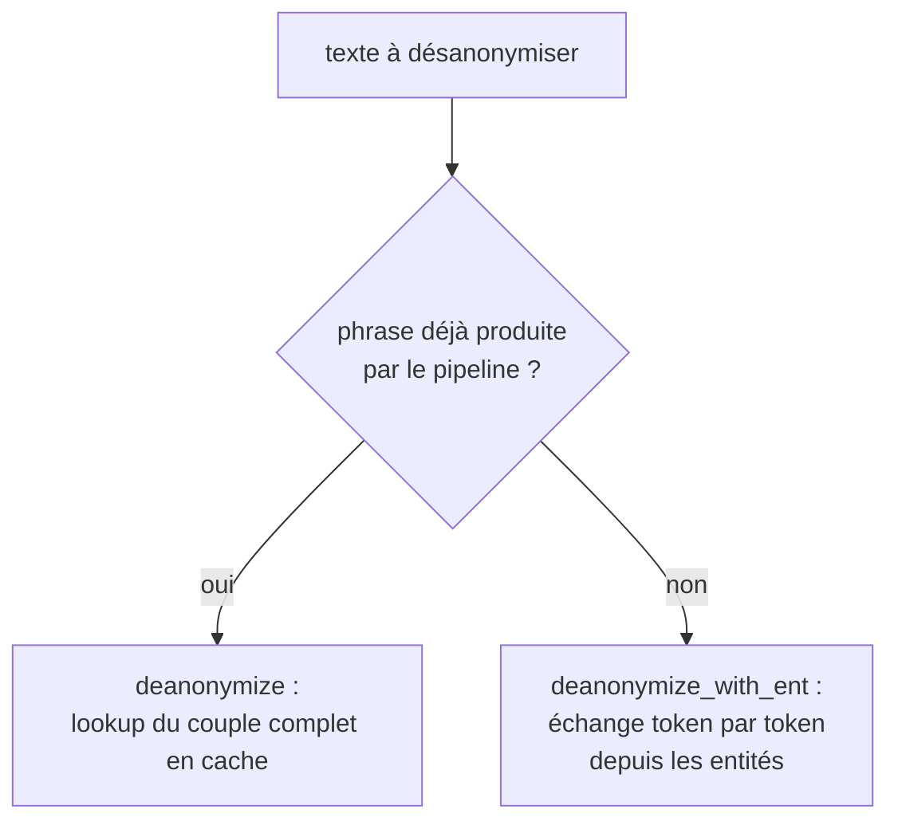

# Conception du pipeline

Une fois admis qu'il faut anonymiser (voir [Pourquoi anonymiser ?](why-anonymize.md)),
reste le **comment**. Cette page le construit pas à pas. On part de la première
brique, détecter les données sensibles, et on ajoute une contrainte à la fois. Chaque
composant du pipeline apparaît parce qu'une contrainte précédente l'a rendu
nécessaire. À la fin, l'ordre des étapes et les choix techniques (synchrone vs
asynchrone, deux mécanismes de déanonymisation, mémoire par conversation) ne sont
plus arbitraires, ils découlent du problème.

!!! note "Pour la vue d'ensemble"
    Cette page est narrative. Pour la carte des couches et l'API de chaque
    composant, voir [Architecture](architecture.md).

---

## Étape 1 : savoir *quoi* remplacer, le détecteur

Anonymiser, c'est remplacer une valeur sensible par un *placeholder*, c'est-à-dire le
*token* qui prend sa place dans le texte anonymisé. Sur un texte libre, on ne sait pas
d'avance où sont les PII ni de quel type. La première brique est donc la **détection**.

Deux approches classiques se complètent :

- la **regex** reconnaît des **motifs**, c'est-à-dire des chaînes de caractères qui
  suivent une structure fixe (IBAN, téléphone, e-mail). Efficace sur ces formats,
  mais inutilisable sur du texte non structuré comme un prénom, un nom, une date
  écrite ou un lieu ;
- le **NER** (Named Entity Recognition) est un **modèle d'IA** qui, sur un texte,
  classe les mots selon une classification décidée à l'avance (nom, prénom, lieu,
  organisation). Il saisit le contexte là où la regex ne voit qu'un format.

C'est le rôle du **détecteur** (`AnyDetector`). Il lit le texte et renvoie une liste
de **détections**, une par PII trouvée, avec sa position, son type et un score de
confiance.



*Le détecteur transforme un texte brut en détections positionnées et typées.*
{ .figure-caption }

PIIGhost fournit ces approches comme détecteurs interchangeables :

- **NER** : `Gliner2Detector`, `SpacyDetector`, `TransformersDetector` ;
- **regex** : `RegexDetector`, avec en option un validateur de checksum (Luhn,
  mod-97) qui écarte les faux positifs ;
- **LLM** : `LLMDetector`, quand le contexte métier dépasse les détecteurs étroits.

On peut les combiner (`CompositeDetector`) : une regex plus un NER couvrent plus de
cas qu'un seul. C'est pour cela que le détecteur est un **protocole** et non une
classe figée, on injecte celui qu'on veut.

---

## Étape 2 : dire *de quel type* il s'agit, le placeholder typé

Avec la détection, on connaît le type de chaque PII. Le placeholder le plus simple
serait un token constant, le même pour tout, comme `<<REDACT>>`{ .placeholder }. On
l'enrichit avec le type : `<<PERSON>>`{ .placeholder } ou `<<EMAIL>>`{ .placeholder }.

Pourquoi est-ce utile ? Parce que le modèle qui lit le texte anonymisé a besoin du
**type** pour raisonner. « Contacte `<<PERSON>>`{ .placeholder } à
`<<EMAIL>>`{ .placeholder } » reste exploitable ; « Contacte `<<REDACT>>`{ .placeholder }
à `<<REDACT>>`{ .placeholder } » ne l'est plus.

La **placeholder factory** (`AnyPlaceholderFactory`) décide de la forme du placeholder.
Elle prend une entité et rend son token. C'est elle qu'on change pour passer de
`<<REDACT>>`{ .placeholder } à `<<PERSON>>`{ .placeholder }.

---

## Étape 3 : distinguer les individus, l'entité et son identité

Un texte peut citer **deux personnes différentes**. Si les deux deviennent
`<<PERSON>>`{ .placeholder }, le modèle ne peut plus les distinguer, et on ne peut
plus revenir en arrière sans ambiguïté. Il faut donc une **identité** par individu :

```text
Patrick écrit à Marie  →  <<PERSON:1>> écrit à <<PERSON:2>>
```

`Patrick`{ .pii } devient `<<PERSON:1>>`{ .placeholder }, `Marie`{ .pii } devient
`<<PERSON:2>>`{ .placeholder }. Le compteur distingue les individus du même type.

Mais une même personne apparaît souvent **plusieurs fois**, parfois orthographiée
différemment (« Patrick », « patrick »). Toutes ces occurrences doivent partager
**le même** token. Une détection isolée ne suffit donc pas. Il faut une notion
au-dessus, l'**entité**, qui regroupe toutes les détections désignant la même PII.

D'où une nouvelle étape, passer des détections aux entités. C'est le **linker**
(`AnyEntityLinker`). `ExactEntityLinker` :

1. **étend** chaque détection en cherchant ses autres occurrences dans le texte
   (« Patrick » trouvé une fois est recherché partout) ;
2. **groupe** les détections de même clé canonique `(texte en minuscules, label)`
   en une seule entité.



*Le linker regroupe les détections d'une même PII en une entité, qui recevra un
token unique.*
{ .figure-caption }

C'est l'entité, pas la détection, qui reçoit un token. Toutes les occurrences d'une
entité partagent donc le même `<<PERSON:1>>`{ .placeholder }.

---

## Étape 4 : arbitrer les détections qui se contredisent, le résolveur de spans

Dès qu'on combine des détecteurs, ou qu'un détecteur trouve plusieurs candidats sur
la même zone, des détections **se chevauchent**. Exemple classique : un NER propose
`LOCATION` sur « Paris » et `PERSON` sur la même position, ou deux modèles donnent
des bornes légèrement différentes.

Si on laissait passer ces chevauchements jusqu'au remplacement, on produirait des
tokens imbriqués et un texte corrompu. Il faut donc **résoudre les conflits de
positions avant** de regrouper en entités.

C'est le **résolveur de spans** (`AnySpanConflictResolver`).
`ConfidenceSpanConflictResolver` garde, sur chevauchement, la détection de plus
haute confiance ; à confiance égale, la plus **longue** (la plus spécifique). Cette
règle « le plus long gagne » évite qu'un « Jean » détecté à l'intérieur de
« Jean-Pierre » n'évince l'entité complète.

L'ordre des étapes est contraint :



*Les positions se résolvent avant le linking ; les identités se résolvent après.*
{ .figure-caption }

On résout les **positions** avant le linking (on veut des détections propres à
étendre), et les **identités** après (voir l'étape suivante).

---

## Étape 5 : fusionner les entités équivalentes, le résolveur d'entités

Après le linking, deux entités peuvent encore désigner la même personne, par exemple
« Patrick » et « Patric » (faute de frappe), ou provenir de détecteurs différents qui
partagent une détection. Les fusionner évite de donner deux tokens à une seule
personne.

C'est le **résolveur d'entités** (`AnyEntityConflictResolver`) :

- `MergeEntityConflictResolver` fusionne les entités qui partagent une détection
  (union-find, transitif) ;
- `FuzzyEntityConflictResolver` fusionne par similarité de texte (Jaro-Winkler), pour
  rattraper les variantes orthographiques.

À ce stade, on a une liste d'entités propres, chacune devant recevoir un token unique
et stable.

---

## Étape 6 : produire le texte, l'anonymiseur

L'**anonymiseur** (`AnyAnonymizer`) applique enfin le remplacement. Il demande un
token à la factory pour chaque entité, puis remplace chaque détection par son token.

Conséquence de l'étape 4 : le remplacement par positions se fait **de droite à
gauche**, pour que remplacer une zone ne décale pas les positions des zones encore à
traiter. Cela suppose des spans non chevauchants, ce que l'étape 4 garantit.

---

## Étape 7 : revenir en arrière, la déanonymisation à deux voies

Anonymiser ne sert que si l'on peut **désanonymiser**, c'est-à-dire restaurer les
vraies valeurs pour l'utilisateur. Pour cela il faut savoir que
`<<PERSON:1>>`{ .placeholder } valait `Patrick`{ .pii }. Il y a deux situations, donc
deux mécanismes.

**Voie 1, la phrase entière est connue (`deanonymize`).**
Quand le pipeline a transformé « Patrick habite Paris » en
« `<<PERSON:1>>` habite `<<LOCATION:1>>` », il **mémorise le couple complet** dans
le cache. Si on lui redonne exactement cette phrase anonymisée, il retrouve
l'original d'un seul coup. Rapide et exact, mais limité à une phrase **déjà produite**
par le pipeline.

**Voie 2, une phrase nouvelle (`deanonymize_with_ent`).**
Le modèle génère une réponse **nouvelle** contenant un token, par exemple « Bien sûr,
`<<PERSON:1>>`{ .placeholder } ! ». Cette phrase n'a jamais été produite par le
pipeline, donc la voie 1 ne la trouve pas. Mais on connaît les couples
token ↔ valeur des entités de la conversation ; on remplace alors chaque token connu
par sa valeur, dans **n'importe quel** texte.



*Deux voies pour deux situations : retrouver une phrase connue en bloc, ou échanger
les tokens un par un dans une phrase quelconque.*
{ .figure-caption }

Le middleware essaie la voie 1 (exacte, peu coûteuse) et retombe sur la voie 2 en cas
d'échec. Ce fallback est essentiel. Un texte porteur de tokens mais absent du cache
doit pouvoir être restauré depuis la mémoire plutôt que rendu tel quel avec ses
tokens.

---

## Étape 8 : la conversation, mémoire et cohérence des compteurs

Tout ce qui précède traite **un** texte, isolément. Un agent, lui, enchaîne des
messages, et le même `Patrick`{ .pii } doit garder le même
`<<PERSON:1>>`{ .placeholder } du premier au dernier.

### Pourquoi rejouer le pipeline par message ne suffit pas

La tentation est de rappeler simplement `anonymize` sur chaque message. Mais le
pipeline mono-texte n'a aucune mémoire. Il repart de zéro à chaque appel, et le
compteur recommence à 1. Sur deux messages, on obtiendrait :

```text
Message 1 : "Patrick appelle Marie"   →  <<PERSON:1>> appelle <<PERSON:2>>
Message 2 : "Marie rappelle Patrick"  →  <<PERSON:1>> rappelle <<PERSON:2>>
```

`Marie`{ .pii } est `<<PERSON:2>>`{ .placeholder } au message 1 puis
`<<PERSON:1>>`{ .placeholder } au message 2. Les identités se croisent, et plus rien
n'est réversible de façon cohérente sur le fil. Une conversation porte donc un
**état partagé** d'un message au suivant.

### La mémoire de conversation

Le `ThreadAnonymizationPipeline` ajoute cet état, une **mémoire** qui accumule les
entités vues, dédupliquées par identité canonique `(texte en minuscules, label)`.
À chaque message, les entités détectées sont d'abord **liées à celles déjà connues**
(cross-message linking) avant d'être rendues. Une personne revue dans un message
ultérieur retrouve donc son entité, et son token, au lieu d'en créer un nouveau.

```text
Message 1 : "Patrick appelle Marie"   →  <<PERSON:1>> appelle <<PERSON:2>>
   mémoire : patrick→1, marie→2
Message 2 : "Marie rappelle Patrick"  →  <<PERSON:2>> rappelle <<PERSON:1>>
   (réutilise la mémoire, aucun nouveau compteur)
```

### Les deux règles qui en découlent

- **Ordre figé au premier vu** (*first-seen*). Le compteur d'une entité est attribué
  à sa **première** apparition dans la conversation et ne bouge plus. Si « Patrick »
  apparaît au message 1, il garde `<<PERSON:1>>`{ .placeholder } même si une autre
  personne apparaît plus tôt dans un message suivant. Sans cette règle, une nouvelle
  entité tôt dans son message volerait le compteur d'une plus ancienne.
- **Isolation par `thread_id`.** Mémoire et clés de cache sont préfixées par
  conversation, pour qu'un backend partagé (Redis) ne mélange pas deux dialogues, et
  pour que `forget_thread` puisse tout effacer d'un fil (droit à l'oubli).

### Le rendu change aussi de nature

Sur un texte isolé, on remplaçait par **positions** (étape 6). Mais en conversation,
les détections d'une entité viennent de **messages différents** ; leurs positions
n'ont plus de référentiel commun. Le rendu d'un message se fait donc par
**remplacement de toutes les surface forms connues** de la conversation, du token le
plus long au plus court, pour qu'une forme courte (« Jean ») ne morde pas à
l'intérieur d'une plus longue (« Jean-Pierre »).

C'est aussi ce qui rend possible la voie 2 de l'étape 7 : puisqu'on sait remplacer
les surface forms dans n'importe quel texte, on sait restaurer les tokens dans une
réponse inédite du modèle.

---

## Étape 9 : pourquoi tout est asynchrone

Le pipeline est **asynchrone de bout en bout**, pour deux raisons concrètes :

- **Le cache est un service externe.** Détections et mappings sont mis en cache via
  aiocache, potentiellement sur Redis ou une base SQL. Lire et écrire ces entrées,
  c'est de l'I/O réseau ; le faire en asynchrone évite de bloquer pendant l'attente.
- **L'API sert plusieurs requêtes à la fois.** Un serveur qui héberge le pipeline
  doit traiter des conversations concurrentes sur une seule boucle d'événements.

Mais l'inférence d'un modèle NER local est, elle, **synchrone et lourde** (des
centaines de millisecondes de calcul CPU/GPU). Appelée directement dans une coroutine,
elle **gèle toute la boucle** : aucune autre requête ne progresse pendant ce temps.
La détection modèle est donc **déportée dans un thread** (`asyncio.to_thread`), avec
un sémaphore optionnel pour borner la concurrence (mémoire GPU, cœurs CPU).

En résumé : **asynchrone pour l'I/O et l'orchestration, déport en thread pour le
calcul bloquant**. Un détecteur qui appelle une **API distante**, lui, reste en
asynchrone natif (c'est de l'I/O réseau, pas du calcul), sans `to_thread`.

---

## Étape 10 : pourquoi un cache, et lequel

La détection est l'étape coûteuse. Le même texte revient souvent (le middleware
ré-anonymise tout l'historique à chaque tour). On **cache donc les résultats de
détection** et les mappings d'anonymisation, par hash du texte.

Le choix du backend suit la criticité :

- une détection est **chère et partageable** (sérialisable), donc on la met dans un
  backend **partagé** : un worker ne refait pas le travail d'un autre ;
- une projection bon marché (regrouper des entités déjà connues) se **recalcule**
  plutôt que de se partager.

Le cache ne stocke que des dicts compatibles JSON. Le backend SQL utilise donc un
sérialiseur **JSON** par défaut, et non Pickle, pour qu'une base altérée ne puisse pas
déclencher d'exécution de code à la lecture.

---

## Étape 11 : le garde-fou, défense en profondeur

Même avec tout ce qui précède, une PII peut passer entre les mailles, par exemple un
nom que le NER a raté ou un IBAN qu'aucune regex ne couvrait. Le **garde-fou** (`AnyGuardRail`)
re-analyse le texte anonymisé et **lève une erreur** s'il y trouve encore une PII en
clair.

Comme les placeholders réalistes (Faker) peuvent eux-mêmes ressembler à des PII, le
pipeline transmet au garde-fou les tokens qu'il vient d'émettre, pour qu'il les
ignore. Le garde-fou est optionnel mais c'est la dernière barrière avant la sortie.

---

## Étape 12 : raccorder au monde agent, le middleware

Reste à brancher tout cela dans une boucle d'agent LangChain, de façon transparente.
C'est le `PIIAnonymizationMiddleware`, qui intervient en trois points :

- **avant le modèle** (`abefore_model`) : anonymise les messages avant que le LLM ne
  les voie ;
- **après le modèle** (`aafter_model`) : désanonymise pour l'affichage utilisateur ;
- **autour des appels outils** (`awrap_tool_call`) : selon la stratégie choisie,
  désanonymise les arguments pour que l'outil reçoive de vraies données, puis
  ré-anonymise sa réponse.

Le middleware ne contient aucune logique d'anonymisation, il **délègue tout** au
pipeline conversationnel. C'est un simple adaptateur entre le monde LangChain et le
core.

---

## Récapitulatif : chaque composant répond à une contrainte

<div class="wide-table" markdown="1">

| Contrainte rencontrée | Composant né de la contrainte |
|---|---|
| On ne sait pas où sont les PII | Détecteur (`AnyDetector`) |
| Le modèle a besoin du type | Placeholder typé (`AnyPlaceholderFactory`) |
| Distinguer deux individus du même type | Identité par entité + linker (`AnyEntityLinker`) |
| Détections qui se chevauchent | Résolveur de spans (`AnySpanConflictResolver`) |
| Entités équivalentes à fusionner | Résolveur d'entités (`AnyEntityConflictResolver`) |
| Produire le texte sans corruption | Anonymiseur, remplacement droite-à-gauche |
| Revenir en arrière sur phrase connue / nouvelle | `deanonymize` (cache) + `deanonymize_with_ent` (entités) |
| Cohérence sur toute la conversation | Mémoire par `thread_id`, ordre first-seen |
| I/O sans bloquer / calcul lourd | Asynchrone + déport en thread de l'inférence |
| Détection coûteuse et répétée | Cache aiocache, sérialisation JSON |
| PII résiduelle | Garde-fou (`AnyGuardRail`) |
| Intégration agent transparente | Middleware LangChain |

</div>

---

## Voir aussi

- [Architecture](architecture.md), la carte des couches et l'API de chaque composant
- [Placeholder factories](placeholder-factories.md), les familles de tokens et ce
  qu'elles préservent
- [Stratégies d'appel outil](tool-call-strategies.md), le détail de `awrap_tool_call`
- [Observation et cache](observation.md), backends de cache et traçage
