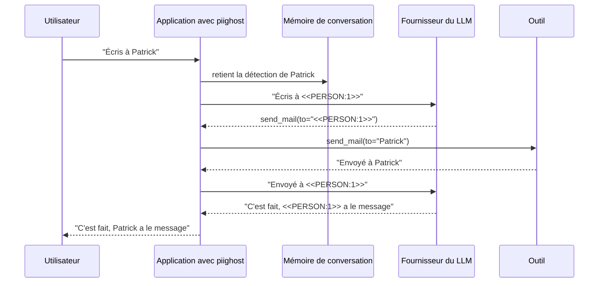

# Comment documenter `piighost` dans une AIPD

Une analyse d'impact relative à la protection des données (AIPD) décrit un traitement, évalue ses risques pour les personnes concernées, et liste les mesures qui y répondent. Si votre système transmet des conversations à un LLM à travers `piighost`, cette page donne à votre délégué à la protection des données (DPO) la matière des parties de l'AIPD qui le concernent, dans l'ordre de l'article 35, paragraphe 7, du RGPD. La lecture juridique de la pseudonymisation, et ce qu'a jugé la Cour de justice dans CEPD/CRU, sont sur [Conformité](compliance.md).

!!! warning "Pas un conseil juridique"
    Cette page décrit ce que `piighost` fait et ne fait pas. Savoir si votre traitement exige une AIPD, et ce que l'AIPD conclut, revient à votre DPO et à votre conseil.

## Vérifier si une AIPD est requise

L'article 35, paragraphe 1, impose une AIPD avant un traitement susceptible d'engendrer un risque élevé, et chaque autorité de contrôle publie la liste des traitements qui en exigent une (article 35, paragraphe 4). En France, c'est la [liste de la CNIL](https://www.cnil.fr/sites/default/files/atoms/files/liste-traitements-aipd-requise.pdf).

Les [lignes directrices WP248 rév.01](https://www.cnil.fr/sites/default/files/atoms/files/wp248_rev.01_fr.pdf), adoptées par le groupe de travail "Article 29" et reprises par le Comité européen de la protection des données, donnent neuf critères. Dans la plupart des cas, un traitement qui en remplit deux exige une AIPD. Un assistant LLM pour un cabinet d'avocats ou une étude notariale peut en remplir plusieurs, parmi lesquels "données sensibles ou données à caractère hautement personnel" et "utilisation innovante ou application de nouvelles solutions technologiques ou organisationnelles".

Si vous concluez qu'une AIPD est requise, rassemblez les faits de votre déploiement avant de la rédiger.

- Le fichier de configuration du pipeline, ou le code qui le construit. [`piighost validate`](reference/cli.md) vérifie un fichier de configuration.
- Les détecteurs et les labels qu'ils recherchent.
- La placeholder factory.
- Le backend de mémoire, et s'il est protégé par un hasher et un cipher.
- Le garde-fou, s'il y en a un.
- Le redactor d'observation, si des traces sont exportées.
- L'intégration (middleware LangChain, Pydantic AI, LlamaIndex, hooks Claude Code, client distant) et, pour le middleware LangChain, la stratégie d'appel d'outil.

## Décrire le traitement

L'article 35, paragraphe 7, point a), demande une description systématique du traitement. Pour la part qu'assure `piighost`, elle tient en quatre étapes.

1. **Détection.** Les détecteurs configurés repèrent les PII de chaque message, un nom, un e-mail, un IBAN. Seul ce qu'ils reconnaissent est remplacé. Les patterns regex et les modèles NER s'exécutent en local, un `LLMDetector` s'exécute là où tourne son modèle de chat. Un catalogue regex du hub épinglé sur un commit est récupéré une fois, sous forme de patterns seulement, puis relu depuis le cache local, et aucun texte de message n'est envoyé au hub.
2. **Remplacement.** Chaque valeur détectée est remplacée par un token avant que le texte parte vers le fournisseur du LLM. `Patrick`{ .pii } devient `<<PERSON:1>>`{ .placeholder }, et reste `<<PERSON:1>>`{ .placeholder } pendant toute la conversation.
3. **Conservation de la correspondance.** La correspondance de `<<PERSON:1>>`{ .placeholder } vers `Patrick`{ .pii } est conservée dans la mémoire de conversation, cloisonnée par conversation (`thread_id`).
4. **Restauration.** Quand la réponse revient, `piighost` remet `Patrick`{ .pii } à la place de `<<PERSON:1>>`{ .placeholder } pour l'utilisateur. Avec le middleware LangChain, la stratégie d'appel d'outil décide si les outils reçoivent aussi les vraies valeurs. Le défaut, `ToolCallStrategy.FULL`, restaure les arguments d'un appel d'outil et dé-identifie son résultat.

### Où vit la correspondance

La correspondance est ce que le RGPD appelle une information supplémentaire, et elle contient les valeurs en clair. Consignez où elle vit.

| Backend de mémoire | Où vit la correspondance | Survit à un redémarrage | Protection au repos | Extra |
|---|---|---|---|---|
| `InMemoryConversationMemory` (défaut) | la mémoire du processus applicatif | non | aucune | socle |
| `RedisConversationMemory` | un serveur Redis | oui, avec un `ttl` optionnel | hasher et cipher optionnels | `redis` |
| `SqlAlchemyConversationMemory` | une table SQL (SQLite, PostgreSQL) | oui | hasher et cipher optionnels | `sqlalchemy` |
| `PIIGhostClient` | le serveur `piighost-api` qu'il appelle | selon le backend de ce serveur | selon le backend de ce serveur | `client` |

Le hasher et le cipher demandent l'extra `crypto`, et `Argon2Hasher` l'extra `argon2`. L'identifiant de conversation reste en clair dans les clés Redis et la table SQL, puisque c'est lui qui permet de retrouver et d'effacer une conversation. Utilisez un `thread_id` opaque, jamais un e-mail ni un nom.

Deux autres endroits contiennent des valeurs en clair et entrent dans la description.

- Chaque worker garde en mémoire une copie mémoïsée des tokens d'une conversation. `token_memo_ttl` borne sa durée de vie, voir [Déploiement multi-instance](multi-instance.md).
- Avec le middleware LangChain, les messages de l'état LangGraph contiennent les valeurs restaurées après le tour du modèle, donc un checkpointer qui persiste cet état les persiste. Voir [Sécurité](security.md).

### Qui peut restaurer

Restaurer suppose la correspondance, donc un accès au backend de mémoire, et à la clé de chiffrement quand le backend chiffre. En pratique, ce sont le processus applicatif, et quiconque peut lire le stockage avec `PIIGHOST_CIPHER_KEY`, ou le stockage seul quand il n'est pas chiffré. Le fournisseur du LLM ne reçoit que des tokens, il ne peut donc pas restaurer. Le considérant 29 demande au responsable du traitement d'indiquer les personnes autorisées, nommez-les dans l'AIPD.

## Cartographier les flux de données

Le diagramme suit `Patrick`{ .pii } pendant un tour de conversation.

*Un tour avec le middleware LangChain et la stratégie d'appel d'outil par défaut, `FULL`.*
{ .figure-caption }

Chaque flux entre dans l'AIPD avec ce qui le traverse et qui le reçoit.

| Flux | Ce qui passe | Destinataire |
|---|---|---|
| Utilisateur vers application | le message en clair | vous |
| Application vers mémoire | les valeurs détectées, chiffrées quand un cipher est configuré | vous, ou l'hébergeur du stockage |
| Application vers fournisseur du LLM | le texte dé-identifié, avec tout ce que les détecteurs n'ont pas remplacé | le fournisseur du LLM |
| Application vers outil | les valeurs restaurées, sous les stratégies `FULL` et `INPUT` | l'exploitant de l'outil |
| Résultat d'outil vers fournisseur du LLM | la réponse de l'outil, dé-identifiée sous `FULL` et `OUTPUT`, telle que l'outil l'a rendue sous `INPUT` et `PASSTHROUGH` | le fournisseur du LLM |
| Application vers backend de traces | les payloads des étapes, tokenisés quand un `observation_redactor` est défini, en clair sinon | l'exploitant du backend de traces |
| Application vers un `LLMDetector` distant | le message en clair, puisque la détection précède le remplacement | le fournisseur de ce modèle de chat |
| Application vers un garde-fou distant | la sortie dé-identifiée (`LLMGuardRail`, `ModerationGuardRail`) | le fournisseur de ce modèle |

## Associer les mesures aux risques

L'article 35, paragraphe 7, point d), demande les mesures envisagées pour faire face aux risques. Le tableau liste celles que fournit `piighost`, le réglage à consigner, et la page qui le détaille.

| Risque | Mesure | Réglage à consigner | Détail |
|---|---|---|---|
| Le fournisseur du LLM lit les PII | les valeurs sont remplacées avant que le texte parte, et un token à compteur ou à hash n'est jamais calculé à partir de la valeur qu'il remplace | les détecteurs, la placeholder factory | [Placeholder factories](placeholder-factories.md) |
| La correspondance atteint le fournisseur | la correspondance reste dans la mémoire, de votre côté, et n'est jamais envoyée avec le texte | le backend de mémoire | [Sécurité](security.md) |
| Vol du stockage persistant | la clé de chaque message est hachée (`Sha256Hasher` ou `Argon2Hasher`) et chaque valeur chiffrée (`AesGcmCipher`), les deux ou aucun, et un stockage réseau construit sans eux émet un `PIIGhostSecurityWarning` | le hasher, le cipher, où sont gardés `PIIGHOST_HASH_PEPPER` et `PIIGHOST_CIPHER_KEY` | [Sécurité](security.md) |
| Une PII reste dans la sortie | un garde-fou revérifie le texte dé-identifié, et le pipeline lève `PIIRemainingError` quand il en signale une | `DetectorGuardRail`, `Gliner2GuardRail`, `LLMGuardRail` ou `ModerationGuardRail` | [Garde-fous](reference/guard-rails.md) |
| Les journaux et les traces portent des PII | la librairie n'écrit aucune PII dans ses loggers, et un `observation_redactor` tokenise les payloads des traces | le redactor, `trace_clear_text`, le fait que `PIIGHOST_HOOK_LOG` ne soit pas défini | [Observation](observation.md) |
| Une conversation voit les valeurs d'une autre | la mémoire est cloisonnée par `thread_id`, et les intégrations refusent un tour sans `thread_id` au lieu de le verser dans un fil partagé | la façon dont `thread_id` est dérivé | [Limites](limitations.md) |
| Un utilisateur tape un token pour lire la valeur d'autrui | un token tapé dans l'entrée est neutralisé avant le rendu (`escape_existing_tokens=True` par défaut) | laissé à son défaut | [Sécurité](security.md) |
| Le LLM invente un token | un token inventé est refusé par défaut (`InventedPlaceholderStrategy.RAISE`) | la stratégie | [Stratégies d'appel outil](tool-call-strategies.md) |
| Conservation, et demande d'effacement | `forget_thread` efface une conversation de la mémoire et du mémo local des tokens, et renvoie combien de messages et de détections il a supprimés | la règle de conservation, `max_threads` et `ttl` sur le backend en mémoire, `ttl` sur Redis, `token_memo_ttl` | [Référence du pipeline](reference/pipeline.md) |

Le journal de débogage des hooks Claude Code, écrit seulement quand `PIIGHOST_HOOK_LOG` est défini, peut contenir des valeurs restaurées. Laissez-le non défini en production.

## Consigner les risques résiduels

L'article 35, paragraphe 7, point c), demande une évaluation des risques. `piighost` réduit l'exposition envers le fournisseur du LLM sans supprimer les risques suivants, à consigner comme résiduels.

- **La détection est au mieux.** Une PII que les détecteurs ne reconnaissent pas parvient au fournisseur en clair. Un modèle NER peut aussi tronquer un texte plus long que son contexte. Voir [Limites](limitations.md).
- **Le contexte et les quasi-identifiants restent en clair.** "`<<PERSON:1>>`{ .placeholder }, le seul notaire d'un village de 300 habitants" identifie une personne sans la nommer. Les détecteurs voient des valeurs, pas cette inférence.
- **Le LLM peut écrire une PII qu'il a inventée.** Un nom que le modèle invente n'est dans aucune correspondance, rien ne le rattache donc à une personne ni ne le retire.
- **Les valeurs que l'assistant introduit restent en clair** sous le défaut `EntityCreateByAssistantStrategy.PRESERVE`. `ANONYMIZE` les tokenise aussi.
- **Le stockage de la correspondance est une cible.** Il contient les valeurs en clair, ou chiffrées sous une clé que détient votre environnement. La mémoire du processus et un état LangGraph persisté les contiennent en clair. Voir [Sécurité](security.md).
- **Les outils reçoivent les vraies valeurs** sous les stratégies `FULL` et `INPUT`, donc chaque outil que l'agent peut appeler est un destinataire. Sous `INPUT` et `PASSTHROUGH`, une PII dans la réponse d'un outil parvient au fournisseur en clair.
- **L'effacement a une portée.** `forget_thread` atteint la mémoire et le mémo du processus qui l'exécute. Il n'atteint ni les journaux du fournisseur, ni votre checkpointer, ni vos traces, ni le mémo d'un autre worker avant l'échéance de son `token_memo_ttl`.
- **La position du fournisseur n'est pas tranchée.** Une AIPD qui traite le texte dé-identifié comme une donnée personnelle pour le fournisseur tient quelle que soit l'issue de cette question. Voir [Conformité](compliance.md).

## Remplir le modèle

Copiez le tableau dans votre AIPD et remplissez la dernière colonne pour votre déploiement. Il suit les quatre points de l'article 35, paragraphe 7. Le [modèle d'AIPD du Comité européen](https://www.edpb.europa.eu/news/news/2026/enhancing-compliance-and-consistency-edpb-adopts-dpia-template_fr), adopté le 14 avril 2026 pour consultation publique, et la [méthode et le logiciel PIA de la CNIL](https://www.cnil.fr/fr/RGPD-analyse-impact-protection-des-donnees-aipd) peuvent l'accueillir.

| Article 35, paragraphe 7 | Élément | Ce qu'il faut consigner | Votre déploiement |
|---|---|---|---|
| a) description | finalité | l'usage de l'assistant LLM | |
| a) description | détecteurs | les détecteurs, les labels qu'ils recherchent, les langues qu'ils couvrent | |
| a) description | placeholder | la factory et un exemple de token | |
| a) description | correspondance | le backend de mémoire, son hébergeur, sa durée de conservation | |
| a) description | destinataires | le fournisseur du LLM, les outils, le backend de traces, tout détecteur ou garde-fou distant | |
| a) description | restauration | qui peut restaurer, et avec quel accès | |
| b) nécessité | minimisation | pourquoi le fournisseur a besoin du texte dé-identifié, et pourquoi les outils ont besoin des vraies valeurs | |
| c) risques | résiduels | les risques résiduels ci-dessus qui s'appliquent, avec leur vraisemblance et leur gravité | |
| d) mesures | chiffrement | le hasher, le cipher, où vivent les secrets | |
| d) mesures | garde-fou | le garde-fou, ou pourquoi il n'y en a pas | |
| d) mesures | journalisation | le redactor d'observation, les journaux applicatifs, le checkpointer | |
| d) mesures | cloisonnement | la façon dont `thread_id` est dérivé, et qu'il est opaque | |
| d) mesures | effacement | quand et par qui `forget_thread` est appelé, et ce qu'il n'atteint pas | |
| d) mesures | fournisseur | le contrat de sous-traitance, les conditions de conservation et d'entraînement, le transfert hors UE s'il y en a un | |

## Voir aussi

- [Conformité](compliance.md) : les dispositions du RGPD, les lignes directrices du Comité européen et l'arrêt CEPD/CRU sur la pseudonymisation.
- [Sécurité](security.md) : le modèle de menace, les backends de mémoire, et le chiffrement au repos.
- [Limites](limitations.md) : ce que la détection manque, et comment y remédier.
- [Déploiement](deployment.md) : borner la mémoire et exploiter `piighost` en production.
