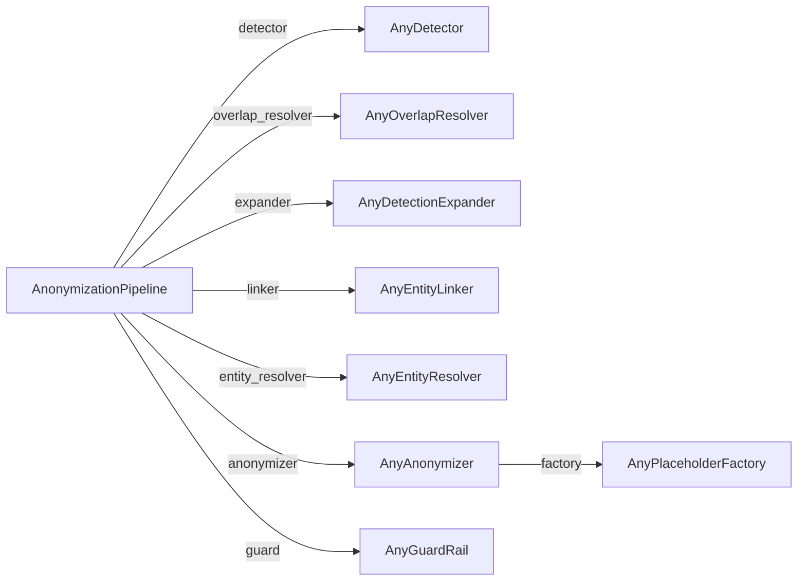

# Étendre PIIGhost

Chaque étape du pipeline est un **port**, un `Protocol` que vous satisfaites en implémentant sa méthode unique. Aucune classe de base à hériter, et rien d'autre dans le pipeline ne change. Vous pouvez aussi sous-classer un patron `Base*` là où il en existe un, qui fournit le squelette commun et vous laisse un seul point d'extension.



*Le pipeline injecte un composant par port. Seul le détecteur est requis, le linker, l'anonymiseur et le résolveur de chevauchements retombent sur des composants intégrés, et seules les étapes expand, entity-resolve, guard et override sont désactivées par défaut.*
{ .figure-caption }

Les ports vivent dans le `base.py` de chaque composant, sous `piighost.components.*`. Les modèles de données qu'ils échangent vivent dans `piighost.models`.

```python
from piighost.models import Detection, Entity, Span
```

Une `Detection` est un `Span(start, end)` portant `text`, `label` et une `confidence` dans l'intervalle 0 à 1. Une `Entity` regroupe les détections qui partagent une valeur, et en dérive son `label`, son `text` et ses `spans`.

---

## Un détecteur personnalisé

Un détecteur trouve les PII dans un texte. Implémentez une seule méthode.

```python
class AnyDetector(Protocol):
    async def detect(self, text: str) -> list[Detection]: ...
```

`detect` est asynchrone pour qu'une implémentation puisse attendre un serveur de modèle ou une API LLM. Renvoyez les détections dans n'importe quel ordre. Les chevauchements et les répétitions sont résolus par les étapes suivantes, pas ici.

???+ example "Détecteur regex de pseudos"

    ```python
    import re

    from piighost.models import Detection, Span


    class HandleDetector:
        """Detect @handles as USERNAME."""

        async def detect(self, text: str) -> list[Detection]:
            detections: list[Detection] = []
            for match in re.finditer(r"@\w+", text):
                span = Span(match.start(), match.end())
                detections.append(
                    Detection(
                        span=span,
                        text=match.group(),
                        label="USERNAME",
                        confidence=1.0,
                    )
                )
            return detections
    ```

Pour alimenter un détecteur depuis une liste de valeurs figée dans les tests, utilisez plutôt le détecteur intégré `ExactMatchDetector`. Voir [Tester un pipeline sans modèle](examples/testing.md).

### Pour les modèles NER, sous-classez `BaseNERDetector`

Les détecteurs adossés à un modèle (`Gliner2Detector`, `SpacyDetector`, `TransformersDetector`) étendent tous `BaseNERDetector`. Il traduit le label qu'un modèle émet en interne vers le label qui apparaît dans `Detection.label`, si bien que vous pouvez interroger un modèle avec les chaînes qu'il détecte le mieux tout en produisant des labels propres en aval. Passez `labels` sous forme de liste pour un mapping identité, ou sous forme de dictionnaire `{émis: interne}` pour renommer.

```python
from piighost.components.detector.ner import Gliner2Detector

# Query GLiNER2 with "person" and "company" but emit "PERSON" / "COMPANY".
detector = Gliner2Detector(
    model,
    labels={"PERSON": "person", "COMPANY": "company"},
)
```

### Utilisation

```python
from piighost.pipeline import AnonymizationPipeline

detector = HandleDetector()
pipeline = AnonymizationPipeline(
    detector,
    linker,
    anonymizer,
)
```

---

## Un résolveur de chevauchements personnalisé

Un résolveur de chevauchements réconcilie les détections dont les spans se chevauchent en un ensemble non chevauchant. Le port :

```python
class AnyOverlapResolver(Protocol):
    def resolve(self, detections: list[Detection]) -> list[Detection]: ...
```

Plutôt que d'implémenter `resolve` de zéro, sous-classez `BaseOverlapResolver`. Il regroupe les détections en groupes de chevauchement et confie chaque groupe à votre `_reduce`, si bien que vous décidez seulement quelles détections garder dans un groupe qui se chevauche.

???+ example "Le span le plus long l'emporte"

    ```python
    from piighost.models import Detection
    from piighost.components.overlap_resolver.base import BaseOverlapResolver


    class LongestOverlapResolver(BaseOverlapResolver):
        """Keep the longest detection in each overlap group."""

        def _reduce(self, conflicting: list[Detection]) -> list[Detection]:
            return [max(conflicting, key=lambda d: d.span.length)]
    ```

Le `ConfidenceOverlapResolver` intégré garde plutôt la détection de plus haute confiance. Le résolveur de chevauchements est toujours actif. Omettez-le et le pipeline installe un `ConfidenceOverlapResolver`. Passez le vôtre pour changer la règle. Il n'y a aucun moyen supporté de le désactiver, car le rendu suppose des spans disjoints et lève sinon `OverlappingSpansError`.

---

## Un expandeur personnalisé

Un expandeur trouve les occurrences qu'un détecteur a manquées, comme la répétition d'un nom repéré ailleurs. Le port :

```python
class AnyDetectionExpander(Protocol):
    def expand(self, text: str, detections: list[Detection]) -> list[Detection]: ...
```

Sous-classez `BaseDetectionExpander`. Il conserve les détections d'origine et, pour chacune, ajoute une détection à chaque occurrence supplémentaire que votre `_find_occurrences` renvoie, en reprenant le label et la confiance de la détection source.

???+ example "Répétitions par mot entier"

    ```python
    import re
    from collections.abc import Iterable

    from piighost.models import Detection, Span
    from piighost.components.expander.base import BaseDetectionExpander


    class WholeWordExpander(BaseDetectionExpander):
        """Find whole-word repeats of a detected value."""

        def _find_occurrences(self, text: str, detection: Detection) -> Iterable[Span]:
            pattern = re.compile(rf"\b{re.escape(detection.text)}\b")
            return [Span(m.start(), m.end()) for m in pattern.finditer(text)]
    ```

Le `WordBoundaryExpander` intégré fait exactement cela. L'étape est optionnelle.

---

## Un linker d'entités personnalisé

Un linker regroupe les détections qui réfèrent à la même valeur en entités, si bien que chaque occurrence partage un placeholder. Le port :

```python
class AnyEntityLinker(Protocol):
    def link(self, detections: list[Detection]) -> list[Entity]: ...
```

Sous-classez `BaseEntityLinker`. Il regroupe les détections par une clé que vous calculez dans `_key`, une entité par clé distincte, en gardant l'ordre de première occurrence.

???+ example "Regrouper par valeur exacte et label"

    ```python
    from collections.abc import Hashable

    from piighost.models import Detection
    from piighost.components.linker.base import BaseEntityLinker


    class CaseSensitiveLinker(BaseEntityLinker):
        """Group detections that share an exact value and label."""

        def _key(self, detection: Detection) -> Hashable:
            return (detection.text, detection.label)
    ```

L'`ExactEntityLinker` intégré regroupe sur la valeur en casse repliée, si bien que `Patrick`{ .pii } et `patrick`{ .pii } deviennent une seule entité.

---

## Un résolveur d'entités personnalisé

Un résolveur d'entités réconcilie les entités qui ne devraient pas coexister, comme deux entités qui partagent une détection. Le port :

```python
class AnyEntityResolver(Protocol):
    def resolve(self, entities: list[Entity]) -> list[Entity]: ...
```

Sous-classez `BaseEntityResolver`. Il regroupe les entités qui partagent une détection et confie chaque groupe à votre `_reduce`, qui renvoie un ensemble cohérent, soit en fusionnant le groupe en une entité, soit en les gardant séparées. Les composants intégrés :

- `MergeEntityResolver` fusionne les entités qui partagent une détection, par union-find.
- `SeparateEntityResolver` les garde séparées, en donnant chaque détection partagée à une entité.
- `FuzzyEntityResolver` fusionne les entités aux valeurs proches (nécessite l'extra `fuzzy`).

L'étape est optionnelle.

---

## Une fabrique de placeholders personnalisée

Une fabrique de placeholders transforme les entités en leurs jetons de remplacement. Elle est générique sur un **tag de préservation**, un type fantôme qui déclare ce que ses jetons préservent, dont le type-checker se sert pour verrouiller un consommateur comme le middleware. Le port :

```python
class AnyPlaceholderFactory(Protocol[PreservationT_co]):
    def create(self, entities: list[Entity]) -> Mapping[Entity, PreservationT_co]: ...
```

Un jeton est une instance du tag, qui est une sous-classe de `str`, donc c'est une vraie chaîne qui porte son niveau de préservation dans son propre type. `create` doit être déterministe. Les mêmes entités produisent les mêmes jetons à chaque appel, car le pipeline l'appelle plusieurs fois par exécution.

???+ example "Fabrique de labels entre crochets"

    ```python
    from collections.abc import Mapping

    from piighost.models import Entity
    from piighost.components.placeholder.base import AnyPlaceholderFactory
    from piighost.components.placeholder.tags import PreservesLabel


    class BracketLabelFactory(AnyPlaceholderFactory[PreservesLabel]):
        """Emit [LABEL] for every entity, collapsing each label to one token."""

        def create(self, entities: list[Entity]) -> Mapping[Entity, PreservesLabel]:
            return {
                entity: PreservesLabel(f"[{entity.label}]") for entity in entities
            }
    ```

`PreservesLabel` dit que le jeton révèle le type mais pas une identité unique, donc cette fabrique convient au caviardage à usage unique, pas au middleware. Pour un jeton que le middleware sait dé-identifier et retrouver, taguez-le `PreservesRecognizableIdentity` (ou un sous-tag comme `PreservesLabeledIdentityOpaque`) et utilisez une grammaire délimitée comme `<<PERSON:1>>`{ .placeholder }. Pour envelopper une forme interne dans des délimiteurs sans écrire l'enveloppe vous-même, sous-classez `BaseDelimitedPlaceholderFactory`. Voir [Placeholder factories](placeholder-factories.md) pour la taxonomie complète des tags et des exemples détaillés.

### Utilisation

```python
from piighost.components.anonymizer import Anonymizer

factory = BracketLabelFactory()
anonymizer = Anonymizer(factory)
```

---

## Un garde-fou personnalisé

Un garde-fou re-contrôle la sortie anonymisée à la recherche de PII résiduelles. Il classe, il ne décide pas. Il renvoie un `GuardVerdict` et laisse le pipeline lever `PIIRemainingError` quand un verdict est signalé. Il n'y a pas de patron `Base`, les gardes diffèrent par tout leur mécanisme de contrôle. Le port :

```python
class AnyGuardRail(Protocol):
    async def check(self, text: str) -> GuardVerdict: ...
```

`check` ne voit que le texte anonymisé. Les placeholders qu'il porte sont clairement synthétiques, donc un contrôle destiné aux vraies PII ne les prend pas pour elles.

???+ example "Signaler un @ résiduel"

    ```python
    from piighost.components.guard.base import GuardVerdict


    class AtSignGuard:
        """Flag any residual @ sign as leftover PII."""

        async def check(self, text: str) -> GuardVerdict:
            return GuardVerdict(flagged="@" in text)
    ```

Le `DetectorGuardRail` intégré relance un détecteur et rapporte les détections résiduelles. L'étape est optionnelle. Ne passez aucun `guard` et la sortie est renvoyée sans contrôle.

### Utilisation

```python
from piighost.pipeline import AnonymizationPipeline

guard = AtSignGuard()
pipeline = AnonymizationPipeline(
    detector,
    linker,
    anonymizer,
    guard=guard,
)
```

---

## Composition complète

Les étapes sont indépendantes, donc un détecteur, une fabrique et un garde personnalisés se combinent librement avec les composants intégrés :

```python
from piighost.components.anonymizer import Anonymizer
from piighost.components.linker import ExactEntityLinker
from piighost.components.overlap_resolver import ConfidenceOverlapResolver
from piighost.components.entity_resolver import MergeEntityResolver
from piighost.pipeline import AnonymizationPipeline

detector = HandleDetector()
linker = ExactEntityLinker()
factory = BracketLabelFactory()
anonymizer = Anonymizer(factory)
overlap_resolver = ConfidenceOverlapResolver()
entity_resolver = MergeEntityResolver()
guard = AtSignGuard()
pipeline = AnonymizationPipeline(
    detector,
    linker,
    anonymizer,
    overlap_resolver=overlap_resolver,
    entity_resolver=entity_resolver,
    guard=guard,
)
```

Pour tester un composant personnalisé de façon déterministe, alimentez-le via `ExactMatchDetector`. Voir [Tester un pipeline sans modèle](examples/testing.md).
