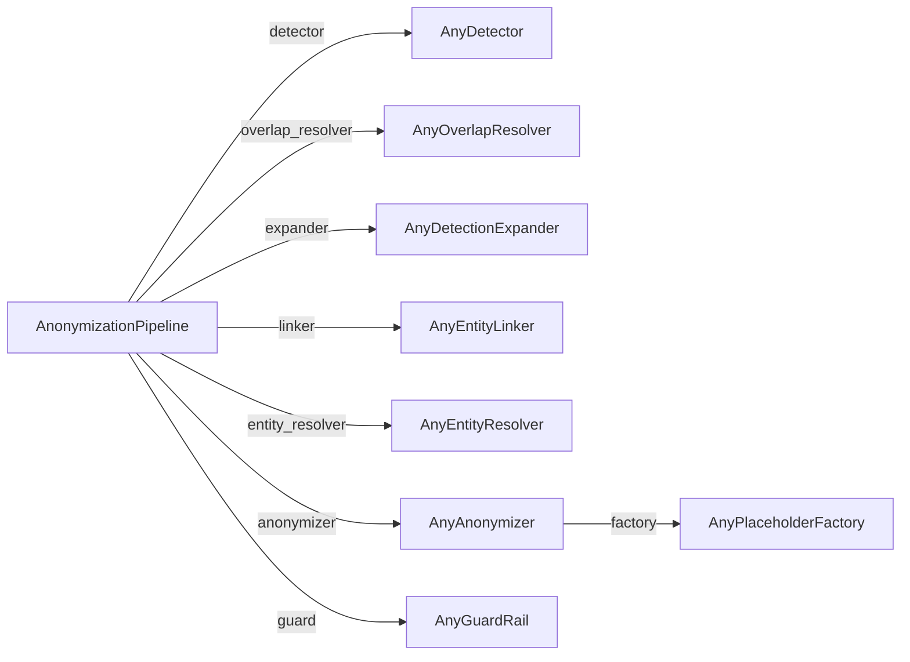

# Étendre PIIGhost

Chaque étape du pipeline est un **port**, un `Protocol` que vous satisfaites en implémentant sa méthode unique. Aucune classe de base à hériter, et rien d'autre dans le pipeline ne change. Là où un patron `Base*` existe, vous pouvez aussi le sous-classer. Ce patron fournit le squelette commun et vous laisse un seul point d'extension.


```mermaid
flowchart LR
    P[AnonymizationPipeline] -->|detector| D[AnyDetector]
    P -->|overlap_resolver| O[AnyOverlapResolver]
    P -->|expander| X[AnyDetectionExpander]
    P -->|linker| L[AnyEntityLinker]
    P -->|entity_resolver| R[AnyEntityResolver]
    P -->|anonymizer| A[AnyAnonymizer]
    P -->|guard| G[AnyGuardRail]
    A -->|factory| F[AnyPlaceholderFactory]
```

*Le pipeline injecte un composant par port. Seul le détecteur est requis. Le linker, l'anonymiseur et le résolveur de chevauchements utilisent par défaut des composants intégrés. Seules les étapes expand, entity-resolve, guard et override sont désactivées par défaut.*
{ .figure-caption }

Les ports vivent dans le `base.py` de chaque composant, sous `piighost.components.*`. Les modèles de données qu'ils échangent vivent dans `piighost.models`.

```python
--8<-- "snippets/extending_models.py"
```

Une `Detection` est un `Span(start, end)` portant `text`, `label` et une `confidence` dans l'intervalle 0 à 1. Une `Entity` regroupe les détections qui partagent une valeur, et en dérive son `label`, son `text` et ses `spans`. Voir la [référence des modèles de données](reference/models.md) pour chaque champ, méthode et erreur de validation.

---

## Un détecteur personnalisé

Un détecteur trouve les données confidentielles (données personnelles, secrets) dans un texte. Implémentez une seule méthode.

```python
--8<-- "snippets/ports.py:detector"
```

`detect` est asynchrone pour qu'une implémentation puisse attendre un serveur de modèle ou une API LLM. Renvoyez les détections dans n'importe quel ordre. Les chevauchements et les répétitions sont résolus par les étapes suivantes, pas ici.

???+ example "Détecteur regex de pseudos"

    ```python
    --8<-- "snippets/extending.py:handle_detector"
    ```

Pour alimenter un détecteur depuis une liste de valeurs figée dans les tests, utilisez plutôt le détecteur intégré `ExactMatchDetector`. Voir [Tester un pipeline sans modèle](examples/testing.md).

### Pour les modèles NER, sous-classez `BaseNERDetector`

Les détecteurs adossés à un modèle (`Gliner2Detector`, `SpacyDetector`, `TransformersDetector`) étendent tous `BaseNERDetector`. `BaseNERDetector` traduit le label qu'un modèle émet en interne vers le label qui apparaît dans `Detection.label`. Vous pouvez ainsi interroger un modèle avec les chaînes qu'il détecte le mieux, tout en produisant des labels propres en aval. Passez `labels` sous forme de liste pour garder chaque label tel quel (mapping identité), ou sous forme de dictionnaire `{émis: interne}` pour renommer.

```python
--8<-- "snippets/extending_gliner2.py:example"
```

### Utilisation

```python
--8<-- "snippets/extending.py:use_detector"
```

---

## Un résolveur de chevauchements personnalisé

Un résolveur de chevauchements reçoit des détections dont les spans se chevauchent, et en tire un ensemble de détections sans chevauchement. Le port :

```python
--8<-- "snippets/ports.py:overlap_resolver"
```

Plutôt que d'implémenter `resolve` de zéro, sous-classez `BaseOverlapResolver`. Il regroupe les détections en groupes de chevauchement et confie chaque groupe à votre `_reduce`, si bien que vous décidez seulement quelles détections garder dans un groupe qui se chevauche.

???+ example "Le span le plus long l'emporte"

    ```python
    --8<-- "snippets/extending.py:longest_resolver"
    ```

Le `ConfidenceOverlapResolver` intégré garde plutôt la détection de plus haute confiance. Le résolveur de chevauchements est toujours actif. Omettez-le et le pipeline installe un `ConfidenceOverlapResolver`. Passez le vôtre pour changer la règle. Il n'y a aucun moyen supporté de le désactiver, car le rendu suppose des spans disjoints et lève sinon `OverlappingSpansError`.

---

## Un expandeur personnalisé

Un expandeur trouve les occurrences qu'un détecteur a manquées, comme la répétition d'un nom repéré ailleurs. Le port :

```python
--8<-- "snippets/ports.py:expander"
```

Sous-classez `BaseDetectionExpander`. Il conserve les détections d'origine. Pour chacune, il ajoute une détection à chaque occurrence supplémentaire que renvoie votre `_find_occurrences`. Chaque détection ajoutée reprend le label et la confiance de la détection source. Une occurrence qui chevauche une détection déjà retenue est écartée, car l'expander passe après le résolveur de chevauchements et le rendu refuse deux spans qui se recouvrent. Les valeurs sont cherchées de la plus longue à la plus courte, donc un nom complet prend sa place avant son prénom.

???+ example "Répétitions par mot entier"

    ```python
    --8<-- "snippets/extending.py:whole_word_expander"
    ```

Le `WordBoundaryExpander` intégré fait exactement cela. L'étape est optionnelle.

---

## Un linker d'entités personnalisé

Un linker regroupe en entités les détections qui réfèrent à la même valeur. Toutes les occurrences d'une valeur partagent ainsi un placeholder. Le port :

```python
--8<-- "snippets/ports.py:linker"
```

Sous-classez `BaseEntityLinker`. Il regroupe les détections selon une clé que vous calculez dans `_key`. Il crée une entité par clé distincte, dans l'ordre de première occurrence.

???+ example "Regrouper par valeur exacte et label"

    ```python
    --8<-- "snippets/extending.py:case_sensitive_linker"
    ```

L'`ExactEntityLinker` intégré regroupe selon la clé de valeur. Cette clé est la même pour les mêmes mots, quelles que soient leurs espaces et leur casse. `Patrick`{ .pii } et `patrick`{ .pii } deviennent donc une seule entité. Utilisez `piighost.text.value_key` dans votre propre linker pour suivre la même règle, voir [Espaces Unicode](reference/detectors.md#espaces-unicode).

---

## Un résolveur d'entités personnalisé

Un résolveur d'entités réconcilie les entités qui ne devraient pas coexister, comme deux entités qui partagent une détection. Le port :

```python
--8<-- "snippets/ports.py:entity_resolver"
```

Sous-classez `BaseEntityResolver`. Il regroupe les entités qui partagent une détection et confie chaque groupe à votre `_reduce`. Votre `_reduce` renvoie un ensemble cohérent, soit en fusionnant le groupe en une entité, soit en gardant les entités séparées. Les composants intégrés :

- `MergeEntityResolver` fusionne les entités qui partagent une détection, par union-find.
- `SeparateEntityResolver` les garde séparées, en donnant chaque détection partagée à une entité.
- `FuzzyEntityResolver` fusionne les entités aux valeurs proches (nécessite l'extra `fuzzy`).

L'étape est optionnelle.

---

## Une fabrique de placeholders personnalisée

Une fabrique de placeholders transforme les entités en leurs jetons de remplacement. Elle est générique sur un **tag de préservation**, un type fantôme qui déclare ce que ses jetons préservent. Le type-checker se sert de ce tag pour verrouiller un consommateur comme le middleware. Le port :

```python
--8<-- "snippets/ports.py:placeholder_factory"
```

Un jeton est une instance du tag, et le tag est une sous-classe de `str`. Le jeton est donc une vraie chaîne, qui porte son niveau de préservation dans son propre type. `create` doit être déterministe. Les mêmes entités produisent les mêmes jetons à chaque appel, car le pipeline l'appelle plusieurs fois par exécution.

???+ example "Fabrique de labels entre crochets"

    ```python
    --8<-- "snippets/extending.py:bracket_factory"
    ```

`PreservesLabel` dit que le jeton révèle le type mais pas une identité unique. Cette fabrique convient donc au caviardage à usage unique, pas au middleware. Pour un jeton que le middleware sait dé-identifier et retrouver, taguez-le `PreservesRecognizableIdentity` (ou un sous-tag comme `PreservesLabeledIdentityOpaque`) et utilisez une grammaire délimitée comme `<<PERSON:1>>`{ .placeholder }. Pour envelopper une forme interne dans des délimiteurs sans écrire l'enveloppe vous-même, sous-classez `BaseDelimitedPlaceholderFactory`. Voir [Placeholder factories](placeholder-factories.md) pour la taxonomie complète des tags et des exemples détaillés.

### Utilisation

```python
--8<-- "snippets/extending.py:use_factory"
```

---

## Un garde-fou personnalisé

Un garde-fou re-contrôle la sortie dé-identifiée à la recherche de données confidentielles résiduelles. Il classe, il ne décide pas. Il renvoie un `GuardVerdict` et laisse le pipeline lever `PIIRemainingError` quand un verdict est signalé. Il n'y a pas de patron `Base`, parce que chaque garde a son propre mécanisme de contrôle. Le port :

```python
--8<-- "snippets/ports.py:guard"
```

`check` ne voit que le texte dé-identifié. Les placeholders de ce texte sont clairement synthétiques. Un contrôle qui cherche les vraies valeurs ne les prend donc pas pour de vraies valeurs.

???+ example "Signaler un @ résiduel"

    ```python
    --8<-- "snippets/extending.py:at_sign_guard"
    ```

Le `DetectorGuardRail` intégré relance un détecteur et rapporte les détections résiduelles. L'étape est optionnelle. Ne passez aucun `guard` et la sortie est renvoyée sans contrôle.

### Utilisation

```python
--8<-- "snippets/extending.py:use_guard"
```

---

## Composition complète

Les étapes sont indépendantes, donc un détecteur, une fabrique et un garde personnalisés se combinent librement avec les composants intégrés :

```python
--8<-- "snippets/extending.py:assemble"
```

Pour tester un composant personnalisé de façon déterministe, alimentez-le via `ExactMatchDetector`. Voir [Tester un pipeline sans modèle](examples/testing.md).
