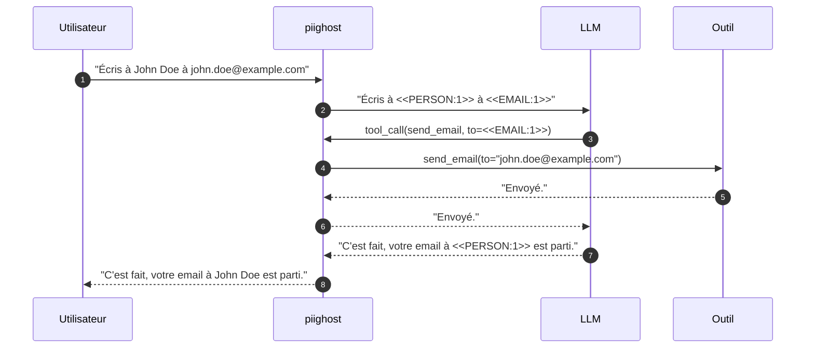

# PIIGhost

`piighost` est une librairie Python qui empêche les PII (données personnelles identifiables) d'atteindre un modèle de langage, tout en gardant l'application pleinement fonctionnelle.

Cette librairie repère les PII grâce à des détecteurs (regex, NER, ou un autre LLM) et remplace chaque valeur par un placeholder stable, par exemple `John Doe`{ .pii } devient `<<PERSON:1>>`{ .placeholder } et `john.doe@example.com`{ .pii } devient `<<EMAIL:1>>`{ .placeholder }. Le modèle ne travaille donc que sur du texte dé-identifié. Quand le LLM retourne des placeholders, `piighost` réinjecte les vraies valeurs à leur place, l'utilisateur final voit `John Doe`{ .pii } et n'a jamais conscience de la dé-identification. La même mécanique protège les agents outillés. Un outil qui a besoin de la vraie adresse la reçoit en clair, alors que le LLM qui décide de l'appeler ne voit toujours que `<<EMAIL:1>>`{ .placeholder }.

Enfin, `piighost` garde la correspondance entre la valeur et son placeholder tout au long de la conversation. Si `john.doe@example.com`{ .pii } réapparaît trois messages plus tard, le placeholder reste `<<EMAIL:1>>`{ .placeholder }, ce qui permet au modèle de suivre le fil de discussion.

!!! note "Dé-identification réversible"
    `piighost` conserve la correspondance entre une valeur et son placeholder pour pouvoir restaurer les données. Au sens du RGPD, il s'agit d'une pseudonymisation, pas d'une anonymisation définitive. Les valeurs réelles restent stockées le temps de la conversation et doivent être protégées en conséquence.

*Tour complet d'un agent. L'utilisateur et l'outil voient les vraies valeurs, le LLM ne voit que des placeholders.*
{ .figure-caption }

## Pourquoi dé-identifier ?

Un LLM hébergé (GPT, Claude, Gemini) reçoit chaque octet de contexte que vous lui envoyez, PII des utilisateurs comprises. Dé-identifier en amont découple le choix du modèle de la sensibilité du contenu. Quand les PII n'atteignent jamais le modèle, le fournisseur cesse d'être une décision de confidentialité et redevient une question de qualité, de coût et de latence.

Le spectre des fournisseurs, le détail juridique (CLOUD Act, FISA 702, Schrems II), les cas d'usage et la comparaison avec les alternatives sont dans [Pourquoi dé-identifier ?](why-anonymize.md).

## Par où commencer

Chaque page suit un rôle du [framework Diátaxis](https://diataxis.fr/), tutoriel pour apprendre, recette pour résoudre une tâche, référence pour consulter l'API, concept pour comprendre les choix de design.

-   :lucide-rocket: __Démarrer__

    ---

    Installer et prendre `piighost` en main.

    - [Installation](getting-started/installation.md)
    - [Quickstart](getting-started/quickstart.md)
    - [Premier pipeline](getting-started/first-pipeline.md)
    - [Pipeline conversationnel](getting-started/conversation.md)
    - [Middleware LangChain](getting-started/langchain.md)

-   :lucide-wrench: __Recettes__

    ---

    Résoudre une tâche précise.

    - [Usage basique](examples/basic.md)
    - [Intégration LangChain](examples/langchain.md)
    - [Détecteurs prêts à l'emploi](examples/detectors.md)
    - [Étendre PIIGhost](extending.md)
    - [Tests](examples/testing.md)

-   :lucide-book-open: __Référence__

    ---

    La documentation d'API complète.

    - [Anonymizer](reference/anonymizer.md)
    - [Pipeline](reference/pipeline.md)
    - [Middleware](reference/middleware.md)
    - [Détecteurs](reference/detectors.md)

-   :lucide-layers: __Concepts__

    ---

    Comprendre les choix de design.

    - [Pourquoi dé-identifier ?](why-anonymize.md)
    - [Architecture](architecture.md)
    - [Placeholder factories](placeholder-factories.md)
    - [Sécurité](security.md)

