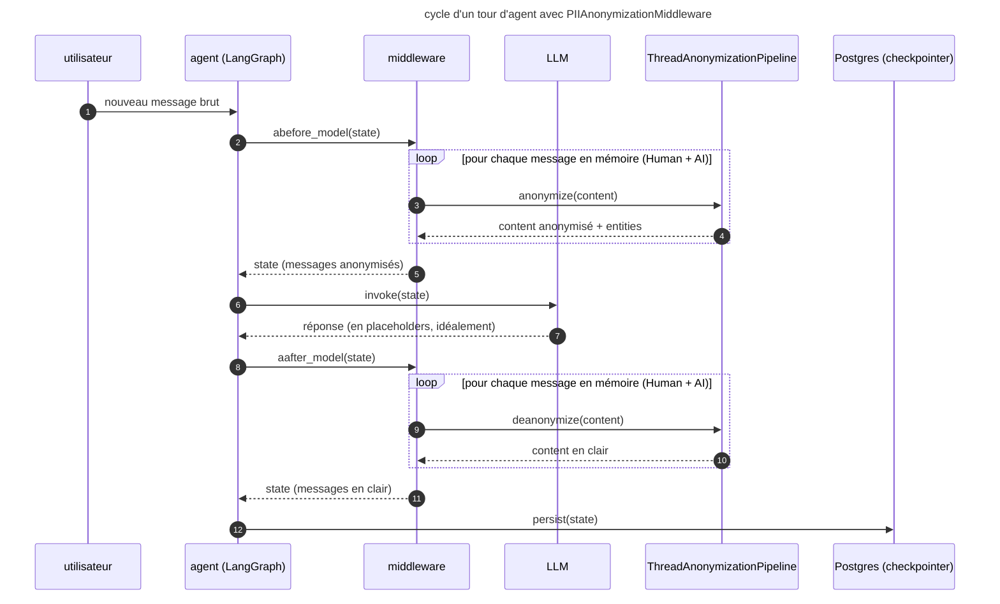
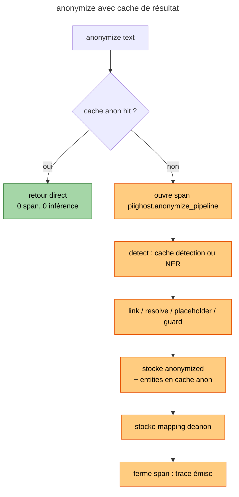
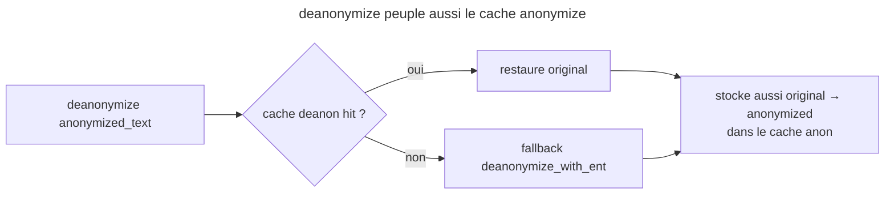

# Observation, cache et middleware

Ce document explique **comment** l'observation est branchée dans piighost,
**pourquoi** elle a été conceptualisée ainsi, et **quels problèmes ouverts**
restent à résoudre dans l'interaction observation ↔ cache ↔ middleware
LangChain. Il ne se limite pas à la surface API : il documente les choix de
design, les compromis explicitement écartés et les conséquences observées en
production.

---

## 1. Pourquoi un module observation dans piighost

### 1.1 Le besoin

Une pipeline d'anonymisation en production est une boîte noire désagréable :
quand un placeholder est mal détecté, qu'une PII fuit, qu'un guard rail
rejette un texte ou que la latence explose, on ne dispose ni d'un point
unique pour reconstituer le déroulé d'une requête, ni d'un mécanisme
standard pour relier détection, link, anonymizer et guard à la même unité
d'observation.

L'objectif est donc de **produire pour chaque requête `anonymize` une trace
hiérarchisée** :

- un span racine `piighost.anonymize_pipeline` (entrée/sortie redactées)
- un span enfant par étape : `detect`, `link`, `placeholder`, `guard`
- chaque enfant porte ses propres entrée/sortie en **forme observée**
  (PII redactée par défaut)

### 1.2 Pourquoi une abstraction backend-agnostique

Le marché des plateformes d'observation LLM est fragmenté (Langfuse, Opik,
Phoenix, Traceloop, etc.) et **bouge vite**. Câbler directement le SDK
Langfuse dans `pipeline.py` aurait deux conséquences inacceptables :

1. **Vendor lock-in** au niveau bibliothèque : tout consommateur de piighost
   se retrouve à payer pour Langfuse, ou à patcher la lib pour brancher
   autre chose.
2. **Cycle d'API instable** : Langfuse v3 → v4 a déjà cassé l'API
   `update_trace`. Lier la lib à une version SDK enferme l'utilisateur.

L'abstraction retenue est volontairement **un mince calque sur l'API
Langfuse v3** (`start_as_current_span` / `start_as_current_observation` /
`update` / `update_trace`). Ce n'est pas un hasard : Langfuse v3 a un
vocabulaire suffisant pour exprimer ce qu'on veut tracer, donc le mapping
vers les autres backends est trivial. Inverser l'abstraction (« inventer
notre propre vocabulaire et faire mapper Langfuse vers nous ») aurait
demandé deux fois plus d'adapters pour un gain nul.

### 1.3 Le contrat

```python
class AbstractObservationService(ABC):
    @abstractmethod
    def start_as_current_span(
        self, *,
        name: str,
        input: Any = None,
        output: Any = None,
        session_id: str | None = None,
        user_id: str | None = None,
        metadata: dict[str, Any] | None = None,
        tags: list[str] | None = None,
    ) -> AbstractContextManager[AbstractSpan]: ...

    def flush(self) -> None:
        return None
```

Trois implémentations existent :

| Implémentation                | Localisation                              | Extra      |
|-------------------------------|-------------------------------------------|------------|
| `NoOpObservationService`      | `piighost.observation.base`               | (aucun)    |
| `LangfuseObservationService`  | `piighost.observation.langfuse`           | `langfuse` |
| `OpikObservationService`      | `piighost.observation.opik`               | `opik`     |

Le `NoOpObservationService` est branché par défaut quand aucun backend
n'est passé à `ThreadAnonymizationPipeline.__init__` : la pipeline appelle
toujours `start_as_current_span`, mais c'est gratuit. Cette uniformité
évite de polluer le code avec des `if observation is not None`.

### 1.4 Activation par variables d'environnement

Côté serveur (piighost-api), le choix du backend se fait à partir des
variables d'environnement *natives* de chaque SDK :

- `LANGFUSE_PUBLIC_KEY` activée → `LangfuseObservationService`
- `OPIK_API_KEY` activée → `OpikObservationService`
- aucune → pas d'observation

**Pourquoi pas un switch explicite type `PIIGHOST_OBSERVATION=langfuse` ?**
Parce qu'il dupliquerait une information déjà portée par les credentials.
Si l'utilisateur définit `LANGFUSE_PUBLIC_KEY`, son intention est claire ;
exiger un second flag `PIIGHOST_OBSERVATION=langfuse` est un piège à
configuration redondant.

**Pourquoi un mutex dur (fail-fast au boot) si plusieurs sont définies ?**
Parce que la pipeline ne peut accepter qu'**un seul** `observation` à
l'instanciation, et qu'un fallback silencieux (« on prend Langfuse en
priorité ») produirait des traces qui partent vers le mauvais backend sans
que personne ne s'en aperçoive. L'erreur explicite au démarrage est
toujours préférable au comportement surprenant en production.

---

## 2. Deux niveaux d'observation : pipeline d'anonymisation et agent

Quand piighost est utilisé via le couple piighost-api + piighost-chat, deux
zones distinctes méritent d'être tracées, et chacune a son propre point
d'instrumentation :

| Zone                               | Instrumenté via                          | Trace produite                       |
|------------------------------------|------------------------------------------|--------------------------------------|
| Pipeline d'anonymisation           | `pipeline._observation` (piighost)       | `piighost.anonymize_pipeline`        |
| Agent LangChain (LLM + outils)     | `langfuse.langchain.CallbackHandler`     | trace LangChain canonique            |

Les deux émettent dans **le même projet Langfuse** (mêmes credentials),
mais comme **deux traces distinctes**. Il n'existe pas aujourd'hui de
propagation de `trace_id` du chat vers l'API : tracer la chaîne complète
demanderait :

1. un en-tête HTTP côté piighost-chat (`X-Trace-Parent: …`)
2. un parsing côté piighost-api qui transforme cet en-tête en
   `root_span` passé à `pipeline.anonymize(..., root_span=…)`
3. l'API publique de `pipeline.anonymize` accepte déjà ce `root_span`,
   mais `LangfuseObservationService` n'expose pas de moyen propre de
   reconstruire un span à partir d'un trace_id W3C distant

Cette corrélation a été **explicitement écartée** au lancement : la valeur
ajoutée (« tout dans une trace ») ne couvre pas le coût (deux services à
modifier + dépendance forte au format Langfuse de propagation). Elle reste
ouverte si un cas d'usage la justifie (par exemple debug d'incohérence
entre placeholder côté chat et côté API).

---

## 3. Cycle anonymize / deanonymize du middleware (état actuel)

Cette section documente **le comportement réel** du middleware tel que
défini dans `piighost.middleware.PIIAnonymizationMiddleware`, et explique
pourquoi il a des conséquences contre-intuitives sur le cache et
l'observation.

### 3.1 Le cycle par tour



Deux points clés :

- **`abefore_model` itère sur tous les messages**, pas seulement le dernier.
  Avant chaque appel LLM, l'historique entier doit être en placeholders.
- **`aafter_model` itère aussi sur tous les messages** et écrit le résultat
  désanonymisé dans le state. C'est ce state qui est persisté par le
  checkpointer LangGraph.

### 3.2 La conséquence privacy : Postgres stocke du clair

Vérification empirique en lisant directement le checkpoint LangGraph :

```python
async with AsyncPostgresSaver.from_conn_string(pg_url) as cp:
    snap = await cp.aget({"configurable": {"thread_id": "..."}})
    for m in snap["channel_values"]["messages"]:
        print(type(m).__name__, repr(m.content))

# HumanMessage 'Hi, my name is Emma and I live in Paris'
# AIMessage    'Hi Emma — nice to meet you!'
```

Postgres contient les PII brutes, jamais les placeholders. Le cache Redis
(détentions et mappings) n'est qu'une structure auxiliaire utilisée pour
re-construire l'anonymisation à chaque tour ; il n'est pas la source de
vérité.

**Pourquoi ce choix ?** Au design initial du middleware, deux propriétés
étaient privilégiées :

1. **Lecture facile pour l'UI** : `state.values["messages"]` est lisible
   tel quel sans passer par piighost à chaque rendu.
2. **Robustesse au crash du cache** : si Redis flush ou tombe, l'historique
   en clair reste interprétable par un humain.

Ces propriétés ont **un coût caché** que le design n'avait pas anticipé,
détaillé en 3.3 et 3.4.

### 3.3 La conséquence performance : O(N²) appels par conversation

Comme le state stocké est en clair, `abefore_model` doit re-anonymiser
**l'historique entier** avant chaque appel LLM, pas seulement le dernier
message. Pour une conversation de N tours :

- tour 1 : 1 message à anonymiser → 1 appel `anonymize`
- tour 2 : 3 messages (Human, AI, Human) → 3 appels
- tour 3 : 5 messages → 5 appels
- ...
- tour N : 2N-1 messages → 2N-1 appels

**Total** : Σ(2k-1) = N² appels `anonymize` sur la durée de la
conversation. Pour les `HumanMessage` répétés, le cache détection
amortit le coût (le hash du texte hit le cache `detect:hash(text)`), mais
les étapes link/resolve/placeholder/guard tournent quand même. Pour les
`AIMessage`, **aucun cache ne hit** : chaque réponse LLM a un texte
unique, donc le NER tourne pleinement à chaque tour, sur des messages que
le LLM a lui-même générés.

### 3.4 La conséquence observation : du bruit massif sur Langfuse

Un span `piighost.anonymize_pipeline` est ouvert au début de chaque appel
`pipeline.anonymize`, **avant** la consultation du cache (`base.py:225`).
Conséquence directe :

- À chaque tour, on émet 2N-1 traces dans Langfuse
- Dont la majorité sont des **replays** de messages déjà traités, qui
  n'apportent aucune information nouvelle (le résultat est déterministe
  pour un `(text, thread_id)` donné)
- Le bruit noie les traces vraiment intéressantes (HITL, premiers passages,
  guard rail qui rejette)

### 3.5 Pourquoi ré-anonymiser les `AIMessage` est forcé

Une lecture rapide donne envie de dire : « le LLM a un system prompt qui
lui demande de préserver les placeholders, donc l'AIMessage de sortie est
déjà en placeholders, pas besoin de l'anonymiser ». C'est faux **dans
l'architecture actuelle** :

1. À la fin du tour N, `aafter_model` désanonymise le contenu de l'AIMessage
   (`<<PERSON:1>>` → `Emma`) avant de le persister.
2. Au tour N+1, le state lu depuis Postgres contient `Emma`.
3. Avant l'appel LLM, il faut **re-projeter** ce contenu en placeholders,
   sinon le LLM voit du raw — ce qui annule toute l'anonymisation.

Donc l'anonymisation des AIMessages dans `abefore_model` n'est pas une
défense paranoïaque contre une hallucination. C'est une **conséquence
mécanique** du choix de désanonymiser dans `aafter_model`. Si l'on
modifie la stratégie de stockage, ce coût disparaît.

---

## 4. Le problème du HITL (Human-in-the-loop)

Le flow HITL exposé par piighost-chat est :

| Étape                    | Endpoint chat                        | Endpoint piighost-api      | Trace |
|--------------------------|--------------------------------------|----------------------------|-------|
| 1. Détection initiale    | `POST /api/detect`                   | `POST /v1/detect`          | non   |
| 2. Correction utilisateur| `PUT /api/detect`                    | `PUT /v1/detect`           | non   |
| 3. Validation + envoi    | `POST /api/chat` → middleware → API  | `POST /v1/anonymize`       | oui   |

Seule l'étape 3 produit une trace, et c'est la bonne (elle reflète les
détections corrigées par l'utilisateur, parce que `PUT /v1/detect` a
écrit dans la cache détection avec la même clé que ce que `anonymize`
consultera).

C'est un **point critique** pour comprendre la section suivante : si
l'on suppresse les traces sur cache hit, on suppresse aussi la trace
HITL — la cache détection a justement été pré-remplie par `PUT
/v1/detect`. Ce serait perdre l'observation des messages les plus
intéressants : ceux que l'utilisateur a corrigés à la main.

---

## 5. Modèle proposé : cache de résultat anonymize + observation sur miss

Cette section décrit la solution envisagée pour résoudre simultanément
trois problèmes : O(N²) sur l'historique, NER inutile sur les AIMessage
et bruit Langfuse sur replay.

### 5.1 Idée centrale

Aujourd'hui le cache piighost ne mémorise que **les détections** (clé
`detect:hash(text)`). On ajoute un **cache de résultat anonymize complet**
(clé `anon:result:hash(text)`, valeur `(anonymized_text, entities)`),
peuplé à deux endroits :

1. **À la sortie de `pipeline.anonymize`** : après un run réel, on stocke
   `text → (anonymized, entities)` pour ce thread.
2. **À la sortie de `pipeline.deanonymize` / `deanonymize_with_ent`** :
   on connaît les deux côtés du mapping (`anonymized → text`), donc on
   peuple aussi le cache anonymize dans le sens inverse
   (`text → anonymized`) pour ce thread.

Le second point est ce qui fait disparaître l'overhead sur les AIMessage :
quand `aafter_model` désanonymise un AIMessage, il publie la connaissance
nécessaire pour que `abefore_model` du tour suivant la trouve.

### 5.2 Skip du span racine sur cache hit

Le check du cache se fait **avant** d'ouvrir le span d'observation :

```python
async def anonymize(self, text, *, root_span=None, metadata=None):
    if root_span is not None:
        return await self._anonymize_with_span(text, root_span, ...)

    cached = await self._cache_get_anon_result(text)
    if cached is not None:
        # ni span racine, ni spans enfants : trace muette
        return cached["anonymized"], self._deserialize_entities(cached["entities"])

    with self._observation.start_as_current_span(
        name="piighost.anonymize_pipeline", ...
    ) as auto_root:
        return await self._anonymize_with_span(text, auto_root, ...)
```

Le cache hit court-circuite à la fois le pipeline et l'observation. Pas
de drapeau « ignore this trace », pas de span vide à filtrer côté
Langfuse : le span n'est jamais créé.

### 5.3 Invalidation par HITL

`override_detections` doit invalider le cache anonymize pour le texte
concerné, sans quoi un override utilisateur ne déclencherait pas de
nouveau run :

```python
async def override_detections(self, text, detections, thread_id="default"):
    if self._cache is None:
        raise RuntimeError(...)
    detect_key = self._thread_key(thread_id, f"{CACHE_KEY_DETECTION}:{hash_sha256(text)}")
    anon_key   = self._thread_key(thread_id, f"{CACHE_KEY_ANON_RESULT}:{hash_sha256(text)}")
    await self._cache.set(detect_key, self._serialize_detections(detections), ttl=self._cache_ttl)
    await self._cache.delete(anon_key)
```

Au prochain `anonymize(text)`, le cache anonymize miss, le pipeline
tourne avec les détections corrigées, et la trace HITL part dans
Langfuse.

### 5.4 Flow résultant





### 5.5 Bénéfices attendus

- **Observation** : 1 trace Langfuse par message **vraiment nouveau**
  (premier passage ou HITL). Les replays de tour à tour sont silencieux.
- **Performance** : passage de O(N²) à O(N) appels effectifs pour une
  conversation de N tours, le reste étant des cache hits gratuits.
- **AIMessage** : 0 NER inutile, parce que le mapping est déjà connu
  depuis `aafter_model` du tour précédent.
- **HITL** : reste tracé et reste autoritaire, parce que l'override
  invalide explicitement le cache.

---

## 6. Compromis et alternatives écartées

### 6.1 Stocker des placeholders dans Postgres plutôt que du clair

L'alternative la plus radicale : supprimer `aafter_model`, garder le
state en placeholders, et déléguer la désanonymisation à la couche
d'affichage (`/api/messages` côté piighost-chat le fait déjà).

Bénéfices :

- Postgres ne contient jamais de PII en clair (gain privacy massif)
- O(N) appels au lieu de O(N²) en mode pur (sans même besoin du cache
  proposé en §5)

Coûts :

- **Rupture de contrat** avec les consommateurs existants qui lisent
  `state.values["messages"]` directement
- **Perte de la propriété « robuste au crash du cache »** : si le cache
  des mappings tombe, on ne peut plus désanonymiser pour l'affichage

Verdict : le cache de résultat (§5) capte la majorité du gain
performance sans casser le contrat de stockage. La rupture restera une
décision séparée à prendre quand le besoin privacy le commandera (RGPD,
audit, etc.). On documente, mais on n'expédie pas dans la même PR.

### 6.2 Corrélation trace-ID chat ↔ piighost-api

Rejetée pour le moment, raisons en §2.

### 6.3 Drapeau explicite `force_trace=True`

Une variante de la solution proposée serait : pas de cache de résultat,
mais simplement un drapeau `pipeline.anonymize(text, force_trace=True)`
que la couche d'appel passerait quand elle veut une trace indépendamment
du cache. C'est plus simple à implémenter mais :

- ne résout **pas** le coût pipeline (NER tourne pareil)
- déplace la complexité chez l'appelant (qui doit savoir quand forcer)
- n'élimine pas le bruit Langfuse pour les replays (le caller ne sait
  pas si le tour est un replay)

Le cache de résultat fait disparaître les trois problèmes en un seul
mécanisme, donc on lui préfère la solution structurée.

### 6.4 Désactiver l'observation par tag/règle côté Langfuse

On pourrait laisser piighost émettre toutes les traces et filtrer côté
Langfuse via tags ou règles d'ingestion. C'est techniquement faisable
mais :

- on continue à payer le coût d'export OTLP (latence, bande passante)
- on continue à payer le coût d'ingestion Langfuse (souvent facturé)
- la solution ne migre pas avec le projet vers un autre backend

Donc à éviter : on filtre **à la source** quand on peut.

---

## 7. Plan de migration

Ordre d'implémentation recommandé :

1. **`piighost`** :
   1. Ajouter `CACHE_KEY_ANON_RESULT` et les helpers
      `_cache_get_anon_result` / `_store_anon_result` dans
      `pipeline/base.py`
   2. Modifier `anonymize()` pour checker la cache avant d'ouvrir le
      span racine
   3. Modifier `deanonymize()` et `deanonymize_with_ent()` pour peupler
      le cache anonymize côté inverse
   4. Modifier `override_detections()` pour invalider la cache anonymize
   5. Tests : ajouter un cas qui vérifie que `anonymize` après
      `deanonymize` ne déclenche ni span ni run pipeline ; et un cas
      qui vérifie que `override_detections` invalide bien
   6. Doc : ce fichier
2. **`piighost-api`** : aucun changement nécessaire — la lib expose
   exactement le même contrat.
3. **`piighost-chat`** : aucun changement nécessaire — le middleware
   n'est pas conscient du cache.

Compatibilité ascendante :

- Le nouveau cache est **opt-in implicite** : si `cache=None` à
  l'instanciation de la pipeline, rien ne change.
- Les utilisateurs qui ont déjà un Redis n'ont **aucune migration** à
  faire : la nouvelle clé `anon:result:*` cohabite avec les clés
  existantes `detect:*` et `anon:anonymized:*`. Au pire, ils paient un
  cache miss au premier passage.
- L'API publique de `pipeline.anonymize` ne change pas. Le nouveau
  comportement est strictement plus permissif (skip pipeline quand
  possible).

---

## 8. Questions ouvertes

- **TTL du cache anonymize** : faut-il aligner sur `cache_ttl` global
  ou exposer un TTL spécifique ? Une fenêtre courte protège contre les
  changements de configuration de placeholder factory ; une fenêtre
  longue maximise le gain. Recommandation : aligner sur `cache_ttl`,
  laisser l'utilisateur tuner.
- **Invalidation lors d'un changement de placeholder factory** : si la
  pipeline est ré-instanciée avec un autre `ph_factory`, les entrées
  cachées sont obsolètes. Aujourd'hui le cache est versionné par hash
  de texte, pas par config. Une solution propre serait d'inclure un
  `pipeline_signature` dans la clé de cache.
- **Concurrence sur la même clé** : si deux `anonymize(text)`
  concurrents miss le cache, ils font tous les deux le run et la
  dernière écriture gagne. C'est rarement un problème (résultat
  déterministe), mais à documenter.
