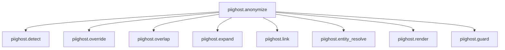

# Observation

`piighost` émet une trace OpenTelemetry à chaque anonymisation. Chaque appel
ouvre un span racine et un span enfant par étape du pipeline. On voit ainsi où
une PII a été détectée, comment elle a été liée, quel token l'a remplacée et si
le guard rail a laissé passer. Le traçage est optionnel et n'est jamais requis
pour anonymiser.

!!! note
    Les payloads des traces portent par défaut les valeurs de PII en clair, donc
    une trace fait aussi office de jeu de données d'annotation. Passez un
    `observation_redactor` pour caviarder ces valeurs avant d'envoyer les traces
    vers un backend en qui vous n'avez pas pleine confiance. Voir
    [Caviarder les payloads des traces](#caviarder-les-payloads-des-traces)
    plus bas.

## La couture du tracer

Le pipeline ne parle jamais directement à un backend de traçage. Il appelle
`get_tracer()` une fois à la construction, puis enregistre via le tracer
retourné.

```python
from piighost.observation import get_tracer

tracer = get_tracer()
with tracer.span("piighost.detect") as span:
    span.set_input(text)
    span.set_output(detections)
    span.set_attribute("count", len(detections))
```

`get_tracer()` retourne un tracer basé sur OpenTelemetry quand l'extra
`observation` est installé, et un tracer no-op sinon. Le tracer no-op
n'enregistre rien et ne coûte rien, donc le pipeline émet ses spans sans
condition, sans garde autour de chaque appel. Contrairement aux autres
dépendances optionnelles, un extra manquant dégrade vers le tracer no-op au lieu
de lever une exception, parce que le traçage ne doit jamais bloquer
l'anonymisation.

Un span est un gestionnaire de contexte qui porte un payload d'entrée, un
payload de sortie et des attributs scalaires. L'imbrication est implicite. Un
span ouvert à l'intérieur d'un autre devient son enfant via le contexte ambiant
d'OpenTelemetry, donc le pipeline ne fait pas transiter de poignée parente entre
ses étapes.

## Un span par étape

`AnonymizationPipeline.anonymize` ouvre un span racine `piighost.anonymize`,
puis un span enfant par étape exécutée. Une étape désactivée n'émet aucun span.
L'arbre d'un run complet est le suivant.



*L'arbre des spans d'une anonymisation. Les étapes optionnelles n'apparaissent que si elles sont configurées.*
{ .figure-caption }

Le span racine enregistre le texte d'entrée et le texte anonymisé final.
`detect` enregistre les détections et leur nombre. `link` enregistre les
entités. `render` enregistre le texte anonymisé et le nombre de tokens. `guard`
enregistre s'il a levé un drapeau et les labels vus. Le pipeline de thread émet
le même arbre depuis son propre `anonymize`, et un span `piighost.deanonymize`
quand il restaure un texte.

Les spans s'imbriquent sous le span courant au moment de l'appel `anonymize`.
Ouvrez un span applicatif autour d'une conversation et chaque appel du pipeline
se rend en dessous, comme une seule trace.

## Caviarder les payloads des traces

Par défaut un payload de span contient la PII en clair. Le span `detect`
enregistre `Patrick`{ .pii }, le span racine enregistre le texte d'entrée avec
`Patrick`{ .pii } à sa place. C'est délibéré. Une trace avec les valeurs en
clair est un jeu de données prêt à l'emploi pour évaluer la qualité de
détection.

C'est aussi une fuite si le backend n'a pas à connaître les PII. Passez un
`observation_redactor`, une placeholder factory, au constructeur du pipeline et
chaque payload est caviardé au travers avant de sortir du processus.

```python
from piighost.pipeline import AnonymizationPipeline
from piighost.components.placeholder import LabelPlaceholderFactory

redactor = LabelPlaceholderFactory()
pipeline = AnonymizationPipeline(
    detector,
    linker,
    anonymizer,
    observation_redactor=redactor,
)
```

Avec le redactor défini, le span `detect` enregistre `<<PERSON>>`{ .placeholder }
au lieu de `Patrick`{ .pii }, et le payload d'entrée montre le texte caviardé. Le
compromis est direct. Une trace caviardée est sûre à envoyer vers n'importe quel
backend mais ne peut plus servir de jeu de données d'annotation, puisque les
valeurs en clair ont disparu.

<div class="wide-table" markdown="1">

| `observation_redactor` | Payloads des traces | Sûr pour un backend non fiable | Utilisable comme jeu de données |
|---|---|---|---|
| `None` (défaut) | valeurs de PII en clair | non | oui |
| une placeholder factory | tokens caviardés | oui | non |

</div>

## La corrélation avec un backend est de la configuration de déploiement, pas du code de la lib

`piighost` émet des spans OpenTelemetry standard et s'arrête là. Il ne fournit
aucun adapter par backend. Le backend qui reçoit les spans relève de la
configuration du SDK OpenTelemetry de l'application, posée une fois au
déploiement, en dehors de `piighost`.

N'importe quel exporteur OTLP fonctionne tel quel. Les spans atteignent le
`TracerProvider` que l'application a enregistré. Sans provider configuré, l'API
OpenTelemetry est un no-op et les spans ne vont nulle part.

Langfuse est une cible courante parce que son SDK v3 est bâti sur OpenTelemetry.
Pointez-le vers le processus et il capture les spans `piighost` à côté des
siens. Son filtre d'export par défaut ne laisse passer que ses propres spans et
des instrumenteurs LLM connus, donc admettez le scope d'instrumentation
`piighost` via le prédicat `should_export_span` du SDK.

```python
from langfuse import Langfuse

def export_piighost_spans(span) -> bool:
    scope = span.instrumentation_scope
    if scope is None:
        return False
    return (
        scope.name == "langfuse-sdk"
        or scope.name == "piighost"
        or scope.name.startswith("piighost.")
    )

client = Langfuse(should_export_span=export_piighost_spans)
```

Les payloads sont sérialisés sous les clés d'attributs que Langfuse mappe vers
l'entrée et la sortie d'une observation, donc ils s'y rendent richement.
N'importe quel autre backend OTLP les montre comme de simples attributs de span.
Rien de tout cela ne vit dans `piighost`, c'est le câblage SDK que vous faites
déjà pour le reste de votre stack.

La version complète et exécutable, avec repli console quand aucun credential
Langfuse n'est présent, est dans `examples/observation/langfuse_tracing.py`.

## Voir aussi

- [Architecture](architecture.md) : chaque étape du pipeline émet un span.
- [Placeholder factories](placeholder-factories.md) : les factories utilisables comme `observation_redactor`.
- [Sécurité](security.md) : ce qu'une trace peut laisser fuir et comment le borner.
