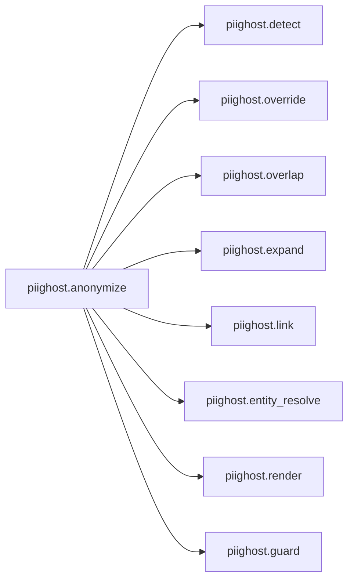

# Observation

`piighost` émet une trace OpenTelemetry à chaque dé-identification. Chaque appel
ouvre un span racine et un span enfant par étape du pipeline. On voit ainsi où
une valeur a été détectée, comment elle a été liée, quel jeton l'a remplacée et si
le garde-fou a laissé passer. Le traçage est optionnel et n'est jamais requis
pour dé-identifier.

!!! note
    Les payloads des traces portent par défaut les valeurs en clair, donc
    une trace fait aussi office de jeu de données d'annotation. Passez un
    `observation_redactor` pour caviarder ces valeurs avant d'envoyer les traces
    vers un backend en qui vous n'avez pas pleine confiance. Voir
    [Caviarder les payloads des traces](#caviarder-les-payloads-des-traces)
    plus bas.

## La couture du tracer

Le pipeline ne parle jamais directement à un backend de traçage. Il appelle
`get_tracer()` une fois à la construction, puis enregistre via le tracer
retourné.

```python
--8<-- "snippets/observation_tracer.py:example"
```

`get_tracer()` retourne un tracer basé sur OpenTelemetry quand l'extra
`observation` est installé, et un tracer no-op sinon. Le tracer no-op
n'enregistre rien et ne coûte rien, donc le pipeline émet ses spans sans
condition, sans garde autour de chaque appel. Contrairement aux autres dépendances optionnelles, l'absence de l'extra `observation` ne lève pas d'exception.
`get_tracer()` se rabat alors sur le tracer no-op, parce que le traçage ne doit
jamais bloquer la dé-identification.

Un span est un gestionnaire de contexte qui porte un payload d'entrée, un
payload de sortie et des attributs scalaires. L'imbrication est implicite. Un span ouvert à l'intérieur d'un autre devient son enfant via le contexte ambiant
d'OpenTelemetry. Le pipeline n'a donc pas à passer le span parent d'une étape à
l'autre.

## Un span par étape

`AnonymizationPipeline.anonymize` ouvre un span racine `piighost.anonymize`,
puis un span enfant par étape exécutée. Une étape désactivée n'émet aucun span.
L'arbre d'un run complet est le suivant.


```mermaid
flowchart LR
    A[piighost.anonymize] --> B[piighost.detect]
    A --> C[piighost.override]
    A --> D[piighost.overlap]
    A --> E[piighost.expand]
    A --> F[piighost.link]
    A --> G[piighost.entity_resolve]
    A --> H[piighost.render]
    A --> I[piighost.guard]
```

*L'arbre des spans d'une dé-identification. Les étapes optionnelles n'apparaissent que si elles sont configurées.*
{ .figure-caption }

Le span racine enregistre le texte d'entrée et le texte dé-identifié final.
`detect` enregistre les détections et leur nombre. `link` enregistre les
entités. `render` enregistre le texte dé-identifié et le nombre de jetons. `guard`
enregistre s'il a levé un drapeau et les labels vus. Le pipeline de conversation
diffère. Il exécute la résolution de chevauchement et l'expansion dans
`_detect`, et la résolution d'entités dans `_thread_tokens`. Aucune de ces étapes
n'obtient donc de span propre, et seuls `detect`, `link` et `render` restent sous
la racine. Le span racine et le span `detect` portent aussi un attribut
`cache_hit` et un `langfuse.session.id`. Le pipeline de conversation émet
aussi un span `piighost.deanonymize` quand il restaure un texte.

Les spans s'imbriquent sous le span courant au moment de l'appel `anonymize`.
Si vous ouvrez un span applicatif autour d'une conversation, chaque appel du
pipeline s'affiche en dessous, et l'ensemble forme une seule trace.

## Caviarder les payloads des traces

Par défaut un payload de span contient les données confidentielles (données personnelles, secrets) en clair. Le span `detect`
enregistre `Patrick`{ .pii }. Le span racine enregistre le texte d'entrée, où
`Patrick`{ .pii } figure en clair. C'est délibéré. Une trace avec les valeurs en
clair est un jeu de données prêt à l'emploi pour évaluer la qualité de
détection.

C'est aussi une fuite si le backend n'a pas à connaître les données confidentielles. Passez un
`observation_redactor` au constructeur du pipeline. C'est une placeholder
factory, qui caviarde chaque payload avant qu'il sorte du processus.

```python
--8<-- "snippets/observation_redactor.py:example"
```

Avec le masqueur défini, le span `detect` enregistre `<<PERSON>>`{ .placeholder }
au lieu de `Patrick`{ .pii }, et le payload d'entrée montre le texte caviardé. Le
compromis est direct. Une trace caviardée est sûre à envoyer vers n'importe quel
backend mais ne peut plus servir de jeu de données d'annotation, puisque les
valeurs en clair ont disparu.

<div class="wide-table" markdown="1">

| `observation_redactor` | Payloads des traces | Sûr pour un backend non fiable | Utilisable comme jeu de données |
|---|---|---|---|
| `None` (défaut) | valeurs en clair | non | oui |
| une placeholder factory | jetons caviardés | oui | non |

</div>

Le traçage en clair reste le défaut, pour que les traces gardent leur valeur d'annotation. Il doit cependant rester un choix explicite. Sans masqueur et avec un tracer provider réellement configuré, le pipeline avertit une fois à la construction que ses traces portent des données confidentielles en clair. Passez `trace_clear_text=True` pour assumer le traçage en clair et taire l'avertissement, ou un `observation_redactor` pour caviarder les payloads.

```python
--8<-- "snippets/observation_clear_text.py:example"
```

## La corrélation avec un backend est de la configuration de déploiement, pas du code de la lib

`piighost` émet des spans OpenTelemetry standard et s'arrête là. Il ne fournit
aucun adapter par backend. Le backend qui reçoit les spans relève de la
configuration du SDK OpenTelemetry de l'application, posée une fois au
déploiement, en dehors de `piighost`.

N'importe quel exporteur OTLP fonctionne tel quel. Les spans atteignent le
`TracerProvider` que l'application a enregistré. Sans provider configuré, l'API
OpenTelemetry est un no-op et les spans ne vont nulle part.

Langfuse est une cible courante parce que son SDK v3 est bâti sur OpenTelemetry.
Pointez-le vers le processus et il capture les spans `piighost` à côté des
siens. Son filtre d'export par défaut ne laisse passer que ses propres spans et
ceux des instrumenteurs LLM connus. Admettez donc le scope d'instrumentation
`piighost` via le prédicat `should_export_span` du SDK.

```python
--8<-- "snippets/observation_langfuse.py"
```

Les payloads sont sérialisés sous les clés d'attributs que Langfuse mappe vers
l'entrée et la sortie d'une observation. Langfuse les affiche donc dans ces deux
champs.
N'importe quel autre backend OTLP les montre comme de simples attributs de span.
Ce câblage ne vit pas dans `piighost`. C'est le câblage SDK que vous faites
déjà pour le reste de votre stack.

La version complète et exécutable, avec repli console quand aucun credential
Langfuse n'est présent, est dans `examples/observation/langfuse_tracing.py`.

## Voir aussi

- [Architecture](architecture.md) : chaque étape du pipeline émet un span.
- [Fabriques de placeholders](placeholder-factories.md) : les factories utilisables comme `observation_redactor`.
- [Sécurité](security.md) : ce qu'une trace peut laisser fuir et comment le borner.
