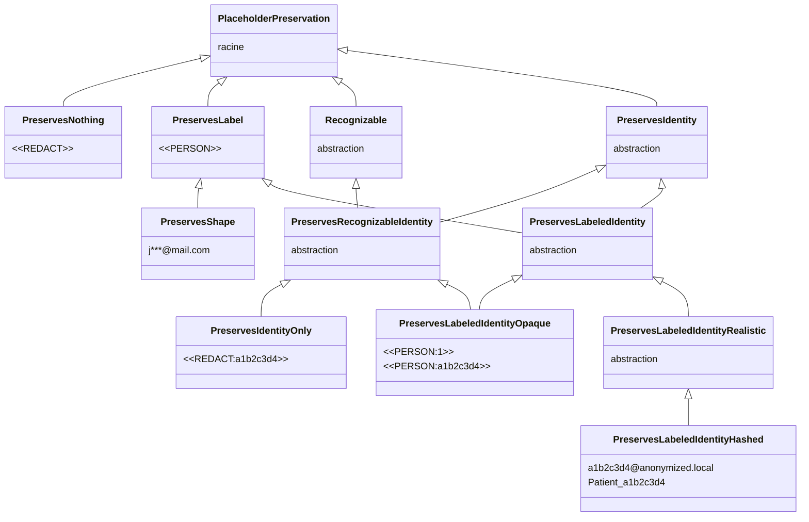

# Placeholder factories

Un *placeholder* est le token synthétique qui prend la place d'une PII détectée avant que le texte n'atteigne le LLM. Au lieu d'envoyer `Patrick habite à Paris`{ .pii } au LLM, le pipeline transmet `<<PERSON:1>>`{ .placeholder } `habite à`  `<<LOCATION:1>>`{ .placeholder }. Les valeurs originales restent dans la mémoire de conversation, le LLM ne les voit jamais.

!!! note "Pourquoi le nom placeholder factory"

    *Placeholder* parce que le token tient la place de la valeur originale. On aurait pu dire *token*, mais ce mot est déjà surchargé côté LLM (tokens de langage). *Factory* parce que le composant fabrique ces tokens à la volée, en fonction des entités détectées dans chaque message.

Une **placeholder factory** décide de la forme de ces tokens et de la quantité d'information qu'ils transportent. Deux questions structurent le choix.

1. *Le token est-il unique par entité ?* `Patrick`{ .pii } et `Marie`{ .pii } ne doivent pas se ramener au même `<<PERSON>>`{ .placeholder } générique, sinon le LLM ne peut pas les distinguer. Un token unique par entité permet au modèle de raisonner sur les relations, *le manager est-il la même personne que `Patrick`{ .pii } ?* devient *`<<PERSON:1>>`{ .placeholder } est-il `<<PERSON:2>>`{ .placeholder } ?* et a une réponse claire.
2. *Le token est-il réversible et retrouvable ?* À partir du token seul, sans consulter la mémoire, peut-on récupérer la valeur originale, et peut-on relocaliser le token dans un texte que le pipeline n'a pas produit ? C'est la condition du remplacement de chaîne que le middleware fait sur les arguments d'outil. Si deux entités se confondent dans un même `<<PERSON>>`{ .placeholder }, on ne sait pas laquelle restaurer.

Cinq familles de factories se placent à des points différents de ce spectre, et le choix a des conséquences directes sur les `ToolCallStrategy` utilisables sans risque. Voir [Stratégies d'appel outil](tool-call-strategies.md) pour le côté runtime.

- **Aucune information** (`<<REDACT>>`{ .placeholder }) : un token constant qui ne révèle rien au LLM. Caviardage classique. Aucun raisonnement possible sur les entités, le modèle ne peut pas voir que la valeur était une ville et décider d'appeler l'outil `get_weather`.
- **Type seul** (`<<PERSON>>`{ .placeholder }, `<<EMAIL>>`{ .placeholder }) : le type est révélé, pas l'identité. Plusieurs personnes dans une même conversation se confondent dans le même `<<PERSON>>`{ .placeholder }, donc les références croisées se cassent.
- **Type + id (opaque)** (`<<PERSON:1>>`{ .placeholder }, `<<PERSON:a1b2c3d4>>`{ .placeholder }) : type révélé, identité stable, token manifestement synthétique. Le LLM sait que `<<PERSON:1>>`{ .placeholder } et `<<PERSON:2>>`{ .placeholder } sont deux personnes différentes. Unique, donc réversible par remplacement de chaîne.
- **Id seul** (`<<REDACT:a1b2c3d4>>`{ .placeholder }) : un hash unique par entité, sans révéler le type. Le LLM voit qu'il y a deux entités distinctes mais ignore si ce sont des personnes, des emails ou des cartes. Garde la réversibilité côté outil sans donner d'indice sémantique au modèle.
- **Valeur partielle** (`j***@mail.com`{ .placeholder }) : le format est conservé mais une partie du contenu réel reste visible. Le LLM voit que c'est un email, devine peut-être le domaine, mais pas l'adresse complète. Plus risqué côté confidentialité (fragments réels) et côté réversibilité (collisions possibles).

!!! note "Convention de format des tokens"

    Les tokens de cette documentation suivent une règle simple.

    - **Token synthétique** (qui ne ressemble à aucune PII réelle), encadré par `<<` et `>>`. Exemples : `<<REDACT>>`{ .placeholder }, `<<PERSON>>`{ .placeholder }, `<<PERSON:1>>`{ .placeholder }, `<<PERSON:a1b2c3d4>>`{ .placeholder }, `<<REDACT:a1b2c3d4>>`{ .placeholder }. Les délimiteurs servent deux objectifs. Un LLM ou un humain qui relit ne confond jamais le token avec un mot du texte ou une balise HTML/XML émise par le modèle. Et le middleware peut retrouver le token pour faire son remplacement de chaîne, y compris repérer un token que le modèle aurait inventé.
    - **Token qui réplique un format de PII** (réaliste hashé, masqué), sans délimiteur. Exemples : `a1b2c3d4@anonymized.local`{ .placeholder }, `Patient_a1b2c3d4`{ .placeholder }, `j***@mail.com`{ .placeholder }. L'absence de délimiteur est délibérée, le but est de paraître naturel pour qu'un outil aval qui valide le format (regex email, longueur de carte) accepte le token.

    La règle vaut aussi pour toute factory que vous écrirez. Token purement opaque, encadrez-le. Token qui imite une vraie valeur, laissez-le brut.

---

## Détail des familles

### Aucune information : destruction totale

Le token est un marqueur fixe, par exemple `<<REDACT>>`{ .placeholder }. Le LLM apprend *qu'une* information a été retirée mais rien sur son type, son nombre ni ses relations. La conversation perd toutes ses références internes. Un agent qui doit traiter *envoyer la facture au client* ne peut pas savoir si le client est celui cité plus tôt ou un nouveau. Utile pour la rédaction d'archive, inutile dès qu'un agent doit raisonner.

Built-in : `RedactPlaceholderFactory` (sortie `<<REDACT>>`{ .placeholder }, délimiteurs paramétrables). Tag `PreservesNothing`.

### Type seul : type connu, identités confondues

`<<PERSON>>`{ .placeholder }, `<<EMAIL>>`{ .placeholder }. Le LLM sait qu'il s'agit d'une personne, d'un email, d'une carte, et peut répondre aux questions qui dépendent du seul type. Mais deux personnes différentes dans la même conversation se confondent dans le même token. Le mode d'échec classique est la référence croisée, *`Patrick`{ .pii } est-il la même personne que le manager cité plus tôt ?* devient *`<<PERSON>>`{ .placeholder } est-il le même que `<<PERSON>>`{ .placeholder } ?*, ce qui est sans réponse.

Built-in : `LabelPlaceholderFactory` (sortie `<<PERSON>>`{ .placeholder }). Tag `PreservesLabel`.

### Type + id (opaque)

`<<PERSON:1>>`{ .placeholder }, `<<PERSON:a1b2c3d4>>`{ .placeholder }. La chaîne n'est manifestement *pas* une personne, un email ou un numéro de carte, c'est un token. Le LLM ne peut pas la confondre avec une donnée réelle, les logs d'audit se parcourent facilement, et il y a **zéro chance** de collision avec une vraie valeur. Ses délimiteurs le rendent aussi retrouvable, ce qui permet de repérer un token que le modèle aurait inventé. Compromis, un prompt ou un outil aval strict qui exige *l'argument doit ressembler à un email* rejettera ces tokens.

Built-in : `LabelCounterPlaceholderFactory` (`<<PERSON:1>>`{ .placeholder }) et `LabelHashPlaceholderFactory` (`<<PERSON:a1b2c3d4>>`{ .placeholder }). Les deux numérotent les entités par label dans l'ordre, la première personne devient l'ordinal 1, la deuxième 2, un email démarre son propre compte à 1. `LabelHashPlaceholderFactory` affiche cet ordinal sous forme de hash. Le hash est un sha256 de la chaîne `label:ordinal`, jamais de la valeur, uniquement pour l'apparence opaque, donc deux entités consécutives paraissent sans lien. Tag `PreservesLabeledIdentityOpaque`.

### Id seul : identité sans type

`<<REDACT:a1b2c3d4>>`{ .placeholder }. Le token garde la forme synthétique `<<...>>` mais ne révèle pas le label, tout en portant un hash unique par entité. Le LLM ignore si l'entité est une personne, un email ou une carte, mais voit que `<<REDACT:a1b2c3d4>>`{ .placeholder } et `<<REDACT:ef98abcd>>`{ .placeholder } sont deux entités différentes. C'est l'un des niveaux les plus protecteurs qui reste utilisable côté outil, le hash étant unique le remplacement de chaîne fonctionne.

Pas de built-in pour cette branche. Le tag `PreservesIdentityOnly` est prévu pour une factory que vous écrivez, un caviardage hashé sans préfixe de label. Voir la section *Écrire la sienne* plus bas.

### Type + id (réaliste hashé)

Une factory utilisateur peut produire des valeurs **qui ressemblent au format d'origine** mais dont le contenu est piloté par un hash, par exemple `a1b2c3d4@anonymized.local`{ .placeholder } pour un email, ou `Patient_a1b2c3d4`{ .placeholder } pour un nom. Le token passe la validation de format de base (regex email, longueur, caractères autorisés), donc les outils et les templates de prompt aval qui attendent une valeur d'apparence réelle continuent de fonctionner. Comme le contenu est un hash, le token est **unique et ne peut pas coïncider par hasard** avec une vraie valeur existante.

Pas de built-in. Tag `PreservesLabeledIdentityHashed`. Voir la section *Écrire la sienne* plus bas pour un exemple complet. Ce tag n'est pas retrouvable, le middleware ne peut donc pas repérer un token inventé sous cette forme, à considérer avant de l'utiliser sous middleware.

### Valeur partielle : fuite partielle de valeur

`j***@mail.com`{ .placeholder }, `****4567`{ .placeholder }, `P******`{ .placeholder }. Le token conserve *une partie* de la valeur originale, le domaine de l'email, les quatre derniers chiffres d'une carte, la première lettre d'un nom. Le LLM peut raisonner au-delà du type, *l'email est sur le domaine de l'entreprise*, *la carte se termine en 4567*, *le nom commence par P*. Deux compromis viennent avec.

1. **Des fragments réels de la PII atteignent le LLM.** Il ne peut pas reconstruire la valeur complète, mais `j***@mail.com`{ .placeholder } situe déjà l'utilisateur chez un fournisseur de mail connu.
2. **Des collisions sont possibles.** Deux cartes différentes terminant par `4567` se confondent dans `****4567`{ .placeholder }, deux emails partageant la première lettre et le domaine deviennent identiques. Le token est *majoritairement* unique, sans garantie.

Built-in : `MaskPlaceholderFactory`, qui garde par défaut le premier caractère de la valeur et masque le reste avec `*`, donc `Jonathan`{ .pii } devient `J*******`{ .placeholder }. Tag `PreservesShape`. Le middleware le rejette pour la même raison que `PreservesLabel`, un token ambigu ne peut pas être désanonymisé par remplacement de chaîne.

---

## Tags de préservation

Chaque factory porte un **type fantôme** qui résume le niveau de préservation de ses tokens. C'est ce tag que le type-checker lit pour valider une factory face à ses consommateurs. Un type fantôme est un paramètre générique qui n'existe qu'à la vérification de types, il n'influe pas sur l'exécution.

**Identité de chaque famille.**

| Famille | Exemple | Tag |
|---|---|---|
| Aucune information | `<<REDACT>>`{ .placeholder } | `PreservesNothing` |
| Type seul | `<<PERSON>>`{ .placeholder } | `PreservesLabel` |
| Type + id (opaque) | `<<PERSON:1>>`{ .placeholder }, `<<PERSON:a1b2c3d4>>`{ .placeholder } | `PreservesLabeledIdentityOpaque` |
| Id seul | `<<REDACT:a1b2c3d4>>`{ .placeholder } | `PreservesIdentityOnly` |
| Type + id (réaliste hashé) | `a1b2c3d4@anonymized.local`{ .placeholder }, `Patient_a1b2c3d4`{ .placeholder } | `PreservesLabeledIdentityHashed` |
| Valeur partielle | `j***@mail.com`{ .placeholder }, `****4567`{ .placeholder } | `PreservesShape` |

Deux angles de lecture, deux tableaux. **Confidentialité**, ce qui fuit vers le LLM, point de vue attaquant et privacy. **Exploitation**, ce que l'agent et le système peuvent faire avec le token, point de vue capacités fonctionnelles. La même réponse peut être bonne d'un côté et problématique de l'autre, c'est la tension qu'on rend explicite.

Code couleur commun aux deux tables, bleu = meilleur, vert = correct, jaune = partiel, rouge = problématique.

#### Confidentialité (ce qui fuit vers le LLM)

<table class="security-table" markdown="1">
<thead>
<tr><th>Famille</th><th>Type vu ?</th><th>PII distinguées ?</th><th>Fuite de valeur ?</th><th>Collision avec une vraie valeur ?</th></tr>
</thead>
<tbody>
<tr><td>Aucune information</td><td class="c-blue">non</td><td class="c-blue">non</td><td class="c-blue">aucune</td><td class="c-blue">non</td></tr>
<tr><td>Type seul</td><td class="c-green">oui</td><td class="c-blue">non</td><td class="c-blue">aucune</td><td class="c-blue">non</td></tr>
<tr><td>Type + id (opaque)</td><td class="c-green">oui</td><td class="c-green">oui</td><td class="c-blue">aucune</td><td class="c-blue">non</td></tr>
<tr><td>Id seul</td><td class="c-blue">non</td><td class="c-green">oui</td><td class="c-blue">aucune</td><td class="c-blue">non</td></tr>
<tr><td>Type + id (réaliste hashé)</td><td class="c-green">oui</td><td class="c-green">oui</td><td class="c-blue">aucune</td><td class="c-blue">non</td></tr>
<tr><td>Valeur partielle</td><td class="c-green">oui</td><td class="c-green">oui</td><td class="c-yellow">partielle</td><td class="c-yellow">risque</td></tr>
</tbody>
</table>

#### Exploitation par le LLM et l'agent

<table class="security-table" markdown="1">
<thead>
<tr><th>Famille</th><th>Raisonner sur le type</th><th>Suivre les références entre entités</th><th>Réversible côté outil</th><th>Token retrouvable</th></tr>
</thead>
<tbody>
<tr><td>Aucune information</td><td class="c-red">non</td><td class="c-red">non</td><td class="c-red">non</td><td class="c-green">oui</td></tr>
<tr><td>Type seul</td><td class="c-blue">oui</td><td class="c-red">non</td><td class="c-red">non</td><td class="c-green">oui</td></tr>
<tr><td>Type + id (opaque)</td><td class="c-blue">oui</td><td class="c-blue">oui</td><td class="c-blue">oui</td><td class="c-blue">oui</td></tr>
<tr><td>Id seul</td><td class="c-red">non</td><td class="c-blue">oui</td><td class="c-blue">oui</td><td class="c-blue">oui</td></tr>
<tr><td>Type + id (réaliste hashé)</td><td class="c-blue">oui</td><td class="c-blue">oui</td><td class="c-blue">oui</td><td class="c-red">non</td></tr>
<tr><td>Valeur partielle</td><td class="c-blue">oui</td><td class="c-yellow">majoritairement</td><td class="c-yellow">oui (collisions)</td><td class="c-red">non</td></tr>
</tbody>
</table>

<small>
Légende :
<span class="sec-legend c-blue">meilleur</span>
<span class="sec-legend c-green">correct</span>
<span class="sec-legend c-yellow">partiel</span>
<span class="sec-legend c-red">problématique</span>
</small>

Les tags forment une **hiérarchie d'héritage** que le type-checker exploite via la covariance de `AnyPlaceholderFactory[PreservationT_co]`. Une factory taguée plus spécifiquement satisfait donc un consommateur qui en demande une plus lâche. Trois axes indépendants organisent la taxonomie. *Label*, le token révèle le type. *Identity*, le token est unique par entité. *Recognizable*, la factory peut retrouver son token dans un texte arbitraire, ce qu'un token délimité permet et un token réaliste non.

`PreservesLabeledIdentity` combine label et identity par multi-héritage, une factory `<<PERSON:1>>`{ .placeholder } est donc à la fois un `PreservesLabel` *et* un `PreservesIdentity`. `PreservesRecognizableIdentity` croise l'identité et la retrouvabilité, c'est l'intersection sur laquelle le middleware se restreint. Un consommateur typé contre `PreservesRecognizableIdentity` accepte `PreservesIdentityOnly` et `PreservesLabeledIdentityOpaque`, et rejette `PreservesLabel`, `PreservesShape`, `PreservesNothing` qui n'ont pas la garantie d'unicité, ainsi que `PreservesLabeledIdentityHashed` qui n'est pas retrouvable.



*Hiérarchie des tags de préservation. Chaque nœud porte un exemple de token, les nœuds abstraits servent d'intersection entre axes.*
{ .figure-caption }

`PreservesLabeledIdentity` hérite à la fois de `PreservesLabel` et de `PreservesIdentity`. C'est ce qui exprime le *A est un B mais tous les B ne sont pas des A*, tout `PreservesLabeledIdentity` est aussi un `PreservesLabel` et un `PreservesIdentity`, l'inverse est faux. `PreservesShape` étend `PreservesLabel`, un token masqué implique le label par son format mais ne garantit pas l'unicité, il reste donc un frère de l'identité. Chaque tag est une sous-classe de `str`, si bien qu'un token est une vraie chaîne qui porte son niveau de préservation dans son propre type.

Une factory déclare le tag **le plus spécifique** qui matche ses garanties.

```python
class LabelCounterPlaceholderFactory(BaseCounterPlaceholderFactory): ...  # PreservesLabeledIdentityOpaque
class LabelHashPlaceholderFactory(BaseCounterPlaceholderFactory): ...     # PreservesLabeledIdentityOpaque
class LabelPlaceholderFactory(AnyPlaceholderFactory[PreservesLabel]): ...
class MaskPlaceholderFactory(AnyPlaceholderFactory[PreservesShape]): ...
class RedactPlaceholderFactory(AnyPlaceholderFactory[PreservesNothing]): ...
# No built-in for the id-only branch nor the realistic hashed one,
# implement your own with PreservesIdentityOnly or PreservesLabeledIdentityHashed.
```

---

## Factories built-in

| Factory | Style | Mécanisme | Exemple de sortie | Tag |
|---|---|---|---|---|
| `RedactPlaceholderFactory` | Redact | aucun | `<<REDACT>>`{ .placeholder } | `PreservesNothing` |
| `LabelPlaceholderFactory` | Label | aucun | `<<PERSON>>`{ .placeholder } | `PreservesLabel` |
| `LabelCounterPlaceholderFactory` (défaut) | Label | Counter | `<<PERSON:1>>`{ .placeholder } | `PreservesLabeledIdentityOpaque` |
| `LabelHashPlaceholderFactory` | Label | Hash | `<<PERSON:a1b2c3d4>>`{ .placeholder } | `PreservesLabeledIdentityOpaque` |
| `MaskPlaceholderFactory` | Mask | partial | `J*******`{ .placeholder } | `PreservesShape` |

Le naming suit le schéma `<Style><Mécanisme>PlaceholderFactory`.

- **Style**, ce que le token préserve, Redact = rien, Label = type, Mask = valeur partielle.
- **Mécanisme**, comment l'unicité est obtenue, Counter = compteur séquentiel par label, Hash = sha256 de `label:ordinal` rendu en hex. Absent quand non pertinent.

`LabelCounterPlaceholderFactory` et `LabelHashPlaceholderFactory` sont les valeurs sûres par défaut, réversibles et retrouvables. `RedactPlaceholderFactory`, `LabelPlaceholderFactory` et `MaskPlaceholderFactory` sont des outils de caviardage non réversibles, rejetés par le middleware. Les branches id seul et réaliste hashé n'ont pas de built-in, vous les écrivez avec le tag correspondant.

---

## Quel placeholder choisir ?

La placeholder factory est l'endroit où le **compromis confidentialité / capacité d'agent** est rendu explicite. Le bon choix dépend du contexte. Deux scénarios couvrent l'essentiel.

### Cas 1 : dé-identification simple (one-shot, archivage, conformité)

Le but est de produire une version assainie d'un document, caviardage d'un jugement, nettoyage d'un dossier RH avant archivage, export d'un jeu de données. Pas d'agent, pas d'outils, parfois même pas besoin de réversibilité.

| Besoin | Famille recommandée | Pourquoi |
|---|---|---|
| Effacer toute trace, sans réversibilité | **Aucune information** (`<<REDACT>>`{ .placeholder }) | Le plus protecteur, aucune fuite sémantique. Le document reste lisible mais le LLM ne peut rien en inférer. Built-in `RedactPlaceholderFactory`. |
| Garder un texte lisible, le lecteur humain voit `<<EMAIL>>`{ .placeholder } plutôt que `<<REDACT>>`{ .placeholder } | **Type seul** (`<<PERSON>>`{ .placeholder }, `<<EMAIL>>`{ .placeholder }) | Le type aide la lecture humaine sans rien fuiter de la valeur. Built-in `LabelPlaceholderFactory`. |
| Permettre une désanonymisation côté serveur | **Type + id (opaque)** (`<<PERSON:1>>`{ .placeholder }) | Réversible, audit trivial, aucune collision. Built-in `LabelCounterPlaceholderFactory` ou `LabelHashPlaceholderFactory`. |
| Suivre *qui est qui* sans révéler le type (médical, RH) | **Id seul** (`<<REDACT:a1b2c3d4>>`{ .placeholder }) | Distingue les entités sans indice sémantique. À implémenter, pas de built-in. |

### Cas 2 : dé-identification pour LLM ou agent avec outils

Le LLM raisonne sur la conversation, et les outils (CRM, BDD, mail) ont besoin des vraies valeurs au moment de l'appel. Le middleware fait du remplacement de chaîne sur les arguments d'outil, **il exige donc un token unique par entité et retrouvable**.

Conséquence directe, seules les familles avec identité préservée *et* grammaire retrouvable sont compatibles, c'est-à-dire l'id seul et le type + id opaque. `Aucune information`, `Type seul` et `Valeur partielle` sont rejetées au type-check. Le réaliste hashé préserve l'identité mais n'est pas retrouvable, il ne passe pas la contrainte du middleware.

| Besoin | Famille recommandée | Pourquoi |
|---|---|---|
| **Cas par défaut** | **Type + id (opaque)** (`<<PERSON:1>>`{ .placeholder }, `<<PERSON:a1b2c3d4>>`{ .placeholder }) | Réversible, retrouvable, opaque, zéro collision. La valeur sûre. Built-in `LabelCounterPlaceholderFactory` (compteur par thread) ou `LabelHashPlaceholderFactory` (hash de l'ordinal). |
| Réduction des biais (CV, candidature) | **Id seul** (`<<REDACT:a1b2c3d4>>`{ .placeholder }) | Le LLM ne voit pas le type, donc pas le genre ni l'origine inférables d'un prénom. Distingue les candidats sans biaiser le raisonnement. À implémenter. |
| Type sensible (catégorie médicale, niveau d'habilitation) | **Id seul** (`<<REDACT:a1b2c3d4>>`{ .placeholder }) | Même raison, le type lui-même est une PII et ne doit pas atteindre le LLM. À implémenter. |

À éviter dans un agent sous middleware.

- `LabelPlaceholderFactory` et `MaskPlaceholderFactory` sont rejetées par le middleware, pas d'unicité garantie. Utilisables hors middleware, ou en `ToolCallStrategy.PASSTHROUGH`, où l'agent ne reçoit jamais les vraies valeurs.
- Une factory réaliste hashée (`PreservesLabeledIdentityHashed`) préserve l'identité mais reste non retrouvable, donc le middleware ne peut pas repérer un token que le modèle inventerait. Réservez-la à la dé-identification hors agent, ou à un flux où l'invented-placeholder n'est pas un souci.

Le tag de préservation existe pour que ce choix soit visible par le type-checker, pas enseveli dans des détails de format. Une factory taguée `PreservesShape` ne peut pas être branchée sur le middleware *par accident*, l'erreur tombe à la vérification de types, pas sur le premier appel d'outil en production.

---

## Pourquoi `PIIAnonymizationMiddleware` exige une identité retrouvable

Le middleware travaille sur trois frontières, les **messages d'entrée** (LLM in), les **messages de sortie** (LLM out) et les **appels d'outil**. Les deux premières s'appuient sur la mémoire de conversation, les appels d'outil non.

**Messages d'entrée et sortie.** Quand `abefore_model` dé-identifie un message, le pipeline mémorise le mapping entité vers token. La réponse du LLM est restaurée en relisant ce mapping à l'envers. Cette opération fonctionne avec n'importe quelle factory, qu'il y ait ou non collision de tokens.

**Appels d'outil.** Le LLM produit les arguments d'outil en *combinant* et *paraphrasant* les tokens qu'il vient de voir. Ce texte précis n'a jamais été produit par le pipeline, il n'est donc pas mémorisé. La seule façon de le désanonymiser est le **remplacement de chaîne**, on parcourt les arguments à la recherche des tokens connus et on substitue la valeur originale de chaque entité. La logique est symétrique pour la réponse de l'outil, ré-anonymisée en remplaçant les valeurs PII connues par leur token.

Cette substitution n'est non ambiguë **que si chaque entité a un token unique**. Si deux entités se confondent dans `<<PERSON>>`{ .placeholder }, on ne sait pas quelle valeur restaurer. Le middleware exige en plus une **grammaire retrouvable**, une fois tous les tokens émis remplacés, tout token restant qui matche encore la grammaire a été inventé par le modèle et peut être refusé (voir [Stratégies d'appel outil](tool-call-strategies.md)). Le middleware restreint donc son type accepté à un pipeline dont les tokens sont `PreservesRecognizableIdentity`, ce qui via la covariance englobe `PreservesIdentityOnly` (redact hashé sans label) et `PreservesLabeledIdentityOpaque` (avec label). Brancher une factory `PreservesLabel`, `PreservesShape`, `PreservesNothing` ou `PreservesLabeledIdentityHashed` est rejeté par `pyrefly` avant même que le programme ne tourne.

`PIIAnonymizationMiddleware` reproduit la contrainte au runtime. À la construction, il demande au pipeline un *recognizer*, l'objet qui sait retrouver ses propres tokens. Une factory délimitée est son propre recognizer, une factory sans grammaire, comme un masque, n'en a pas et le middleware lève `UnrecognizableFactoryError`. Cela rattrape les pipelines non typés ou distants qui auraient contourné le type-checker.

Voir [Stratégies d'appel outil](tool-call-strategies.md) pour la seule échappatoire, `ToolCallStrategy.PASSTHROUGH`, qui ne traverse jamais la frontière outil en clair.

---

## Écrire la sienne

Il suffit d'hériter de `AnyPlaceholderFactory[<tag>]` avec le bon tag de préservation, puis d'implémenter `create()`.

???+ example "Factory id seul (id sans label) : `PreservesIdentityOnly`"

    ```python
    import uuid
    from collections.abc import Mapping

    from piighost.models import Entity
    from piighost.components.placeholder import AnyPlaceholderFactory
    from piighost.components.placeholder.tags import PreservesIdentityOnly


    class UUIDPlaceholderFactory(AnyPlaceholderFactory[PreservesIdentityOnly]):
        """Generate opaque delimited ids, e.g. <<a3f21b4c>>, no label revealed."""

        def create(self, entities: list[Entity]) -> Mapping[Entity, PreservesIdentityOnly]:
            tokens: dict[Entity, PreservesIdentityOnly] = {}
            seen: dict[str, PreservesIdentityOnly] = {}  # canonical value -> token

            for entity in entities:
                canonical = entity.text.lower()
                if canonical not in seen:
                    seen[canonical] = PreservesIdentityOnly(f"<<{uuid.uuid4().hex[:8]}>>")
                tokens[entity] = seen[canonical]

            return tokens
    ```

    Le token est délimité, donc retrouvable, et unique par entité. Cette factory est utilisable sous `PIIAnonymizationMiddleware`.

??? example "Factory format crochets (label + id) : `PreservesLabeledIdentityOpaque`"

    ```python
    from collections import defaultdict
    from collections.abc import Mapping

    from piighost.models import Entity
    from piighost.components.placeholder import AnyPlaceholderFactory
    from piighost.components.placeholder.tags import PreservesLabeledIdentityOpaque


    class BracketPlaceholderFactory(AnyPlaceholderFactory[PreservesLabeledIdentityOpaque]):
        """Generate tokens in the format [PERSON:1], [LOCATION:2], etc."""

        def create(
            self, entities: list[Entity]
        ) -> Mapping[Entity, PreservesLabeledIdentityOpaque]:
            tokens: dict[Entity, PreservesLabeledIdentityOpaque] = {}
            counters: dict[str, int] = defaultdict(int)

            for entity in entities:
                counters[entity.label] += 1
                inner = f"{entity.label}:{counters[entity.label]}"
                tokens[entity] = PreservesLabeledIdentityOpaque(f"[{inner}]")

            return tokens
    ```

??? example "Factory réaliste hashé : `PreservesLabeledIdentityHashed`"

    Cette factory produit une valeur d'apparence réelle dont le contenu vient d'un hash de la valeur d'origine, donc unique et sans collision. Le token n'a pas de grammaire délimitée, il n'est donc pas retrouvable, à réserver hors middleware.

    ```python
    import hashlib
    from collections.abc import Mapping

    from piighost.models import Entity
    from piighost.components.placeholder import AnyPlaceholderFactory
    from piighost.components.placeholder.tags import PreservesLabeledIdentityHashed


    class HashedEmailPlaceholderFactory(
        AnyPlaceholderFactory[PreservesLabeledIdentityHashed]
    ):
        """Generate realistic emails like a1b2c3d4@anonymized.local."""

        def create(
            self, entities: list[Entity]
        ) -> Mapping[Entity, PreservesLabeledIdentityHashed]:
            tokens: dict[Entity, PreservesLabeledIdentityHashed] = {}

            for entity in entities:
                digest = hashlib.sha256(entity.text.encode()).hexdigest()[:8]
                tokens[entity] = PreservesLabeledIdentityHashed(f"{digest}@anonymized.local")

            return tokens
    ```

---

## Voir aussi

- [Stratégies d'appel outil](tool-call-strategies.md) : comment le middleware utilise ces tokens, et pourquoi `PASSTHROUGH` est le seul mode qui tolère un tag plus faible.
- [Étendre PIIGhost](extending.md) : référence complète des protocoles et des autres points d'injection du pipeline.
- [Limites](limitations.md) : conséquences opérationnelles du choix de factory.
