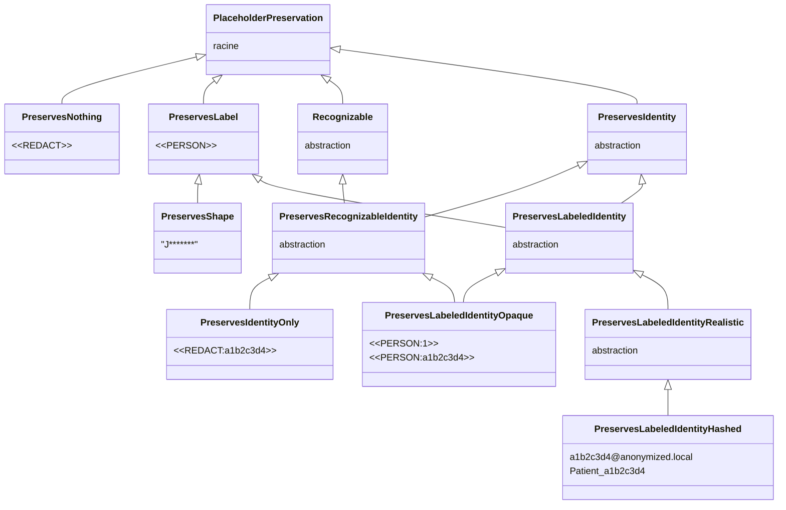

# Fabriques de placeholders

Un *placeholder* est le jeton synthétique qui prend la place d'une valeur détectée avant que le texte n'atteigne le LLM. Au lieu d'envoyer `Patrick`{ .pii } habite à `Paris`{ .pii } au LLM, le pipeline transmet `<<PERSON:1>>`{ .placeholder } habite à `<<LOCATION:1>>`{ .placeholder }. Les valeurs originales restent dans la mémoire de conversation, le LLM ne les voit jamais.

!!! note "Pourquoi le nom placeholder factory"

    *Placeholder* parce que le jeton tient la place de la valeur originale. Le nom anglais aurait pu être *token*, mais ce mot est déjà surchargé côté LLM (tokens de langage). *Factory* parce que le composant fabrique ces jetons à la volée, en fonction des entités détectées dans chaque message.

Une **placeholder factory** décide de la forme de ces jetons et de la quantité d'information qu'ils transportent. Deux questions structurent le choix.

1. *Le jeton est-il unique par entité ?* `Patrick`{ .pii } et `Marie`{ .pii } ne doivent pas se ramener au même `<<PERSON>>`{ .placeholder } générique, sinon le LLM ne peut pas les distinguer. Un jeton unique par entité permet au modèle de raisonner sur les relations. La question *le manager est-il la même personne que `Patrick`{ .pii } ?* devient *`<<PERSON:1>>`{ .placeholder } est-il `<<PERSON:2>>`{ .placeholder } ?*, et elle a une réponse claire.

2. *Le jeton est-il réversible et retrouvable ?* Le jeton désigne-t-il une seule valeur dans la mémoire de la conversation, et peut-on le relocaliser dans un texte que le pipeline n'a pas produit ? La restauration a besoin de ces deux propriétés, qu'elle porte sur la réponse du modèle ou sur les arguments d'un outil. Si deux entités se confondent dans un même `<<PERSON>>`{ .placeholder }, on ne sait pas laquelle restaurer.

Six familles de factories se placent à des points différents de ce spectre, et le choix a des conséquences directes sur les `ToolCallStrategy` utilisables sans risque. Voir [Stratégies d'appel outil](tool-call-strategies.md) pour le côté exécution.

- **Aucune information** (`<<REDACT>>`{ .placeholder }) : un jeton constant qui ne révèle rien au LLM. Caviardage classique. Aucun raisonnement n'est possible sur les entités. Par exemple, le modèle ne peut pas voir que la valeur était une ville et décider d'appeler l'outil `get_weather`.

- **Type seul** (`<<PERSON>>`{ .placeholder }, `<<EMAIL>>`{ .placeholder }) : le type est révélé, pas l'identité. Plusieurs personnes dans une même conversation se confondent dans le même `<<PERSON>>`{ .placeholder }, donc les références croisées se cassent.

- **Type + id (opaque)** (`<<PERSON:1>>`{ .placeholder }, `<<PERSON:a1b2c3d4>>`{ .placeholder }) : type révélé, identité stable, jeton manifestement synthétique. Le LLM sait que `<<PERSON:1>>`{ .placeholder } et `<<PERSON:2>>`{ .placeholder } sont deux personnes différentes. Unique, donc réversible par remplacement de chaîne.

- **Id seul** (`<<REDACT:a1b2c3d4>>`{ .placeholder }) : un hash unique par entité, sans révéler le type. Le LLM voit qu'il y a deux entités distinctes mais ignore si ce sont des personnes, des emails ou des cartes. Garde la réversibilité côté outil sans donner d'indice sémantique au modèle.

- **Valeur partielle** (`J*******`{ .placeholder } pour `Jonathan`{ .pii }) : une partie du contenu réel reste visible, ici la première lettre et la longueur. Le LLM voit le début de la valeur, pas la valeur complète. Plus risqué côté confidentialité (fragments réels) et côté réversibilité (collisions possibles).

!!! note "Convention de format des jetons"

    Les jetons de cette documentation suivent une règle simple.

    - **Jeton synthétique** (qui ne ressemble à aucune valeur réelle), encadré par `<<` et `>>`. Par exemple `<<REDACT>>`{ .placeholder }, `<<PERSON>>`{ .placeholder }, `<<PERSON:1>>`{ .placeholder }, `<<PERSON:a1b2c3d4>>`{ .placeholder }, `<<REDACT:a1b2c3d4>>`{ .placeholder }. Les délimiteurs servent deux objectifs. Un LLM ou un humain qui relit ne confond jamais le jeton avec un mot du texte ou une balise HTML/XML émise par le modèle. Et le middleware peut retrouver le jeton pour faire son remplacement de chaîne, y compris repérer un jeton que le modèle aurait inventé.
    - **Jeton qui réplique le format d'une valeur réelle** (réaliste hashé, masqué), sans délimiteur. Par exemple `a1b2c3d4@anonymized.local`{ .placeholder }, `Patient_a1b2c3d4`{ .placeholder }, `j***@mail.com`{ .placeholder }. L'absence de délimiteur est délibérée. Le jeton doit paraître naturel, pour qu'un outil aval qui valide le format (regex email, longueur de carte) l'accepte.

    La règle vaut aussi pour toute factory que vous écrirez. Jeton purement opaque, encadrez-le. Jeton qui imite une vraie valeur, laissez-le brut.

---

## Détail des familles

### Aucune information, destruction totale

Le jeton est un marqueur fixe, par exemple `<<REDACT>>`{ .placeholder }. Le LLM apprend *qu'une* information a été retirée mais rien sur son type, son nombre ni ses relations. La conversation perd toutes ses références internes. Un agent qui doit traiter *envoyer la facture au client* ne peut pas savoir si le client est celui cité plus tôt ou un nouveau.

Utile pour le caviardage d'archive, inutile dès qu'un agent doit raisonner.

- Intégrée : `RedactPlaceholderFactory` (sortie `<<REDACT>>`{ .placeholder }, délimiteurs paramétrables).
- Tag de préservation : `PreservesNothing`.

### Type seul, identités confondues

`<<PERSON>>`{ .placeholder }, `<<EMAIL>>`{ .placeholder }. Le LLM sait qu'il s'agit d'une personne, d'un email, d'une carte, et peut répondre aux questions qui dépendent du seul type. Mais deux personnes différentes dans la même conversation se confondent dans le même jeton.

Le mode d'échec classique est la référence croisée. La question *`Patrick`{ .pii } est-il la même personne que le manager cité plus tôt ?* devient *`<<PERSON>>`{ .placeholder } est-il le même que `<<PERSON>>`{ .placeholder } ?*, et cette question n'a pas de réponse.

- Intégrée : `LabelPlaceholderFactory` (sortie `<<PERSON>>`{ .placeholder }).
- Tag de préservation : `PreservesLabel`.

### Type + id (opaque)

`<<PERSON:1>>`{ .placeholder }, `<<PERSON:a1b2c3d4>>`{ .placeholder }. La chaîne n'est manifestement *pas* une personne, un email ou un numéro de carte, c'est un jeton. Le LLM ne peut pas la confondre avec une donnée réelle, les logs d'audit se parcourent facilement, et il y a **zéro chance** de collision avec une vraie valeur.

Ses délimiteurs rendent aussi le jeton retrouvable. On peut ainsi repérer un jeton que le modèle aurait inventé.

En contrepartie, un prompt ou un outil aval strict qui exige *l'argument doit ressembler à un email* rejettera ces jetons.

- Intégrées : `LabelCounterPlaceholderFactory` (`<<PERSON:1>>`{ .placeholder }) et `LabelHashPlaceholderFactory` (`<<PERSON:a1b2c3d4>>`{ .placeholder }).
- Tag de préservation : `PreservesLabeledIdentityOpaque`.

Les deux numérotent les entités par label, dans l'ordre. La première personne devient l'ordinal 1, la deuxième 2, et un email démarre son propre compte à 1.

`LabelHashPlaceholderFactory` affiche cet ordinal sous forme de hash. Le hash est un sha256 de la chaîne `label:ordinal`, jamais de la valeur. Il ne sert qu'à donner une apparence opaque, pour que deux entités consécutives paraissent sans lien.

### Id seul, identité sans type

`<<REDACT:a1b2c3d4>>`{ .placeholder }. Le jeton garde la forme synthétique `<<...>>` mais ne révèle pas le label, tout en portant un hash unique par entité. Le LLM ignore si l'entité est une personne, un email ou une carte, mais voit que `<<REDACT:a1b2c3d4>>`{ .placeholder } et `<<REDACT:ef98abcd>>`{ .placeholder } sont deux entités différentes.

C'est l'un des niveaux les plus protecteurs qui reste utilisable côté outil. Le remplacement de chaîne fonctionne, parce que le hash est unique.

- Intégrée : aucune pour cette branche.
- Tag de préservation : `PreservesIdentityOnly`, prévu pour une factory que vous écrivez, un caviardage hashé sans préfixe de label. Voir la section *Écrire la sienne* plus bas.

### Type + id (réaliste hashé)

Une factory utilisateur peut produire des valeurs **qui ressemblent au format d'origine** mais dont le contenu est piloté par un hash, par exemple `a1b2c3d4@anonymized.local`{ .placeholder } pour un email, ou `Patient_a1b2c3d4`{ .placeholder } pour un nom.

Le jeton passe la validation de format de base (regex email, longueur, caractères autorisés), donc les outils et les templates de prompt aval qui attendent une valeur d'apparence réelle continuent de fonctionner. Comme le contenu est un hash, le jeton est **unique et ne peut pas coïncider par hasard** avec une vraie valeur existante.

- Intégrée : aucune. Voir la section *Écrire la sienne* plus bas pour un exemple complet.
- Tag de préservation : `PreservesLabeledIdentityHashed`.

!!! warning "Jeton non retrouvable"

    Ce tag n'est pas retrouvable. Le middleware ne peut donc pas repérer un jeton inventé sous cette forme. Tenez-en compte avant de l'utiliser sous middleware.

### Valeur partielle, un fragment fuit

`J*******`{ .placeholder }, `j***@mail.com`{ .placeholder }, `****4567`{ .placeholder }. Le jeton conserve *une partie* de la valeur originale, par exemple le domaine de l'email, les quatre derniers chiffres d'une carte, la première lettre d'un nom. Le LLM peut raisonner au-delà du type, *l'email est sur le domaine de l'entreprise*, *la carte se termine en 4567*, *le nom commence par J*. Deux compromis viennent avec.

1. **Des fragments réels de la valeur atteignent le LLM.** Il ne peut pas reconstruire la valeur complète, mais `j***@mail.com`{ .placeholder } situe déjà l'utilisateur chez un fournisseur de mail connu.
2. **Des collisions sont possibles.** Deux cartes différentes terminant par `4567` se confondent dans `****4567`{ .placeholder }, deux emails partageant la première lettre et le domaine deviennent identiques. Le jeton est *majoritairement* unique, sans garantie.

- Intégrée : `MaskPlaceholderFactory`, qui garde par défaut le premier caractère de la valeur et masque le reste avec `*`, donc `Jonathan`{ .pii } devient `J*******`{ .placeholder } et `jean@mail.com`{ .pii } devient `j************`{ .placeholder }. Les formes `j***@mail.com`{ .placeholder } et `****4567`{ .placeholder } demandent une factory que vous écrivez.
- Tag de préservation : `PreservesShape`.

Le middleware le rejette, à la vérification de types comme à l'exécution. Un jeton ambigu ne peut pas être restauré par remplacement de chaîne, et un masque n'a pas de grammaire que le middleware sache retrouver.

---

## Tags de préservation

Chaque factory porte un **type fantôme** qui résume le niveau de préservation de ses jetons. Un type fantôme est un paramètre générique qui n'existe qu'à la vérification de types, il n'influe pas sur l'exécution. C'est ce tag que le vérificateur de types lit pour valider une factory face à ses consommateurs.

Le tableau suivant donne un exemple de jeton et le tag de chaque famille.

| Famille | Exemple | Tag |
|---|---|---|
| Aucune information | `<<REDACT>>`{ .placeholder } | `PreservesNothing` |
| Type seul | `<<PERSON>>`{ .placeholder } | `PreservesLabel` |
| Type + id (opaque) | `<<PERSON:1>>`{ .placeholder }, `<<PERSON:a1b2c3d4>>`{ .placeholder } | `PreservesLabeledIdentityOpaque` |
| Id seul | `<<REDACT:a1b2c3d4>>`{ .placeholder } | `PreservesIdentityOnly` |
| Type + id (réaliste hashé) | `a1b2c3d4@anonymized.local`{ .placeholder }, `Patient_a1b2c3d4`{ .placeholder } | `PreservesLabeledIdentityHashed` |
| Valeur partielle | `J*******`{ .placeholder }, `****4567`{ .placeholder } | `PreservesShape` |

Deux tableaux lisent ces familles sous deux angles. Le tableau **Confidentialité** montre ce qui fuit vers le LLM, du point de vue de l'attaquant et de la vie privée. Le tableau **Exploitation** montre ce que l'agent et le système peuvent faire avec le jeton, du point de vue des capacités fonctionnelles. La même réponse peut être bonne d'un côté et problématique de l'autre, et les deux tableaux rendent cette tension explicite.

Les deux tableaux partagent le même code couleur, du meilleur au problématique, détaillé dans la légende sous le second tableau.

#### Confidentialité (ce qui fuit vers le LLM)

<table class="security-table" markdown="1">
<thead>
<tr><th>Famille</th><th>Type vu ?</th><th>Valeurs distinguées ?</th><th>Fuite de valeur ?</th><th>Collision avec une vraie valeur ?</th></tr>
</thead>
<tbody>
<tr><td>Aucune information</td><td class="c-blue">non</td><td class="c-blue">non</td><td class="c-blue">aucune</td><td class="c-blue">non</td></tr>
<tr><td>Type seul</td><td class="c-green">oui</td><td class="c-blue">non</td><td class="c-blue">aucune</td><td class="c-blue">non</td></tr>
<tr><td>Type + id (opaque)</td><td class="c-green">oui</td><td class="c-green">oui</td><td class="c-blue">aucune</td><td class="c-blue">non</td></tr>
<tr><td>Id seul</td><td class="c-blue">non</td><td class="c-green">oui</td><td class="c-blue">aucune</td><td class="c-blue">non</td></tr>
<tr><td>Type + id (réaliste hashé)</td><td class="c-green">oui</td><td class="c-green">oui</td><td class="c-blue">aucune</td><td class="c-blue">non</td></tr>
<tr><td>Valeur partielle</td><td class="c-green">oui</td><td class="c-green">oui</td><td class="c-yellow">partielle</td><td class="c-yellow">risque</td></tr>
</tbody>
</table>

#### Exploitation par le LLM et l'agent

<table class="security-table" markdown="1">
<thead>
<tr><th>Famille</th><th>Raisonner sur le type</th><th>Suivre les références entre entités</th><th>Réversible côté outil</th><th>Jeton retrouvable</th></tr>
</thead>
<tbody>
<tr><td>Aucune information</td><td class="c-red">non</td><td class="c-red">non</td><td class="c-red">non</td><td class="c-green">oui</td></tr>
<tr><td>Type seul</td><td class="c-blue">oui</td><td class="c-red">non</td><td class="c-red">non</td><td class="c-green">oui</td></tr>
<tr><td>Type + id (opaque)</td><td class="c-blue">oui</td><td class="c-blue">oui</td><td class="c-blue">oui</td><td class="c-blue">oui</td></tr>
<tr><td>Id seul</td><td class="c-red">non</td><td class="c-blue">oui</td><td class="c-blue">oui</td><td class="c-blue">oui</td></tr>
<tr><td>Type + id (réaliste hashé)</td><td class="c-blue">oui</td><td class="c-blue">oui</td><td class="c-blue">oui</td><td class="c-red">non</td></tr>
<tr><td>Valeur partielle</td><td class="c-blue">oui</td><td class="c-yellow">majoritairement</td><td class="c-yellow">oui (collisions)</td><td class="c-red">non</td></tr>
</tbody>
</table>

<small>
Légende :
<span class="sec-legend c-blue">meilleur</span>
<span class="sec-legend c-green">correct</span>
<span class="sec-legend c-yellow">partiel</span>
<span class="sec-legend c-red">problématique</span>
</small>

Les tags forment une **hiérarchie d'héritage** que le vérificateur de types exploite via la covariance de `AnyPlaceholderFactory[PreservationT_co]`. Une factory taguée plus spécifiquement satisfait donc un consommateur qui en demande une plus lâche.

Trois axes indépendants organisent la taxonomie :

- *Label* : le jeton révèle le type.
- *Identité* : le jeton est unique par entité.
- *Retrouvable* : la factory peut retrouver son jeton dans un texte arbitraire. Un jeton délimité le permet, un jeton réaliste non.

`PreservesLabeledIdentity` combine label et identity par multi-héritage. Une factory `<<PERSON:1>>`{ .placeholder } est donc à la fois un `PreservesLabel` *et* un `PreservesIdentity`.

`PreservesRecognizableIdentity` croise l'identité et la retrouvabilité. Le middleware n'accepte que cette intersection. Un consommateur typé contre `PreservesRecognizableIdentity` trie les tags ainsi :

- Accepte : `PreservesIdentityOnly` et `PreservesLabeledIdentityOpaque`.
- Rejette : `PreservesLabel`, `PreservesShape` et `PreservesNothing`, qui n'ont pas la garantie d'unicité, ainsi que `PreservesLabeledIdentityHashed`, qui n'est pas retrouvable.


```mermaid
classDiagram
    class PlaceholderPreservation {
        racine
    }
    class PreservesNothing {
        &lt;&lt;REDACT&gt;&gt;
    }
    class PreservesLabel {
        &lt;&lt;PERSON&gt;&gt;
    }
    class PreservesShape {
        "J*******"
    }
    class Recognizable {
        abstraction
    }
    class PreservesIdentity {
        abstraction
    }
    class PreservesRecognizableIdentity {
        abstraction
    }
    class PreservesIdentityOnly {
        &lt;&lt;REDACT:a1b2c3d4&gt;&gt;
    }
    class PreservesLabeledIdentity {
        abstraction
    }
    class PreservesLabeledIdentityOpaque {
        &lt;&lt;PERSON:1&gt;&gt;
        &lt;&lt;PERSON:a1b2c3d4&gt;&gt;
    }
    class PreservesLabeledIdentityRealistic {
        abstraction
    }
    class PreservesLabeledIdentityHashed {
        a1b2c3d4@anonymized.local
        Patient_a1b2c3d4
    }

    PlaceholderPreservation <|-- PreservesNothing
    PlaceholderPreservation <|-- PreservesLabel
    PlaceholderPreservation <|-- Recognizable
    PlaceholderPreservation <|-- PreservesIdentity
    PreservesLabel <|-- PreservesShape
    PreservesIdentity <|-- PreservesRecognizableIdentity
    Recognizable <|-- PreservesRecognizableIdentity
    PreservesRecognizableIdentity <|-- PreservesIdentityOnly
    PreservesLabel <|-- PreservesLabeledIdentity
    PreservesIdentity <|-- PreservesLabeledIdentity
    PreservesLabeledIdentity <|-- PreservesLabeledIdentityOpaque
    PreservesRecognizableIdentity <|-- PreservesLabeledIdentityOpaque
    PreservesLabeledIdentity <|-- PreservesLabeledIdentityRealistic
    PreservesLabeledIdentityRealistic <|-- PreservesLabeledIdentityHashed
```

*Hiérarchie des tags de préservation. Chaque nœud porte un exemple de jeton, les nœuds abstraits servent d'intersection entre axes. Chaque flèche va d'un tag vers son parent et se lit "est un".*
{ .figure-caption }

`PreservesLabeledIdentity` hérite à la fois de `PreservesLabel` et de `PreservesIdentity`. Cet héritage exprime la relation *A est un B mais tous les B ne sont pas des A*. Tout `PreservesLabeledIdentity` est aussi un `PreservesLabel` et un `PreservesIdentity`, mais un `PreservesLabel` n'est pas forcément un `PreservesLabeledIdentity`.

`PreservesShape` étend `PreservesLabel`, parce qu'un jeton masqué implique le label par son format. Il ne garantit pas l'unicité, donc il ne descend pas de `PreservesIdentity`.

Chaque tag est une sous-classe de `str`, si bien qu'un jeton est une vraie chaîne qui porte son niveau de préservation dans son propre type.

Une factory déclare le tag **le plus spécifique** qui correspond à ses garanties.

```python
--8<-- "snippets/placeholder_builtins.py:example"
```

---

## Factories intégrées

| Factory | Style | Mécanisme | Exemple de sortie |
|---|---|---|---|
| `RedactPlaceholderFactory` | Redact | aucun | `<<REDACT>>`{ .placeholder } |
| `LabelPlaceholderFactory` | Label | aucun | `<<PERSON>>`{ .placeholder } |
| `LabelCounterPlaceholderFactory` (défaut) | Label | Counter | `<<PERSON:1>>`{ .placeholder } |
| `LabelHashPlaceholderFactory` | Label | Hash | `<<PERSON:a1b2c3d4>>`{ .placeholder } |
| `MaskPlaceholderFactory` | Mask | partiel | `J*******`{ .placeholder } |

Le tag de chaque factory figure dans le tableau des familles, plus haut. Le nommage suit le schéma `<Style><Mécanisme>PlaceholderFactory`.

- **Style** : ce que le jeton préserve. Redact = rien, Label = type, Mask = valeur partielle.
- **Mécanisme** : comment l'unicité est obtenue. Counter = compteur séquentiel par label, Hash = sha256 de `label:ordinal` rendu en hex. Absent quand non pertinent.

`LabelCounterPlaceholderFactory` et `LabelHashPlaceholderFactory` sont les valeurs sûres par défaut, réversibles et retrouvables. `RedactPlaceholderFactory`, `LabelPlaceholderFactory` et `MaskPlaceholderFactory` sont des outils de caviardage non réversibles. Le vérificateur de types les rejette sous le middleware, et le middleware refuse aussi le masque à la construction. Les branches id seul et réaliste hashé n'ont pas de factory intégrée. Vous les écrivez avec le tag correspondant.

---

## Quel placeholder choisir ?

La placeholder factory est l'endroit où le **compromis confidentialité / capacité d'agent** est rendu explicite. Le bon choix dépend du contexte. Deux scénarios couvrent l'essentiel.

### Cas 1, dé-identification ponctuelle (archivage, conformité)

Le but est de produire une version assainie d'un document, par exemple le caviardage d'un jugement, nettoyage d'un dossier RH avant archivage, export d'un jeu de données. Pas d'agent, pas d'outils, parfois même pas besoin de réversibilité.

| Besoin | Famille recommandée | Pourquoi |
|---|---|---|
| Effacer toute trace, sans réversibilité | **Aucune information** (`<<REDACT>>`{ .placeholder }) | Le plus protecteur, aucune fuite sémantique. Le document reste lisible mais le LLM ne peut rien en inférer. Factory intégrée `RedactPlaceholderFactory`. |
| Garder un texte lisible, le lecteur humain voit `<<EMAIL>>`{ .placeholder } plutôt que `<<REDACT>>`{ .placeholder } | **Type seul** (`<<PERSON>>`{ .placeholder }, `<<EMAIL>>`{ .placeholder }) | Le type aide la lecture humaine sans rien fuiter de la valeur. Factory intégrée `LabelPlaceholderFactory`. |
| Permettre une restauration côté serveur | **Type + id (opaque)** (`<<PERSON:1>>`{ .placeholder }) | Réversible, audit trivial, aucune collision. Factory intégrée `LabelCounterPlaceholderFactory` ou `LabelHashPlaceholderFactory`. |
| Suivre *qui est qui* sans révéler le type (médical, RH) | **Id seul** (`<<REDACT:a1b2c3d4>>`{ .placeholder }) | Distingue les entités sans indice sémantique. À implémenter, pas de factory intégrée. |

### Cas 2, dé-identification pour un LLM ou un agent avec outils

Le LLM raisonne sur la conversation, et les outils (CRM, BDD, mail) ont besoin des vraies valeurs au moment de l'appel. Le middleware restaure par remplacement de chaîne, sur la réponse du modèle comme sur les arguments d'outil. **Il exige donc un jeton unique par entité et retrouvable**.

Par conséquent, seules les familles avec identité préservée *et* grammaire retrouvable sont compatibles, c'est-à-dire l'id seul et le type + id opaque. Les familles aucune information, type seul et valeur partielle sont rejetées à la vérification de types. Le réaliste hashé préserve l'identité mais n'est pas retrouvable, donc il ne passe pas la contrainte du middleware.

| Besoin | Famille recommandée | Pourquoi |
|---|---|---|
| **Cas par défaut** | **Type + id (opaque)** (`<<PERSON:1>>`{ .placeholder }, `<<PERSON:a1b2c3d4>>`{ .placeholder }) | Réversible, retrouvable, opaque, zéro collision. La valeur sûre. Factory intégrée `LabelCounterPlaceholderFactory` (compteur par conversation) ou `LabelHashPlaceholderFactory` (hash de l'ordinal). |
| Réduction des biais (CV, candidature) | **Id seul** (`<<REDACT:a1b2c3d4>>`{ .placeholder }) | Le LLM ne voit pas le type, donc pas le genre ni l'origine inférables d'un prénom. Distingue les candidats sans biaiser le raisonnement. À implémenter. |
| Type sensible (catégorie médicale, niveau d'habilitation) | **Id seul** (`<<REDACT:a1b2c3d4>>`{ .placeholder }) | Même raison, le type lui-même est une PII et ne doit pas atteindre le LLM. À implémenter. |

À éviter dans un agent sous middleware.

- `LabelPlaceholderFactory` et `MaskPlaceholderFactory` sont rejetées par le middleware, quelle que soit la `ToolCallStrategy`, parce qu'elles ne garantissent pas l'unicité. Le vérificateur de types rejette les deux, et le middleware refuse aussi le masque à la construction. Utilisez-les avec le pipeline seul, hors middleware.
- Une factory réaliste hashée (`PreservesLabeledIdentityHashed`) préserve l'identité mais reste non retrouvable, donc le middleware ne peut pas repérer un jeton que le modèle inventerait. Réservez-la à la dé-identification hors agent, ou à un flux où un placeholder inventé par le modèle n'est pas un souci.

Le tag de préservation existe pour que ce choix soit visible par le vérificateur de types, pas enseveli dans des détails de format. Une factory taguée `PreservesShape` ne peut pas être branchée sur le middleware *par accident*, l'erreur tombe à la vérification de types, pas sur le premier appel d'outil en production.

---

## Pourquoi `PIIAnonymizationMiddleware` exige une identité retrouvable

Le middleware travaille sur trois frontières, les **messages d'entrée** (LLM in), les **messages de sortie** (LLM out) et les **appels d'outil**. Les trois s'appuient sur la mémoire de conversation, qui garde les détections de chaque message.

**Messages d'entrée et sortie.** Quand `abefore_model` dé-identifie un message, le pipeline enregistre ses détections dans la mémoire. Quand le LLM répond, `aafter_model` restaure sa réponse par **remplacement de chaîne**. Il cherche chaque jeton connu de la conversation et le remplace par la valeur de son entité. La réponse du modèle est un texte nouveau, que le pipeline n'a jamais produit, donc il n'y a pas d'autre moyen de la restaurer.

**Appels d'outil.** Le LLM produit les arguments d'outil en *combinant* et *paraphrasant* les jetons qu'il vient de voir. Le middleware les restaure de la même façon, en parcourant les arguments à la recherche des jetons connus. La réponse de l'outil, elle, passe dans le pipeline de la conversation comme un message de l'utilisateur, détection comprise.

Sur les deux canaux, ce remplacement n'est non ambigu **que si chaque entité a un jeton unique**. Si deux entités se confondent dans `<<PERSON>>`{ .placeholder }, on ne sait pas quelle valeur restaurer.

Le middleware exige en plus une **grammaire retrouvable**, c'est-à-dire une forme de jeton qu'il sait repérer dans un texte. Une fois tous les jetons émis remplacés, tout jeton restant qui suit encore la grammaire a été inventé par le modèle et peut être refusé (voir [Stratégies d'appel outil](tool-call-strategies.md)).

Le middleware restreint donc son type accepté à un pipeline dont les jetons sont `PreservesRecognizableIdentity`. Par covariance, ce type englobe `PreservesIdentityOnly` (caviardage hashé sans label) et `PreservesLabeledIdentityOpaque` (avec label). `pyrefly` rejette une factory `PreservesLabel`, `PreservesShape`, `PreservesNothing` ou `PreservesLabeledIdentityHashed` avant même que le programme ne tourne.

`PIIAnonymizationMiddleware` reproduit une partie de la contrainte à l'exécution. À la construction, il demande au pipeline un *recognizer*, l'objet qui sait retrouver ses propres jetons. Une factory délimitée est son propre recognizer. Une factory sans grammaire, comme un masque, n'en a pas, et le middleware lève alors `UnrecognizableFactoryError`. Il demande ensuite un jeton au recognizer et vérifie son tag. Une factory délimitée sans identité, comme `LabelPlaceholderFactory` ou `RedactPlaceholderFactory`, lève `IrreversibleFactoryError`, parce que la restauration mettrait une seule valeur à la place de chaque jeton partagé. Ces vérifications rattrapent les pipelines non typés, comme un pipeline construit depuis un fichier de config, qui auraient contourné le vérificateur de types.

La grammaire du recognizer est bornée, ce n'est pas "n'importe quoi entre les délimiteurs". Elle se lit ainsi :

- Forme interne : un label, puis éventuellement un deux-points et un identifiant, comme `<<PERSON>>`{ .placeholder }, `<<PERSON:1>>`{ .placeholder } ou `<<PERSON:a1b2c3d4>>`{ .placeholder }.
- Label : une lettre ou un underscore, puis lettres, chiffres, underscores, espaces ou tirets, si bien qu'un label en plusieurs mots émis par un détecteur, comme `date of birth`, reste reconnu.
- Identifiant : après le deux-points, alphanumérique, un ordinal ou un digest hexadécimal.

Un contenu délimité arbitraire n'est pas un jeton. Un décalage C++ `cout << x >> y` ou un passage markdown ne déclenche donc jamais le garde-fou des jetons inventés.

Une réponse en streaming qui ouvre `<<` sans le refermer est relâchée plutôt que retenue indéfiniment.

Le choix de `ToolCallStrategy` ne lève pas cette contrainte. Même sous `PASSTHROUGH`, le middleware restaure la réponse du modèle pour l'utilisateur, donc chaque jeton doit désigner une seule entité. Voir [Stratégies d'appel outil](tool-call-strategies.md).

---

## Écrire la sienne

Héritez de `AnyPlaceholderFactory[<tag>]` avec le tag de préservation qui correspond à vos garanties, puis implémentez `create()`.

???+ example "Factory id seul (id sans label), `PreservesIdentityOnly`"

    ```python
    --8<-- "snippets/placeholder_uuid.py"
    ```

    Le jeton est délimité, donc retrouvable, et unique par entité. Cette factory est utilisable sous `PIIAnonymizationMiddleware`.

??? example "Factory format crochets (label + id), `PreservesLabeledIdentityOpaque`"

    ```python
    --8<-- "snippets/placeholder_bracket.py"
    ```

??? example "Factory réaliste hashé, `PreservesLabeledIdentityHashed`"

    Cette factory produit une valeur d'apparence réelle dont le contenu vient d'un hash de la valeur d'origine, donc unique et sans collision. Le jeton n'a pas de grammaire délimitée, donc il n'est pas retrouvable. Réservez-la hors middleware.

    ```python
    --8<-- "snippets/placeholder_hashed_email.py"
    ```

---

## Voir aussi

- [Stratégies d'appel outil](tool-call-strategies.md) : comment le middleware utilise ces jetons.
- [Étendre piighost](extending.md) : référence complète des protocoles et des autres points d'injection du pipeline.
- [Limites](limitations.md) : conséquences opérationnelles du choix de factory.
