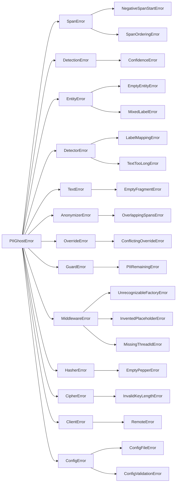

# Référence des exceptions

Module : `piighost.exceptions`

Chaque erreur levée par la librairie dérive de `PIIGhostError`, donc un seul `except PIIGhostError` couvre toute la famille. Entre la racine et les feuilles se trouvent les classes de regroupement, une par sous-système, qu'un appelant attrape pour réagir à un étage plutôt qu'à une défaillance précise. Le module ne dépend de rien en dehors de la librairie standard, donc chaque classe s'importe sans extra optionnel, y compris les erreurs levées par des composants qui en exigent un.

```python
from piighost.exceptions import PIIGhostError
```

`PIIGhostSecurityWarning` est le seul nom du module en dehors de cet arbre. Étant un avertissement et non une erreur, il est décrit en fin de page.

## La hiérarchie



*L'arbre `PIIGhostError`, chaque classe de regroupement à gauche des erreurs qu'elle couvre.*
{ .figure-caption }

Sur les trente-trois classes d'erreur, vingt sont levées par un composant et treize n'existent que pour être attrapées. `ConfigError` compte des deux côtés, une classe de regroupement qui est aussi levée pour elle-même.

## Modèles de données

Module : `piighost.models`. `SpanError`, `DetectionError` et `EntityError` regroupent les échecs de validation des modèles de données gelés. Chacune est levée depuis `__post_init__`, donc une valeur invalide échoue à la construction et n'atteint jamais un étage.

| Exception | Levée par | Levée quand |
|-----------|-----------|-------------|
| `NegativeSpanStartError` | `Span.__post_init__` | `start` est négatif |
| `SpanOrderingError` | `Span.__post_init__` | `end` n'est pas strictement supérieur à `start`, ce qui décrit un intervalle vide ou inversé |
| `ConfidenceError` | `Detection.__post_init__` | `confidence` tombe hors de l'intervalle fermé 0 à 1 |
| `EmptyEntityError` | `Entity.__post_init__` | l'entité ne regroupe aucune détection |
| `MixedLabelError` | `Entity.__post_init__` | les détections regroupées ne partagent pas toutes le même label |

Les invariants que ces erreurs font respecter sont dans [Référence des modèles de données](models.md), et les ports qui échangent les modèles dans [Étendre PIIGhost](../extending.md).

## Détecteurs

Module : `piighost.components.detector.ner`. `DetectorError` regroupe deux défaillances de `BaseNERDetector`, elles ne touchent donc que les détecteurs à modèle. Un détecteur regex, exact-match, composite ou chunked ne lève ni l'une ni l'autre.

| Exception | Levée par | Levée quand |
|-----------|-----------|-------------|
| `LabelMappingError` | `BaseNERDetector.__init__` | deux labels externes pointent vers un même label interne, ce qui rendrait la recherche inverse ambiguë |
| `TextTooLongError` | `BaseNERDetector`, à la détection | un texte dépasse `max_chars` alors que `auto_chunk` est désactivé, un scan limité au préfixe étant refusé |

Les deux sont traitées dans [Détecteurs](detectors.md), avec les arguments `max_chars` et `auto_chunk` qui gouvernent la seconde.

## Utilitaires de texte

Module : `piighost.text`. `TextError` regroupe les défaillances des utilitaires de frontière de mot et porte une seule sous-classe.

| Exception | Levée par | Levée quand |
|-----------|-----------|-------------|
| `EmptyFragmentError` | `boundary_wrap`, `find_all_word_boundary` et `ExactMatchDetector.__init__` | le fragment cherché est vide, ce qui correspondrait à chaque position du texte |

Un fragment vide produirait des spans de largeur nulle qu'un `Span` refuse, donc la défaillance remonterait sinon en `SpanOrderingError` loin de sa cause. `ExactMatchDetector` vérifie ses valeurs configurées à la construction, donc une faute dans la config échoue au chargement plutôt qu'au premier message. `LLMDetector` ne la lève pas, la sortie d'un modèle n'étant pas fiable, une valeur extraite vide est écartée avec un avertissement.

## Anonymizer

Module : `piighost.components.anonymizer`. `AnonymizerError` regroupe les défaillances de l'étage de rendu et porte une sous-classe.

| Exception | Levée par | Levée quand |
|-----------|-----------|-------------|
| `OverlappingSpansError` | `Anonymizer.render` | deux spans se chevauchent encore quand la réécriture en une passe les atteint |

L'hypothèse de spans disjoints derrière cette erreur est dans [Référence Anonymizer](anonymizer.md), et l'étage qui la garantit dans [Pipeline](pipeline.md).

## Overrides de détection

Module : `piighost.components.override`. `OverrideError` regroupe les défaillances de l'étage whitelist et blacklist et porte une sous-classe.

| Exception | Levée par | Levée quand |
|-----------|-----------|-------------|
| `ConflictingOverrideError` | `DetectionOverride.apply` | un span whitelisté chevauche un span blacklisté sous la stratégie de conflit `raise` |

Les deux autres stratégies de conflit tranchent la collision au lieu de lever. Chaque clé `[override]` est dans la [référence de configuration](../configuration/toml.md).

## Garde-fous

Module : `piighost.pipeline`. `GuardError` regroupe les défaillances de l'étage garde-fou et porte une sous-classe.

| Exception | Levée par | Levée quand |
|-----------|-----------|-------------|
| `PIIRemainingError` | le pipeline, après l'étage garde-fou | un garde-fou renvoie un verdict signalé |

Un garde-fou ne lève rien lui-même. Il renvoie un verdict, et le pipeline transforme un verdict signalé en cette erreur, comme décrit dans [Garde-fous](guard-rails.md).

## Intégrations

Module : `piighost.integrations`. `MiddlewareError` regroupe les défaillances de la couche d'intégration. Les deux premières ci-dessous viennent du `TextDeidentifier` partagé, qui porte aussi bien le middleware LangChain que le query engine LlamaIndex et les hooks Pydantic AI. La troisième appartient au seul middleware LangChain.

| Exception | Levée par | Levée quand |
|-----------|-----------|-------------|
| `UnrecognizableFactoryError` | `TextDeidentifier.__init__` | le pipeline n'expose aucun recognizer de token, sa placeholder factory n'ayant pas de grammaire retrouvable |
| `InventedPlaceholderError` | `TextDeidentifier.deanonymize` et `deanonymize_stream` | le texte restauré porte encore un token que le pipeline n'a jamais émis, sous la stratégie `RAISE` de placeholder inventé |
| `MissingThreadIdError` | le middleware LangChain, à chaque tour | la config LangGraph ne porte pas de `thread_id` alors que `require_thread_id` est activé |

Les trois sont traitées dans [Intégration LangChain](langchain.md), avec les stratégies qui décident si la deuxième est levée du tout.

## Crypto

Module : `piighost.crypto`. `HasherError` et `CipherError` regroupent les défaillances de construction des primitives de chiffrement au repos, une sous-classe chacune.

| Exception | Levée par | Levée quand |
|-----------|-----------|-------------|
| `EmptyPepperError` | `BaseHasher.__init__` | le pepper est vide, ce qui laisserait des PII à faible entropie attaquables par force brute |
| `InvalidKeyLengthError` | `AesGcmCipher.__init__` | la clé AES ne fait pas 16, 24 ou 32 octets |

Les deux échouent en fermeture à la construction, donc un store mal configuré ne démarre jamais. Ce que ces primitives protègent est dans [Sécurité](../security.md), et les backends de mémoire qui les prennent dans [Référence de la mémoire de conversation](memory.md).

## Client distant

Module : `piighost.integrations.client`. `ClientError` regroupe les défaillances du client distant et porte une sous-classe.

| Exception | Levée par | Levée quand |
|-----------|-----------|-------------|
| `RemoteError` | `PIIGhostClient`, à chaque appel | le `piighost-api` distant répond avec un statut non-2xx |

Le contrôle porte sur le statut seulement. Un corps 2xx auquel manque une clé attendue remonte en `KeyError`, pas en `RemoteError`. Les méthodes du client sont dans [Client distant](../getting-started/api-client.md).

## Configuration

Module : `piighost.config`. `ConfigError` regroupe les défaillances de chargement et de construction, et contrairement aux autres classes de regroupement elle est aussi levée pour elle-même.

| Exception | Levée par | Levée quand |
|-----------|-----------|-------------|
| `ConfigFileError` | `load_config` | le fichier est absent, illisible, ou du TOML ou JSON invalide |
| `ConfigValidationError` | `load_config` | les données analysées échouent à la validation du schéma, ce qui emballe la `ValidationError` de pydantic dans la famille de la librairie |
| `ConfigError` | `load_pipeline`, `load_thread_pipeline`, et le `build()` d'une config de composant | le point d'entrée ne correspond pas à la section `[memory]` déclarée, une variable d'environnement de secret est absente ou malformée, ou une mémoire déclare un hacheur ou un cipher mais pas les deux |

Attraper `ConfigError` couvre les trois. Chaque clé et chaque variable de secret est dans la [référence de configuration](../configuration/toml.md), et le CLI `piighost` rapporte les trois mêmes depuis `validate`, comme décrit dans [Interface en ligne de commande](cli.md).

## Erreurs porteuses de données

Trois erreurs exposent les valeurs derrière la défaillance en attributs. Toutes les autres ne portent que leur message.

| Exception | Attribut | Contient |
|-----------|----------|----------|
| `PIIRemainingError` | `detections` | les détections résiduelles derrière le signalement, vide quand le garde-fou raisonne par score et ne localise rien |
| `InventedPlaceholderError` | `tokens` | les tokens inventés, dans leur ordre d'apparition |
| `RemoteError` | `status_code` | le statut HTTP renvoyé par le serveur |

## `PIIGhostSecurityWarning`

Un `UserWarning`, en dehors de l'arbre `PIIGhostError`, donc il ne fait jamais échouer un appel et les filtres standards de `warnings` le gouvernent. Il signale une configuration qui tourne mais garde les PII lisibles, donc un choix assumé fonctionne encore alors qu'un oubli reste bruyant. Deux endroits l'émettent, tous deux à la construction.

| Émis par | Émis quand |
|----------|------------|
| `warn_plaintext`, appelé depuis `RedisConversationMemory` et `SqlAlchemyConversationMemory` | un backend persistant est construit sans hacheur ni cipher, donc son store garde les PII en clair |
| `BaseAnonymizationPipeline.__init__` | aucun `observation_redactor` n'est posé, `trace_clear_text` est désactivé, et le tracer exporte, donc les traces enregistreraient du texte en clair |

La comparaison des backends est dans [Référence de la mémoire de conversation](memory.md), et le redactor dans [Observation](../observation.md).

## Voir aussi

- [Pipeline](pipeline.md) : l'ordre des étages que les erreurs ci-dessus suivent.
- [Garde-fous](guard-rails.md) : le verdict derrière `PIIRemainingError`.
- [Intégration LangChain](langchain.md) : les stratégies derrière les erreurs du middleware.
- [Référence de configuration](../configuration/toml.md) : chaque clé que les erreurs de configuration valident.
- [Sécurité](../security.md) : ce que les échecs en fermeture protègent.
