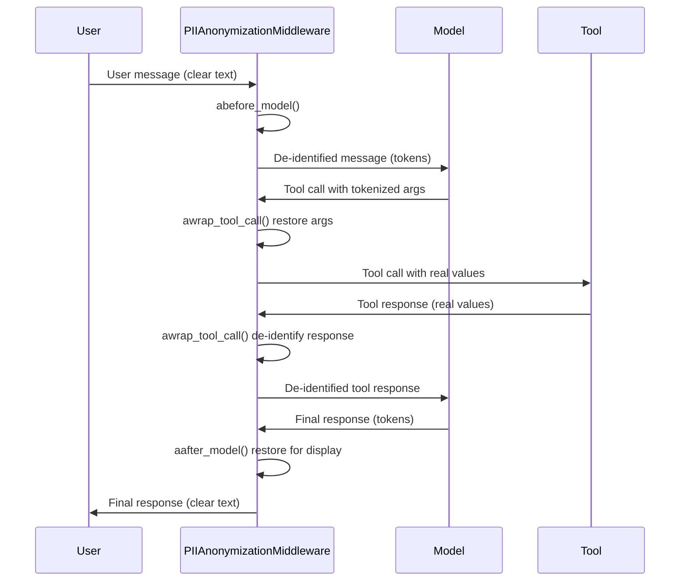

# Référence de l'intégration LangChain

Module : `piighost.integrations.langchain`

!!! note "Déplacé en 1.4.0"
    Cette intégration vient de `piighost.integrations.middleware`. L'ancien chemin d'import fonctionne toujours mais émet un `DeprecationWarning`. Mettez à jour vos imports vers `piighost.integrations.langchain`.

`PIIAnonymizationMiddleware` est un `AgentMiddleware` LangChain qui dé-identifie les PII autour de la frontière modèle et outils d'un agent. Il lit le thread id depuis la config LangGraph, dé-identifie les messages avant que le modèle ne les voie, les restaure ensuite pour l'affichage, et route les appels d'outil selon une stratégie choisie. Toute la détection, l'attribution des tokens et le remplacement sont délégués à un `ThreadAnonymizationPipeline`.

```python
from piighost.integrations.langchain import (
    AssistantEntityStrategy,
    InventedPlaceholderStrategy,
    PIIAnonymizationMiddleware,
    ToolCallStrategy,
)
```

Nécessite l'extra `middleware` (`pip install piighost[langchain]`), qui tire `langchain`. Importer le paquet ne tire jamais `langchain`. La classe du middleware est importée à la demande, donc un extra manquant lève une `ImportError` nommant l'extra.

---

## `PIIAnonymizationMiddleware`

Étend `AgentMiddleware` et intercepte la boucle de l'agent en trois points.

<div class="wide-table" markdown="1">

| Hook | Moment | Opération |
|------|--------|-----------|
| `abefore_model` | Avant chaque appel modèle | Dé-identifie les messages utilisateur et modèle |
| `aafter_model` | Après chaque réponse modèle | Restaure les messages utilisateur et modèle pour l'affichage |
| `awrap_tool_call` | Autour de chaque appel d'outil | Dé-identifie les arguments, dé-identifie la réponse, selon la stratégie |

</div>

### Constructeur

```python
PIIAnonymizationMiddleware(
    pipeline: AnyThreadPipeline,
    tool_strategy: ToolCallStrategy = ToolCallStrategy.FULL,
    require_thread_id: bool = True,
    invented_strategy: InventedPlaceholderStrategy = InventedPlaceholderStrategy.RAISE,
    assistant_strategy: AssistantEntityStrategy = AssistantEntityStrategy.PRESERVE,
)
```

| Paramètre | Type | Description |
|-----------|------|-------------|
| `pipeline` | `AnyThreadPipeline` | Le pipeline de thread qui dé-identifie et restaure (requis) |
| `tool_strategy` | `ToolCallStrategy` | Comment les deux directions d'un appel d'outil sont traitées |
| `require_thread_id` | `bool` | Si un thread id absent lève, plutôt que de retomber sur un thread partagé |
| `invented_strategy` | `InventedPlaceholderStrategy` | Comment un token que le pipeline n'a jamais émis est traité après restauration |
| `assistant_strategy` | `AssistantEntityStrategy` | Comment les valeurs introduites par l'assistant sont traitées |

Le pipeline doit exposer un reconnaisseur de tokens délimités via `pipeline.recognizer`, pour qu'un token inventé par le modèle puisse être retrouvé. Un pipeline dont la factory de placeholders n'est pas délimitée, un masque par exemple, n'a pas de reconnaisseur, et le constructeur lève `UnrecognizableFactoryError`. La borne de type `IdentityT` impose la même contrainte au type-checking pour les appelants typés.

`require_thread_id` vaut `True` par défaut, donc un thread id absent lève `MissingThreadIdError` plutôt que de router chaque conversation vers le thread `"default"` partagé, ce qui ferait fuiter l'état des placeholders d'une conversation à l'autre. Passez `False` pour choisir sciemment ce repli partagé, en usage mono-conversation ou sans état.

---

## Hooks

### `abefore_model(state, runtime) -> dict | None`

Dé-identifie les messages utilisateur et modèle avant que le modèle ne les voie. Chaque message passe par `pipeline.anonymize()` sous le rôle que son type porte. Un `ToolMessage` n'est jamais réécrit ici, seulement dans l'enveloppe d'outil. Sous `AssistantEntityStrategy.IGNORE`, le contenu d'un `AIMessage` est ignoré entièrement.

Renvoie `{"messages": [...]}` quand un message change, `None` sinon.

```python
# before: [HumanMessage("Email Patrick in Paris")]
# after:  [HumanMessage("Email <<PERSON:1>> in <<LOCATION:1>>")]
```

### `aafter_model(state, runtime) -> dict | None`

Restaure les messages utilisateur et modèle pour l'affichage via `pipeline.deanonymize()`, puis applique `invented_strategy` au texte restauré. Renvoie `{"messages": [...]}` quand un message change, `None` sinon.

```python
# before: [AIMessage("Sent to <<PERSON:1>>.")]
# after:  [AIMessage("Sent to Patrick.")]
```

### `awrap_tool_call(request, handler) -> ToolMessage | Command`

Route l'appel d'outil selon `tool_strategy`. Quand la stratégie dé-identifie l'entrée, les arguments de l'outil sont restaurés en vraies valeurs avant l'exécution. Quand elle dé-identifie la sortie, une réponse d'outil de type `str` passe par `pipeline.anonymize()` après l'exécution. `PASSTHROUGH` ne touche ni l'un ni l'autre.

La restauration des arguments descend dans les conteneurs `dict`, `list` et `tuple` imbriqués. Seules les feuilles `str` sont restaurées, les autres types passent inchangés.

```python
# model calls  : send_email(to="<<PERSON:1>>", subject="Hi")
#                       restore args
# tool receives: send_email(to="Patrick", subject="Hi")
# tool returns : "Sent to Patrick."
#                       de-identify response
# model sees   : "Sent to <<PERSON:1>>."
```

---

## Stratégies

Des enums simples dans `piighost.integrations.langchain.strategy`, importables sans `langchain`.

### `ToolCallStrategy`

Comment les deux directions d'un appel d'outil sont traitées. Les directions sont indépendantes, et le middleware n'agit que dans l'enveloppe d'outil.

| Valeur | Arguments | Réponse |
|--------|-----------|---------|
| `INPUT` | restaurés en vraies valeurs | laissée telle que l'outil l'a renvoyée |
| `OUTPUT` | laissés tokenisés | dé-identifiée |
| `FULL` | restaurés en vraies valeurs | dé-identifiée |
| `PASSTHROUGH` | inchangés | inchangée |

`FULL` est la valeur par défaut. Une stratégie qui ne dé-identifie pas la réponse la laisse telle que l'outil l'a renvoyée, et le modèle la voit ainsi.

### `InventedPlaceholderStrategy`

Comment un token que le pipeline n'a jamais émis est traité. Après restauration, chaque token émis a été remplacé par sa valeur, donc tout token qui suit encore la grammaire des placeholders a été inventé par le modèle, qu'il soit halluciné ou injecté.

| Valeur | Effet |
|--------|-------|
| `KEEP` | laisse le token inventé dans le texte |
| `DROP` | retire le token inventé |
| `RAISE` | lève `InventedPlaceholderError` |

`RAISE` est la valeur par défaut.

### `AssistantEntityStrategy`

Comment les valeurs introduites par l'assistant sont traitées. La provenance d'une valeur est le rôle de sa première occurrence dans le thread. Une valeur introduite par l'assistant n'est pas une PII utilisateur, donc la dé-identifier prive le modèle de sa connaissance du monde sur cette entité.

| Valeur | Effet |
|--------|-------|
| `PRESERVE` | laisse en clair les valeurs introduites par l'assistant |
| `ANONYMIZE` | les dé-identifie comme des PII utilisateur |
| `IGNORE` | n'analyse pas du tout les messages de l'assistant, ce qui épargne le détecteur |

`PRESERVE` est la valeur par défaut.

---

## Flux complet



*Du message utilisateur à la réponse restaurée, en passant par le modèle et l'outil.*
{ .figure-caption }

---

## Exemple

```python
from langchain.agents import create_agent
from langchain_core.tools import tool

from piighost.config import load_thread_pipeline
from piighost.integrations.langchain import PIIAnonymizationMiddleware


@tool
def get_info(person: str) -> str:
    """Return information about a person."""
    return f"{person} is a software engineer in Paris."


pipeline = load_thread_pipeline("pipeline.toml")
middleware = PIIAnonymizationMiddleware(pipeline)

agent = create_agent(
    model="openai:gpt-5.4",
    system_prompt="You are a helpful assistant. Treat placeholders as real values.",
    tools=[get_info],
    middleware=[middleware],
)

config = {"configurable": {"thread_id": "conv-1"}}
result = await agent.ainvoke(
    {"messages": [{"role": "user", "content": "Who is Patrick?"}]},
    config,
)
print(result["messages"][-1].content)
```

Le pipeline doit être un pipeline de thread dont la factory de placeholders est délimitée, comme `label`, `label_counter` ou `label_hash`. Passez un thread id à chaque appel via `config["configurable"]["thread_id"]`, puisque `require_thread_id` vaut `True` par défaut.

---

## Streaming

Les hooks `abefore_model` et `aafter_model` voient le message complet, donc un affichage en direct qui streame la réponse montrerait les placeholders jusqu'à ce qu'elle se termine. Pour un affichage token par token, enveloppez `deanonymize_stream` autour de votre propre boucle de streaming. Il ne tamponne qu'un token coupé entre deux chunks, restaure chaque token dès qu'il est complet, et applique `invented_strategy` par token restauré.

### `deanonymize_stream(source, thread_id) -> AsyncIterator[str]`

`source` est un itérateur asynchrone des chunks de texte du modèle ; `thread_id` est l'id avec lequel vous avez lancé l'agent, puisqu'une boucle de streaming manuelle est hors de la config LangGraph que lisent les hooks.

```python
config = {"configurable": {"thread_id": "conv-1"}}


async def model_text():
    async for chunk, _meta in agent.astream(
        {"messages": [{"role": "user", "content": "Who is Patrick?"}]},
        config,
        stream_mode="messages",
    ):
        if isinstance(chunk.content, str):
            yield chunk.content


async for restored in middleware.deanonymize_stream(model_text(), "conv-1"):
    print(restored, end="", flush=True)
```

Un token coupé entre deux chunks, `<<PER`{ .placeholder } puis `SON:1>>`{ .placeholder }, est retenu jusqu'à ce qu'il soit complet puis restauré en `Patrick`{ .pii }, donc l'affichage ne montre jamais de token cassé.

Pour un autre framework, la même restauration est un cran plus bas : `pipeline.recognizer.async_stream_decoder(replace)` construit le décodeur sur la grammaire de n'importe quelle factory, avec `replace` une coroutine qui désanonymise un token.

---

## Voir aussi

- [Référence Pipeline](pipeline.md) pour le pipeline de thread que le middleware pilote.
- [Stratégies d'appel d'outil](../tool-call-strategies.md) pour le raisonnement derrière chaque stratégie.
- [Configuration TOML](../configuration/toml.md) pour construire le pipeline depuis un fichier.
