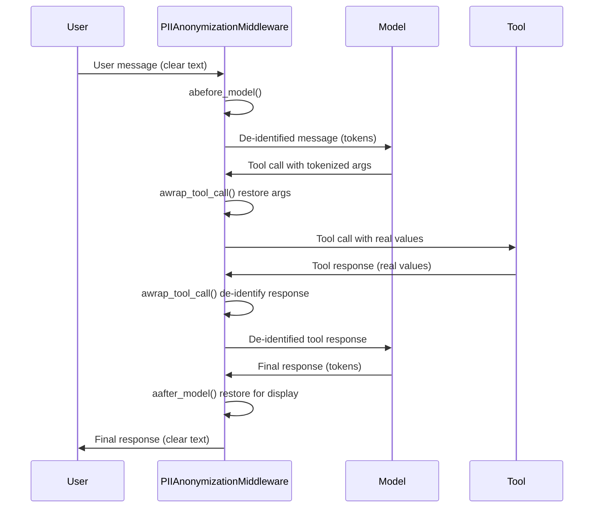

# Référence de l'intégration LangChain

Module : `piighost.integrations.langchain`

`PIIAnonymizationMiddleware` est un `AgentMiddleware` LangChain qui dé-identifie les données confidentielles autour de la frontière modèle et outils d'un agent. Il lit l'identifiant de conversation depuis la config LangGraph, dé-identifie les messages avant que le modèle ne les voie, les restaure ensuite pour l'affichage, et route les appels d'outil selon une stratégie choisie. Toute la détection, l'attribution des jetons et le remplacement sont délégués à un `ThreadAnonymizationPipeline`.

```python
from piighost.integrations.langchain import (
    EntityCreateByAssistantStrategy,
    InventedPlaceholderStrategy,
    PIIAnonymizationMiddleware,
    ToolCallStrategy,
)
```

Nécessite l'extra `langchain` (`pip install piighost[langchain]`), qui tire `langchain`. Importer le paquet ne tire jamais `langchain`. La classe du middleware est importée à la demande, donc un extra manquant lève une `ImportError` nommant l'extra.

---

## `PIIAnonymizationMiddleware`

Étend `AgentMiddleware` et intercepte la boucle de l'agent en trois points.

<div class="wide-table" markdown="1">

| Hook | Moment | Opération |
|------|--------|-----------|
| `abefore_model` | Avant chaque appel modèle | Dé-identifie les messages utilisateur et modèle |
| `aafter_model` | Après chaque réponse modèle | Restaure les messages utilisateur et modèle pour l'affichage |
| `awrap_tool_call` | Autour de chaque appel d'outil | Restaure les arguments, dé-identifie la réponse, selon la stratégie |

</div>

### Constructeur

```python
PIIAnonymizationMiddleware(
    pipeline: AnyThreadPipeline[IdentityT],
    tool_strategy: ToolCallStrategy = ToolCallStrategy.FULL,
    invented_strategy: InventedPlaceholderStrategy = InventedPlaceholderStrategy.RAISE,
    assistant_strategy: EntityCreateByAssistantStrategy = EntityCreateByAssistantStrategy.PRESERVE,
)
```

| Paramètre | Type | Description |
|-----------|------|-------------|
| `pipeline` | `AnyThreadPipeline[IdentityT]` | Le pipeline de conversation qui dé-identifie et restaure (requis) |
| `tool_strategy` | `ToolCallStrategy` | Comment les deux directions d'un appel d'outil sont traitées |
| `invented_strategy` | `InventedPlaceholderStrategy` | Comment un jeton que le pipeline n'a jamais émis est traité après restauration |
| `assistant_strategy` | `EntityCreateByAssistantStrategy` | Comment les valeurs introduites par l'assistant sont traitées |

Le pipeline doit exposer un reconnaisseur de jetons délimités via `pipeline.recognizer`, pour qu'un jeton inventé par le modèle puisse être retrouvé. Un pipeline dont la factory de placeholders n'est pas délimitée, un masque par exemple, n'a pas de reconnaisseur, et le constructeur lève `UnrecognizableFactoryError`. La borne de type `IdentityT` impose la même contrainte au type-checking pour les appelants typés.

Chaque appel de l'agent porte un identifiant de conversation dans sa config LangGraph. Un appel qui n'en porte pas lève `MissingThreadIdError`. Le middleware ne route pas cet appel vers une conversation partagée, parce que l'état des placeholders fuiterait alors d'une conversation à l'autre. Si vos conversations n'ont pas besoin d'être séparées, nommez vous-même la conversation `"default"` (`DEFAULT_THREAD_ID`).

---

## Hooks

### `abefore_model(state, runtime) -> dict | None`

Dé-identifie les messages utilisateur et modèle avant que le modèle ne les voie. Chaque message passe par `pipeline.anonymize()` avec le rôle que donne son type de message. Un `ToolMessage` n'est jamais réécrit ici, seulement dans l'enveloppe d'outil. Sous `EntityCreateByAssistantStrategy.IGNORE`, le contenu d'un `AIMessage` est ignoré entièrement.

Renvoie `{"messages": [...]}` quand un message change, `None` sinon.

```text
# before: [HumanMessage("Email Patrick in Paris")]
# after:  [HumanMessage("Email <<PERSON:1>> in <<LOCATION:1>>")]
```

### `aafter_model(state, runtime) -> dict | None`

Restaure les messages utilisateur et modèle pour l'affichage via `pipeline.deanonymize()`, puis applique `invented_strategy` au texte restauré. Renvoie `{"messages": [...]}` quand un message change, `None` sinon.

```text
# before: [AIMessage("Sent to <<PERSON:1>>.")]
# after:  [AIMessage("Sent to Patrick.")]
```

### `awrap_tool_call(request, handler) -> ToolMessage | Command`

Route l'appel d'outil selon `tool_strategy`. Quand la stratégie dé-identifie l'entrée, les arguments de l'outil sont restaurés en vraies valeurs avant l'exécution. Quand elle dé-identifie la sortie, une réponse d'outil de type `str` passe par `pipeline.anonymize()` après l'exécution. `PASSTHROUGH` ne touche ni l'un ni l'autre.

La restauration des arguments descend dans les conteneurs `dict`, `list` et `tuple` imbriqués. Seules les feuilles `str` sont restaurées, les autres types passent inchangés.

La réponse est dé-identifiée quelle que soit la forme que l'outil renvoie. L'outil peut renvoyer son `ToolMessage` directement, ou un `Command` dont la mise à jour d'état porte ce `ToolMessage`. Un outil qui écrit aussi dans l'état utilise cette seconde forme. Une mise à jour d'état est parcourue sous ses deux formes, une correspondance de clés d'état ou une séquence de paires clé-valeur. Chaque entrée porte un message ou une séquence de messages. Les quatre formes que LangGraph accepte sont donc couvertes. Un contenu fait d'une liste de blocs de texte est traité comme une chaîne simple, bloc par bloc.

```text
# model calls  : send_email(to="<<PERSON:1>>", subject="Hi")
#                       restore args
# tool receives: send_email(to="Patrick", subject="Hi")
# tool returns : "Sent to Patrick."
#                       de-identify response
# model sees   : "Sent to <<PERSON:1>>."
```

---

## Stratégies

Des enums simples dans `piighost.integrations.langchain.strategy`, importables sans `langchain`.

### `ToolCallStrategy`

Comment les deux directions d'un appel d'outil sont traitées. Les directions sont indépendantes, et le middleware n'agit que dans l'enveloppe d'outil.

| Valeur | Arguments | Réponse |
|--------|-----------|---------|
| `INPUT` | restaurés en vraies valeurs | laissée telle que l'outil l'a renvoyée |
| `OUTPUT` | laissés en jetons | dé-identifiée |
| `FULL` | restaurés en vraies valeurs | dé-identifiée |
| `PASSTHROUGH` | inchangés | inchangée |

`FULL` est la valeur par défaut. Une stratégie qui ne dé-identifie pas la réponse la laisse telle que l'outil l'a renvoyée, et le modèle la voit ainsi.

### `InventedPlaceholderStrategy`

Comment un jeton que le pipeline n'a jamais émis est traité. Après restauration, chaque jeton émis a été remplacé par sa valeur. Tout jeton qui suit encore la grammaire des placeholders a donc été inventé par le modèle, qu'il soit halluciné ou injecté.

| Valeur | Effet |
|--------|-------|
| `KEEP` | laisse le jeton inventé dans le texte |
| `DROP` | retire le jeton inventé |
| `RAISE` | lève `InventedPlaceholderError` |

`RAISE` est la valeur par défaut.

### `EntityCreateByAssistantStrategy`

Comment les valeurs introduites par l'assistant sont traitées. La provenance d'une valeur est le rôle de sa première occurrence dans la conversation. Une valeur introduite par l'assistant n'est pas une donnée confidentielle de l'utilisateur. La dé-identifier prive donc le modèle de sa connaissance du monde sur cette entité.

| Valeur | Effet |
|--------|-------|
| `PRESERVE` | laisse en clair les valeurs introduites par l'assistant |
| `ANONYMIZE` | les dé-identifie comme les données confidentielles de l'utilisateur |
| `IGNORE` | n'analyse pas du tout les messages de l'assistant, ce qui épargne le détecteur |

`PRESERVE` est la valeur par défaut.

---

## Flux complet


```mermaid
sequenceDiagram
    participant U as User
    participant M as PIIAnonymizationMiddleware
    participant L as Model
    participant T as Tool

    U->>M: User message (clear text)
    M->>M: abefore_model()
    M->>L: De-identified message (tokens)
    L->>M: Tool call with tokenized args
    M->>M: awrap_tool_call() restore args
    M->>T: Tool call with real values
    T->>M: Tool response (real values)
    M->>M: awrap_tool_call() de-identify response
    M->>L: De-identified tool response
    L->>M: Final response (tokens)
    M->>M: aafter_model() restore for display
    M->>U: Final response (clear text)
```

*Du message utilisateur à la réponse restaurée, en passant par le modèle et l'outil.*
{ .figure-caption }

---

## Exemple

```python
--8<-- "snippets/reference_langchain.py:invoke"
```

Le pipeline doit être un pipeline de conversation dont la factory de placeholders est délimitée, comme `label`, `label_counter` ou `label_hash`. Passez un identifiant de conversation à chaque appel via `config["configurable"]["thread_id"]`, sans quoi l'appel lève `MissingThreadIdError`.

---

## Streaming

Les hooks `abefore_model` et `aafter_model` voient le message complet. Un affichage en direct qui streame la réponse montrerait donc les placeholders jusqu'à ce qu'elle se termine. Pour un affichage token par token, enveloppez `deanonymize_stream` autour de votre propre boucle de streaming. Il ne tamponne qu'un jeton coupé entre deux chunks, restaure chaque jeton dès qu'il est complet, et applique `invented_strategy` par jeton restauré.

### `deanonymize_stream(source, thread_id) -> AsyncIterator[str]`

`source` est un itérateur asynchrone des chunks de texte du modèle. `thread_id` est l'id avec lequel vous avez lancé l'agent. Vous le passez vous-même, parce qu'une boucle de streaming manuelle ne voit pas la config LangGraph que lisent les hooks.

```python
--8<-- "snippets/reference_langchain.py:stream"
```

Un jeton coupé entre deux chunks, `<<PER`{ .placeholder } puis `SON:1>>`{ .placeholder }, est retenu jusqu'à ce qu'il soit complet puis restauré en `Patrick`{ .pii }, donc l'affichage ne montre pas de jeton cassé. Seul un flux qui s'interrompt au milieu d'un jeton rend son fragment tel quel, par exemple `<<PER`{ .placeholder }. Ce fragment ne contient aucune vraie valeur.

Pour un autre framework, utilisez la même restauration un cran plus bas. `pipeline.recognizer.async_stream_decoder(replace)` construit le décodeur sur la grammaire de n'importe quelle factory. `replace` est une coroutine qui restaure un jeton.

---

## Voir aussi

- [Référence Pipeline](pipeline.md) pour le pipeline de conversation que le middleware pilote.
- [Stratégies d'appel d'outil](../tool-call-strategies.md) pour le raisonnement derrière chaque stratégie.
- [Configuration TOML](../configuration/toml.md) pour construire le pipeline depuis un fichier.
- [Afficher une réponse streamée](../../../openwiki/fr/processes/show-a-streamed-reply.md) et [Laisser un outil agir sur les vraies valeurs](../../../openwiki/fr/processes/let-a-tool-act.md) pour les règles de gestion du flux et des appels d'outil, et leur emplacement dans le code.
