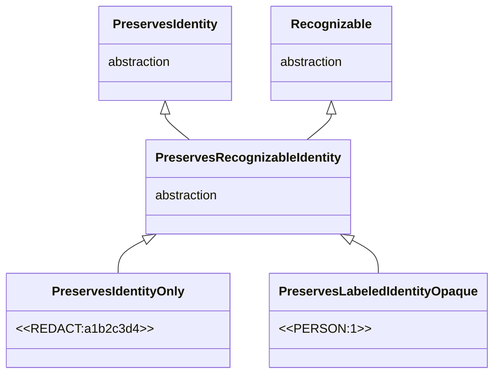
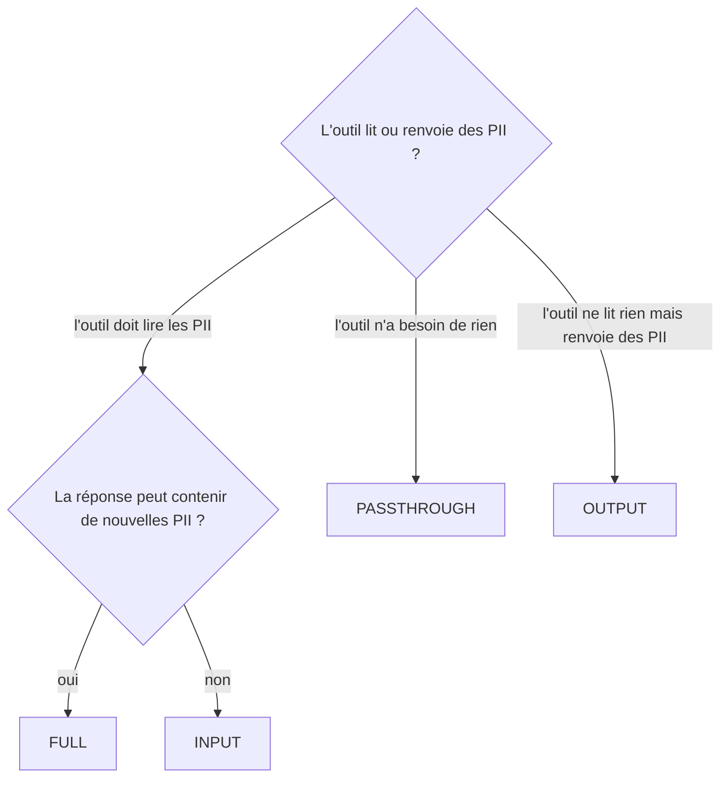

# Stratégies d'appel outil

`PIIAnonymizationMiddleware` travaille sur deux canaux, le canal LLM et le canal outil, qui n'offrent pas les mêmes garanties de fiabilité. Trois stratégies pilotent son comportement, une par décision indépendante que le middleware doit prendre.

- **`ToolCallStrategy`** décide ce qui franchit la frontière outil, dans les deux directions. Défaut `FULL`.
- **`InventedPlaceholderStrategy`** décide du sort d'un token que le pipeline n'a jamais émis, apparu dans une réponse ou un argument désanonymisé. Défaut `RAISE`.
- **`AssistantEntityStrategy`** décide du sort d'une valeur dont la première occurrence dans le thread vient de l'assistant. Défaut `PRESERVE`.

!!! note "Une entité, un token, sur tout le fil"

    Prenez `jean@mail.com`{ .pii } dans le premier message d'un thread. Le pipeline le dé-identifie en `<<EMAIL:1>>`{ .placeholder } et mémorise le mapping. Ce token porte l'identité de l'entité sur tout le fil, c'est lui qui traverse le LLM, les outils et la réponse. Toutes les stratégies ci-dessous décident *où* et *dans quel sens* ce token est traduit vers `jean@mail.com`{ .pii } et retour.

---

## Détail des familles

### Le canal LLM : basé sur la mémoire, fiable

Dans `abefore_model`, le middleware envoie au LLM un texte dé-identifié *exact* et le pipeline mémorise le mapping entité vers token. Quand le LLM répond, `aafter_model` restaure les valeurs en relisant ce mapping. C'est déterministe, ça ne peut pas être ambigu, et ça fonctionne quel que soit le token utilisé. Tant que le LLM renvoie tel quel le texte dé-identifié qu'il a reçu, ce canal est fiable.

### Le canal outil : remplacement de chaîne, fragile

Dans `awrap_tool_call`, le LLM produit les arguments d'outil en combinant, fragmentant, paraphrasant les tokens qu'il vient de voir. Ce texte arbitraire n'a jamais été produit par le pipeline, il n'est donc pas mémorisé. Idem pour la réponse de l'outil, `piighost` ne l'a jamais vue.

Les deux directions retombent donc sur du **remplacement de chaîne brut**.

- *Arguments d'outil (LLM vers outil)*, on parcourt les arguments à la recherche des tokens connus et on remplace chacun par la valeur originale de son entité, `<<EMAIL:1>>`{ .placeholder } redevient `jean@mail.com`{ .pii }.
- *Réponse de l'outil (outil vers LLM)*, on parcourt la réponse à la recherche des valeurs PII connues et on remplace chacune par le token correspondant.

Le remplacement brut n'est correct que si le mapping est **non ambigu**. Si deux entités partagent le token `<<PERSON>>`{ .placeholder }, impossible de savoir laquelle restaurer dans les arguments. C'est la raison structurelle pour laquelle le middleware n'accepte que des factories dont les tokens préservent une identité retrouvable. Voir [Placeholder factories](placeholder-factories.md).

Le middleware agit seulement dans le wrapper d'outil, jamais sur la réponse stockée ensuite. Les arguments sont désanonymisés récursivement à travers les `dict`, `list` et `tuple` imbriqués, les autres conteneurs passent tels quels.

### `ToolCallStrategy` : ce qui franchit la frontière outil

Les deux directions d'un appel d'outil sont indépendantes. `INPUT` désanonymise les arguments pour que l'outil reçoive de la vraie donnée. `OUTPUT` anonymise la réponse de l'outil pour protéger toute PII qu'elle renvoie. `FULL` fait les deux. `PASSTHROUGH` ne touche à rien.

| Stratégie | L'outil voit | Réponse vers le LLM | Quand l'utiliser |
|---|---|---|---|
| `INPUT` | les vraies valeurs (arguments désanonymisés) | telle quelle, non anonymisée | outils dont la réponse est connue sans PII |
| `OUTPUT` | les tokens | ré-anonymisée par le pipeline | outils qui reçoivent des identifiants opaques mais peuvent renvoyer des PII |
| `FULL` (défaut) | les vraies valeurs (arguments désanonymisés) | ré-anonymisée par le pipeline | outils qui lisent des PII et peuvent en renvoyer de nouvelles (BDD, CRM, recherche) |
| `PASSTHROUGH` | les tokens | telle quelle | outils qui ne doivent jamais voir de PII, ou qui n'en ont pas besoin |

`FULL` est symétrique, on désanonymise les arguments puis on passe la réponse par `pipeline.anonymize()`, qui re-détecte et ré-anonymise. Toute nouvelle PII renvoyée par l'outil devient un token avant que le LLM ne la voie, au prix d'une passe de détection par appel.

`INPUT` désanonymise seulement l'entrée et laisse la réponse brute, à réserver aux outils dont la sortie est connue sans PII, un lookup d'identifiant interne, un drapeau de statut, une valeur numérique. `OUTPUT` fait l'inverse, il laisse les arguments sous forme de tokens et n'anonymise que la réponse.

`PASSTHROUGH` est la frontière de confidentialité la plus stricte, les outils n'observent jamais de PII. L'outil reçoit la chaîne de tokens telle quelle et sa réponse est transmise sans réécriture. Utile quand les outils de l'agent travaillent sur des identifiants opaques, ou quand l'outil est lui-même la couche LLM-facing d'un autre système de dé-identification. C'est le seul mode qui tolère une factory `PreservesLabel`, `PreservesShape` ou `PreservesNothing`, puisque la frontière outil n'est jamais traversée en clair l'exigence d'unicité disparaît. On ne peut toujours pas brancher une telle factory directement sur `PIIAnonymizationMiddleware`, le type-checker la rejette, l'échappatoire est d'utiliser le pipeline brut hors du middleware.

### `InventedPlaceholderStrategy` : le token que le modèle a inventé

Après désanonymisation, tout token émis par le pipeline a été remplacé par sa valeur. Si une chaîne matche encore la grammaire des tokens, c'est que le modèle l'a inventée, par hallucination ou par injection. Le modèle a pu produire un `<<PERSON:9>>`{ .placeholder } qui ne correspond à aucune entité connue.

| Stratégie | Effet | Quand l'utiliser |
|---|---|---|
| `KEEP` | laisse le token inventé dans le texte | tolérant, quand un faux token n'a pas d'importance |
| `DROP` | retire le token inventé du texte | nettoyer une sortie utilisateur sans lever |
| `RAISE` (défaut) | lève `InventedPlaceholderError` | par défaut, refuser un token non émis plutôt que le laisser passer |

Cette détection n'est possible que parce que la factory est retrouvable, ce qui est garanti par le tag `PreservesRecognizableIdentity` que le middleware exige.

### `AssistantEntityStrategy` : la valeur venue de l'assistant

La *provenance* d'une valeur est le rôle de sa première occurrence dans le thread. Une valeur que l'assistant a introduite n'est pas une PII utilisateur, l'anonymiser prive le modèle de sa connaissance du monde sur cette entité. Si l'assistant cite un lieu public dans sa réponse, le dé-identifier au tour suivant coupe le modèle d'une information qu'il a lui-même produite.

| Stratégie | Effet | Quand l'utiliser |
|---|---|---|
| `PRESERVE` (défaut) | laisse en clair les valeurs introduites par l'assistant | par défaut, garder la connaissance du modèle |
| `ANONYMIZE` | les dé-identifie comme des PII utilisateur | quand même les valeurs de l'assistant doivent être protégées |
| `IGNORE` | n'analyse pas du tout les messages de l'assistant | économiser le détecteur quand l'assistant n'introduit jamais de PII |

---

## Tags de préservation

Les stratégies ci-dessus ne sont pas des types fantômes, ce sont des `Enum` passées à la construction du middleware. La contrainte de type porte sur la *factory* du pipeline, pas sur les stratégies.

Le middleware est générique sur un tag `PreservesRecognizableIdentity`, l'intersection de l'axe *Identity* (le token est unique par entité) et de l'axe *Recognizable* (le token porte une grammaire délimitée que la factory sait retrouver). L'unicité rend la désanonymisation par remplacement de chaîne non ambiguë. La retrouvabilité rend possible la détection d'un token inventé, donc `InventedPlaceholderStrategy`.



*L'intersection sur laquelle le middleware se restreint, identité et retrouvabilité en même temps.*
{ .figure-caption }

Une seule exception, `PASSTHROUGH`. Comme la frontière outil n'est jamais traversée en clair, l'exigence tombe, mais elle reste imposée au type-check, il faut donc sortir du middleware pour utiliser un tag plus faible.

---

## Stratégies built-in

<div class="wide-table" markdown="1">

| Enum | Membres | Défaut | Décide |
|---|---|---|---|
| `ToolCallStrategy` | `INPUT`, `OUTPUT`, `FULL`, `PASSTHROUGH` | `FULL` | ce qui franchit la frontière outil, dans chaque direction |
| `InventedPlaceholderStrategy` | `KEEP`, `DROP`, `RAISE` | `RAISE` | le sort d'un token que le pipeline n'a jamais émis |
| `AssistantEntityStrategy` | `PRESERVE`, `ANONYMIZE`, `IGNORE` | `PRESERVE` | le sort d'une valeur introduite par l'assistant, par provenance |

</div>

Toutes trois sont des `Enum` simples, sans dépendance externe, importables depuis `piighost.integrations.middleware` sans installer `langchain`.

---

## Quelle stratégie choisir ?



*Choix d'une `ToolCallStrategy` selon ce que l'outil lit et renvoie.*
{ .figure-caption }

Pour `ToolCallStrategy`.

- Par défaut `FULL`, le réglage le plus défensif et le seul qui rattrape automatiquement les PII introduites par l'outil.
- `INPUT` quand la réponse est prouvée sans PII et que le gain de latence compte.
- `OUTPUT` quand l'outil reçoit des identifiants opaques mais peut renvoyer des PII.
- `PASSTHROUGH` quand la confidentialité prime, ou quand l'outil est conçu pour travailler sur des tokens.

Pour les deux autres, gardez les défauts sauf raison contraire. Passez `InventedPlaceholderStrategy` à `DROP` pour nettoyer une sortie utilisateur sans lever, ou à `KEEP` pour tolérer un faux token. Passez `AssistantEntityStrategy` à `ANONYMIZE` si même les valeurs citées par l'assistant doivent être protégées, ou à `IGNORE` pour économiser le détecteur quand l'assistant n'introduit jamais de PII.

---

## Pourquoi le canal outil exige une identité retrouvable

Le canal LLM restaure par relecture du mapping mémorisé, il tolère n'importe quelle factory. Le canal outil, lui, retombe sur du remplacement de chaîne sur un texte que le pipeline n'a jamais produit, il ne peut donc pas relire un mapping, il doit **retrouver** les tokens dans le texte et savoir **quelle entité unique** chacun désigne.

Deux garanties en découlent, portées par le tag `PreservesRecognizableIdentity` que `PIIAnonymizationMiddleware` exige. L'unicité, sinon deux entités partageant un token rendent la restauration ambiguë. La retrouvabilité, sinon le token n'a pas de grammaire fixe et se confond avec la prose, ce qui interdit aussi de repérer un token inventé.

La contrainte est vérifiée au type-check par le bound du générique, et re-vérifiée au runtime à la construction du middleware, qui demande au pipeline un recognizer et lève `UnrecognizableFactoryError` s'il n'y en a pas. Voir [Placeholder factories](placeholder-factories.md) pour le détail des tags et la hiérarchie complète.

---

## Écrire la sienne

Les stratégies sont des `Enum` fermées, on ne les étend pas, on les combine à la construction du middleware. L'exemple couvre les trois axes en un appel.

???+ example "Combiner les trois stratégies à la construction"

    ```python
    from piighost.integrations.middleware import (
        PIIAnonymizationMiddleware,
        ToolCallStrategy,
        InventedPlaceholderStrategy,
        AssistantEntityStrategy,
    )

    middleware = PIIAnonymizationMiddleware(
        pipeline,  # tokens PreservesRecognizableIdentity, sinon UnrecognizableFactoryError
        tool_strategy=ToolCallStrategy.FULL,
        invented_strategy=InventedPlaceholderStrategy.DROP,
        assistant_strategy=AssistantEntityStrategy.PRESERVE,
        require_thread_id=True,
    )
    ```

Pour changer *ce que* le pipeline retrouve et restaure, c'est la placeholder factory qu'on remplace, pas une stratégie. Voir *Écrire la sienne* dans [Placeholder factories](placeholder-factories.md).

---

## Voir aussi

- [Placeholder factories](placeholder-factories.md) : la contrainte d'unicité et de retrouvabilité qui motive `PreservesRecognizableIdentity`.
- [Architecture](architecture.md) : diagrammes de séquence des canaux LLM et outil.
- [Limites](limitations.md) : interactions entre le choix de stratégie et le reste du pipeline.
