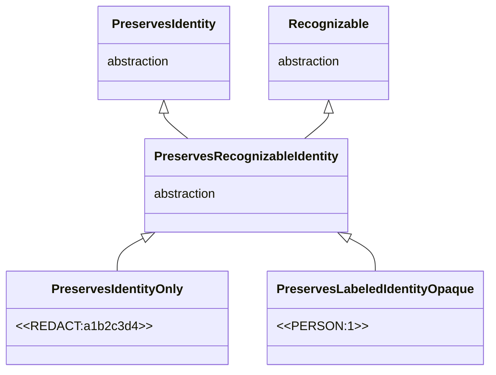

# Stratégies d'appel outil

`PIIAnonymizationMiddleware` travaille sur deux canaux, le canal LLM et le canal outil. Les deux restaurent les jetons de la même façon, mais le canal outil donne les vraies valeurs à du code qui agit. Trois stratégies pilotent son comportement, une par décision indépendante que le middleware doit prendre.

- **`ToolCallStrategy`** décide ce qui franchit la frontière outil, dans les deux directions. Défaut `FULL`.
- **`InventedPlaceholderStrategy`** décide du sort d'un jeton que le pipeline n'a jamais émis, apparu dans une réponse ou un argument restauré. Défaut `RAISE`.
- **`EntityCreateByAssistantStrategy`** décide du sort d'une valeur dont la première occurrence dans la conversation vient de l'assistant. Défaut `PRESERVE`.

!!! note "Une entité, un jeton, sur toute la conversation"

    Prenez `jean@mail.com`{ .pii } dans le premier message d'une conversation. Le pipeline le dé-identifie en `<<EMAIL:1>>`{ .placeholder } et mémorise le mapping. Ce jeton porte l'identité de l'entité sur toute la conversation. C'est lui qui traverse le LLM, les outils et la réponse. Toutes les stratégies ci-dessous décident *où* et *dans quel sens* ce jeton est traduit vers `jean@mail.com`{ .pii } et retour.

---

## Les deux canaux

### Le canal LLM

Dans `abefore_model`, le middleware dé-identifie les messages et le pipeline enregistre leurs détections dans la mémoire de la conversation. Quand le LLM répond, `aafter_model` restaure sa réponse par **remplacement de chaîne**. Il cherche chaque jeton connu de la conversation et le remplace par la valeur de son entité. Le LLM écrit par exemple "J'ai écrit à `<<EMAIL:1>>`{ .placeholder }", et l'utilisateur lit "J'ai écrit à `jean@mail.com`{ .pii }". Cette réponse est un texte que le pipeline n'a jamais produit. Le remplacement est le seul moyen de la restaurer.

### Le canal outil

Dans `awrap_tool_call`, le LLM produit les arguments d'outil en combinant, fragmentant, paraphrasant les jetons qu'il vient de voir. Les deux directions de l'appel sont traitées différemment.

- *Arguments d'outil (LLM vers outil)*. Le middleware les restaure par le même remplacement de chaîne que le canal LLM. Il parcourt les arguments à la recherche des jetons connus et remplace chacun par la valeur originale de son entité. Ainsi, `<<EMAIL:1>>`{ .placeholder } redevient `jean@mail.com`{ .pii }.
- *Réponse de l'outil (outil vers LLM)*. La réponse passe dans le pipeline de la conversation, détection comprise, comme un message de l'utilisateur. Une valeur déjà vue reprend son jeton. Une valeur que la conversation n'a jamais citée, un e-mail renvoyé par un CRM par exemple, est détectée et reçoit le sien.

Sur les deux canaux, le remplacement n'est correct que si le mapping est **non ambigu**. Si deux entités partagent le jeton `<<PERSON>>`{ .placeholder }, impossible de savoir laquelle restaurer. Sur le canal outil, l'erreur a un effet concret, par exemple un e-mail envoyé à la mauvaise personne. C'est la raison pour laquelle le middleware n'accepte que des factories dont les jetons préservent une identité retrouvable. Voir [Fabriques de placeholders](placeholder-factories.md).

Le middleware agit seulement dans le wrapper d'outil, jamais sur la réponse stockée ensuite. Les arguments sont restaurés récursivement à travers les `dict`, `list` et `tuple` imbriqués. Les autres conteneurs passent tels quels.

---

## Les trois stratégies

### `ToolCallStrategy`, ce qui franchit la frontière outil

Les deux directions d'un appel d'outil sont indépendantes. `INPUT` restaure les arguments pour que l'outil reçoive de la vraie donnée. `OUTPUT` dé-identifie la réponse de l'outil pour protéger les données confidentielles (données personnelles, secrets) qu'elle renvoie. `FULL` fait les deux. `PASSTHROUGH` ne touche à rien.

| Stratégie | L'outil voit | Réponse vers le LLM | Quand l'utiliser |
|---|---|---|---|
| `INPUT` | les vraies valeurs (arguments restaurés) | telle quelle, non dé-identifiée | outils dont la réponse est connue sans donnée confidentielle |
| `OUTPUT` | les jetons | dé-identifiée par le pipeline | outils qui reçoivent des identifiants opaques mais peuvent renvoyer des données confidentielles |
| `FULL` (défaut) | les vraies valeurs (arguments restaurés) | dé-identifiée par le pipeline | outils qui lisent des données confidentielles et peuvent en renvoyer de nouvelles (BDD, CRM, recherche) |
| `PASSTHROUGH` | les jetons | telle quelle | outils qui ne doivent jamais voir de données confidentielles, ou qui n'en ont pas besoin |

`FULL` est symétrique. Il restaure les arguments, puis passe la réponse par `pipeline.anonymize()`, qui re-détecte et dé-identifie. Toute nouvelle donnée confidentielle renvoyée par l'outil devient un jeton avant que le LLM ne la voie, au prix d'une passe de détection par appel.

`INPUT` restaure seulement l'entrée et laisse la réponse brute. Réservez-le aux outils dont la sortie est connue sans donnée confidentielle, comme la recherche d'un identifiant interne, un drapeau de statut ou une valeur numérique. `OUTPUT` fait l'inverse. Il laisse les arguments sous forme de jetons et ne dé-identifie que la réponse.

`PASSTHROUGH` est la frontière de confidentialité la plus stricte. Les outils n'observent jamais de données confidentielles. L'outil reçoit la chaîne de jetons telle quelle et sa réponse est transmise sans réécriture. Utile quand les outils de l'agent travaillent sur des identifiants opaques, ou quand l'outil est lui-même la couche exposée au LLM d'un autre système de dé-identification. `PASSTHROUGH` n'assouplit pas l'exigence sur la factory. Le canal LLM restaure toujours la réponse du modèle, donc chaque jeton doit encore désigner une seule entité. Une factory `PreservesLabel`, `PreservesShape` ou `PreservesNothing` ne s'utilise qu'avec le pipeline seul, hors du middleware.

### `InventedPlaceholderStrategy`, le jeton que le modèle a inventé

Après restauration, tout jeton émis par le pipeline a été remplacé par sa valeur. Si une chaîne suit encore la grammaire des jetons, c'est que le modèle l'a inventée, par hallucination ou par injection. Le modèle a pu produire un `<<PERSON:9>>`{ .placeholder } qui ne correspond à aucune entité connue.

| Stratégie | Effet | Quand l'utiliser |
|---|---|---|
| `KEEP` | laisse le jeton inventé dans le texte | tolérant, quand un faux jeton n'a pas d'importance |
| `DROP` | retire le jeton inventé du texte | nettoyer une sortie utilisateur sans lever |
| `RAISE` (défaut) | lève `InventedPlaceholderError` | par défaut, refuser un jeton non émis plutôt que le laisser passer |

Cette détection n'est possible que parce que la factory est retrouvable. Le tag `PreservesRecognizableIdentity`, que le middleware exige, le garantit.

### `EntityCreateByAssistantStrategy`, la valeur venue de l'assistant

La *provenance* d'une valeur est le rôle de sa première occurrence dans la conversation. Une valeur que l'assistant a introduite n'est pas une donnée confidentielle de l'utilisateur. La dé-identifier prive le modèle de sa connaissance du monde sur cette entité. Si l'assistant cite un lieu public dans sa réponse, le dé-identifier au tour suivant coupe le modèle d'une information qu'il a lui-même produite.

| Stratégie | Effet | Quand l'utiliser |
|---|---|---|
| `PRESERVE` (défaut) | laisse en clair les valeurs introduites par l'assistant | par défaut, garder la connaissance du modèle |
| `ANONYMIZE` | les dé-identifie comme les données confidentielles de l'utilisateur | quand même les valeurs de l'assistant doivent être protégées |
| `IGNORE` | n'analyse pas du tout les messages de l'assistant | économiser le détecteur quand l'assistant n'introduit jamais de données confidentielles |

---

## Tags de préservation

Les stratégies ci-dessus sont des `Enum` passées à la construction du middleware. La contrainte de type porte sur la *factory* du pipeline, pas sur les stratégies.

Le middleware est générique sur un tag `PreservesRecognizableIdentity`. Ce tag est l'intersection de l'axe *Identity* (le jeton est unique par entité) et de l'axe *Recognizable* (le jeton porte une grammaire délimitée que la factory sait retrouver). L'unicité rend la restauration par remplacement de chaîne non ambiguë. La retrouvabilité permet de détecter un jeton inventé. `InventedPlaceholderStrategy` repose sur cette détection.


```mermaid
classDiagram
    class PreservesIdentity {
        abstraction
    }
    class Recognizable {
        abstraction
    }
    class PreservesRecognizableIdentity {
        abstraction
    }
    class PreservesIdentityOnly {
        &lt;&lt;REDACT:a1b2c3d4&gt;&gt;
    }
    class PreservesLabeledIdentityOpaque {
        &lt;&lt;PERSON:1&gt;&gt;
    }

    PreservesIdentity <|-- PreservesRecognizableIdentity
    Recognizable <|-- PreservesRecognizableIdentity
    PreservesRecognizableIdentity <|-- PreservesIdentityOnly
    PreservesRecognizableIdentity <|-- PreservesLabeledIdentityOpaque
```

*L'intersection sur laquelle le middleware se restreint, identité et retrouvabilité en même temps.*
{ .figure-caption }

La contrainte vaut pour toutes les `ToolCallStrategy`, `PASSTHROUGH` compris, parce que le canal LLM restaure toujours la réponse du modèle. Pour utiliser un tag plus faible, il faut sortir du middleware.

---

## Stratégies intégrées

<div class="wide-table" markdown="1">

| Enum | Membres | Défaut | Décide |
|---|---|---|---|
| `ToolCallStrategy` | `INPUT`, `OUTPUT`, `FULL`, `PASSTHROUGH` | `FULL` | ce qui franchit la frontière outil, dans chaque direction |
| `InventedPlaceholderStrategy` | `KEEP`, `DROP`, `RAISE` | `RAISE` | le sort d'un jeton que le pipeline n'a jamais émis |
| `EntityCreateByAssistantStrategy` | `PRESERVE`, `ANONYMIZE`, `IGNORE` | `PRESERVE` | le sort d'une valeur introduite par l'assistant, par provenance |

</div>

Toutes trois sont des `Enum` simples, sans dépendance externe, importables depuis `piighost.integrations.langchain` sans installer `langchain`.

---

## Quelle stratégie choisir ?

Deux questions suffisent à choisir une `ToolCallStrategy`.

| L'outil a besoin des vraies valeurs ? | Sa réponse peut contenir des données confidentielles ? | Stratégie |
|---|---|---|
| oui | oui | `FULL` |
| oui | non | `INPUT` |
| non | oui | `OUTPUT` |
| non | non | `PASSTHROUGH` |

Pour `ToolCallStrategy`.

- Par défaut `FULL`, le réglage le plus défensif et le seul qui rattrape automatiquement les données confidentielles introduites par l'outil.
- `INPUT` quand la réponse est prouvée sans donnée confidentielle et que le gain de latence compte.
- `OUTPUT` quand l'outil reçoit des identifiants opaques mais peut renvoyer des données confidentielles.
- `PASSTHROUGH` quand la confidentialité prime, ou quand l'outil est conçu pour travailler sur des jetons.

Pour les deux autres, gardez les défauts sauf raison contraire. Passez `InventedPlaceholderStrategy` à `DROP` pour nettoyer une sortie utilisateur sans lever, ou à `KEEP` pour tolérer un faux jeton. Passez `EntityCreateByAssistantStrategy` à `ANONYMIZE` si même les valeurs citées par l'assistant doivent être protégées, ou à `IGNORE` pour économiser le détecteur quand l'assistant n'introduit jamais de données confidentielles.

---

## Pourquoi le middleware exige une identité retrouvable

Les deux canaux restaurent par remplacement de chaîne, sur un texte que le pipeline n'a jamais produit, la réponse du modèle ou les arguments d'un outil. Ils doivent donc **retrouver** les jetons dans le texte et savoir **quelle entité unique** chacun désigne.

Deux garanties en découlent, portées par le tag `PreservesRecognizableIdentity` que `PIIAnonymizationMiddleware` exige. L'unicité est requise, sinon deux entités qui partagent un jeton rendent la restauration ambiguë. La retrouvabilité est requise, sinon le jeton n'a pas de grammaire fixe et se confond avec la prose. Sans retrouvabilité, on ne peut pas non plus repérer un jeton inventé.

Le vérificateur de types contrôle la contrainte par la borne du générique. La construction du middleware en revérifie une partie à l'exécution. Le middleware demande alors au pipeline un recognizer et lève `UnrecognizableFactoryError` s'il n'y en a pas, par exemple avec un masque. Voir [Fabriques de placeholders](placeholder-factories.md) pour le détail des tags et la hiérarchie complète.

---

## Écrire la sienne

Les stratégies sont des `Enum` fermées. On ne les étend pas, on les combine à la construction du middleware. L'exemple couvre les trois axes en un appel.

???+ example "Combiner les trois stratégies à la construction"

    ```python
    --8<-- "snippets/tool_call_middleware.fr.py:example"
    ```

Pour changer *ce que* le pipeline retrouve et restaure, c'est la placeholder factory qu'on remplace, pas une stratégie. Voir *Écrire la sienne* dans [Fabriques de placeholders](placeholder-factories.md).

---

## Voir aussi

- [Fabriques de placeholders](placeholder-factories.md) : la contrainte d'unicité et de retrouvabilité qui motive `PreservesRecognizableIdentity`.
- [Architecture](architecture.md) : diagrammes de séquence des canaux LLM et outil.
- [Limites](limitations.md) : interactions entre le choix de stratégie et le reste du pipeline.
- [Laisser un outil agir sur les vraies valeurs](../../openwiki/fr/processes/let-a-tool-act.md) : les règles de gestion d'un appel d'outil, de `BR-TOOL-01` à `BR-TOOL-11`, et leur emplacement dans le code.
