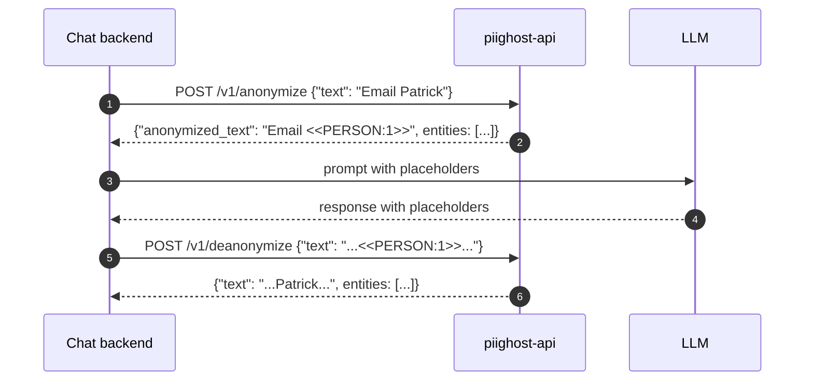

# piighost-api Documentation Bootstrap Implementation Plan

> **For agentic workers:** REQUIRED SUB-SKILL: Use superpowers:subagent-driven-development (recommended) or superpowers:executing-plans to implement this plan task-by-task. Steps use checkbox (`- [ ]`) syntax for tracking.

**Goal:** Bootstrap a bilingual EN+FR documentation site for `piighost-api` using zensical, with five starter pages, two zensical configs, and a refactored bilingual README pair, modelled on the existing piighost docs structure.

**Architecture:** All work happens in the `/home/secondary/PycharmProjects/piighost-api` repo. Two zensical configs at the project root (`zensical.toml` for EN, `zensical.fr.toml` for FR), each pointing at `docs/en/` or `docs/fr/`. Pages are written from scratch, not auto-generated. The piighost-docs skill (in `~/.claude/CLAUDE.md`) defines the conventions: EN/FR mirroring is mandatory, Mermaid diagrams use the figure-caption pattern, nav lives in both zensical TOMLs.

**Tech Stack:** Markdown, zensical static site generator, Mermaid for diagrams, `uv tool run zensical` for local serve. No code changes; documentation only.

**Spec:** `~/PycharmProjects/piighost/docs/superpowers/specs/2026-05-01-piighost-api-docs-design.md`

**No version bumps.** All commits land on master without a release.

---

## File Structure

All paths are relative to `/home/secondary/PycharmProjects/piighost-api/`.

| File | Role | Action |
|---|---|---|
| `zensical.toml` | EN zensical config (docs_dir=docs/en) | Create |
| `zensical.fr.toml` | FR zensical config (docs_dir=docs/fr) | Create |
| `docs/en/index.md` | EN landing page | Create |
| `docs/fr/index.md` | FR landing page | Create |
| `docs/en/getting-started/installation.md` | EN install instructions | Create |
| `docs/fr/getting-started/installation.md` | FR install instructions | Create |
| `docs/en/getting-started/quickstart.md` | EN quickstart | Create |
| `docs/fr/getting-started/quickstart.md` | FR quickstart | Create |
| `docs/en/reference/endpoints.md` | EN REST API reference | Create |
| `docs/fr/reference/endpoints.md` | FR REST API reference | Create |
| `docs/en/reference/cli.md` | EN Typer CLI reference | Create |
| `docs/fr/reference/cli.md` | FR Typer CLI reference | Create |
| `README.md` | Refactored EN README | Replace |
| `README.fr.md` | New FR README | Create |

Each EN/FR pair MUST stay in sync. The implementer commits both files of a pair together so they never drift across commits.

---

## Task 1: Zensical configs + empty docs trees

Stand up the configs and the directory skeleton so subsequent tasks land in a working zensical site from the start. After this task, `zensical serve --dev` should boot (with empty pages); pages are filled in by the next tasks.

**Files:**
- Create: `zensical.toml`
- Create: `zensical.fr.toml`
- Create: `docs/en/index.md` (placeholder, replaced by Task 2)
- Create: `docs/fr/index.md` (placeholder, replaced by Task 2)

- [ ] **Step 1: Create `zensical.toml` (EN)**

```toml
[project]
site_name = "PIIGhost API"
site_url = "https://athroniaeth.github.io/piighost-api/"
site_description = "REST API server for piighost PII anonymization."
site_author = "PIIGhost"
copyright = "Copyright &copy; 2026 PIIGhost contributors"
repo_url = "https://github.com/Athroniaeth/piighost-api"
repo_name = "Athroniaeth/piighost-api"
edit_uri = "edit/master/docs/en/"
docs_dir = "docs/en"

nav = [
  { "Home" = "index.md" },
  { "Get started" = [
    { "Installation" = "getting-started/installation.md" },
    { "Quickstart" = "getting-started/quickstart.md" },
  ]},
  { "Reference" = [
    { "REST endpoints" = "reference/endpoints.md" },
    { "CLI" = "reference/cli.md" },
  ]},
]
```

- [ ] **Step 2: Create `zensical.fr.toml` (FR)**

```toml
[project]
site_name = "PIIGhost API"
site_url = "https://athroniaeth.github.io/piighost-api/fr/"
site_description = "Serveur d'API REST pour l'anonymisation PII piighost."
site_author = "PIIGhost"
copyright = "Copyright &copy; 2026 contributeurs PIIGhost"
repo_url = "https://github.com/Athroniaeth/piighost-api"
repo_name = "Athroniaeth/piighost-api"
edit_uri = "edit/master/docs/fr/"
docs_dir = "docs/fr"

nav = [
  { "Accueil" = "index.md" },
  { "Démarrer" = [
    { "Installation" = "getting-started/installation.md" },
    { "Démarrage rapide" = "getting-started/quickstart.md" },
  ]},
  { "Référence" = [
    { "Endpoints REST" = "reference/endpoints.md" },
    { "CLI" = "reference/cli.md" },
  ]},
]
```

- [ ] **Step 3: Create placeholder `docs/en/index.md`**

```markdown
---
icon: lucide/shield
---

# PIIGhost API

Placeholder. Filled in by Task 2.
```

- [ ] **Step 4: Create placeholder `docs/fr/index.md`**

```markdown
---
icon: lucide/shield
---

# PIIGhost API

Espace réservé. Rempli par la Task 2.
```

- [ ] **Step 5: Verify zensical serves both configs locally**

Run: `cd /home/secondary/PycharmProjects/piighost-api && uv tool run zensical serve --dev`

Expected: HTTP server starts (default port 8000), the home page renders with the placeholder text. Stop with Ctrl-C.

Then run: `uv tool run zensical serve --dev --config zensical.fr.toml`

Expected: same, with the French nav and placeholder.

If `zensical` is not installed, run `uv tool install zensical` first.

- [ ] **Step 6: Commit**

```bash
git add zensical.toml zensical.fr.toml docs/en/index.md docs/fr/index.md
git commit -m "docs(zensical): scaffold EN+FR configs and empty docs trees"
```

---

## Task 2: Landing pages (`docs/en/index.md` + `docs/fr/index.md`)

Replace the placeholder index pages with the real landing content. Two paragraphs, one Mermaid sequence diagram, a short list of differentiators.

**Files:**
- Modify: `docs/en/index.md`
- Modify: `docs/fr/index.md`

- [ ] **Step 1: Write `docs/en/index.md`**

Full content:

````markdown
---
icon: lucide/shield
---

# PIIGhost API

`piighost-api` is a REST API server that hosts a [piighost](https://github.com/Athroniaeth/piighost) anonymization pipeline behind HTTP. The library `piighost` embeds in your Python process; the API hosts a single configurable pipeline so multiple processes (chat backends, batch jobs, notebooks) hit one inference endpoint without re-loading models or duplicating cache state.

Use `piighost-api` when:

- You run **multiple consumers** of the same pipeline (a chat backend plus an offline batch job) and want them to share detections + thread-scoped memory.
- You want **language-agnostic** access to the pipeline (any HTTP client works, not just Python).
- You need **shared caching** across instances (Redis backend) or **API key authentication** in front of the inference endpoint.

For a single Python process, prefer the `piighost` library directly.

## Request flow



<figcaption>A consumer (chat backend) anonymises text via the API before sending it to the LLM, then deanonymises the response on its way back to the user. The pipeline only loads on the API side.</figcaption>

## Differentiators

- **PII inference server** — any piighost detector (regex, GLiNER2, spaCy, …) loaded once, shared across requests.
- **Anonymize / deanonymize endpoints** — full pipeline with entity detection, linking, and resolution.
- **Thread-scoped memory** — conversation entities tracked per `thread_id` for cross-message linking.
- **API key authentication** — [keyshield](https://github.com/Athroniaeth/keyshield) with Argon2 hashing, scopes, and expiration.
- **Redis cache** — anonymization mappings and detection results persisted via aiocache.
- **Configurable pipeline** — specify a Python file at startup (`module:variable` pattern).
- **HITL dataset CLI** — `piighost-api dataset extract|metrics` builds a NER training set from the observation backend.

## Next steps

- [Installation](getting-started/installation.md) — install via uv, pip, or Docker.
- [Quickstart](getting-started/quickstart.md) — write a `pipeline.py` and make your first request.
- [REST endpoints](reference/endpoints.md) — full API reference.
- [CLI](reference/cli.md) — `serve`, `dataset extract`, `dataset metrics`.
````

- [ ] **Step 2: Write `docs/fr/index.md`**

Translate the EN page to idiomatic French. Keep the front matter, headings, the Mermaid diagram (translate the participant labels to `Backend chat`, `LLM`), the figcaption, and the bullet list. Cross-links target the FR pages (`getting-started/installation.md`, etc.) — same relative paths because the FR tree mirrors EN.

Suggested French text for the opening paragraph:

> `piighost-api` est un serveur d'API REST qui héberge un pipeline d'anonymisation [piighost](https://github.com/Athroniaeth/piighost) derrière HTTP. La bibliothèque `piighost` s'intègre dans votre processus Python ; l'API héberge un unique pipeline configurable afin que plusieurs processus (backends chat, jobs batch, notebooks) atteignent un seul endpoint d'inférence sans recharger les modèles ni dupliquer le cache.

For the bullet headings, translate:
- "PII inference server" → "Serveur d'inférence PII"
- "Anonymize / deanonymize endpoints" → "Endpoints d'anonymisation et de désanonymisation"
- "Thread-scoped memory" → "Mémoire scopée par thread"
- "API key authentication" → "Authentification par clé d'API"
- "Redis cache" → "Cache Redis"
- "Configurable pipeline" → "Pipeline configurable"
- "HITL dataset CLI" → "CLI dataset HITL"

The Mermaid sequence diagram and figcaption translate cleanly. Use the same `<figcaption>` HTML pattern.

- [ ] **Step 3: Verify both pages render**

Start `uv tool run zensical serve --dev` and visit `/`. Confirm the Mermaid diagram renders, the bullets are styled, the cross-links work. Repeat with `--config zensical.fr.toml` for the FR build.

- [ ] **Step 4: Commit**

```bash
git add docs/en/index.md docs/fr/index.md
git commit -m "docs(index): write EN+FR landing pages with Mermaid sequence diagram"
```

---

## Task 3: Installation pages (`docs/en/getting-started/installation.md` + FR)

**Files:**
- Create: `docs/en/getting-started/installation.md`
- Create: `docs/fr/getting-started/installation.md`

- [ ] **Step 1: Write `docs/en/getting-started/installation.md`**

Full content:

````markdown
---
icon: lucide/download
---

# Installation

## Requirements

- Python 3.12+
- [uv](https://docs.astral.sh/uv/) (recommended), pip, or Docker
- Optional: a Redis instance for shared cache, a Langfuse / Opik account for observation traces

## Python install

=== "uv"

    ```bash
    uv add piighost-api
    ```

=== "pip"

    ```bash
    pip install piighost-api
    ```

The base install ships with regex detectors only. NER detectors come from the `piighost` library extras (e.g. `piighost[gliner2]`).

## Optional extras

`piighost-api` exposes three optional extras that pull in observation or dataset tooling:

=== "uv"

    ```bash
    uv add piighost-api[langfuse]   # observation traces to Langfuse
    uv add piighost-api[opik]       # observation traces to Opik
    uv add piighost-api[dataset]    # piighost-api dataset extract|metrics CLI
    ```

=== "pip"

    ```bash
    pip install piighost-api[langfuse]
    pip install piighost-api[opik]
    pip install piighost-api[dataset]
    ```

Extras compose: `piighost-api[langfuse,dataset]` enables observation and the dataset CLI in one go.

## Docker

A pre-built image is published to GitHub Container Registry:

```bash
docker pull ghcr.io/athroniaeth/piighost-api:latest
```

Mount your `pipeline.py` and override `EXTRA_PACKAGES` to install detector extras at boot:

```yaml
services:
  piighost-api:
    image: ghcr.io/athroniaeth/piighost-api:latest
    environment:
      - EXTRA_PACKAGES=piighost[gliner2,langfuse]
      - LANGFUSE_PUBLIC_KEY=${LANGFUSE_PUBLIC_KEY}
      - LANGFUSE_SECRET_KEY=${LANGFUSE_SECRET_KEY}
    volumes:
      - ./pipeline.py:/app/pipeline.py
```

The entrypoint runs `uv pip install $EXTRA_PACKAGES` at startup, so the same image serves regex-only and NER deployments.

## Verify

```bash
piighost-api --help
```

Expected: a Typer help banner with `serve` and `dataset` subcommands.

## Next

Continue with the [Quickstart](quickstart.md) to write a pipeline and make your first request.
````

- [ ] **Step 2: Write `docs/fr/getting-started/installation.md`**

Translate the EN page 1-to-1. Translate "Requirements" → "Pré-requis", "Python install" → "Installation Python", "Optional extras" → "Extras optionnels", "Docker" → "Docker" (kept), "Verify" → "Vérification", "Next" → "Suite". Keep the code blocks and tab labels (`uv` / `pip`) as-is.

Suggested French opening for the bullet list:

> - Python 3.12+
> - [uv](https://docs.astral.sh/uv/) (recommandé), pip ou Docker
> - Optionnel : une instance Redis pour le cache partagé, un compte Langfuse ou Opik pour les traces d'observation

The cross-link at the end becomes "Continuez avec le [Démarrage rapide](quickstart.md)…".

- [ ] **Step 3: Verify both pages render**

Run zensical serve, visit `/getting-started/installation/` (EN and FR). Confirm tabs work and code blocks render.

- [ ] **Step 4: Commit**

```bash
git add docs/en/getting-started/installation.md docs/fr/getting-started/installation.md
git commit -m "docs(getting-started): write EN+FR installation pages"
```

---

## Task 4: Quickstart pages (`docs/en/getting-started/quickstart.md` + FR)

**Files:**
- Create: `docs/en/getting-started/quickstart.md`
- Create: `docs/fr/getting-started/quickstart.md`

- [ ] **Step 1: Write `docs/en/getting-started/quickstart.md`**

Full content:

````markdown
---
icon: lucide/zap
---

# Quickstart

Spin up a piighost-api server, run your first anonymization request, see the placeholder in action. Five minutes from a fresh repo clone.

## 1. Write a `pipeline.py`

The server loads a single pipeline at boot, specified via `module:variable`. Create `pipeline.py` next to the place you'll run the server from. Regex-only is enough to play:

```python
from piighost.anonymizer import Anonymizer
from piighost.detector import RegexDetector
from piighost.linker.entity import ExactEntityLinker
from piighost.pipeline.thread import ThreadAnonymizationPipeline
from piighost.placeholder import LabelCounterPlaceholderFactory
from piighost.resolver.entity import MergeEntityConflictResolver
from piighost.resolver.span import ConfidenceSpanConflictResolver

pipeline = ThreadAnonymizationPipeline(
    detector=RegexDetector(
        patterns={
            "EMAIL": r"[a-zA-Z0-9._%+\-]+@[a-zA-Z0-9.\-]+\.[a-zA-Z]{2,}",
            "PHONE": r"\+\d{1,3}[\s.\-]?\(?\d{1,4}\)?(?:[\s.\-]?\d{1,4}){1,4}",
        }
    ),
    span_resolver=ConfidenceSpanConflictResolver(),
    entity_linker=ExactEntityLinker(),
    entity_resolver=MergeEntityConflictResolver(),
    anonymizer=Anonymizer(LabelCounterPlaceholderFactory()),
)
```

## 2. Start the server

```bash
piighost-api serve pipeline:pipeline --host 0.0.0.0 --port 8000
```

Expected log: `Pipeline ready: RegexDetector` and uvicorn listening on `0.0.0.0:8000`.

## 3. First request

```bash
curl -X POST http://localhost:8000/v1/anonymize \
  -H "Content-Type: application/json" \
  -d '{"text": "Email me at patrick@acme.com", "thread_id": "demo"}'
```

Response:

```json
{
  "anonymized_text": "Email me at <<EMAIL:1>>",
  "entities": [
    {
      "label": "EMAIL",
      "placeholder": "<<EMAIL:1>>",
      "detections": [{"text": "patrick@acme.com", "label": "EMAIL", "start_pos": 12, "end_pos": 28, "confidence": 1.0}]
    }
  ]
}
```

## 4. Round-trip

Pass the anonymized text back through `/v1/deanonymize` (cached path) to recover the original:

```bash
curl -X POST http://localhost:8000/v1/deanonymize \
  -H "Content-Type: application/json" \
  -d '{"text": "Email me at <<EMAIL:1>>", "thread_id": "demo"}'
```

Response: the original `Email me at patrick@acme.com`.

## 5. Optional: observation

Set `LANGFUSE_PUBLIC_KEY` / `LANGFUSE_SECRET_KEY` (or `OPIK_API_KEY`) in your environment before starting the server. Each anonymize call then emits a trace tree (`piighost.anonymize_pipeline` → `detect` → `link` → `placeholder` → `guard`). See [REST endpoints](../reference/endpoints.md) for the per-endpoint behaviour.

## Container path

If you prefer Docker, the [Installation](installation.md) page documents the GHCR image. The same `pipeline.py` mounts in via a volume.

## Next

- [REST endpoints](../reference/endpoints.md) — every endpoint, with request and response shapes.
- [CLI](../reference/cli.md) — server flags plus the `dataset extract|metrics` subcommands.
````

- [ ] **Step 2: Write `docs/fr/getting-started/quickstart.md`**

Translate the EN page 1-to-1. Code blocks (Python, bash, JSON) stay as-is. Translate section headings (`Write a pipeline.py` → `Écrire un pipeline.py`, `Start the server` → `Démarrer le serveur`, `First request` → `Première requête`, `Round-trip` → `Aller-retour`, `Optional: observation` → `Optionnel : observation`, `Container path` → `Chemin Docker`, `Next` → `Suite`).

The "expected log" line and inline strings translate naturally; keep the actual log strings verbatim because they are produced by the program.

- [ ] **Step 3: Verify both pages render**

Visit `/getting-started/quickstart/` in both builds. Confirm code blocks have language highlighting and the curl examples copy cleanly.

- [ ] **Step 4: Commit**

```bash
git add docs/en/getting-started/quickstart.md docs/fr/getting-started/quickstart.md
git commit -m "docs(getting-started): write EN+FR quickstart pages"
```

---

## Task 5: REST endpoints reference (`docs/en/reference/endpoints.md` + FR)

**Files:**
- Create: `docs/en/reference/endpoints.md`
- Create: `docs/fr/reference/endpoints.md`

- [ ] **Step 1: Write `docs/en/reference/endpoints.md`**

The page lists eight endpoints. Use a uniform shape per endpoint:

```markdown
### `POST /v1/anonymize`

Run the full anonymization pipeline against *text*, scoped by *thread_id*. Cache hit short-circuits the pipeline and the observation trace.

**Request body** (`AnonymizeRequest`)

| Field | Type | Default | Description |
|---|---|---|---|
| `text` | string | required | The text to anonymize. |
| `thread_id` | string | `"default"` | Thread identifier for cache and memory isolation. |

**Response** (`AnonymizeResponse`)

| Field | Type | Description |
|---|---|---|
| `anonymized_text` | string | The text with PII replaced by placeholders. |
| `entities` | list | One entity per linked group, with `label`, `placeholder`, and `detections`. |

**Example**

```bash
curl -X POST http://localhost:8000/v1/anonymize \
  -H "Content-Type: application/json" \
  -d '{"text": "Email patrick@acme.com", "thread_id": "u1"}'
```

```json
{"anonymized_text": "Email <<EMAIL:1>>", "entities": [...]}
```
```

Use the full content below for the page (front matter, intro, then the eight endpoint sections):

````markdown
---
icon: lucide/server
---

# REST endpoints

All endpoints are mounted under the API root and accept JSON bodies (msgspec). When API keys are configured (`API_KEY_*` env vars at server boot), every endpoint except `GET /` and `GET /health` requires the configured header.

The OpenAPI / Swagger schema is also served live at `/schema/swagger`.

---

## `GET /`

Index. Returns the project name, version, and a pointer to the Swagger doc. No auth required.

```bash
curl http://localhost:8000/
```

```json
{"name": "piighost-api", "version": "0.6.0", "docs": "/schema/swagger"}
```

---

## `GET /health`

Liveness probe. Returns server status and the loaded detector class name. No auth required.

```bash
curl http://localhost:8000/health
```

```json
{"status": "ok", "detector": "CompositeDetector"}
```

---

## `GET /v1/config`

Reports the labels the pipeline declares (when the detector exposes `.labels`) and the placeholder factory class name. Useful for clients that want to render the label vocabulary in a UI.

```bash
curl http://localhost:8000/v1/config
```

```json
{"labels": ["PERSON", "LOCATION", "EMAIL"], "placeholder_factory": "LabelCounterPlaceholderFactory"}
```

---

## `POST /v1/detect`

Run the model-only detection (no anonymisation). Returns the entities the pipeline would have replaced. Side effect: populates the detection cache for `(text, thread_id)` so a subsequent `POST /v1/anonymize` on the same text does not re-run the detector.

**Request body** (`DetectRequest`)

| Field | Type | Default |
|---|---|---|
| `text` | string | required |
| `thread_id` | string | `"default"` |

**Response** (`DetectResponse`)

| Field | Type | Description |
|---|---|---|
| `entities` | list | Entities with their detections (no placeholders). |

```bash
curl -X POST http://localhost:8000/v1/detect \
  -H "Content-Type: application/json" \
  -d '{"text": "Email patrick@acme.com", "thread_id": "u1"}'
```

---

## `PUT /v1/detect`

HITL override of the detection cache. Replaces the model's detections for `(text, thread_id)` with the user-supplied list, and invalidates the anonymise-result cache so the next `POST /v1/anonymize` re-runs with the corrected detections.

When observation is configured, this also emits a `piighost.hitl_correction` trace carrying the model and human detections; see the `dataset extract` CLI for using these traces as a NER training set.

**Request body** (`OverrideDetectRequest`)

| Field | Type | Default |
|---|---|---|
| `text` | string | required |
| `detections` | list | required (each: `{text, label, start_pos, end_pos, confidence}`) |
| `thread_id` | string | `"default"` |

**Response** — empty 200.

```bash
curl -X PUT http://localhost:8000/v1/detect \
  -H "Content-Type: application/json" \
  -d '{"text": "Hi Alice", "thread_id": "u1", "detections": [{"text":"Alice","label":"PERSON","start_pos":3,"end_pos":8,"confidence":1.0}]}'
```

---

## `POST /v1/anonymize`

Run the full pipeline (detect → resolve spans → link → resolve entities → anonymize). Returns the anonymised text and the entity tree.

**Request body** (`AnonymizeRequest`): `{text, thread_id}` (same shape as `/v1/detect`).

**Response** (`AnonymizeResponse`)

| Field | Type | Description |
|---|---|---|
| `anonymized_text` | string | The text with PII replaced by placeholders. |
| `entities` | list | One entity per linked group: `{label, placeholder, detections}`. |

```bash
curl -X POST http://localhost:8000/v1/anonymize \
  -H "Content-Type: application/json" \
  -d '{"text": "Email patrick@acme.com", "thread_id": "u1"}'
```

```json
{
  "anonymized_text": "Email <<EMAIL:1>>",
  "entities": [{"label": "EMAIL", "placeholder": "<<EMAIL:1>>", "detections": [...]}]
}
```

---

## `POST /v1/deanonymize`

Cached path. Looks up the previously-stored mapping for `(anonymised_text, thread_id)`; returns the original text. Errors with 404 when the mapping has expired or never existed.

**Request body** (`DeanonymizeRequest`): `{text, thread_id}`.

**Response** (`DeanonymizeResponse`): `{text, entities}` (the entities used for the original anonymise call).

```bash
curl -X POST http://localhost:8000/v1/deanonymize \
  -H "Content-Type: application/json" \
  -d '{"text": "Email <<EMAIL:1>>", "thread_id": "u1"}'
```

---

## `POST /v1/deanonymize/entities`

Token-replacement path. Replaces every known token in *text* with its original value, in a single regex pass, using the thread's accumulated entity memory. Works on text the pipeline never anonymised (e.g. an LLM-generated reply that includes placeholders), unlike the cached path above.

**Request body** (`DeanonymizeRequest`): `{text, thread_id}`.

**Response** (`DeanonymizeEntResponse`): `{text}`.

```bash
curl -X POST http://localhost:8000/v1/deanonymize/entities \
  -H "Content-Type: application/json" \
  -d '{"text": "Hi <<PERSON:1>>!", "thread_id": "u1"}'
```

---

## Authentication

When `API_KEY_<NAME>=<key>` env vars are set at server boot, every protected endpoint requires the matching key in an `Authorization` header. See [keyshield](https://github.com/Athroniaeth/keyshield) for the details of scopes, rotation, and Argon2 hashing.

When no API keys are configured, auth is disabled (the server logs `auth disabled` at startup).
````

- [ ] **Step 2: Write `docs/fr/reference/endpoints.md`**

Translate 1-to-1. Each endpoint section keeps its HTTP method + path, the table headers translate (`Field` → `Champ`, `Type` → `Type`, `Default` → `Défaut`, `Description` → `Description`), the curl examples and JSON responses stay verbatim. Translate the introductory blurb, the section "Authentication" → "Authentification", and the prose explaining each endpoint.

- [ ] **Step 3: Verify both pages render**

Long page; confirm anchors work (sidebar should show one entry per `### POST/GET/PUT ...`).

- [ ] **Step 4: Commit**

```bash
git add docs/en/reference/endpoints.md docs/fr/reference/endpoints.md
git commit -m "docs(reference): write EN+FR REST endpoints reference"
```

---

## Task 6: CLI reference (`docs/en/reference/cli.md` + FR)

**Files:**
- Create: `docs/en/reference/cli.md`
- Create: `docs/fr/reference/cli.md`

- [ ] **Step 1: Write `docs/en/reference/cli.md`**

Full content:

````markdown
---
icon: lucide/terminal
---

# CLI

`piighost-api` ships a Typer CLI with three subcommands.

```text
piighost-api serve         <pipeline> [options]
piighost-api dataset extract --output FILE [options]
piighost-api dataset metrics --input FILE  [options]
```

Run `piighost-api --help` (or any subcommand with `--help`) for the live help banner.

---

## `serve`

Start the HTTP server. Loads the pipeline once and keeps it warm; uvicorn handles request multiplexing.

| Argument / option | Type | Default | Description |
|---|---|---|---|
| `pipeline` | string | required | Pipeline import path in `module:variable` format (e.g. `pipeline:pipeline`). |
| `--host` | string | `127.0.0.1` | Bind host. Set to `0.0.0.0` to expose on all interfaces. |
| `--port` | int | `8000` | Bind port. |
| `--log-level` | string | `info` | Log level. One of `debug`, `info`, `warning`, `error`. |

The pipeline path is forwarded to a uvicorn factory via the `PIIGHOST_PIPELINE` env var, so the server can hot-reload without rebuilding the import path.

```bash
piighost-api serve pipeline:pipeline --host 0.0.0.0 --port 8000
```

---

## `dataset extract`

Pull HITL and / or non-HITL traces from the configured observation backend (Langfuse) into a JSONL training file. Requires the `dataset` extra (`uv add piighost-api[dataset]`).

The command auto-loads a `.env` from the working directory if `python-dotenv` is available, so `LANGFUSE_PUBLIC_KEY` / `LANGFUSE_SECRET_KEY` can live there instead of being exported manually.

| Option | Type | Default | Description |
|---|---|---|---|
| `--output` / `-o` | path | required | Destination JSONL file. |
| `--since` | datetime | unset | ISO timestamp; skip traces older than this. |
| `--until` | datetime | unset | ISO timestamp; skip traces newer than this. |
| `--mode` | enum | `all` | `all`, `hitl`, or `model-only`. |
| `--limit` | int | unset | Stop after N records. |

**JSONL record schema**

```json
{
  "text": "Bonjour Patrick, comment vas tu ?",
  "entities": [[8, 15, "PERSON"]],
  "model_entities": [[8, 15, "ORG"]],
  "labels_universe": ["PERSON", "LOCATION"],
  "source": "hitl",
  "trace_id": "abc...",
  "session_id": "u1",
  "created_at": "2026-05-01T05:47:27.000Z"
}
```

- `entities` is the ground truth (human corrections in `hitl` records, model output in `model-only` records).
- `model_entities` is always the model's prediction; matches `entities` for `model-only` records.
- `labels_universe` is the detector's vocabulary at correction time when the detector exposes `.labels`, empty otherwise.
- `source` is `"hitl"` for HITL traces, `"model"` for non-HITL traces.

**Mode semantics**

| `--mode` | Trace name | `entities` source |
|---|---|---|
| `hitl` | `piighost.hitl_correction` | `output.detections` (human) |
| `model-only` | `piighost.anonymize_pipeline` | child `piighost.detect` `output.detections` |
| `all` (default) | both | per-trace |

**Example**

```bash
piighost-api dataset extract --output /tmp/dataset.jsonl --since 2026-04-01 --limit 1000
```

---

## `dataset metrics`

Compute per-label precision / recall / F1 from a JSONL produced by `dataset extract`. Pure stdlib; no extra installs needed.

| Option | Type | Default | Description |
|---|---|---|---|
| `--input` / `-i` | path | required | JSONL file to read. |
| `--output` / `-o` | path | unset | Write the report to this path instead of stdout. |
| `--output-format` | enum | `table` | `table`, `csv`, or `json`. |
| `--match-mode` | enum | `strict` | `strict` (exact span+label) or `lenient` (IoU ≥ `--iou-threshold`). |
| `--iou-threshold` | float | `0.5` | IoU floor in lenient mode. |
| `--source` | enum | `all` | `all`, `hitl`, or `model`; restrict aggregation to one source. |

**Output columns**

| Column | Meaning |
|---|---|
| `tp` | True positive (model and human agreed). |
| `fp` | False positive (model predicted, human deleted or relabelled). |
| `fn` | False negative (human added, model missed). |
| `P` | Precision = `tp / (tp + fp)`. |
| `R` | Recall = `tp / (tp + fn)`. |
| `F1` | Harmonic mean of P and R. |

The table also reports macro and micro averages and, when label-level confusion exists (same span, different labels), a confusion section.

**Example**

```bash
piighost-api dataset metrics --input /tmp/dataset.jsonl --source hitl
```

```text
label                    tp     fp     fn      P      R     F1
--------------------------------------------------------------
PERSON                    3      0      1   1.00   0.75   0.86
LOCATION                  2      0      1   1.00   0.67   0.80
--------------------------------------------------------------
macro avg                 -      -      -   1.00   0.71   0.83
micro avg                 -      -      -   1.00   0.71   0.83
```

---

## Typical workflow

```bash
# 1. Extract the last week of HITL corrections
piighost-api dataset extract --output /tmp/last_week.jsonl --since "$(date -u -d '7 days ago' +%Y-%m-%dT%H:%M:%S)"

# 2. Inspect the dataset before training
piighost-api dataset metrics --input /tmp/last_week.jsonl --source hitl

# 3. Convert to spaCy / GLiNER / your training tooling (out of scope of this CLI)
```
````

- [ ] **Step 2: Write `docs/fr/reference/cli.md`**

Translate the EN page 1-to-1. The command names and flag names stay in English. Translate column headings of all tables (e.g. "Argument / option" → "Argument / option" stays, "Type" → "Type", "Default" → "Défaut", "Description" → "Description"). Translate "Mode semantics" → "Sémantique des modes", "Output columns" → "Colonnes de sortie", "Typical workflow" → "Workflow type".

- [ ] **Step 3: Verify both pages render**

Confirm tables and code blocks render. Spot-check the output table example renders monospaced.

- [ ] **Step 4: Commit**

```bash
git add docs/en/reference/cli.md docs/fr/reference/cli.md
git commit -m "docs(reference): write EN+FR CLI reference"
```

---

## Task 7: Refactor README + add FR README

**Files:**
- Modify: `README.md`
- Create: `README.fr.md`

- [ ] **Step 1: Replace `README.md`**

Full new content:

````markdown
# PIIGhost API


[](https://pytest.org/)
[](https://docs.astral.sh/uv/)
[](https://docs.astral.sh/ruff/)

[README EN](README.md) - [README FR](README.fr.md)

[Documentation EN](https://athroniaeth.github.io/piighost-api/) - [Documentation FR](https://athroniaeth.github.io/piighost-api/fr/)

`piighost-api` is a REST API server for [piighost](https://github.com/Athroniaeth/piighost) PII anonymization. The library `piighost` embeds in your Python process; the API hosts a single configurable pipeline behind HTTP so multiple processes (chat backends, batch jobs, notebooks) hit one inference endpoint without re-loading models or duplicating cache state.


## Features

- **PII inference server** — any piighost detector (regex, GLiNER2, spaCy, …) loaded once, shared across requests.
- **Anonymize / deanonymize endpoints** — full pipeline with entity detection, linking, and resolution.
- **Thread-scoped memory** — conversation entities tracked per `thread_id` for cross-message linking.
- **API key authentication** — keyshield with Argon2, scopes, expiration.
- **Redis cache** — shared anonymization mappings via aiocache.
- **Configurable pipeline** — `module:variable` import path at startup.
- **HITL dataset CLI** — `piighost-api dataset extract|metrics` builds a NER training set from observation traces.

## Quick start

```bash
uv add piighost-api
piighost-api serve pipeline:pipeline --port 8000
```

See the [Quickstart guide](https://athroniaeth.github.io/piighost-api/getting-started/quickstart/) for the full walk-through, including the `pipeline.py` template.

For the Docker path:

```bash
docker pull ghcr.io/athroniaeth/piighost-api:latest
```

## Documentation

- [Installation](https://athroniaeth.github.io/piighost-api/getting-started/installation/)
- [Quickstart](https://athroniaeth.github.io/piighost-api/getting-started/quickstart/)
- [REST endpoints](https://athroniaeth.github.io/piighost-api/reference/endpoints/)
- [CLI](https://athroniaeth.github.io/piighost-api/reference/cli/)

## License

MIT.
````

- [ ] **Step 2: Create `README.fr.md`**

Translate the new EN README 1-to-1. Same badges, same Mermaid diagram (translate the `Chat backend` participant to `Backend chat`). Translate "Quick start" → "Démarrage rapide", "Documentation" → "Documentation", "License" → "Licence". The "Features" bullet headings translate as in the EN index.md (Task 2).

The cross-link line at the top stays as `[README EN](README.md) - [README FR](README.fr.md)`.

- [ ] **Step 3: Verify the READMEs render on GitHub-flavoured Markdown**

Open both files in your IDE's preview (or `gh markdown-preview README.md` if installed). Confirm the cross-links work and the Mermaid diagram parses.

- [ ] **Step 4: Commit**

```bash
git add README.md README.fr.md
git commit -m "docs(readme): refactor for bilingual EN+FR with cross-links to docs site"
```

---

## Task 8: Final verification

**Files:** none modified — verification only.

- [ ] **Step 1: Boot both zensical builds**

```bash
cd /home/secondary/PycharmProjects/piighost-api
uv tool run zensical serve --dev
```

Visit `http://localhost:8000/`. Click through every nav entry (Home, Installation, Quickstart, REST endpoints, CLI). Confirm no broken links, all five pages render, code highlighting works, the Mermaid diagram on the home page renders.

Stop with Ctrl-C, then:

```bash
uv tool run zensical serve --dev --config zensical.fr.toml
```

Repeat the click-through for the French nav. Confirm every EN page has a French sibling and the URLs match.

- [ ] **Step 2: Sanity-check the bilingual READMEs**

```bash
ls -1 README*.md
```

Expected: `README.fr.md` and `README.md`. Open both, confirm the cross-link line is identical and the Mermaid diagram is present in both.

- [ ] **Step 3: Confirm git log is clean**

```bash
git log --oneline | head -10
```

Expected: a series of `docs(...)` commits matching the task structure. No accidental code changes.

- [ ] **Step 4: Re-run the existing piighost-api test suite as a sanity check**

```bash
unset VIRTUAL_ENV
uv run pytest -q
```

Expected: every test passes (no docs change should affect tests, but the sanity check costs nothing).
