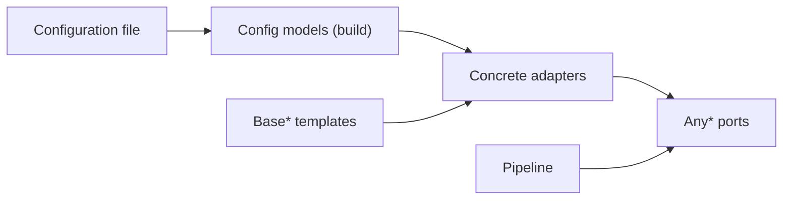

# Add or replace a pipeline component

## In short

- PIIGhost is a sequence of interchangeable stages: you replace a detector or a rule without touching the other stages.
- Each stage follows a contract written once. Any part that respects this contract can take its place.
- The configuration file builds these parts. The parts, for their part, know nothing about the configuration file.
- The heavy building blocks (AI models, databases) are installed only if you ask for them.
- The type of the chosen placeholder is checked before execution: an incompatible combination is rejected early.

This page is technical. For the flow of a message, read [Protect a message before it is sent to the model](../processes/protect-a-message.md). The terms are defined in the [glossary](../glossary.md).

## How the code is split

Each stage lives in a package of `src/piighost/components/`. Its `base.py` declares the **port**: a `Protocol` marked `runtime_checkable`, named `Any*`. The pipeline depends on the port, never on a concrete class. An object satisfies the port as soon as it has the right method, without inheritance.

When several adapters share a skeleton, this skeleton lives in a `Base*` template (Template Method pattern). The adapter then supplies only the step that varies, for example `_key` for a linker or `_reduce` for an overlap resolver.



### Which ports have a template

| Port | `Base*` template | Adapters provided |
|---|---|---|
| `AnyDetector` | none (except `BaseNERDetector` for NER models) | `RegexDetector`, `ExactMatchDetector`, `CompositeDetector`, `ChunkedDetector`, `LLMDetector`, NER detectors |
| `AnyDetectionOverride` | none | `DetectionOverride` |
| `AnyOverlapResolver` | `BaseOverlapResolver` | `ConfidenceOverlapResolver`, `MergeOverlapResolver` |
| `AnyDetectionExpander` | `BaseDetectionExpander` | `WordBoundaryExpander` |
| `AnyEntityLinker` | `BaseEntityLinker` | `ExactEntityLinker` |
| `AnyEntityResolver` | `BaseEntityResolver` | `MergeEntityResolver`, `FuzzyEntityResolver`, `SeparateEntityResolver` |
| `AnyAnonymizer` | `BaseAnonymizer` | `Anonymizer` |
| `AnyPlaceholderFactory` | `BaseDelimitedPlaceholderFactory`, `BaseCounterPlaceholderFactory` | factories of `components/placeholder/` |
| `AnyGuardRail` | none | `DetectorGuardRail`, `Gliner2GuardRail`, `LLMGuardRail`, `ModerationGuardRail` |
| `AnyConversationMemory` | none | in-process memory, Redis, SQLAlchemy |
| `AnyHasher` / `AnyCipher` | `BaseHasher` / none | SHA-256, Argon2id / AES-GCM |

The ports without a template state it in their docstring: their implementations differ in their whole mechanism, not in a single step.

### The shared NER detector

`BaseNERDetector` (`components/detector/ner/base.py`) carries the pass common to the models: label mapping, a confidence threshold applied whatever the model, splitting a text that is too long into overlapping chunks. A text longer than `max_chars` is split if `auto_chunk` is active (by default), otherwise it raises `TextTooLongError`.

## One-way coupling between configuration and core

`config/` imports the core and builds it. No core module imports `piighost.config` at runtime. Each configuration model inherits from `_ComponentConfig`, which forbids any undeclared key, and exposes a `build()` that imports its adapter at the last moment. There is neither a builder registry nor a `from_config` method.

You choose the type of a component with the `type` key: `DetectorConfig` is a union discriminated on `type`.

## Optional dependencies loaded on demand

The core depends only on `typing-extensions`. Everything else is an extra of `pyproject.toml`. A module that needs an extra checks its presence with `importlib.util.find_spec` and raises an `ImportError` that names the extra to install. The packages expose these names lazily through a `__getattr__` that reads a dictionary of name to module. `from piighost import AnonymizationPipeline` therefore loads neither torch nor langchain.

## Typed placeholders

The placeholder factories carry a preservation tag (`components/placeholder/tags.py`). These tags are subclasses of `str` that exist only for the type checker. They say whether the placeholder keeps the value type, the identity, the shape, and whether it can be found in a text. The middleware requires `PreservesRecognizableIdentity`: a placeholder that identifies a single value and that can be found. Passing it a mask factory becomes a typing error.

## Add a detector

1. Copy the closest adapter. For a NER model, start from `components/detector/ner/spacy.py` and inherit from `BaseNERDetector`. Otherwise, start from `components/detector/regex.py` and implement `async def detect(self, text: str) -> list[Detection]`.
2. If the module imports a heavy dependency, keep the import in the module, behind a `find_spec` test, and expose the class through the package `__getattr__`.
3. Add the extra in `[project.optional-dependencies]` of `pyproject.toml`, then in the `all` extra.
4. Write the configuration model next to its neighbors in `config/models/detector_model.py`: `type: Literal["..."]`, validated fields, a `build()` that imports the adapter locally.
5. Add this model to the `DetectorConfig` union of `config/models/detector.py`.
6. Add a constructor to the `DETECTORS` list of `tests/components/detector/test_contract.py`.
7. If the module is guarded, add the `(module, dependency, extra)` line to `OPTIONAL_DEPENDENCY_GUARDS` in `tests/regression/test_imports.py`.

### Check

```bash
uv run pytest tests/components/detector/test_contract.py tests/regression/test_imports.py tests/config
make lint
```

The contract test must report, for your detector, the same span in code points, the text read back from the source and the external label as the other detectors.

## Pitfalls

- **A detector can return overlapping detections.** The port allows it. The overlap resolver arbitrates them, and it is always active.
- **A heavy import at package level breaks the minimal install.** `test_missing_optional_dependency_names_its_extra` catches it for the modules listed in `OPTIONAL_DEPENDENCY_GUARDS`. `test_every_module_imports_cleanly` does not see it if the test environment already has all the extras.
- **A misspelled configuration key is rejected**, not ignored, thanks to `extra="forbid"`. This is intended.
- **The threshold of a NER detector applies even if the model ignores it.** Do not rely on the model to filter.

## Doc / code gaps

> ⚠ Doc / code gap
> **Doc**: `AGENTS.md` (lines 7, 26 and 82) says that each stage has an `Any*` port and a `Base*` template. `docs/en/architecture.md:109-111` says that only two ports have no template, the guard rails and the memory.
> **Code**: five ports have no template: the detector (`components/detector/base.py:9`), the whitelist and the blacklist (`components/override/base.py:9-17`), the guard rails (`components/guard/base.py:42`), the memory (`conversation_memory/base.py:10-14`) and encryption (`crypto/cipher/base.py:7-10`).

> ⚠ Doc / code gap
> **Doc**: the error message of `config/models/detector.py:62-66` says that the built-in catalogs were removed "in piighost 2.0".
> **Code**: the package version is `1.10.0` (`pyproject.toml:3`). The `CHANGELOG.md` places the move of the catalogs to the hub in 1.8.0. [to check]: ask the maintainer whether "2.0" means the internal rewrite or an upcoming version.

These gaps are also listed in the [gap register](../reference/doc-code-gaps.md).

## Tests

| Test | What it guarantees |
|---|---|
| `tests/components/detector/test_contract.py` | All detectors report the same value in the same way (span, text, label, confidence between 0 and 1). |
| `tests/regression/test_imports.py` | The public API imports, each module imports without an extra, each guard names its extra. |
| `tests/config/` | Each configuration model validates and builds. |

No test enforces the one-way coupling. The rule "the core never imports `piighost.config`" holds through code review. To check it: `grep -rn "piighost.config" src/piighost --include=*.py | grep -v "^src/piighost/config\|^src/piighost/cli"` must be empty.

To run the tests, see [Run and write tests](../tests/run-and-write-tests.md). For the configuration, see [Configure a pipeline](../operations/configuration-and-hub.md).
