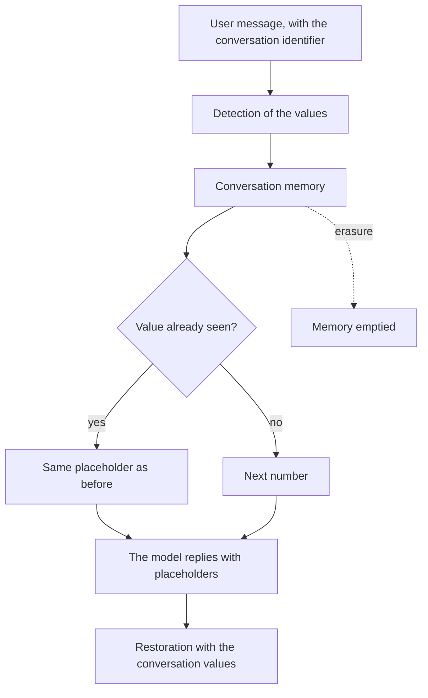

# Follow a conversation and restore the reply

## In short

- In a conversation, a given value keeps the same placeholder from the first message to the last.
- Two conversations are isolated. The same name can carry the same number in both, but they share nothing.
- Each call names its conversation. A call without an identifier is refused. It never falls into a shared conversation.
- A value first mentioned by the assistant stays in clear text, even if the user repeats it later.
- Erasing a conversation deletes its memory. The placeholders of that conversation are no longer restored afterwards.

Needs covered: DEV-2, DEV-3, DEV-8, DEV-10, DEV-11, OPS-2, OPS-7, USER-1, USER-2, USER-6 and DPO-6, described in [Needs by profile](../needs-by-profile.md). The terms are defined in the [glossary](../glossary.md). The processing of a single message is described in [Protect a message before it is sent to the model](protect-a-message.md).

## For the business

PIIGhost has no screen. A conversation is designated by an identifier that the application passes with each message. What you can observe is the text the model receives and the reply shown.

### Who is involved

| Actor | Role |
|---|---|
| The end user | writes in clear text, reads the restored reply, can correct a detection |
| The application | names the conversation on each call |
| PIIGhost | keeps the values of each conversation in memory |
| The model | receives and writes only placeholders |
| The DPO | requests the erasure of a conversation |

### The path of a message in a conversation



### Example conversation

| Turn | Author | Text written | Text seen by the model |
|---|---|---|---|
| 1 | user | I am Claire Dubois. | I am `<<PERSON:1>>`. |
| 2 | user | My colleague Marc Petit and Claire Dubois. | My colleague `<<PERSON:2>>` and `<<PERSON:1>>`. |
| 3 | assistant | The head office is in Lyon. | The head office is in Lyon. |
| 4 | user | I am going to Lyon to see Marc Petit. | I am going to Lyon to see `<<PERSON:2>>`. |

If the model replies "Hello `<<PERSON:1>>`, greet `<<PERSON:2>>`.", the user reads "Hello Claire Dubois, greet Marc Petit."

**How to check**: ask the technical team for the placeholder mapping of the conversation. Each placeholder must designate a single person.

### Correct a detection

The user, or the application on the user's behalf, can correct the values of a message before it is sent, for example add a missed name, or make readable a term masked by mistake.

If your application has a correction screen, do it in that screen. Otherwise, ask the technical team. They apply the correction through `anonymize_corrected` (or the server route `/v1/anonymize/corrected`).

1. Find the message to correct.
2. Add the missed value with its type, or remove the value masked by mistake.
3. Send the corrected message again.

> [!WARNING]
> Correcting an old message can change the numbers of the whole conversation (BR-CONV-07). A reply already written by the model can then be restored with the name of another person. Correct the last message preferably.

**How to check**: the added value leaves as a placeholder, the removed value leaves in clear text, and the other messages do not change.

### Erase a conversation

Typical case: a person exercises their right to erasure.

1. Identify the conversation by its identifier.
2. Ask the technical team for its erasure, or call the erasure route of the server.
3. Note the report, that is the number of messages and values deleted.

**How to check**: restore an old placeholder of this conversation. It must stay as is, for example "Hello `<<PERSON:1>>`".

### Rules to know

**BR-CONV-01.** When a value reappears in a later message of the same conversation, then it takes back its placeholder. A new value of the same type receives the next number.

**BR-CONV-02.** When the same value appears in two different conversations, then each has its own numbering, and a placeholder is restored only in its own conversation. For example, "Marc Petit" is `<<PERSON:2>>` in one conversation and `<<PERSON:1>>` in another. Restoring `<<PERSON:1>>` in a third, empty conversation leaves it as is.

**BR-CONV-03.** When a call names no conversation, then it is refused, before anything is sent to the model. An application whose conversations do not need to be separated names the conversation `default` itself. The reason is that without an identifier, all users would share their placeholders.

**BR-CONV-04.** When the assistant mentions a value before the user does, then it stays in clear text for the whole conversation, even if the user repeats it later (turn 4, "Lyon"). The reason is that the model already knows this value, and masking it would take away useful knowledge. The two other settings are to mask it like a user value, or to not analyze the assistant messages. A value first brought by the user stays masked, even if the assistant repeats it.

**BR-CONV-05.** When the model's reply contains a placeholder of the conversation, then it is replaced by the real value, even in a text that PIIGhost never protected.

**BR-CONV-06.** When the reply contains a placeholder in the right format that PIIGhost never issued, then the restoration is refused by default, with the error `Deanonymized text holds tokens the pipeline never issued: ['<<PERSON:9>>']`. This placeholder was invented by the model or injected by a text. The two other choices are to keep it or drop it.

| Setting | "Hello `<<PERSON:1>>` and `<<PERSON:9>>`." becomes |
|---|---|
| Refuse (default) | error, nothing is shown |
| Drop | "Hello Claire Dubois and ." |
| Keep | "Hello Claire Dubois and `<<PERSON:9>>`." |

A placeholder whose case or number has changed (`<<Person:1>>`, `<<PERSON:01>>`) counts as invented. A placeholder with damaged delimiters (`<< PERSON:1 >>`) is not recognized at all and stays as is.

**BR-CONV-07.** When a person corrects the values of a message by hand, then the correction replaces the automatic detection of that message only. The deny list (`deny_list` in the configuration) and the allow list (`allow_list`) still apply. For example, removing "Claire Dubois" from turn 1 leaves it in clear text in turn 1, and it stays masked in turn 2. The numbers can then change for the whole conversation. After this removal, `<<PERSON:1>>` designates Marc Petit and `<<PERSON:2>>` Claire Dubois.

**BR-CONV-08.** When an identical message is sent again in the same conversation, then its detection is not run again. The result recorded the first time is reused.

**BR-CONV-09.** When a conversation is erased, then all its memory is deleted, and the erasure returns the number of messages and values deleted. For example, it returns `Forgotten(messages=4, detections=5)` for the conversation above. Afterwards, `<<PERSON:1>>` is no longer restored and stays as is.

**BR-CONV-10.** When several instances of the service share the same Redis memory, then they give the same placeholder to the same value of a conversation, and each one restores the placeholders issued by the other.

**BR-CONV-11.** When the memory is kept in the process, then, unless set otherwise, it keeps at most 10,000 conversations and forgets each one a day after its last message. A forgotten conversation no longer restores its placeholders. The reason is that a server that runs for weeks must not keep every value it has seen.

For a reply shown as it arrives, see [Show a streamed reply](show-a-streamed-reply.md).

### What the end user sees

A readable conversation, with the real values. An old reply can still display placeholders if the application restores it a second time. This happens after an erasure, or after one day of inactivity when the memory is kept in the process.

### Frequently asked questions

**The call stops with `No thread_id in the LangGraph config`.** The application does not name the conversation (BR-CONV-03). Have it pass an identifier, or `default` if the conversations do not need to be separated.

**A reply showed the name of another person.** An old message was probably corrected by hand (BR-CONV-07), or the memory of a message expired (see Pitfalls). Check the history of the conversation.

**"Lyon" is not masked although the user wrote it.** The assistant had mentioned it first (BR-CONV-04). To force the masking, see [Impose a deny list and an allow list](impose-a-whitelist-and-blacklist.md).

**The reply stops with `Deanonymized text holds tokens the pipeline never issued`.** The model wrote an unknown placeholder (BR-CONV-06). It often copied a placeholder from another conversation or from a document.

**The reply shows `<<PERSON:1>>` after a long pause.** The in-process memory forgot the conversation after one day of inactivity (BR-CONV-11), or the conversation was erased (BR-CONV-09).

## For developers

The technical guide builds a conversation pipeline step by step in [Conversational pipeline](../../../docs/en/getting-started/conversation.md).

### Where the rules live

| Rule | Location |
|---|---|
| BR-CONV-01, BR-CONV-07 | `src/piighost/pipeline/thread.py:289-339` (`_thread_tokens` over the union of the detections), `components/placeholder/base.py:145-156` |
| BR-CONV-02 | `conversation_memory/memory.py` (storage per `thread_id`), `pipeline/thread.py:219-231` (`deanonymize`) |
| BR-CONV-03 | `integrations/langchain/middleware.py:47-66` (`_thread_id`), `integrations/claude_code/hooks.py:101-105`, `piighost-api` (`app.py`, `thread_id` required on the conversation routes) |
| BR-CONV-04 | `pipeline/thread.py:322-329`, `conversation_memory/memory.py` (`get_provenance`), `integrations/langchain/middleware.py:370` (`_message_role`) |
| BR-CONV-05 | `pipeline/thread.py:219-231` (`deanonymize`) |
| BR-CONV-06 | `integrations/_deidentify.py:133-155` (`_handle_invented`) |
| BR-CONV-07 | `pipeline/thread.py:190-217` (`anonymize_corrected`), per-message rendering on lines 159-178 |
| BR-CONV-08 | `pipeline/thread.py:264-287` (`_detect`) |
| BR-CONV-09 | `pipeline/thread.py:244-262` (`forget_thread`) |
| BR-CONV-10 | `conversation_memory/redis_backend.py` |
| BR-CONV-11 | `conversation_memory/memory.py:13-25` (`DEFAULT_MAX_THREADS`, `DEFAULT_TTL`), `config/models/memory.py` (`InMemoryConfig`) |

Related components: `ThreadAnonymizationPipeline`, `AnyConversationMemory` (`remember`, `get_detections`, `get_provenance`, `forget`), `MessageRole`, `Forgotten`, `thread_token_map`, `TextDeidentifier`, `DEFAULT_THREAD_ID` (`conversation_memory/base.py:31`), `MissingThreadIdError`, `InventedPlaceholderStrategy`, `EntityCreateByAssistantStrategy`.

Mechanics: placeholders are assigned over the union of the detections of all messages, in order of first appearance. The rendering replaces only the positions of the current message, because the detections of different messages share the same position space.

### Correct a message by hand

1. Build the corrected set of `Detection` for the exact text of the message.
2. Call `await pipeline.anonymize_corrected(text, thread_id, detections)`.
3. If the corrected message is not the last one, run the following turns again (BR-CONV-07).

#### Check

```bash
uv run pytest tests/pipeline/test_thread.py tests/pipeline/test_thread_hitl.py tests/acceptance
```

After the correction, `await pipeline.thread_token_map(thread_id)` must show the expected mapping placeholder by placeholder.

### Pitfalls

- **No integration falls back to `default`.** The LangChain middleware and the Claude Code hooks raise `MissingThreadIdError`, and the server answers 400. Only the `piighost anonymize` command keeps `--thread-id default`, for a standalone command.
- **The numbering depends on the order of the union.** Anything that removes an old message from the union shifts the numbering. A correction does it (BR-CONV-07), but also, according to the code, the expiry of a Redis message with `ttl` (`conversation_memory/redis_backend.py:200-228`). [to check] This second case was not replayed. To settle it, write two messages in a Redis conversation with a short `ttl`, let the first one expire, then compare `thread_token_map`.
- **The in-process memory forgets silently.** An evicted or expired conversation (BR-CONV-11) raises nothing. Its placeholders stay as is at restoration. `max_threads=None` and `ttl=None` lift the bounds.
- **Provenance applies to the value key** (`value_key`), so to every spelling of a value.
- **The placeholder cache is memoized per process** (256 maps at most, `_TOKEN_MEMO_MAX`). See [Store conversations](../operations/storage-and-encryption.md) for the effect on erasure with multiple processes.
- **`anonymize_corrected` does not resolve overlaps** and does not run the expansion again. The corrected set must be clean. It only goes through the deny list and allow list.

### Tests

| Test | Covers |
|---|---|
| `tests/pipeline/test_thread.py` | Stable placeholder, next number, conversation isolation, cache, erasure and memo, assistant provenance, final check, memo duration |
| `tests/pipeline/test_thread_hitl.py` | Addition and removal by correction, correction local to the message, replaced correction |
| `tests/integrations/langchain/test_middleware.py` (`TestThreadId`), `tests/integrations/test_claude_code_hooks.py` | Refusal of a call without an identifier (AT-DEV-10-1, AT-DEV-10-2) |
| `tests/conversation_memory/test_in_memory.py` (`TestBounding`) | Default bounds of the in-process memory (AT-OPS-7-1) |
| `tests/acceptance/test_dev.py`, `test_dpo.py`, `test_ops.py` | Restoration limited to its conversation (AT-DEV-3-2), erasure (AT-DPO-6-1), two instances on the same Redis (AT-OPS-2-1) |
| `tests/integrations/test_deidentify.py` | Invented placeholders |

Not covered: the renumbering after a correction of an old message (BR-CONV-07). This behavior was observed by running the pipeline, and no test pins it or forbids it.
