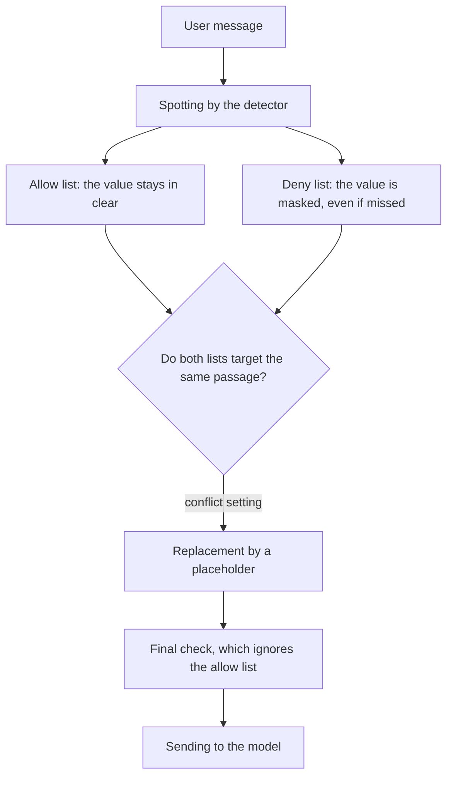

# Impose a deny list and an allow list

## In short

- Two lists, written in the `[override]` section of the configuration, correct the detector. The deny list (`deny_list` in the configuration) always masks, the allow list (`allow_list`) never masks.
- The configuration is the pipeline's, whether it runs in the application or in the `piighost-api` server.
- These lists come before everything else, including a correction made by hand by a person.
- A value on the allow list goes to the model in clear, and the final check does not block it.
- When both lists target the same value, the deny list wins by default, so the value is masked.
- A changed list only applies to the new messages of a conversation already under way.

Needs covered: DPO-3, USER-5 and USER-6, described in [Needs by profile](../needs-by-profile.md). The terms are defined in the [glossary](../glossary.md). The full path of a message is in [Protect a message before it is sent to the model](protect-a-message.md).

## For the business

PIIGhost has no screen. The technical team writes the deny list and the allow list, in the code or in the `[override]` section of the configuration file of the application or of the `piighost-api` server. The DPO decides their content. The tasks below say what to ask for.

### The path of a message through the lists



### Example followed from end to end

The deny list contains the form "PRJ- followed by four digits", with the type `PROJET`. The allow list contains "Acme", the company name. The detector reads "Acme" as a person and does not know the case numbers.

| Step | Text |
|---|---|
| User message | Write to Jean Dupont, at Acme, case PRJ-0042. |
| Without the lists | Write to `<<PERSON:1>>`, at `<<PERSON:2>>`, case PRJ-0042. |
| With the lists, received by the model | Write to `<<PERSON:1>>`, at Acme, case `<<PROJET:1>>`. |
| Reply read by the user | Noted for PRJ-0042. |

### Keep a value in clear

Typical case: your company name is read as a person's name, and the model needs it to answer.

1. List the exact values to keep in clear, with their spelling.
2. State whether the value must stay in clear whatever way the detector classifies it. This is the default setting.
3. If a longer value contains it ("Acme Services" for "Acme"), say whether the longer value must also stay in clear.
4. Send the list to the technical team.

**How to check**: have a test sentence protected. For example, "Claire Dubois works at Acme." must give "`<<PERSON:1>>` works at Acme."

### Force the masking of a value

Typical case: your internal code names are never spotted.

1. Describe the exact form of the values, for example "PRJ- followed by four digits".
2. State whether a value first quoted by the assistant must also be masked. By default, no (BR-LIST-05).
3. Send the description to the technical team.

**How to check**: have a sentence that contains a code name protected. It must be replaced by a placeholder like `<<CODE:1>>`.

### Rules to know

**BR-LIST-01.** When a value is in the allow list, then it is removed from the values to mask and goes to the model in clear.

**BR-LIST-02.** When a value is in the deny list, then it is masked, even if the detector missed it. If the detector had spotted a piece that overlaps it, the deny list's detection replaces that piece.

**BR-LIST-03.** When the allow list targets a value, then the way to apply it follows one of three settings. Example on "Claire Dubois works at Acme, then at Globex SA.", with a detector that reads "Acme" as a person, and an allow list that contains "Acme" and "Globex" as organizations:

| Setting | Removes | Result |
|---|---|---|
| Same value (default) | any detection of the same text, whatever its position and type | `<<PERSON:1>>` works at Acme, then at `<<ORG:1>>`. |
| Exact | only a detection with the same position and the same type | `<<PERSON:1>>` works at `<<PERSON:2>>`, then at `<<ORG:1>>`. |
| Overlap | any detection that touches the value, even a longer one | `<<PERSON:1>>` works at Acme, then at Globex SA. |

"Same value" is the default because the allow list names a value, and the type written next to it is only a guess about what the detector will say.

**BR-LIST-04.** When both lists target the same passage, then the conflict setting decides:

| Setting | Result on "Acme" present in both lists |
|---|---|
| The deny list wins (default) | masked: `<<ORG:1>>` |
| The allow list wins | in clear: `Acme` |
| Refuse | stop with `Overrides contradict each other on 'Acme': a span on the deny list overlaps one on the allow list.` |

This default comes from a simple principle. When in doubt, masking protects.

**BR-LIST-05.** When the assistant is the first to quote a value on the deny list, then it stays in clear by default. A "force" setting masks it anyway. The reason is that masking a value the model brought itself takes useful knowledge away from it. The masking also signals to it that this precise value is sensitive.

**BR-LIST-06.** When a person corrects the values of a message by hand, then both lists still apply to the correction and take precedence over it. For example, the user removes "PRJ-0042" from the masked values of their message, but the number stays masked.

**BR-LIST-07.** When the final check rereads the protected text, then it ignores the values on the allow list. Any other value left in clear blocks the sending.

**BR-LIST-08.** When a list changes during a conversation, then a message already analyzed keeps its old result, even when sent again unchanged. For example, on 2026-10-02, "Acme" enters the deny list. The message sent on 2026-10-01 in the same conversation keeps "Acme" in clear. Only new messages apply the list.

### What the end user sees

Nothing different. The restored reply contains the real values. Only the model sees the difference between a masked value and a value kept in clear.

### Frequently asked questions

**The company name is still masked although it is in the allow list.** Three possible causes. The value is also in the deny list (BR-LIST-04). Or the detected text is longer than the listed value, with the "Same value" setting (BR-LIST-03). Or the message had been analyzed before the value was added to the list (BR-LIST-08).

**A code name on the deny list stays in clear.** The assistant probably quoted it first in the conversation (BR-LIST-05). Ask for the "force" setting if the value must always be masked.

**Processing stops with `Overrides contradict each other on …`.** The conflict setting is "Refuse" and a value is in both lists. Remove it from one of the two.

## For developers

The technical guide shows both lists at work in [How to force a detection or keep a value in clear](../../../docs/en/examples/overrides.md).

### Where the rules live

| Rule | Location |
|---|---|
| BR-LIST-01, BR-LIST-03 | `src/piighost/components/override/detector.py:16-42`, `_clear` lines 145-154 |
| BR-LIST-02 | `detector.py:126-143` (`_force`) |
| BR-LIST-04 | `detector.py:88-108` (`apply`), `_refuse_collisions` lines 156-166 |
| BR-LIST-05 | `detector.py:117-124` (`forces_value`), `pipeline/thread.py:322-329` |
| BR-LIST-06 | `pipeline/thread.py:210` (`anonymize_corrected`) |
| BR-LIST-07 | `pipeline/base.py:225-234` (`_cleared_values`), `pipeline/base.py:313-341` (`_guard`) |
| BR-LIST-08 | `pipeline/thread.py:271-287` (`_detect` reapplies nothing on a cached message) |
| Strategies and defaults | `components/override/strategy.py`, `config/models/override.py:52-58` |
| Refusal of the 1.x names (DEC-09) | `config/models/override.py:14-32`, `_refuse_renamed_keys` and `_refuse_renamed_conflict_values` lines 60-90 |
| Deny list and allow list in the server | `piighost-api` reads the same `[override]` section of its configuration |

Related components: `AnyDetectionOverride` (port, without template), `DetectionOverride` (implementation driven by two detectors), `AllowListStrategy`, `DenyListStrategy`, `OverrideConflictStrategy`, `ConflictingOverrideError`.

Position in the pipeline: right after detection, before overlaps and expansion (`pipeline/base.py:364-371`). In the conversation pipeline, before each write to memory (`pipeline/thread.py:276-286`).

### Configure the lists

1. Start from the `[override]` section documented in `docs/en/configuration/toml.md`.
2. Write each list as a full detector, often `type = "exact"` or `type = "regex"`:

```toml
[override]
allow_list_strategy = "value"
conflict_strategy = "deny_list_wins"

[override.deny_list]
type = "regex"
patterns = { CODE = 'PRJ-[0-9]{4}' }

[override.allow_list]
type = "exact"
values = { Acme = "ORG" }
```

3. To also mask the values first quoted by the assistant, add `deny_list_strategy = "force"`.
4. Do not reuse a 1.x configuration as it is. Its keys `whitelist` and `blacklist` are refused at load time, with the name that replaces them (DEC-09).

#### Check

```bash
uv run pytest tests/components/override tests/config/test_guard_override_models.py
```

Then run `piighost anonymize --config <your file> "Claire Dubois works at Acme on PRJ-0042."`. You must see "Acme" in clear and `<<CODE:1>>` in place of the code.

### Pitfalls

- **The lists are full detectors.** A heavy regex list or a model detector runs a computation again on each message, and a second time for the final check (`cleared_values`).
- **`forces_value` runs the deny list again on each entity value** introduced by the assistant, under `FORCE`.
- **A cached detection does not go through the lists again** (BR-LIST-08). To apply a new list to a conversation under way, clear the conversation (`forget_thread`) or correct the message through `anonymize_corrected`.
- **`ExactMatchDetector` is first of all a test tool.** Used as a deny list in `DetectionOverride`, it survives human corrections. Used alone as the main detector, it does not.

### Tests

| Test | Covers |
|---|---|
| `tests/components/override/test_override.py` | The three allow list strategies, the order according to the conflict setting, the refusal, `forces_value` |
| `tests/config/test_guard_override_models.py` | The `[override]` configuration model, and the refusal of the 1.x keys and values |
| `tests/config/test_settings.py` | `test_deny_list_forces_a_detection` |
| `tests/pipeline/test_override_integration.py` | The lists take precedence over a human correction (AT-USER-6-3), deny list and allow list from end to end (AT-DPO-3-1, AT-DPO-3-2) |

Not covered: the effect of a list change on a message already cached (BR-LIST-08). This behavior was observed by running the pipeline, not read in a test.
