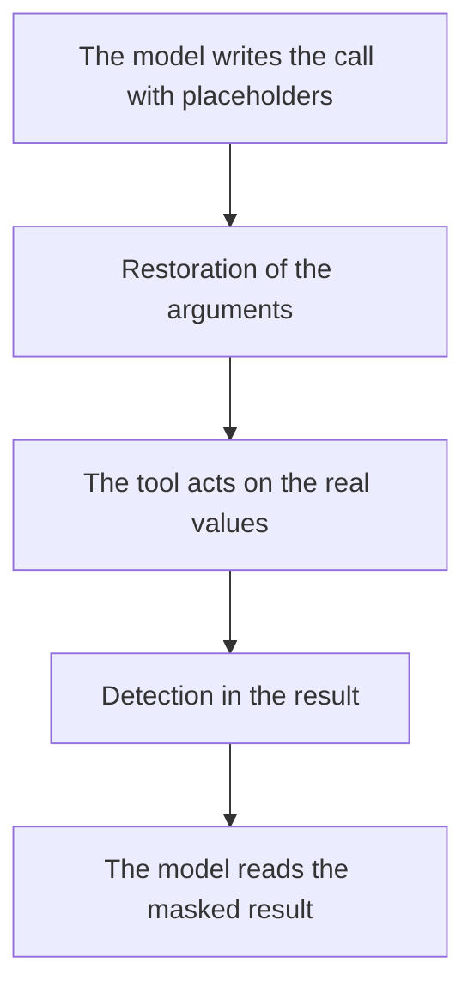

# Let a tool act on the real values

## In short

- An agent calls tools, for example to send an e-mail. The model only knows the placeholders and writes them in the call.
- By default, PIIGhost puts the real values back into the arguments just before execution, then masks the tool result before the model reads it.
- The tool result goes through full detection, so an address the conversation never quoted is masked too.
- Three other settings exist. Two of them let the result go to the model in clear.
- A placeholder invented by the model in an argument blocks the call by default. The tool does not run.

Needs covered: DEV-4, DEV-8, USER-3 and DPO-1, described in [Needs by profile](../needs-by-profile.md). The terms are defined in the [glossary](../glossary.md). Plugging PIIGhost into an agent is described in [Plug the protection into an agent and its tools](../integrations/agents-and-tools.md).

## For the business

PIIGhost has no screen. The tool setting is chosen in the agent's code, for the whole agent. What you can observe is what the tool receives and what the model reads.

### Who is involved

| Actor | Role |
|---|---|
| The end user | asks for an action, for example sending an e-mail |
| The model | decides to call the tool and writes its arguments with placeholders |
| PIIGhost | restores the arguments, then masks the result |
| The tool | acts on the real values |

### The path of a tool call



Example: the conversation already contains "Write to Jean Dupont, jean.dupont@exemple.fr". The model read it as "Write to `<<PERSON:1>>`, `<<EMAIL:1>>`".

| Step | Content |
|---|---|
| The model calls the sending tool | `{"to": "<<EMAIL:1>>", "body": "Hello <<PERSON:1>>"}` |
| The tool receives | `{"to": "jean.dupont@exemple.fr", "body": "Hello Jean Dupont"}` |
| The tool returns | Sent to jean.dupont@exemple.fr, copy to marie.curie@exemple.fr |
| The model reads | Sent to `<<EMAIL:1>>`, copy to `<<EMAIL:2>>` |

The known address takes its placeholder again. The new address takes the next number. The e-mail went to the right address.

**How to check**: in a trace of the agent, the argument received by the tool holds the real address, and the next message sent to the model contains no address in clear.

### Choose the tool setting

| Setting | The tool receives | The model reads the result | Choose it when |
|---|---|---|---|
| Full (default) | the real values | masked | the tool acts on real data (send an e-mail, look up a case) |
| Input only | the real values | in clear | the result never contains personal data |
| Output only | placeholders | masked | the tool does not need the real values |
| None | placeholders | in clear | the tool is internal and its result is safe |

> [!WARNING]
> With "Input only" or "None", the tool result goes to the model in clear. If the tool returns a customer file, that file goes out whole. Validate this choice with the DPO.

### Rules to know

**BR-TOOL-01.** When the setting is "Full", then the arguments are restored before the tool and its result is masked before the model.

**BR-TOOL-02.** When the setting is "Input only", then the arguments are restored and the result goes to the model as the tool returned it.

**BR-TOOL-03.** When the setting is "Output only", then the tool receives the placeholders and its result is masked. For example, the sending tool receives `<<EMAIL:1>>` and would send the e-mail to an address that does not exist.

**BR-TOOL-04.** When the setting is "None", then PIIGhost touches neither the arguments nor the result.

**BR-TOOL-05.** When the result of a tool is masked, then it goes through the full detection of the conversation. A known value takes its placeholder again, a new value takes the next number.

**BR-TOOL-06.** When a value first appears in the result of a tool, then it counts as a user value and stays masked for the rest of the conversation.

**BR-TOOL-07.** When the model writes in an argument a placeholder that was never issued, then the call is refused by default, before execution, with the message `Deanonymized text holds tokens the pipeline never issued: ['<<EMAIL:7>>']`. No e-mail goes out. With the invented-placeholder setting "drop", the tool receives `{"to": ""}`. With "keep", it receives `{"to": "<<EMAIL:7>>"}`.

**BR-TOOL-08.** When the arguments contain lists or nested objects, then each text they contain is restored, and the other values (numbers, booleans) stay intact.

**BR-TOOL-09.** When the model itself writes a value in clear in an argument, then the LangChain integration masks the history again before the next call. A known value takes its placeholder again. A value the model brought itself stays in clear, like any value first quoted by the assistant.

**BR-TOOL-10.** When the agent keeps its history, then the tool call stays written there with its placeholders. The real values only exist during the execution of the tool.

**BR-TOOL-11.** When the model cuts or rewords a placeholder in an argument, then only a placeholder written in full is restored. The tool receives the rest as is.

### What the end user sees

The user sees the result of the action. The e-mail arrives at the right address, the case looked up is the right one. The final reply of the model is restored as described in [Follow a conversation and restore the reply](follow-a-conversation.md).

### Frequently asked questions

**A tool received `<<EMAIL:1>>` instead of the address.** The tool setting is "Output only" or "None" (BR-TOOL-03, BR-TOOL-04). Switch it to "Full" if the tool must act on the real address.

**The tool call stops with `Deanonymized text holds tokens the pipeline never issued`.** The model wrote an unknown placeholder in an argument (BR-TOOL-07). Keep the refusal, because it prevents an e-mail sent to an invented address.

**The result of a tool went to the model in clear.** The setting is "Input only" or "None" (BR-TOOL-02, BR-TOOL-04).

**A tool receives a placeholder behind the OpenAI proxy.** The proxy of the `piighost-api` server does not restore the tool arguments of a reply streamed as it is produced. This is a known limit (USER-3).

## For developers

The technical guide describes the tool settings in [Tool-call strategies](../../../docs/en/tool-call-strategies.md).

### Where the rules live

| Rule | Location |
|---|---|
| BR-TOOL-01 to BR-TOOL-04 | `src/piighost/integrations/langchain/middleware.py:220-251` (`awrap_tool_call`, choice at lines 232-233) |
| BR-TOOL-05, BR-TOOL-06 | `middleware.py:253-272` (`_anonymize_tool_output`, user role), `pipeline/thread.py:126` (`anonymize`) |
| BR-TOOL-07 | `integrations/_deidentify.py:109-117` (`deanonymize_value`), `_handle_invented` lines 133-155 |
| BR-TOOL-08 | `integrations/_deidentify.py:25-37` (`map_strings`) |
| BR-TOOL-09 | `middleware.py:337-368` (`_reanonymize_tool_calls`), called at line 183 |
| BR-TOOL-10 | `middleware.py:244` (`request.override(tool_call=...)`, the state is not modified) |
| BR-TOOL-11 | `integrations/_deidentify.py:109-117` (`deanonymize_value`), `pipeline/thread.py:219-231` (`deanonymize`, which only replaces whole placeholders) |
| Pydantic AI | `integrations/pydantic_ai/hooks.py:124-154` (`deanonymize_tool_args`, `anonymize_tool_result`) |

| Setting on this page | `ToolCallStrategy` |
|---|---|
| Full | `FULL` (default) |
| Input only | `INPUT` |
| Output only | `OUTPUT` |
| None | `PASSTHROUGH` |

```python
from piighost.integrations.langchain import (
    InventedPlaceholderStrategy,
    PIIAnonymizationMiddleware,
    ToolCallStrategy,
)

middleware = PIIAnonymizationMiddleware(
    pipeline,
    tool_strategy=ToolCallStrategy.FULL,
    invented_strategy=InventedPlaceholderStrategy.RAISE,
)
```

### Pitfalls

- **Pydantic AI differs from LangChain on two points.** `pii_hooks` also masks a structured result (dictionary, list), and does not mask again the arguments of the tool calls in the history (BR-TOOL-09).
- **LangChain only masks the text of a result.** The non-text blocks of a `ToolMessage` pass through as they are.
- **`assistant_strategy=EntityCreateByAssistantStrategy.IGNORE` disables BR-TOOL-09.**
- **The middleware requires a pipeline whose factory exposes a `recognizer`**, otherwise it raises `UnrecognizableFactoryError` at construction.
- **Refusing an invented placeholder raises `InventedPlaceholderError` from `awrap_tool_call`.** The tool is not called, and the error goes up to the agent.

### Doc / code gaps

The gap on the result of a tool (the doc spoke of replacing only the known values) is fixed in `docs/en/tool-call-strategies.md` and `docs/fr/tool-call-strategies.md`. See ECART-09 in the [gap register](../reference/doc-code-gaps.md).

### Tests

| Test | Covers |
|---|---|
| `tests/integrations/langchain/test_middleware.py` (`TestToolCalls`) | Each setting, `Command`, history arguments masked again |
| `tests/integrations/langchain/test_middleware_e2e.py` | The second call to the model sees no argument in clear (AT-DEV-4-1, AT-USER-3-1) |
| `tests/integrations/test_pydantic_ai_hooks.py` (`TestTools`) | The tool receives the value, its result is masked |
| `piighost-api:tests/routes/test_rewrite.py` | Arguments restored by the proxy, outside the stream |

Not covered: the restoration of tool arguments in the stream of the OpenAI proxy (AT-USER-3-2). This restoration does not exist.
