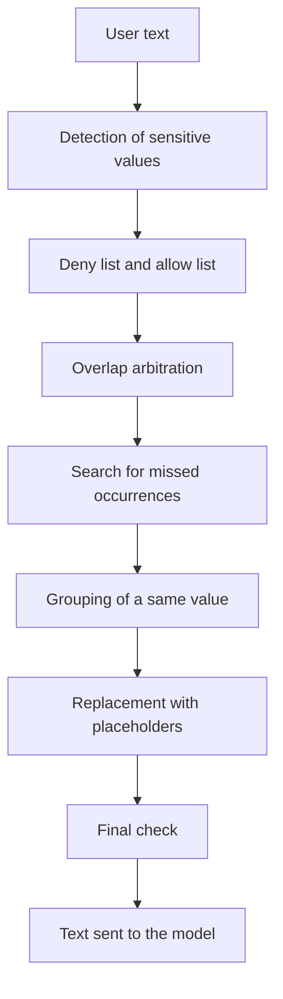

# Protect a message before it is sent to the model

## In short

- Before a text goes to the model, `piighost` finds the sensitive values in it and replaces them with placeholders such as `<<PERSON:1>>`.
- A given value receives a single placeholder across the whole text, even when written with a different case or different spaces.
- The model's reply is then restored. Each placeholder becomes the real value again.
- A value that the detector does not see leaves in clear text, unless a final check is enabled. The final check then blocks the sending.
- Patterns do not check the check digits (card, IBAN). A badly copied value stays masked.

Needs covered, described in [Needs by profile](../needs-by-profile.md):

- Compliance officer: DPO-1, DPO-2, DPO-4
- Developer: DEV-1

The terms are defined in the [glossary](../glossary.md). For a conversation of several messages, read [Follow a conversation and restore the reply](follow-a-conversation.md) next.

## For the business

`piighost` has no screen. What you can observe is the text the model receives and the reply returned to the user. To try it on a sentence, the technical team runs `piighost anonymize "your sentence"`.

### Who is involved

| Actor | Role |
|---|---|
| The end user | writes the message in clear text |
| The application | receives the message and passes it through `piighost` before calling the model |
| `piighost` | finds the values, replaces them with placeholders, keeps the mapping |
| The model | receives the protected text, and only that text |

Before anything is sent, at least one detector must be configured. `piighost` ships no pattern, so the protected types are those of the detectors and pattern groups that the configuration loads.

### The path of a message



In the example followed from end to end, the user writes "Write to Jean Dupont, jean.dupont@exemple.fr".

1. **Detection.** One or more detectors look for the values by shape (email, phone), by AI model (names, places) or by large language model. Here, "Jean Dupont" is detected as a person and "jean.dupont@exemple.fr" as an email.
2. **Deny list and allow list.** The values to always mask or never mask, written in the configuration (`deny_list` and `allow_list`), are applied. See [Impose a deny list and an allow list](impose-a-deny-list-and-an-allow-list.md).
3. **Overlaps.** When two detections overlap, only one span is kept. Here, nothing overlaps.
4. **Missed occurrences** (optional stage). Each value found is searched for elsewhere in the text.
5. **Grouping.** The occurrences of the same value with the same type form a single group.
6. **Replacement.** Each group receives a placeholder. "Jean Dupont" becomes `<<PERSON:1>>`, the address becomes `<<EMAIL:1>>`.
7. **Final check** (optional). The protected text is read again to look for any remaining sensitive value.

The model receives "Write to `<<PERSON:1>>`, `<<EMAIL:1>>`". `piighost` keeps the mapping between each placeholder and its value, to restore the reply.

**How to check**: have the technical team protect the example sentence. The output must contain neither "Jean Dupont" nor the address.

### Rules to know

**BR-MSG-01.** When a value is detected, then it receives a placeholder that names its type and a number, counted per type in order of appearance. For example, "Jean Dupont writes to Marie Curie" becomes "`<<PERSON:1>>` writes to `<<PERSON:2>>`".

**BR-MSG-02.** When a value comes back with a different case or different spaces, then it receives the same placeholder. For example, "Patrick called. Call patrick back tomorrow." becomes "`<<PERSON:1>>` called. Call `<<PERSON:1>>` back tomorrow."

**BR-MSG-03.** When a value has several spellings, then the restoration puts back the first spelling encountered everywhere. In the previous example, the restored reply shows "Patrick" in both places.

**BR-MSG-04.** When a name is joined to another by a hyphen, then it is not recognized as the same word. For example, a detected "Patrick" does not mask "Jean-Patrick". The reason is that a short first name must not be linked to a different compound first name.

**BR-MSG-05.** When two detections overlap, then only one span is always kept, and the surest one wins (default setting). The rest of the longer span can then leave in clear text. A second setting masks the whole covered area.

The following table compares the two settings:

| Setting | "Contract signed by Loni M. Wirth on March 12, 2026." becomes |
|---|---|
| The surest wins (default) | Contract signed by Loni M. `<<PERSON:1>>` on March 12, 2026. |
| Union of spans | Contract signed by `<<PERSON:1>>` on March 12, 2026. |

Here, a pattern that is 100% sure found "Wirth" and a model that is 70% sure found "Loni M. Wirth". On a perfect tie of confidence and position, the first declared detector wins. With the union, the area takes the type of the surest detection, and on equal confidence the type of the longest one.

**BR-MSG-06.** When a value is written with a non-breaking or thin space, then a pattern written with a normal space still finds it. For example, "06 12 34 56 78" typed in a word processor, with non-breaking spaces, becomes `<<PHONE:1>>`.

**BR-MSG-07.** When a pattern recognizes the shape of a card or an IBAN, then the value is masked without checking its check digits. The reason is that a value damaged by character recognition would have wrong check digits, and rejecting it would let it leave in clear text.

**BR-MSG-08.** When a message contains an API key, then it is masked only if the configuration loads a pattern group for secrets or a model that looks for secrets. The `piighost/logs` group of the catalog is such a group. For example, with this group, an OpenAI key leaves as `<<OPENAI_API_KEY:1>>`.

**BR-MSG-09.** When the user types a text that has the shape of a placeholder, then this text is neutralized with an invisible character. For example, "Claire writes `<<PERSON:2>>` here" cannot pass for a real placeholder at restoration. Without this, a hand-typed placeholder could retrieve the value of another person.

**BR-MSG-10.** When the detector does not see a value and no final check is enabled, then the value leaves in clear text. For example, if emails are not recognized, the text becomes "Write to `<<PERSON:1>>`, jean.dupont@exemple.fr".

**BR-MSG-11.** When the final check finds a sensitive value in the protected text, then the sending is blocked with `Anonymized text still contains PII: ['EMAIL']`. The message names the remaining types, never the values.

**BR-MSG-12.** When the search for missed occurrences is active, then it ignores case. It finds "patrick" after "Patrick", at the cost of false positives on common words.

### What the end user sees

Nothing. The user writes in clear text and reads a reply in clear text. Only the model sees the placeholders. If the final check blocks a message, the application receives an error. The message shown to the user then depends on the application.

### Frequently asked questions

**An email address left in clear text.** The detector does not know this type and no final check is enabled (BR-MSG-10). Have the type added to the detector, or enable a final check that recognizes it.

**Part of a name left in clear text ("Loni M.").** Two detections overlapped, and the surest one covered only part of the name (BR-MSG-05). Ask for the "Union of spans" setting.

**The company name is replaced by `<<PERSON:2>>`.** The detector takes it for a person, and the model loses useful information. Have it put in the allow list, see [Impose a deny list and an allow list](impose-a-deny-list-and-an-allow-list.md).

**A wrong card number was masked.** This is intended, because no check digit is checked (BR-MSG-07).

**An API key left in clear text.** No pattern group for secrets is loaded (BR-MSG-08). Have the `piighost/logs` group added to the configuration.

**"Jean-Patrick" stayed in clear text while "Patrick" is masked.** The hyphen joins the two first names (BR-MSG-04). The detector must detect "Jean-Patrick" itself.

**Processing stops with `Anonymized text still contains PII`.** The final check found a remainder (BR-MSG-11). Have the missing type added to the main detector.

## For developers

### Where the rules live

| Rule | Location |
|---|---|
| Order of the stages | `src/piighost/pipeline/base.py:352-393` (`AnonymizationPipeline.anonymize`), deny list and allow list on line 365 |
| BR-MSG-01 | `components/placeholder/label_counter.py`, default `pipeline/base.py:172` |
| BR-MSG-02 | `components/linker/exact.py:8-21`, `text/normalization.py:61-71` (`value_key`) |
| BR-MSG-03 | `components/anonymizer/base.py:151` (`deanonymize` replaces with `entity.text`), `models/entity.py` |
| BR-MSG-04 | `text/boundaries.py:38` (`WORD_JOIN_CHARS`) |
| BR-MSG-05 | `components/overlap_resolver/confidence.py:10-21`, `merge.py:7-15` (`_surest`), `overlap_resolver/base.py` (`by_confidence`, `_conflict_groups`) |
| BR-MSG-06 | `text/normalization.py:45-58`, `components/detector/regex.py:76-90` |
| BR-MSG-07 | `components/detector/regex.py:10-30` |
| BR-MSG-08 | `components/detector/regex.py:33-57` (`from_catalog`), `config/models/detector.py` (`catalogs`) |
| BR-MSG-09 | `components/anonymizer/span.py:26-40`, `_neutralize` on line 79 |
| BR-MSG-10, BR-MSG-11 | `pipeline/base.py:313-341` (`_guard`) |
| BR-MSG-12 | `components/expander/word_boundary.py:11-31` |

When only the detector is provided, the default values are `ExactEntityLinker`, `Anonymizer(LabelCounterPlaceholderFactory())` and `ConfidenceOverlapResolver` (`pipeline/base.py:168-182`). Expansion, entity resolution, the deny list and allow list (`override`) and the final check (`guard`) are disabled.

```python
import asyncio

from piighost.components.detector import ExactMatchDetector
from piighost.pipeline import AnonymizationPipeline

detector = ExactMatchDetector(
    {"Jean Dupont": "PERSON", "jean.dupont@exemple.fr": "EMAIL"}
)
pipeline = AnonymizationPipeline(detector)


async def main() -> None:
    result = await pipeline.anonymize("Write to Jean Dupont, jean.dupont@exemple.fr")
    print(result.text)  # Write to <<PERSON:1>>, <<EMAIL:1>>


asyncio.run(main())
```

### Change a stage

1. Choose the port of the stage (see [Add or replace a component](../architecture/ports-and-extension.md)).
2. Pass your component to the constructor, `AnonymizationPipeline(detector, overlap_resolver=MergeOverlapResolver())`, or in configuration `[overlap_resolver] type = "merge"`.
3. For the final check, pass `guard=DetectorGuardRail(a_detector)`.

#### Check

```bash
uv run pytest tests/pipeline/test_pipeline.py tests/components tests/acceptance/test_dpo.py
```

Then `echo "Tel. 06 12 34 56 78" | uv run piighost anonymize --config <file>` must return a placeholder in place of the number.

### Pitfalls

- **The overlap resolver cannot be disabled.** `overlap_resolver=None` installs `ConfidenceOverlapResolver`. `Anonymizer.render` raises `OverlappingSpansError` if an overlap remains.
- **Expansion runs after the resolver.** It skips any occurrence that touches an already covered character, and searches for the longest values first (`expander/base.py:30-75`).
- **The neutralization character stays in the restored text.** A placeholder typed by the user comes back with an invisible U+200B after its first character. A downstream process that compares exact strings can fail. `Anonymizer(factory, escape_existing_tokens=False)` disables the neutralization, at the cost of BR-MSG-09.
- **`RegexDetector` compiles under `re.ASCII`.** `\d` matches only 0 to 9, and `\w` stops at the first accented character.
- **A detector on its own can return overlapping detections.** The port allows it. Do not test the output of a detector on its own as if it had already gone through the overlap resolver.
- **A score-based guard rail (moderation) locates nothing.** The allow list values cannot be exempted from it (`pipeline/base.py:318-322`).
- **`LLMDetector` fails closed.** A model output that is unreadable, has no `entities` field or is rejected by the parser raises `UnreadableOutputError` and the message is refused (`components/detector/llm.py:174-181`, `_unreadable` at `:203`). `fail_open=True` reads it as zero detections, and the message then leaves without protection. See DPO-9 in [Needs by profile](../needs-by-profile.md#watch-points).

### Tests

| Test | Covers |
|---|---|
| `tests/pipeline/test_pipeline.py` | Order of the stages, default values, final check |
| `tests/components/overlap_resolver/` | The two resolvers, the tie won by the first detector, the union named after the widest |
| `tests/components/expander/test_word_boundary.py` | Search for occurrences, no added overlap |
| `tests/components/anonymizer/test_span_anonymizer.py` | Replacement, neutralization of typed placeholders, refusal of an overlap |
| `tests/text/` | Word boundaries, space normalization |
| `tests/components/detector/test_contract.py` | Same output for every detector |
| `tests/acceptance/test_dpo.py` | AT-DPO-1-2 (an API key leaves as a placeholder), AT-DPO-2-2 (a removed group leaves its values in clear text) |
