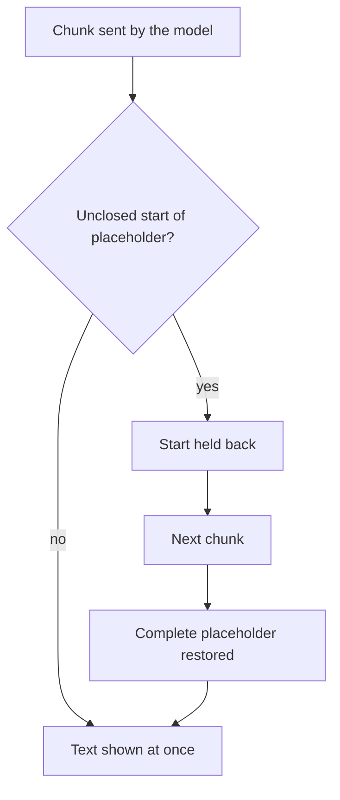

# Show a streamed reply

## In short

- The model sends its reply in chunks, which the application shows as they arrive.
- A placeholder can arrive cut between two chunks, "`<<PER`" then "`SON:1>>`".
- The PIIGhost stream decoder holds back the start of the placeholder until it is whole, then restores it once.
- Without this decoder, the user reads the placeholder on screen.
- A stream cut in the middle of a placeholder leaves that fragment on screen, without any real value.

Needs covered: DEV-9, USER-4, USER-1 and DEV-8, described in [Needs by profile](../needs-by-profile.md). The terms are defined in the [glossary](../glossary.md). The restoration of a whole reply is described in [Follow a conversation and restore the reply](follow-a-conversation.md).

## For the business

PIIGhost has no screen. What you can observe is the text that appears while the model replies. The development team must plug in the stream decoder.

### Who is involved

| Actor | Role |
|---|---|
| The end user | reads the reply while it is being written |
| The model | sends its reply in chunks |
| The application | reads the stream and passes each chunk through the decoder |
| PIIGhost | restores the placeholders chunk by chunk |

### The path of a streamed reply



Example: the conversation maps `<<PERSON:1>>` to Jean Dupont and `<<EMAIL:1>>` to jean.dupont@exemple.fr.

| Chunk received | Text shown |
|---|---|
| "Hello <<PER" | "Hello" |
| "SON:1>>, I am writing" | "Jean Dupont, I am writing" |
| "to you at <<EMA" | "to you at" |
| "IL:1>>." | "jean.dupont@exemple.fr." |

The user read "Hello Jean Dupont, I am writing to you at jean.dupont@exemple.fr." without waiting for the end of the stream.

**How to check**: have the model reply with a name known to the conversation. The screen must never show "`<<PER`".

### Rules to know

**BR-STREAM-01.** When a chunk cannot belong to a placeholder, then it is shown as soon as it arrives.

**BR-STREAM-02.** When a chunk opens a placeholder ("`<<`") without closing it, then everything is held back until it closes, then the whole placeholder is restored once.

**BR-STREAM-03.** When a chunk ends with a single "`<`", then this character is held back, so that a delimiter cut in two joins up again.

**BR-STREAM-04.** When an opening stays unclosed for more than 128 characters, then it is released as is, because no placeholder is that long. Example: "Use cout << x to" followed by "print" is shown with a slight delay, without any loss of text.

**BR-STREAM-05.** When the stream stops in the middle of a placeholder, then the held-back remainder is shown as is, without restoration. Example: "Hello Jean Dupont, see you soon <<EMA". The fragment contains no real value.

**BR-STREAM-06.** When a completed placeholder was never issued, then the invented placeholder setting applies: refusal by default, which interrupts the stream, or drop, or keep.

| Setting | "Hello <<PERSON:" then "9>>." gives |
|---|---|
| Refuse (default) | "Hello", then the stream is interrupted by an error |
| Drop | "Hello ." |
| Keep | "Hello `<<PERSON:9>>`." |

**BR-STREAM-07.** When the application restores each chunk separately, without the decoder, then a cut placeholder is never recognized, and the user reads "Hello `<<PERSON:1>>`.".

**BR-STREAM-08.** When the reply goes through a proxy of the `piighost-api` server, then the proxy also restores the stream with this decoder. The OpenAI proxy restores only the text, not the tool arguments, and neither proxy applies the invented placeholder setting.

### What the end user sees

A reply that is written as it arrives, with the real values. A slight delay appears when a placeholder or a "`<<`" is in progress. Only an interrupted stream leaves a fragment of a placeholder at the end.

### Frequently asked questions

**The screen shows `<<PERSON:1>>` during the stream.** The application does not pass the chunks through the decoder (BR-STREAM-07). Ask the development team to plug it in.

**The reply ends with "`<<EMA`".** The stream was interrupted in the middle of a placeholder (BR-STREAM-05). Run the reply again.

**The stream is interrupted with `Deanonymized text holds tokens the pipeline never issued`.** The model wrote an unknown placeholder (BR-STREAM-06).

## For developers

The technical guide describes the implementation in the [Streaming section of the LangChain reference](../../../docs/en/reference/langchain.md#streaming).

### Where the rules live

| Rule | Location |
|---|---|
| BR-STREAM-01 to BR-STREAM-03 | `src/piighost/components/placeholder/streaming.py:84-137` (`_held_length`, `_split_buffer`) |
| BR-STREAM-04 | `streaming.py:46` (`MAX_TOKEN_LENGTH = 128`) |
| BR-STREAM-05 | `streaming.py:186` and `236` (`flush`) |
| BR-STREAM-06 | `integrations/_deidentify.py:83-107` (`deanonymize_stream`), `_handle_invented` on lines 133-155 |
| BR-STREAM-07 | `integrations/langchain/middleware.py:206-218` (`deanonymize_stream`) |
| BR-STREAM-08 | `piighost-api`, outside this repository: `routes/openai.py` (`_restore_sse_chunk`) and `routes/anthropic.py`, on the decoder of `components/placeholder/streaming.py` |

Related components: `PlaceholderStreamDecoder` (synchronous, `factory.stream_decoder(replace)`), `AsyncPlaceholderStreamDecoder` (`pipeline.recognizer.async_stream_decoder(replace)`), `PIIAnonymizationMiddleware.deanonymize_stream(source, thread_id)`.

### Plug the decoder into a LangChain agent

1. Read the agent stream with `agent.astream(..., stream_mode="messages")`.
2. Pass the texts to `middleware.deanonymize_stream(source, thread_id)`, with the conversation identifier.
3. Show each rendered text.

```python
config = {"configurable": {"thread_id": "conv-1"}}


async def model_text():
    async for chunk, _meta in agent.astream(
        {"messages": [{"role": "user", "content": "Write to Jean Dupont"}]},
        config,
        stream_mode="messages",
    ):
        if isinstance(chunk.content, str):
            yield chunk.content


async for restored in middleware.deanonymize_stream(model_text(), "conv-1"):
    print(restored, end="", flush=True)
```

#### Check

```bash
uv run pytest tests/components/placeholder/test_streaming.py tests/components/placeholder/test_streaming_async.py tests/integrations/langchain/test_middleware_stream.py
```

### Pitfalls

- **The middleware hooks see only the whole message.** Live display requires wrapping the streaming loop with the decoder.
- **The decoder asks for the conversation identifier explicitly**, because the streaming loop is outside the agent configuration.
- **Outside LangChain, the decoder applies no setting to invented placeholders**, unless the `replace` function does.
- **The Pydantic AI capability provides no stream decoder.**
- **The decoder follows the delimiters of the factory**, so a factory with custom delimiters keeps the same behavior.

### Doc / code gaps

The gap on a cut stream (the doc said the display "never" shows a broken placeholder) is fixed in `docs/en/reference/langchain.md` and `docs/fr/reference/langchain.md`. See ECART-10 in the [gap register](../reference/doc-code-gaps.md).

### Tests

| Test | Covers |
|---|---|
| `tests/components/placeholder/test_streaming.py`, `test_streaming_async.py` | Holding back a cut placeholder, cut delimiter, release after 128 characters (AT-USER-4-1) |
| `tests/integrations/langchain/test_middleware_stream.py` | Stream restoration by the middleware (AT-DEV-9-1) |
| `tests/integrations/test_deidentify_stream.py` | Invented placeholder in a stream, remainder rendered at the end of the stream |
| `piighost-api:tests/routes/test_openai_stream.py`, `test_anthropic_messages.py` | Placeholder cut between two events of a proxy (AT-USER-4-2) |

Not covered: the tool arguments of an OpenAI proxy stream, which are not restored.
