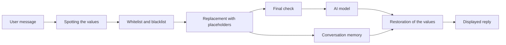

# Get started with the PIIGhost domain documentation

## In short

PIIGhost masks the confidential data of a text before an AI model reads it, then puts the real values back in the reply.

Life cycle of a message:

1. The user writes in clear text.
2. PIIGhost spots the sensitive values, for example names, e-mails, phone numbers or secrets.
3. It replaces them with placeholders like `<<PERSON:1>>`, stable over the whole conversation.
4. The model replies using these placeholders.
5. PIIGhost puts the real values back in the displayed reply.

PIIGhost is a Python library, with no graphical interface. It plugs into LangChain, Pydantic AI, LlamaIndex or Claude Code, or is driven remotely through the companion server `piighost-api`. You configure it with a TOML or JSON file and with the `piighost` command.

The domain documentation is first for the people who decide on data protection (DPO, compliance, product, support), then for developers. What each profile expects is in [Needs by profile](needs-by-profile.md). The code and the tests are the source of truth. The gaps with the existing documentation are in the [gap register](reference/doc-code-gaps.md). The terms are in the [glossary](glossary.md).

## I want to understand…

| Business need | Page to read |
|---|---|
| What each profile expects from PIIGhost, and how to check it | [Needs by profile](needs-by-profile.md) |
| What the model really sees of a message | [Protect a message before it is sent to the model](processes/protect-a-message.md) |
| Why a name stayed in clear text, or half of it | [Protect a message before it is sent to the model](processes/protect-a-message.md#frequently-asked-questions) |
| How a person keeps the same placeholder from one message to the next | [Follow a conversation and restore the reply](processes/follow-a-conversation.md) |
| What happens when you correct a message by hand | [Follow a conversation and restore the reply](processes/follow-a-conversation.md#correct-a-detection) |
| How to erase a conversation (right to erasure) | [Follow a conversation and restore the reply](processes/follow-a-conversation.md) |
| Keep the company name in clear text, or always mask an internal code | [Impose a whitelist and a blacklist](processes/impose-a-whitelist-and-blacklist.md) |
| What a tool of the agent receives, and what the model reads of its result | [Let a tool act on the real values](processes/let-a-tool-act.md) |
| Why a placeholder appears while a reply is displayed | [Show a streamed reply](processes/show-a-streamed-reply.md) |
| What each actor sees depending on the tool used (LangChain, Claude Code…) | [Plug the protection into an agent and its tools](integrations/agents-and-tools.md) |
| What happens when a model answers badly | [Needs by profile, watch points](needs-by-profile.md#watch-points) |
| Where the conversation data is stored, and whether it is encrypted | [Store conversations and protect traces](operations/storage-and-encryption.md) |
| The meaning of a term or an acronym | [Glossary](glossary.md) |
| The places where the documentation and the code diverge | [Doc / code gap register](reference/doc-code-gaps.md) |
| What is decided and remains to be done | [Open points](reference/open-points.md) |

## Change the code

To change the code, the technical documentation says which pages to read and which files to open. See [Change piighost's code](../../docs/en/community/changing-the-code.md).

## The domain documentation groups

- **Needs**: [Needs by profile](needs-by-profile.md).
- **Processes**: [Protect a message](processes/protect-a-message.md), [Follow a conversation](processes/follow-a-conversation.md), [Impose a whitelist and a blacklist](processes/impose-a-whitelist-and-blacklist.md), [Let a tool act](processes/let-a-tool-act.md), [Show a streamed reply](processes/show-a-streamed-reply.md).
- **Integrations**: [Plug the protection into an agent and its tools](integrations/agents-and-tools.md).
- **Operations**: [Configure a pipeline by file, hub and command line](operations/configuration-and-hub.md), [Store conversations and protect traces](operations/storage-and-encryption.md).
- **Architecture**: [Add or replace a pipeline component](architecture/ports-and-extension.md).
- **Tests**: [Run and write tests](tests/run-and-write-tests.md), [Acceptance tests](tests/acceptance-tests.md).
- **Reference**: [Glossary](glossary.md), [Doc / code gap register](reference/doc-code-gaps.md), [Open points](reference/open-points.md).

## Cross-cutting watch points

1. **The conversation identifier decides how placeholders are shared.** A call without an identifier is refused, by LangChain, the Claude Code hooks and the server. An application that names `default` shares its placeholders between all its users. Only the `piighost` command falls back to `default`, for an isolated command. See [Follow a conversation](processes/follow-a-conversation.md#rules-to-know).
2. **Correcting an old message can renumber the placeholders**, and a reply of the model can then be restored with the name of another person. See [Follow a conversation](processes/follow-a-conversation.md#rules-to-know).
3. **The memory and the agent history contain data in clear text.** So does everything that is not processed, that is a Claude Code tool that is not listed (Grep), or a tool result under the "Input only" or "None" strategy. Encrypt the storage, and protect the LangGraph or Pydantic AI history. See [Store conversations](operations/storage-and-encryption.md) and [Plug the protection into an agent](integrations/agents-and-tools.md#pitfalls).
4. **The technical traces carry the text in clear by default.** Configure a trace redactor before you send them to a third-party service. See [Store conversations and protect traces](operations/storage-and-encryption.md#redact-the-traces).
5. **Erasing a conversation only clears the process that receives the request.** When `token_memo_ttl` is not set, the other processes keep a temporary copy. See [Store conversations](operations/storage-and-encryption.md#rules-to-know).
6. **A model-based detector or guard rail fails open.** An unreadable output of the model gives zero detections, and the message leaves without protection. See the [watch points](needs-by-profile.md#watch-points).
