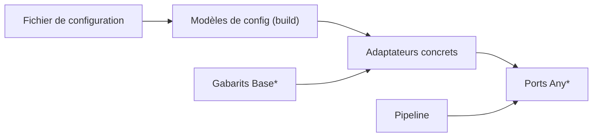

# Ajouter ou remplacer un composant du pipeline

## En bref

- PIIGhost est une suite d'étapes interchangeables : on remplace un détecteur ou une règle sans toucher aux autres étapes.
- Chaque étape suit un contrat écrit une fois. Toute pièce qui respecte ce contrat peut prendre sa place.
- Le fichier de configuration fabrique ces pièces. Les pièces, elles, ignorent tout du fichier de configuration.
- Les briques lourdes (modèles d'IA, bases de données) ne s'installent que si vous les demandez.
- Le type du jeton choisi est vérifié avant l'exécution : une combinaison incompatible est refusée tôt.

Cette page est technique. Pour le déroulé d'un message, lisez [Protéger un message avant l'envoi au modèle](../processes/protect-a-message.md). Les termes sont définis dans le [glossaire](../glossary.md).

## Comment le code est découpé

Chaque étape vit dans un paquet de `src/piighost/components/`. Son `base.py` déclare le **port** : un `Protocol` marqué `runtime_checkable`, nommé `Any*`. Le pipeline dépend du port, jamais d'une classe concrète. Un objet satisfait le port dès qu'il a la bonne méthode, sans héritage.

Quand plusieurs adaptateurs partagent un squelette, ce squelette vit dans un gabarit `Base*` (patron Template Method). L'adaptateur ne fournit alors que l'étape qui varie, par exemple `_key` pour un linker ou `_reduce` pour un résolveur de chevauchements.



### Quels ports ont un gabarit

| Port | Gabarit `Base*` | Adaptateurs fournis |
|---|---|---|
| `AnyDetector` | aucun (sauf `BaseNERDetector` pour les modèles NER) | `RegexDetector`, `ExactMatchDetector`, `CompositeDetector`, `ChunkedDetector`, `LLMDetector`, détecteurs NER |
| `AnyDetectionOverride` | aucun | `DetectionOverride` |
| `AnyOverlapResolver` | `BaseOverlapResolver` | `ConfidenceOverlapResolver`, `MergeOverlapResolver` |
| `AnyDetectionExpander` | `BaseDetectionExpander` | `WordBoundaryExpander` |
| `AnyEntityLinker` | `BaseEntityLinker` | `ExactEntityLinker` |
| `AnyEntityResolver` | `BaseEntityResolver` | `MergeEntityResolver`, `FuzzyEntityResolver`, `SeparateEntityResolver` |
| `AnyAnonymizer` | `BaseAnonymizer` | `Anonymizer` |
| `AnyPlaceholderFactory` | `BaseDelimitedPlaceholderFactory`, `BaseCounterPlaceholderFactory` | fabriques de `components/placeholder/` |
| `AnyGuardRail` | aucun | `DetectorGuardRail`, `Gliner2GuardRail`, `LLMGuardRail`, `ModerationGuardRail` |
| `AnyConversationMemory` | aucun | mémoire en processus, Redis, SQLAlchemy |
| `AnyHasher` / `AnyCipher` | `BaseHasher` / aucun | SHA-256, Argon2id / AES-GCM |

Les ports sans gabarit l'assument dans leur docstring : leurs implémentations diffèrent par tout leur mécanisme, pas par une seule étape.

### Le détecteur NER partagé

`BaseNERDetector` (`components/detector/ner/base.py`) porte la passe commune aux modèles : correspondance des étiquettes, seuil de confiance appliqué quel que soit le modèle, découpage d'un texte trop long en morceaux qui se chevauchent. Un texte plus long que `max_chars` est découpé si `auto_chunk` est actif (par défaut), sinon il lève `TextTooLongError`.

## Couplage à sens unique entre configuration et cœur

`config/` importe le cœur et le construit. Aucun module du cœur n'importe `piighost.config` à l'exécution. Chaque modèle de configuration hérite de `_ComponentConfig`, qui interdit toute clé non déclarée, et expose un `build()` qui importe son adaptateur au dernier moment. Il n'existe ni registre de constructeurs ni méthode `from_config`.

Le type d'un composant se choisit par la clé `type` : `DetectorConfig` est une union discriminée sur `type`.

## Dépendances optionnelles chargées à la demande

Le cœur ne dépend que de `typing-extensions`. Tout le reste est un extra de `pyproject.toml`. Un module qui a besoin d'un extra vérifie sa présence avec `importlib.util.find_spec` et lève une `ImportError` qui nomme l'extra à installer. Les paquets exposent ces noms paresseusement par un `__getattr__` qui lit un dictionnaire nom vers module. `from piighost import AnonymizationPipeline` ne charge donc ni torch ni langchain.

## Jetons typés

Les fabriques de jetons portent une étiquette de préservation (`components/placeholder/tags.py`). Ces étiquettes sont des sous-classes de `str` qui n'existent que pour le vérificateur de types. Elles disent si le jeton garde le type de valeur, l'identité, la forme, et s'il peut être retrouvé dans un texte. Le middleware exige `PreservesRecognizableIdentity` : un jeton qui identifie une seule valeur et qu'on peut retrouver. Lui passer une fabrique de masques devient une erreur de typage.

## Ajouter un détecteur

1. Copiez l'adaptateur le plus proche. Pour un modèle NER, partez de `components/detector/ner/spacy.py` et héritez de `BaseNERDetector`. Sinon, partez de `components/detector/regex.py` et implémentez `async def detect(self, text: str) -> list[Detection]`.
2. Si le module importe une dépendance lourde, gardez l'import dans le module, derrière un test `find_spec`, et exposez la classe par le `__getattr__` du paquet.
3. Ajoutez l'extra dans `[project.optional-dependencies]` de `pyproject.toml`, puis dans l'extra `all`.
4. Écrivez le modèle de configuration à côté de ses voisins dans `config/models/detector_model.py` : `type: Literal["..."]`, champs validés, `build()` qui importe l'adaptateur localement.
5. Ajoutez ce modèle à l'union `DetectorConfig` de `config/models/detector.py`.
6. Ajoutez un constructeur à la liste `DETECTORS` de `tests/components/detector/test_contract.py`.
7. Si le module est guardé, ajoutez la ligne `(module, dépendance, extra)` à `OPTIONAL_DEPENDENCY_GUARDS` dans `tests/regression/test_imports.py`.

### Vérifier

```bash
uv run pytest tests/components/detector/test_contract.py tests/regression/test_imports.py tests/config
make lint
```

Le test de contrat doit rapporter, pour votre détecteur, le même span en points de code, le texte relu dans la source et l'étiquette externe que les autres détecteurs.

## Pièges

- **Un détecteur peut renvoyer des détections qui se chevauchent.** Le port l'autorise. C'est le résolveur de chevauchements qui les arbitre, et il est toujours actif.
- **Un import lourd au niveau du paquet casse l'installation minimale.** `test_missing_optional_dependency_names_its_extra` le repère pour les modules listés dans `OPTIONAL_DEPENDENCY_GUARDS`. `test_every_module_imports_cleanly` ne le voit pas si l'environnement de test a déjà tous les extras.
- **Une clé de configuration mal orthographiée est refusée**, pas ignorée, grâce à `extra="forbid"`. C'est voulu.
- **Le seuil d'un détecteur NER s'applique même si le modèle l'ignore.** Ne comptez pas sur le modèle pour filtrer.

## Écarts doc / code

> ⚠ Écart doc / code
> **Doc** : `AGENTS.md` (lignes 7, 26 et 82) dit que chaque étape a un port `Any*` et un gabarit `Base*`. `docs/en/architecture.md:109-111` dit que seuls deux ports n'ont pas de gabarit, les garde-fous et la mémoire.
> **Code** : cinq ports n'ont pas de gabarit : le détecteur (`components/detector/base.py:9`), la liste blanche et la liste noire (`components/override/base.py:9-17`), les garde-fous (`components/guard/base.py:42`), la mémoire (`conversation_memory/base.py:10-14`) et le chiffrement (`crypto/cipher/base.py:7-10`).

> ⚠ Écart doc / code
> **Doc** : le message d'erreur de `config/models/detector.py:62-66` dit que les catalogues intégrés ont été retirés « in piighost 2.0 ».
> **Code** : la version du paquet est `1.10.0` (`pyproject.toml:3`). Le `CHANGELOG.md` place le passage des catalogues au hub en 1.8.0. [à vérifier] : demandez au mainteneur si « 2.0 » désigne la réécriture interne ou une version à venir.

Ces écarts sont aussi listés dans le [registre des écarts](../reference/doc-code-gaps.md).

## Tests

| Test | Ce qu'il garantit |
|---|---|
| `tests/components/detector/test_contract.py` | Tous les détecteurs rapportent la même valeur de la même façon (span, texte, étiquette, confiance entre 0 et 1). |
| `tests/regression/test_imports.py` | L'API publique s'importe, chaque module s'importe sans extra, chaque garde nomme son extra. |
| `tests/config/` | Chaque modèle de configuration se valide et se construit. |

Aucun test n'impose le couplage à sens unique. La règle « le cœur n'importe jamais `piighost.config` » tient par revue de code. Pour la contrôler : `grep -rn "piighost.config" src/piighost --include=*.py | grep -v "^src/piighost/config\|^src/piighost/cli"` doit être vide.

Pour lancer les tests, voir [Lancer et écrire les tests](../tests/run-and-write-tests.md). Pour la configuration, voir [Configurer un pipeline](../operations/configuration-and-hub.md).
