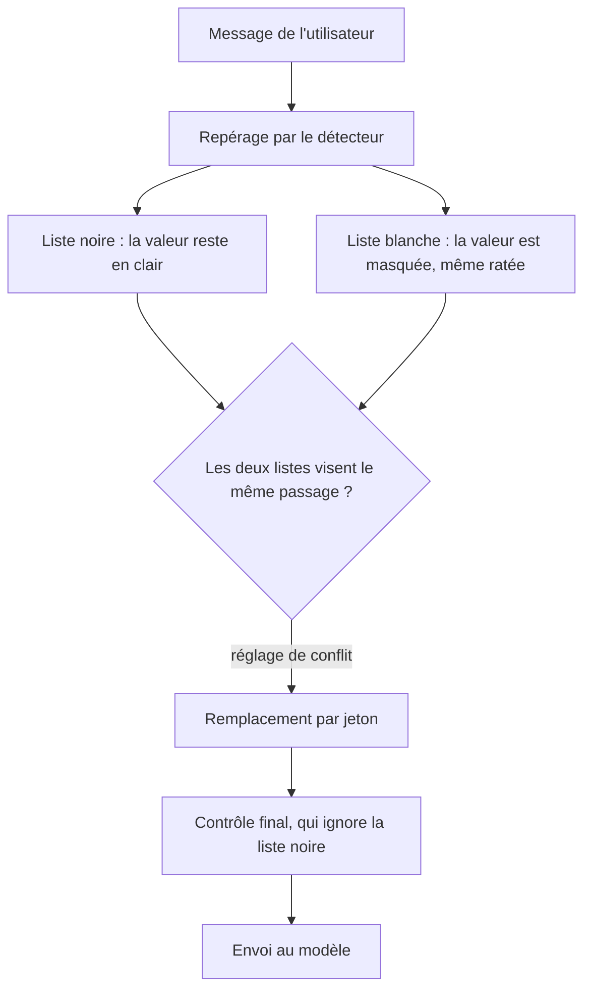

# Imposer une liste blanche et une liste noire

## En bref

- Deux listes, écrites dans la section `[override]` de la configuration, corrigent le détecteur. La liste blanche masque toujours, la liste noire ne masque jamais.
- La configuration est celle du pipeline, qu'il tourne dans l'application ou dans le serveur `piighost-api`.
- Ces listes passent avant tout le reste, y compris avant une correction faite à la main par une personne.
- Une valeur de la liste noire part au modèle en clair, et le contrôle final ne la bloque pas.
- Quand les deux listes visent la même valeur, la liste blanche gagne par défaut, donc la valeur est masquée.
- Une liste modifiée ne s'applique qu'aux messages nouveaux d'une conversation déjà commencée.

Besoins couverts : DPO-3, USER-5 et USER-6, décrits dans [Besoins par profil](../needs-by-profile.md). Les termes sont définis dans le [glossaire](../glossary.md). Le déroulé complet d'un message est dans [Protéger un message avant l'envoi au modèle](protect-a-message.md).

## Pour le métier

PIIGhost n'a pas d'écran. La liste blanche et la liste noire sont écrites par l'équipe technique, dans le code ou dans la section `[override]` du fichier de configuration de l'application ou du serveur `piighost-api`. Le DPO décide de leur contenu. Les tâches ci-dessous disent quoi demander.

### Le trajet d'un message à travers les listes



### Exemple suivi d'un bout à l'autre

La liste blanche contient la forme « PRJ- suivi de quatre chiffres », avec le type `PROJET`. La liste noire contient « Acme », le nom de l'entreprise. Le détecteur lit « Acme » comme une personne et ne connaît pas les numéros de dossier.

| Étape | Texte |
|---|---|
| Message de l'utilisateur | Écrivez à Jean Dupont, chez Acme, dossier PRJ-0042. |
| Sans les listes | Écrivez à `<<PERSON:1>>`, chez `<<PERSON:2>>`, dossier PRJ-0042. |
| Avec les listes, reçu par le modèle | Écrivez à `<<PERSON:1>>`, chez Acme, dossier `<<PROJET:1>>`. |
| Réponse lue par l'utilisateur | C'est noté pour PRJ-0042. |

### Garder une valeur en clair

Cas typique : le nom de votre entreprise est lu comme un nom de personne, et le modèle en a besoin pour répondre.

1. Listez les valeurs exactes à garder en clair, avec leur orthographe.
2. Précisez si la valeur doit rester en clair quelle que soit la façon dont le détecteur la classe. C'est le réglage par défaut.
3. Si une valeur plus longue la contient (« Acme Services » pour « Acme »), dites si la valeur longue doit aussi rester en clair.
4. Transmettez la liste à l'équipe technique.

**Comment vérifier** : faites protéger une phrase de test. Par exemple, « Claire Dubois travaille chez Acme. » doit donner « `<<PERSON:1>>` travaille chez Acme. »

### Forcer le masquage d'une valeur

Cas typique : vos noms de code internes ne sont jamais repérés.

1. Décrivez la forme exacte des valeurs, par exemple « PRJ- suivi de quatre chiffres ».
2. Précisez si une valeur citée d'abord par l'assistant doit aussi être masquée. Par défaut, non (BR-LIST-05).
3. Transmettez la description à l'équipe technique.

**Comment vérifier** : faites protéger une phrase qui contient un nom de code. Il doit être remplacé par un jeton comme `<<CODE:1>>`.

### Règles à connaître

**BR-LIST-01.** Quand une valeur figure dans la liste noire, alors elle est retirée des valeurs à masquer et part au modèle en clair.

**BR-LIST-02.** Quand une valeur figure dans la liste blanche, alors elle est masquée, même si le détecteur l'a ratée. Si le détecteur avait repéré un morceau qui la chevauche, la détection de la liste blanche remplace ce morceau.

**BR-LIST-03.** Quand la liste noire vise une valeur, alors la façon de l'appliquer suit l'un de trois réglages. Exemple sur « Claire Dubois travaille chez Acme, puis chez Globex SA. », avec un détecteur qui lit « Acme » comme une personne, et une liste noire qui contient « Acme » et « Globex » comme organisations :

| Réglage | Retire | Résultat |
|---|---|---|
| Même valeur (par défaut) | toute détection du même texte, quels que soient position et type | `<<PERSON:1>>` travaille chez Acme, puis chez `<<ORG:1>>`. |
| Exact | seulement une détection de même position et de même type | `<<PERSON:1>>` travaille chez `<<PERSON:2>>`, puis chez `<<ORG:1>>`. |
| Chevauchement | toute détection qui touche la valeur, même plus longue | `<<PERSON:1>>` travaille chez Acme, puis chez Globex SA. |

« Même valeur » est le défaut parce que la liste noire nomme une valeur, et le type écrit à côté n'est qu'une supposition sur ce que dira le détecteur.

**BR-LIST-04.** Quand les deux listes visent le même passage, alors le réglage de conflit décide :

| Réglage | Résultat sur « Acme » présent dans les deux listes |
|---|---|
| La liste blanche gagne (par défaut) | masqué : `<<ORG:1>>` |
| La liste noire gagne | en clair : `Acme` |
| Refuser | arrêt avec `Overrides contradict each other on 'Acme': a whitelisted span overlaps a blacklisted one.` |

Ce défaut vient d'un principe simple. En cas de doute, masquer protège.

**BR-LIST-05.** Quand l'assistant cite le premier une valeur de la liste blanche, alors elle reste en clair par défaut. Un réglage « forcer » la masque quand même. La raison est que masquer une valeur que le modèle a lui-même apportée lui retire une connaissance utile. Le masquage lui signale aussi que cette valeur précise est sensible.

**BR-LIST-06.** Quand une personne corrige à la main les valeurs d'un message, alors les deux listes s'appliquent encore à sa correction et l'emportent sur elle. Par exemple, l'utilisateur retire « PRJ-0042 » des valeurs masquées de son message, mais le numéro reste masqué.

**BR-LIST-07.** Quand le contrôle final relit le texte protégé, alors il ignore les valeurs de la liste noire. Toute autre valeur restée en clair bloque l'envoi.

**BR-LIST-08.** Quand une liste change pendant une conversation, alors un message déjà analysé garde son ancien résultat, même renvoyé à l'identique. Par exemple, le 02/10/2026, « Acme » entre dans la liste blanche. Le message envoyé le 01/10/2026 dans la même conversation reste avec « Acme » en clair. Seuls les nouveaux messages appliquent la liste.

### Ce que voit l'utilisateur final

Rien de différent. La réponse restaurée contient les vraies valeurs. Seul le modèle voit la différence entre une valeur masquée et une valeur gardée en clair.

### Questions fréquentes

**Le nom de l'entreprise est encore masqué alors qu'il est dans la liste noire.** Trois causes possibles. La valeur figure aussi dans la liste blanche (BR-LIST-04). Ou le texte détecté est plus long que la valeur listée, avec le réglage « Même valeur » (BR-LIST-03). Ou le message avait été analysé avant l'ajout à la liste (BR-LIST-08).

**Un nom de code de la liste blanche reste en clair.** L'assistant l'a probablement cité le premier dans la conversation (BR-LIST-05). Demandez le réglage « forcer » si la valeur doit toujours être masquée.

**Le traitement s'arrête avec `Overrides contradict each other on …`.** Le réglage de conflit est « Refuser » et une valeur figure dans les deux listes. Retirez-la de l'une des deux.

## Pour les développeurs

Le guide technique montre les deux listes à l'œuvre dans [Comment forcer une détection ou laisser une valeur en clair](../../../docs/fr/examples/overrides.md).

### Où vivent les règles

| Règle | Emplacement |
|---|---|
| BR-LIST-01, BR-LIST-03 | `src/piighost/components/override/detector.py:16-42`, `_clear` lignes 141-150 |
| BR-LIST-02 | `detector.py:122-139` (`_force`) |
| BR-LIST-04 | `detector.py:84-104` (`apply`), `_refuse_collisions` lignes 152-162 |
| BR-LIST-05 | `detector.py:113-120` (`forces_value`), `pipeline/thread.py:322-329` |
| BR-LIST-06 | `pipeline/thread.py:210` (`anonymize_corrected`) |
| BR-LIST-07 | `pipeline/base.py:225-234` (`_cleared_values`), `pipeline/base.py:313-341` (`_guard`) |
| BR-LIST-08 | `pipeline/thread.py:271-287` (`_detect` ne réapplique rien sur un message en cache) |
| Stratégies et défauts | `components/override/strategy.py`, `config/models/override.py:26-32` |
| Liste blanche et liste noire dans le serveur | `piighost-api` lit la même section `[override]` de sa configuration |

Composants liés : `AnyDetectionOverride` (port, sans gabarit), `DetectionOverride` (implémentation pilotée par deux détecteurs), `BlacklistStrategy`, `WhitelistStrategy`, `OverrideConflictStrategy`, `ConflictingOverrideError`.

Position dans le pipeline : juste après la détection, avant les chevauchements et l'expansion (`pipeline/base.py:364-371`). Dans le pipeline de conversation, avant chaque écriture en mémoire (`pipeline/thread.py:276-286`).

### Configurer les listes

1. Partez de la section `[override]` documentée dans `docs/en/configuration/toml.md`.
2. Écrivez chaque liste comme un détecteur complet, souvent `type = "exact"` ou `type = "regex"` :

```toml
[override]
blacklist_strategy = "value"
conflict_strategy = "whitelist_wins"

[override.whitelist]
type = "regex"
patterns = { CODE = 'PRJ-[0-9]{4}' }

[override.blacklist]
type = "exact"
values = { Acme = "ORG" }
```

3. Pour masquer aussi les valeurs citées d'abord par l'assistant, ajoutez `whitelist_strategy = "force"`.

#### Vérifier

```bash
uv run pytest tests/components/override tests/config/test_guard_override_models.py
```

Puis lancez `piighost anonymize --config <votre fichier> "Claire Dubois travaille chez Acme sur PRJ-0042."`. Vous devez voir « Acme » en clair et `<<CODE:1>>` à la place du code.

### Pièges

- **Les listes sont des détecteurs complets.** Une liste regex lourde ou un détecteur à modèle relance un calcul à chaque message, et une seconde fois pour le contrôle final (`cleared_values`).
- **`forces_value` relance la liste blanche sur chaque valeur d'entité** introduite par l'assistant, sous `FORCE`.
- **Une détection en cache n'est pas repassée dans les listes** (BR-LIST-08). Pour appliquer une nouvelle liste à une conversation en cours, effacez la conversation (`forget_thread`) ou corrigez le message par `anonymize_corrected`.
- **`ExactMatchDetector` est d'abord un outil de test.** Utilisé comme liste blanche dans `DetectionOverride`, il survit aux corrections humaines. Utilisé seul comme détecteur principal, il n'y survit pas.

### Écarts doc / code

> ⚠ Écart doc / code
> **Doc** : la docstring de `DetectionOverride` dit que les pipelines appliquent les listes « after every detection read and before every memory write » (`components/override/detector.py:51-53`).
> **Code** : une lecture de détections depuis le cache ne repasse pas par les listes (`pipeline/thread.py:271-274`). Seuls une détection fraîche et un jeu corrigé y passent. [à vérifier] : si « detection read » désigne seulement l'appel au détecteur, il n'y a pas d'écart, mais la formulation induit en erreur.

Cet écart est aussi listé dans le [registre des écarts](../reference/doc-code-gaps.md).

### Tests

| Test | Couvre |
|---|---|
| `tests/components/override/test_override.py` | Les trois stratégies de liste noire, l'ordre selon le réglage de conflit, le refus, `forces_value` |
| `tests/config/test_guard_override_models.py` | Le modèle de configuration `[override]` |
| `tests/config/test_settings.py` | `test_whitelist_forces_a_detection` |
| `tests/pipeline/test_override_integration.py` | Les listes l'emportent sur une correction humaine (AT-USER-6-3), liste blanche et liste noire de bout en bout (AT-DPO-3-1, AT-DPO-3-2) |

Non couvert : l'effet d'un changement de liste sur un message déjà en cache (BR-LIST-08). Ce comportement a été constaté en lançant le pipeline, pas lu dans un test.
