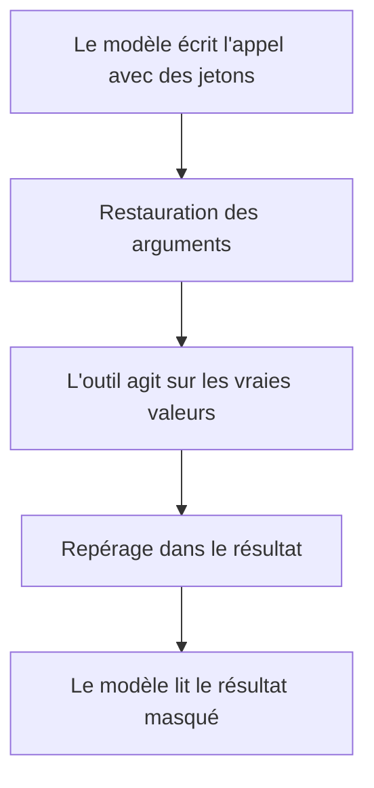

# Laisser un outil agir sur les vraies valeurs

## En bref

- Un agent appelle des outils, par exemple pour envoyer un e-mail. Le modèle ne connaît que les jetons et les écrit dans l'appel.
- Par défaut, PIIGhost remet les vraies valeurs dans les arguments juste avant l'exécution, puis masque le résultat de l'outil avant que le modèle le lise.
- Le résultat de l'outil passe par le repérage complet : une adresse que la conversation n'a jamais citée est masquée aussi.
- Trois autres réglages existent. Deux d'entre eux laissent le résultat partir en clair vers le modèle.
- Un jeton inventé par le modèle dans un argument bloque l'appel par défaut : l'outil ne s'exécute pas.

Besoins couverts : DEV-4, DEV-8, USER-3 et DPO-1, décrits dans [Besoins par profil](../needs-by-profile.md). Les termes sont définis dans le [glossaire](../glossary.md). Le branchement de PIIGhost sur un agent est décrit dans [Brancher la protection sur un agent et ses outils](../integrations/agents-and-tools.md).

## Pour le métier

PIIGhost n'a pas d'écran. Le réglage d'outil se choisit dans le code de l'agent, pour tout l'agent. Ce que vous pouvez constater, c'est ce que reçoit l'outil et ce que lit le modèle.

### Qui intervient

| Acteur | Rôle |
|---|---|
| L'utilisateur final | demande une action, par exemple l'envoi d'un e-mail |
| Le modèle | décide d'appeler l'outil et écrit ses arguments avec des jetons |
| PIIGhost | restaure les arguments, puis masque le résultat |
| L'outil | agit sur les vraies valeurs |

### Le trajet d'un appel d'outil



Exemple : la conversation contient déjà « Écrivez à `<<PERSON:1>>`, `<<EMAIL:1>>` », issu de « Écrivez à Jean Dupont, jean.dupont@exemple.fr ».

| Étape | Contenu |
|---|---|
| Le modèle appelle l'outil d'envoi | `{"to": "<<EMAIL:1>>", "body": "Bonjour <<PERSON:1>>"}` |
| L'outil reçoit | `{"to": "jean.dupont@exemple.fr", "body": "Bonjour Jean Dupont"}` |
| L'outil renvoie | Envoyé à jean.dupont@exemple.fr, copie à marie.curie@exemple.fr |
| Le modèle lit | Envoyé à `<<EMAIL:1>>`, copie à `<<EMAIL:2>>` |

L'adresse connue reprend son jeton. L'adresse nouvelle prend le numéro suivant. L'e-mail est parti à la bonne adresse.

**Comment vérifier** : dans une trace de l'agent, l'argument reçu par l'outil porte la vraie adresse, et le message suivant envoyé au modèle n'en contient aucune.

### Choisir le réglage d'outil

| Réglage | L'outil reçoit | Le modèle lit le résultat | À choisir quand |
|---|---|---|---|
| Complet (par défaut) | les vraies valeurs | masqué | l'outil agit sur de vraies données (envoyer un e-mail, chercher un dossier) |
| Entrée seule | les vraies valeurs | en clair | le résultat ne contient jamais de donnée personnelle |
| Sortie seule | des jetons | masqué | l'outil n'a pas besoin des vraies valeurs |
| Aucun | des jetons | en clair | l'outil est interne et son résultat sans risque |

> [!WARNING]
> Avec « Entrée seule » ou « Aucun », le résultat de l'outil part au modèle en clair. Si l'outil renvoie un dossier client, ce dossier sort entier. Validez ce choix avec le DPO.

### Règles à connaître

**BR-TOOL-01.** Quand le réglage est « Complet », alors les arguments sont restaurés avant l'outil et son résultat est masqué avant le modèle.

**BR-TOOL-02.** Quand le réglage est « Entrée seule », alors les arguments sont restaurés et le résultat part au modèle tel que l'outil l'a renvoyé.

**BR-TOOL-03.** Quand le réglage est « Sortie seule », alors l'outil reçoit les jetons et son résultat est masqué. Exemple : l'outil d'envoi reçoit `<<EMAIL:1>>` et enverrait l'e-mail à une adresse qui n'existe pas.

**BR-TOOL-04.** Quand le réglage est « Aucun », alors PIIGhost ne touche ni aux arguments ni au résultat.

**BR-TOOL-05.** Quand le résultat d'un outil est masqué, alors il passe par le repérage complet de la conversation. Une valeur connue reprend son jeton, une valeur nouvelle prend le numéro suivant.

**BR-TOOL-06.** Quand une valeur apparaît d'abord dans le résultat d'un outil, alors elle compte comme une valeur de l'utilisateur et reste masquée dans la suite de la conversation.

**BR-TOOL-07.** Quand le modèle écrit dans un argument un jeton jamais émis, alors l'appel est refusé par défaut, avant l'exécution : `Deanonymized text holds tokens the pipeline never issued: ['<<EMAIL:7>>']`. Aucun e-mail ne part. Avec « retirer », l'outil reçoit `{"to": ""}`. Avec « garder », il reçoit `{"to": "<<EMAIL:7>>"}`.

**BR-TOOL-08.** Quand les arguments contiennent des listes ou des objets imbriqués, alors chaque texte qu'ils contiennent est restauré, et les autres valeurs (nombres, booléens) restent intactes.

**BR-TOOL-09.** Quand le modèle écrit lui-même une valeur en clair dans un argument, alors, avec LangChain, l'historique est masqué à nouveau avant l'appel suivant. Une valeur connue reprend son jeton. Une valeur que le modèle a apportée lui-même reste en clair, comme toute valeur citée d'abord par l'assistant.

**BR-TOOL-10.** Quand l'agent garde son historique, alors l'appel d'outil y reste écrit avec ses jetons. Les vraies valeurs n'existent que pendant l'exécution de l'outil.

**BR-TOOL-11.** Quand le modèle coupe ou reformule un jeton dans un argument, alors seul un jeton écrit en entier est restauré. L'outil reçoit le reste tel quel.

### Ce que voit l'utilisateur final

Le résultat de l'action : l'e-mail arrive à la bonne adresse, le dossier cherché est le bon. La réponse finale du modèle est restaurée comme décrit dans [Suivre une conversation et restaurer la réponse](follow-a-conversation.md).

### Questions fréquentes

**Un outil a reçu `<<EMAIL:1>>` au lieu de l'adresse.** Le réglage d'outil est « Sortie seule » ou « Aucun » (BR-TOOL-03, BR-TOOL-04). Passez-le à « Complet » si l'outil doit agir sur la vraie adresse.

**L'appel d'outil s'arrête avec `Deanonymized text holds tokens the pipeline never issued`.** Le modèle a écrit un jeton inconnu dans un argument (BR-TOOL-07). Gardez le refus : il évite un e-mail envoyé à une adresse inventée.

**Le résultat d'un outil est parti en clair vers le modèle.** Le réglage est « Entrée seule » ou « Aucun » (BR-TOOL-02, BR-TOOL-04).

**Un outil reçoit un jeton derrière le proxy OpenAI.** Le proxy du serveur `piighost-api` ne restaure pas les arguments d'outil d'une réponse diffusée au fil de l'eau. C'est une limite connue (USER-3).

## Pour les développeurs

Le guide technique décrit les réglages d'outil dans [Stratégies d'appel outil](../../../docs/fr/tool-call-strategies.md).

### Où vivent les règles

| Règle | Emplacement |
|---|---|
| BR-TOOL-01 à BR-TOOL-04 | `src/piighost/integrations/langchain/middleware.py:220-251` (`awrap_tool_call`, choix lignes 232-233) |
| BR-TOOL-05, BR-TOOL-06 | `middleware.py:253-272` (`_anonymize_tool_output`, rôle utilisateur), `pipeline/thread.py:126` (`anonymize`) |
| BR-TOOL-07 | `integrations/_deidentify.py:109-117` (`deanonymize_value`), `_handle_invented` lignes 133-155 |
| BR-TOOL-08 | `integrations/_deidentify.py:25-37` (`map_strings`) |
| BR-TOOL-09 | `middleware.py:337-368` (`_reanonymize_tool_calls`), appelé ligne 183 |
| BR-TOOL-10 | `middleware.py:244` (`request.override(tool_call=...)`, l'état n'est pas modifié) |
| BR-TOOL-11 | `integrations/_deidentify.py:109-117` (`deanonymize_value`), `pipeline/thread.py:219-231` (`deanonymize`, qui ne remplace que les jetons entiers) |
| Pydantic AI | `integrations/pydantic_ai/hooks.py:124-154` (`deanonymize_tool_args`, `anonymize_tool_result`) |

| Réglage de la page | `ToolCallStrategy` |
|---|---|
| Complet | `FULL` (défaut) |
| Entrée seule | `INPUT` |
| Sortie seule | `OUTPUT` |
| Aucun | `PASSTHROUGH` |

```python
from piighost.integrations.langchain import (
    InventedPlaceholderStrategy,
    PIIAnonymizationMiddleware,
    ToolCallStrategy,
)

middleware = PIIAnonymizationMiddleware(
    pipeline,
    tool_strategy=ToolCallStrategy.FULL,
    invented_strategy=InventedPlaceholderStrategy.RAISE,
)
```

### Pièges

- **Pydantic AI diffère de LangChain sur deux points.** `pii_hooks` masque aussi un résultat structuré (dictionnaire, liste), et ne masque pas à nouveau les arguments des appels d'outil de l'historique (BR-TOOL-09).
- **LangChain ne masque que le texte d'un résultat.** Les blocs non textuels d'un `ToolMessage` passent tels quels.
- **`assistant_strategy=EntityCreateByAssistantStrategy.IGNORE` désactive BR-TOOL-09.**
- **Le middleware exige un pipeline dont la fabrique expose un `recognizer`**, sinon il lève `UnrecognizableFactoryError` à la construction.
- **Le refus d'un jeton inventé lève `InventedPlaceholderError` depuis `awrap_tool_call`.** L'outil n'est pas appelé, et l'erreur remonte à l'agent.

### Écarts doc / code

L'écart sur le résultat d'un outil (la doc parlait d'un remplacement des seules valeurs connues) est corrigé dans `docs/en/tool-call-strategies.md` et `docs/fr/tool-call-strategies.md`. Voir ECART-09 dans le [registre des écarts](../reference/doc-code-gaps.md).

### Tests

| Test | Couvre |
|---|---|
| `tests/integrations/langchain/test_middleware.py` (`TestToolCalls`) | Chaque réglage, `Command`, arguments de l'historique masqués à nouveau |
| `tests/integrations/langchain/test_middleware_e2e.py` | Le second appel au modèle ne voit aucun argument en clair (AT-DEV-4-1, AT-USER-3-1) |
| `tests/integrations/test_pydantic_ai_hooks.py` (`TestTools`) | L'outil reçoit la valeur, son résultat est masqué |
| `piighost-api:tests/routes/test_rewrite.py` | Arguments restaurés par le proxy, hors flux |

Non couvert : la restauration des arguments d'outil dans le flux du proxy OpenAI (AT-USER-3-2), qui n'existe pas.
