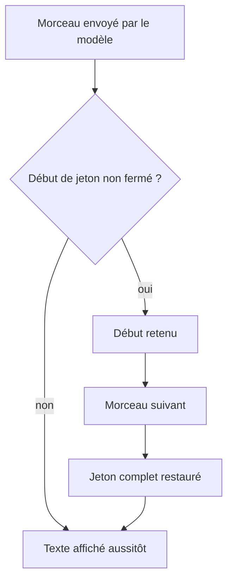

# Afficher une réponse streamée

## En bref

- Le modèle envoie sa réponse en morceaux, que l'application affiche au fil de l'eau.
- Un jeton peut arriver coupé entre deux morceaux, par exemple « `<<PER` » puis « `SON:1>>` ».
- Le décodeur de flux de PIIGhost retient le début du jeton jusqu'à ce qu'il soit entier, puis le restaure une seule fois.
- Sans ce décodeur, l'utilisateur lit le jeton à l'écran.
- Si le flux est coupé au milieu d'un jeton, le début de ce jeton reste à l'écran. Il ne contient aucune valeur réelle.

Besoins couverts : DEV-9, USER-4, USER-1 et DEV-8, décrits dans [Besoins par profil](../needs-by-profile.md). Les termes sont définis dans le [glossaire](../glossary.md). La restauration d'une réponse entière est décrite dans [Suivre une conversation et restaurer la réponse](follow-a-conversation.md).

## Pour le métier

PIIGhost n'a pas d'écran. Ce que vous pouvez constater, c'est le texte qui s'affiche pendant que le modèle répond. Le décodeur de flux doit être branché par l'équipe de développement.

### Qui intervient

| Acteur | Rôle |
|---|---|
| L'utilisateur final | lit la réponse pendant qu'elle s'écrit |
| Le modèle | envoie sa réponse en morceaux |
| L'application | lit le flux et fait passer chaque morceau par le décodeur |
| PIIGhost | restaure les jetons morceau par morceau |

### Le trajet d'une réponse streamée



Exemple : la conversation associe `<<PERSON:1>>` à Jean Dupont et `<<EMAIL:1>>` à jean.dupont@exemple.fr.

| Morceau reçu | Texte affiché |
|---|---|
| « Bonjour <<PER » | « Bonjour » |
| « SON:1>>, je vous » | « Jean Dupont, je vous » |
| « écris à <<EMA » | « écris à » |
| « IL:1>>. » | « jean.dupont@exemple.fr. » |

L'utilisateur a lu « Bonjour Jean Dupont, je vous écris à jean.dupont@exemple.fr. » sans attendre la fin du flux.

**Comment vérifier** : faites répondre le modèle avec un nom connu de la conversation. L'écran ne doit jamais montrer « `<<PER` ».

### Règles à connaître

**BR-STREAM-01.** Quand un morceau ne peut pas appartenir à un jeton, alors il est affiché dès son arrivée.

**BR-STREAM-02.** Quand un morceau ouvre un jeton (« `<<` ») sans le fermer, alors tout est retenu jusqu'à la fermeture, puis le jeton entier est restauré une seule fois.

**BR-STREAM-03.** Quand un morceau finit par un seul « `<` », alors ce caractère est retenu, pour qu'un délimiteur coupé en deux se recolle.

**BR-STREAM-04.** Quand une ouverture reste sans fermeture sur plus de 128 caractères, alors elle est relâchée telle quelle, car aucun jeton n'est aussi long. Par exemple, « Utilisez cout << x pour » suivi de « afficher » s'affiche avec un léger retard, sans perte de texte.

**BR-STREAM-05.** Quand le flux s'arrête au milieu d'un jeton, alors le reste retenu est affiché tel quel, sans restauration. Par exemple, « Bonjour Jean Dupont, à bientôt <<EMA » s'affiche tel quel. Le morceau ne contient aucune vraie valeur.

**BR-STREAM-06.** Quand un jeton complété n'a jamais été émis, alors le réglage des jetons inventés s'applique. Par défaut, il refuse le jeton, ce qui interrompt le flux. Les deux autres choix retirent le jeton ou le gardent.

| Réglage | « Bonjour <<PERSON: » puis « 9>>. » donne |
|---|---|
| Refuser (par défaut) | « Bonjour », puis le flux s'interrompt sur une erreur |
| Retirer | « Bonjour . » |
| Garder | « Bonjour `<<PERSON:9>>`. » |

**BR-STREAM-07.** Quand l'application restaure chaque morceau séparément, sans le décodeur, alors un jeton coupé n'est jamais reconnu, et l'utilisateur lit « Bonjour `<<PERSON:1>>`. ».

**BR-STREAM-08.** Quand la réponse passe par un proxy du serveur `piighost-api`, alors le proxy restaure lui aussi le flux avec ce décodeur. Le proxy OpenAI ne restaure que le texte, pas les arguments d'outil. Aucun des deux proxys, OpenAI et Anthropic, n'applique le réglage des jetons inventés.

### Ce que voit l'utilisateur final

Une réponse qui s'écrit au fil de l'eau, avec les vraies valeurs. Un léger retard apparaît quand un jeton ou un « `<<` » est en cours. Seul un flux interrompu laisse un morceau de jeton à la fin.

### Questions fréquentes

**L'écran montre `<<PERSON:1>>` pendant le flux.** L'application ne fait pas passer les morceaux par le décodeur (BR-STREAM-07). Demandez à l'équipe de développement de le brancher.

**La réponse se termine par « `<<EMA` ».** Le flux s'est interrompu au milieu d'un jeton (BR-STREAM-05). Relancez la réponse.

**Le flux s'interrompt sur `Deanonymized text holds tokens the pipeline never issued`.** Le modèle a écrit un jeton inconnu (BR-STREAM-06).

## Pour les développeurs

Le guide technique décrit la mise en œuvre dans la section [Streaming de la référence LangChain](../../../docs/fr/reference/langchain.md#streaming).

### Où vivent les règles

| Règle | Emplacement |
|---|---|
| BR-STREAM-01 à BR-STREAM-03 | `src/piighost/components/placeholder/streaming.py:84-137` (`_held_length`, `_split_buffer`) |
| BR-STREAM-04 | `streaming.py:46` (`MAX_TOKEN_LENGTH = 128`) |
| BR-STREAM-05 | `streaming.py:186` et `236` (`flush`) |
| BR-STREAM-06 | `integrations/_deidentify.py:83-107` (`deanonymize_stream`), `_handle_invented` lignes 133-155 |
| BR-STREAM-07 | `integrations/langchain/middleware.py:206-218` (`deanonymize_stream`) |
| BR-STREAM-08 | `piighost-api`, hors de ce dépôt, dans `routes/openai.py` (`_restore_sse_chunk`) et `routes/anthropic.py`, sur le décodeur de `components/placeholder/streaming.py` |

Composants liés : `PlaceholderStreamDecoder` (synchrone, `factory.stream_decoder(replace)`), `AsyncPlaceholderStreamDecoder` (`pipeline.recognizer.async_stream_decoder(replace)`), `PIIAnonymizationMiddleware.deanonymize_stream(source, thread_id)`.

### Brancher le décodeur sur un agent LangChain

1. Lisez le flux de l'agent avec `agent.astream(..., stream_mode="messages")`.
2. Passez les textes à `middleware.deanonymize_stream(source, thread_id)`, avec l'identifiant de la conversation.
3. Affichez chaque texte rendu.

```python
config = {"configurable": {"thread_id": "conv-1"}}


async def model_text():
    async for chunk, _meta in agent.astream(
        {"messages": [{"role": "user", "content": "Écrivez à Jean Dupont"}]},
        config,
        stream_mode="messages",
    ):
        if isinstance(chunk.content, str):
            yield chunk.content


async for restored in middleware.deanonymize_stream(model_text(), "conv-1"):
    print(restored, end="", flush=True)
```

#### Vérifier

```bash
uv run pytest tests/components/placeholder/test_streaming.py tests/components/placeholder/test_streaming_async.py tests/integrations/langchain/test_middleware_stream.py
```

### Pièges

- **Les hooks du middleware ne voient que le message entier.** L'affichage en direct demande d'envelopper la boucle de streaming avec le décodeur.
- **Le décodeur demande l'identifiant de conversation explicitement**, parce que la boucle de streaming est hors de la configuration de l'agent.
- **Hors LangChain, le décodeur n'applique aucun réglage aux jetons inventés**, sauf si la fonction `replace` le fait.
- **La capacité Pydantic AI ne fournit pas de décodeur de flux.**
- **Le décodeur suit les délimiteurs de la fabrique**, donc une fabrique aux délimiteurs personnalisés garde le même comportement.

### Tests

| Test | Couvre |
|---|---|
| `tests/components/placeholder/test_streaming.py`, `test_streaming_async.py` | Retenue d'un jeton coupé, délimiteur coupé, relâche après 128 caractères (AT-USER-4-1) |
| `tests/integrations/langchain/test_middleware_stream.py` | Restauration en flux par le middleware (AT-DEV-9-1) |
| `tests/integrations/test_deidentify_stream.py` | Jeton inventé en flux, reste rendu en fin de flux |
| `piighost-api:tests/routes/test_openai_stream.py`, `test_anthropic_messages.py` | Jeton coupé entre deux événements d'un proxy (AT-USER-4-2) |

Non couvert : les arguments d'outil d'un flux du proxy OpenAI. Le proxy ne les restaure pas.
