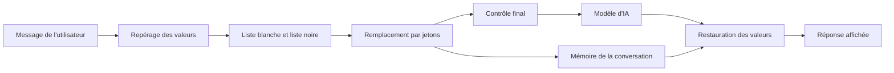

# Démarrer avec le wiki PIIGhost

## En bref

PIIGhost masque les données confidentielles d'un texte avant qu'un modèle d'IA le lise, puis remet les vraies valeurs dans la réponse.

Cycle de vie d'un message :

1. L'utilisateur écrit en clair.
2. PIIGhost repère les valeurs sensibles : noms, e-mails, téléphones, secrets.
3. Il les remplace par des jetons comme `<<PERSON:1>>`, stables dans toute la conversation.
4. Le modèle répond en utilisant ces jetons.
5. PIIGhost remet les vraies valeurs dans la réponse affichée.

PIIGhost est une bibliothèque Python, sans interface graphique. Elle se branche sur LangChain, Pydantic AI, LlamaIndex ou Claude Code, ou se pilote à distance par le serveur compagnon `piighost-api`. Elle se configure par un fichier TOML ou JSON et par la commande `piighost`.

Le wiki s'adresse d'abord aux personnes qui décident de la protection des données (DPO, conformité, produit, support), puis aux développeurs. Ce que chaque profil attend est dans [Besoins par profil](needs-by-profile.md). Le code et les tests font foi. Les écarts avec la documentation existante sont dans le [registre des écarts](reference/doc-code-gaps.md). Les termes sont dans le [glossaire](glossary.md).

## Je cherche à comprendre…

| Besoin métier | Page à lire |
|---|---|
| Ce que chaque profil attend de PIIGhost, et comment le vérifier | [Besoins par profil](needs-by-profile.md) |
| Ce que le modèle voit vraiment d'un message | [Protéger un message avant l'envoi au modèle](processes/protect-a-message.md) |
| Pourquoi un nom est resté en clair, ou à moitié | [Protéger un message avant l'envoi au modèle](processes/protect-a-message.md#questions-fréquentes) |
| Comment une personne garde le même jeton d'un message à l'autre | [Suivre une conversation et restaurer la réponse](processes/follow-a-conversation.md) |
| Ce qui se passe quand on corrige un message à la main | [Suivre une conversation et restaurer la réponse](processes/follow-a-conversation.md#corriger-un-repérage) |
| Comment effacer une conversation (droit à l'effacement) | [Suivre une conversation et restaurer la réponse](processes/follow-a-conversation.md) |
| Garder le nom de l'entreprise en clair, ou toujours masquer un code interne | [Imposer une liste blanche et une liste noire](processes/impose-a-whitelist-and-blacklist.md) |
| Ce que reçoit un outil de l'agent, et ce que le modèle lit de son résultat | [Laisser un outil agir sur les vraies valeurs](processes/let-a-tool-act.md) |
| Pourquoi un jeton apparaît pendant qu'une réponse s'affiche | [Afficher une réponse streamée](processes/show-a-streamed-reply.md) |
| Ce que voit chaque acteur selon l'outil utilisé (LangChain, Claude Code…) | [Brancher la protection sur un agent et ses outils](integrations/agents-and-tools.md) |
| Ce qui se passe quand un modèle répond mal | [Besoins par profil, points de vigilance](needs-by-profile.md#points-de-vigilance) |
| Où sont stockées les données des conversations, et si elles sont chiffrées | [Stocker les conversations et protéger les traces](operations/storage-and-encryption.md) |
| Le sens d'un terme ou d'un sigle | [Glossaire](glossary.md) |
| Les endroits où la documentation et le code divergent | [Registre des écarts doc / code](reference/doc-code-gaps.md) |
| Ce qui est décidé et reste à faire | [Points à régler](reference/open-points.md) |

## Je dois modifier…

| Type de changement | Lire d'abord | Puis |
|---|---|---|
| Ajouter un détecteur | [Ajouter ou remplacer un composant](architecture/ports-and-extension.md#ajouter-un-détecteur) | `components/detector/regex.py` ou `ner/spacy.py`, `config/models/detector_model.py`, `tests/components/detector/test_contract.py` |
| Changer l'arbitrage des chevauchements | [Protéger un message](processes/protect-a-message.md) | `components/overlap_resolver/`, `tests/components/overlap_resolver/` |
| Changer la forme des jetons | [Glossaire](glossary.md), [Ajouter ou remplacer un composant](architecture/ports-and-extension.md#jetons-typés) | `components/placeholder/`, `tags.py`, `tests/components/placeholder/` |
| Toucher à la conversation ou à la correction humaine | [Suivre une conversation](processes/follow-a-conversation.md) | `pipeline/thread.py`, `tests/pipeline/test_thread.py`, `test_thread_hitl.py` |
| Modifier la liste blanche ou la liste noire | [Imposer une liste blanche et une liste noire](processes/impose-a-whitelist-and-blacklist.md) | `components/override/`, `tests/components/override/test_override.py` |
| Changer le traitement des appels d'outil | [Laisser un outil agir](processes/let-a-tool-act.md) | `integrations/langchain/middleware.py` (`awrap_tool_call`), `integrations/pydantic_ai/hooks.py`, `tests/integrations/langchain/test_middleware.py` |
| Changer la restauration en flux | [Afficher une réponse streamée](processes/show-a-streamed-reply.md) | `components/placeholder/streaming.py`, `tests/components/placeholder/test_streaming*.py` |
| Ajouter un test d'acceptation | [Tests d'acceptation](tests/acceptance-tests.md) | `tests/acceptance/`, un identifiant `AT-<besoin>-<n>` dans la docstring |
| Ajouter une clé de configuration | [Configurer un pipeline](operations/configuration-and-hub.md) | `config/models/`, `config/settings.py`, `tests/config/` |
| Modifier la commande `piighost` | [Configurer un pipeline](operations/configuration-and-hub.md#contrôler-depuis-la-ligne-de-commande) | `cli/__init__.py`, `tests/cli/test_cli.py` |
| Ajouter un stockage ou changer le chiffrement | [Stocker les conversations](operations/storage-and-encryption.md) | `conversation_memory/`, `crypto/`, `tests/conversation_memory/` |
| Changer le middleware LangChain ou une autre intégration | [Brancher la protection sur un agent](integrations/agents-and-tools.md) | `integrations/`, `integrations/_deidentify.py`, `tests/integrations/` |
| Ajouter un outil aux hooks Claude Code | [Brancher la protection sur un agent](integrations/agents-and-tools.md) | `integrations/claude_code/hooks.py` (`_TOOL_OUTPUT_TEXT_FIELDS`), `tests/integrations/test_claude_code_hooks.py` |

## Repères pour démarrer en local

- **Pile** : Python 3.11 ou plus, gestionnaire `uv`. Le cœur ne dépend que de `typing-extensions`. Tout le reste est un extra de `pyproject.toml` (`langchain`, `redis`, `gliner2`, `config`…), et `all` les réunit.
- **Installer** : `uv sync` à la racine du dépôt.
- **Tester** : `uv run pytest`, puis `make lint` avant toute fusion. Détails dans [Lancer et écrire les tests](tests/run-and-write-tests.md).
- **Essayer** : `uv run piighost anonymize "Écrivez à claire.dubois@example.com"`. La première exécution télécharge le catalogue `hub:piighost/generic:fab51b33`.
- **Services** : aucun pour les tests. Redis, une base SQL ou `piighost-api` ne servent qu'en exploitation. Voir [Stocker les conversations](operations/storage-and-encryption.md) et [Configurer un pipeline](operations/configuration-and-hub.md).
- **Exemples** : scripts autonomes dans `examples/`, lancés par `uv run examples/<script>.py`.

## Les groupes du wiki

- **Besoins** : [Besoins par profil](needs-by-profile.md).
- **Processus** : [Protéger un message](processes/protect-a-message.md), [Suivre une conversation](processes/follow-a-conversation.md), [Imposer une liste blanche et une liste noire](processes/impose-a-whitelist-and-blacklist.md), [Laisser un outil agir](processes/let-a-tool-act.md), [Afficher une réponse streamée](processes/show-a-streamed-reply.md).
- **Intégrations** : [Brancher la protection sur un agent et ses outils](integrations/agents-and-tools.md).
- **Exploitation** : [Configurer un pipeline par fichier, hub et ligne de commande](operations/configuration-and-hub.md), [Stocker les conversations et protéger les traces](operations/storage-and-encryption.md).
- **Architecture** : [Ajouter ou remplacer un composant du pipeline](architecture/ports-and-extension.md).
- **Tests** : [Lancer et écrire les tests](tests/run-and-write-tests.md), [Tests d'acceptation](tests/acceptance-tests.md).
- **Référence** : [Glossaire](glossary.md), [Registre des écarts doc / code](reference/doc-code-gaps.md), [Points à régler](reference/open-points.md).

## Points de vigilance transverses

1. **L'identifiant de conversation décide du partage des jetons.** Un appel sans identifiant est refusé, par LangChain, les hooks Claude Code et le serveur. Une application qui nomme `default` partage ses jetons entre tous ses utilisateurs. Seule la commande `piighost` se rabat sur `default`, pour une commande isolée. Voir [Suivre une conversation](processes/follow-a-conversation.md#règles-à-connaître).
2. **Corriger un message ancien peut renuméroter les jetons**, et une réponse du modèle peut alors être restaurée avec le nom d'une autre personne. Voir [Suivre une conversation](processes/follow-a-conversation.md#règles-à-connaître).
3. **La mémoire et l'historique de l'agent contiennent des données en clair.** Tout ce qui n'est pas traité en contient aussi : un outil Claude Code non listé (Grep), ou un résultat d'outil sous la stratégie « Entrée seule » ou « Aucun ». Chiffrez le stockage, et protégez l'historique de LangGraph ou de Pydantic AI. Voir [Stocker les conversations](operations/storage-and-encryption.md) et [Brancher la protection sur un agent](integrations/agents-and-tools.md#pièges).
4. **Les traces techniques portent le texte en clair par défaut.** Configurez un masqueur de traces avant de les envoyer à un service tiers. Voir [Stocker les conversations et protéger les traces](operations/storage-and-encryption.md#masquer-les-traces).
5. **Effacer une conversation ne vide que le processus qui reçoit la demande.** Quand `token_memo_ttl` n'est pas réglé, les autres processus gardent une copie temporaire. Voir [Stocker les conversations](operations/storage-and-encryption.md#règles-à-connaître).
6. **Un détecteur ou un garde-fou à base de modèle échoue en ouvert.** Une sortie illisible du modèle donne zéro détection, et le message part sans protection. Voir les [points de vigilance](needs-by-profile.md#points-de-vigilance).
